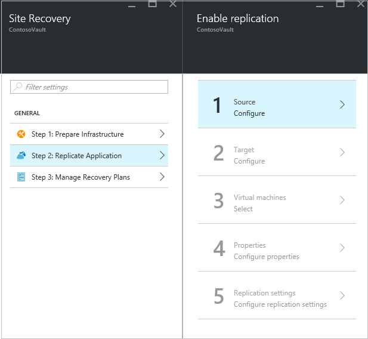
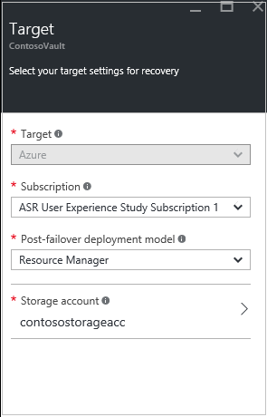
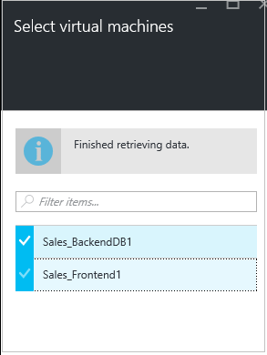

# Step 11: Enable replication to Azure for Hyper-V VMs in VMM clouds

After you've set up a replication policy, use this article to enable replication for on-premises Hyper-V virtual machines (VMs) managed in System Center Virtual Machine Manager (VMM) clouds), to Azure, using the [Azure Site Recovery](site-recovery-overview.md) service in the Azure portal.

Post comments and questions at the bottom of this article, or on the [Azure Recovery Services Forum](https://social.msdn.microsoft.com/forums/azure/home?forum=hypervrecovmgr).

## Before you start

Make sure your Azure account has the correct [permissions](site-recovery-role-based-linked-access-control.md#permissions-required-to-enable-replication-for-new-virtual-machines)to create Azure VMs. [Learn more](../active-directory/role-based-access-built-in-roles.md) about Azure role-based access control.

## Exclude disks from replication

By default all disks on a machine are replicated. You can exclude disks from replication. For example you might not want to replicate disks with temporary data, or data that's refreshed each time a machine or application restarts (for example pagefile.sys or SQL Server tempdb). [Learn more](site-recovery-exclude-disk.md)

## Replicate VMs

Enable replication for VMs as follows:  

1. Click **Step 2: Replicate application** > **Source**. After you've enabled replication for the first time, click **+Replicate** in the vault to enable replication for additional machines.

    
2. In the **Source** blade, select the VMM server, and the cloud in which the Hyper-V hosts are located. Then click **OK**.

    
3. In **Target**, select the subscription, post-failover deployment model, and the storage account you're using for replicated data.

    
4. Select the storage account you want to use. If you want to use a different storage account than those you have, you can [create one](#set-up-an-azure-storage-account). If you’re using a premium storage account for replicated data, you need to select  an additional standard storage account to store replication logs that capture ongoing changes to on-premises data.To create a storage account using the Resource Manager model click **Create new**. If you want to create a storage account using the classic model, do that [in the Azure portal](../storage/common/storage-create-storage-account.md). Then click **OK**.
5. Select the Azure network and subnet to which Azure VMs will connect, when they're created after failover. Select **Configure now for selected machines**, to apply the network setting to all machines you select for protection. Select **Configure later**, to select the Azure network per machine. If you want to use a different network from those you have, you can [create one](#set-up-an-azure-network). To create a network using the Resource Manager model click **Create new**. If you want to create a network using the classic model, do that [in the Azure portal](../virtual-network/virtual-networks-create-vnet-classic-pportal.md). Select a subnet if applicable. Then click **OK**.
6. In **Virtual Machines** > **Select virtual machines**, click and select each machine you want to replicate. You can only select machines for which replication can be enabled. Then click **OK**.

    

7. In **Properties** > **Configure properties**, select the operating system for the selected VMs, and the OS disk.

    - Verify that the Azure VM name (target name) complies with [Azure virtual machine requirements](site-recovery-support-matrix-to-azure.md#failed-over-azure-vm-requirements).   
    - By default all the disks of the VM are selected for replication, but you can clear disks to exclude them.

        - You might want to exclude disks to reduce replication bandwidth. For example, you might not want to replicate disks with temporary data, or data that's refreshed each time a machine or apps restarts (such as pagefile.sys or Microsoft SQL Server tempdb). You can exclude the disk from replication by unselecting the disk.
        - Only basic disks can be exclude. You can't exclude OS disks.
        - We recommend that you don't exclude dynamic disks. Site Recovery can't identify whether a virtual hard disk inside a guest VM is basic or dynamic. If all dependent dynamic volume disks aren't excluded, the protected dynamic disk will show as a failed disk when the VM fails over, and the data on that disk won't be accessible.
        - After replication is enabled, you can't add or remove disks for replication. If you want to add or exclude a disk, you need to disable protection for the VM, and then re-enable it.
        - Disks you create manually in Azure aren't failed back. For example, if you fail over three disks, and create two directly in Azure VM, only the three disks which were failed over will be failed back from Azure to Hyper-V. You can't include disks created manually in failback, or in reverse replication from Hyper-V to Azure.
        - If you exclude a disk that's needed for an application to operate, after failover to Azure you need to create it manually in Azure, so that the replicated application can run. Alternatively, you could integrate Azure automation into a recovery plan, to create the disk during failover of the machine.

    Click **OK** to save changes. You can set additional properties later.

	

8. In **Replication settings** > **Configure replication settings**, select the replication policy you want to apply for the protected VMs. Then click **OK**. You can modify the replication policy in **Replication policies** > policy name > **Edit Settings**. Changes you apply are used for machines that are already replicating, and new machines.

   

You can track progress of the **Enable Protection** job in **Jobs** > **Site Recovery jobs**. After the **Finalize Protection** job runs, the machine is ready for failover.

## Next steps

Go to [Step 12: Run a test failover](vmm-to-azure-walkthrough-test-failover.md)
