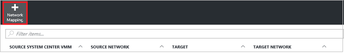

# Step 9: Configure network mapping for Hyper-V replication (with VMM) to Azure

After you set up the [source and target replication settings](vmm-to-azure-walkthrough-source-target.md), use this article to configure network mapping to map between on-premises VMM VM networks, and Azure networks.

Post comments and questions at the bottom of this article, or on the [Azure Recovery Services Forum](https://social.msdn.microsoft.com/forums/azure/home?forum=hypervrecovmgr).

## Before you start

- Learn about [network mapping](vmm-to-azure-walkthrough-network.md#network-mapping-for-replication-to-azure).
- [Prepare VMM for network mapping](vmm-to-azure-walkthrough-network.md#prepare-vmm-for-network-mapping). 
- Verify that virtual machines on the VMM server are connected to a VM network, and that you've created at least one Azure virtual network. Multiple VM networks can be mapped to a single Azure network.

## Configure mapping

Configure mapping as follows:

1. In **Site Recovery Infrastructure** > **Network mappings** > **Network Mapping**, click the **+Network Mapping** icon.

    
2. In **Add network mapping**, select the source VMM server, and **Azure** as the target.
3. Verify the subscription and the deployment model after failover.
4. In **Source network**, select the source on-premises VM network you want to map from the list associated with the VMM server.
5. In **Target network**, select the Azure network in which replica Azure VMs will be located when they're created. Then click **OK**.

    

Here's what happens when network mapping begins:

* Existing VMs on the source VM network are connected to the target network when mapping begins. New VMs connected to the source VM network are connected to the mapped Azure network when replication occurs.
* If you modify an existing network mapping, replica virtual machines connect using the new settings.
* If the target network has multiple subnets, and one of those subnets has the same name as subnet on which the source virtual machine is located, then the replica virtual machine connects to that target subnet after failover.
* If there’s no target subnet with a matching name, the virtual machine connects to the first subnet in the network.

## Next steps

Go to [Step 10: Create a replication policy](vmm-to-azure-walkthrough-replication.md)
