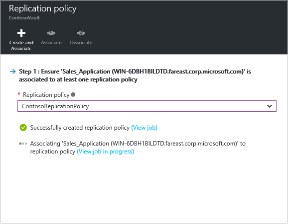

# Step 10: Set up a replication policy for Hyper-V VM replication (with VMM) to Azure

After setting up [network mapping](vmm-to-azure-walkthrough-network-mapping.md), use this article to configure a replication policy T\to replicate on-premises Hyper-V virtual machines managed in System Center Virtual Machine Manager (VMM) clouds to Azure, using the [Azure Site Recovery](site-recovery-overview.md) service in the Azure portal.

After reading this article, post any comments at the bottom, or on the [Azure Recovery Services Forum](https://social.msdn.microsoft.com/forums/azure/home?forum=hypervrecovmgr).

## Create a policy

1. To create a new replication policy, click **Prepare infrastructure** > **Replication Settings** > **+Create and associate**.

    
2. In **Create and associate policy**, specify a policy name.
3. In **Copy frequency**, specify how often you want to replicate delta data after the initial replication (every 30 seconds, 5 or 15 minutes).

	> [!NOTE]
	>  A 30 second frequency isn't supported when replicating to premium storage. The limitation is determined by the number of snapshots per blob (100) supported by premium storage. [Learn more](../storage/common/storage-premium-storage.md#snapshots-and-copy-blob)

4. In **Recovery point retention**, specify in hours how long the retention window will be for each recovery point. Protected machines can be recovered to any point within a window.
5. In **App-consistent snapshot frequency**, specify how frequently (1-12 hours) recovery points containing application-consistent snapshots will be created. Hyper-V uses two types of snapshots — a standard snapshot that provides an incremental snapshot of the entire virtual machine, and an application-consistent snapshot that takes a point-in-time snapshot of the application data inside the virtual machine. Application-consistent snapshots use Volume Shadow Copy Service (VSS) to ensure that applications are in a consistent state when the snapshot is taken. Note that if you enable application-consistent snapshots, it will affect the performance of applications running on source virtual machines. Ensure that the value you set is less than the number of additional recovery points you configure.
6. In **Initial replication start time**, indicate when to start the initial replication. The replication occurs over your internet bandwidth so you might want to schedule it outside your busy hours.
7. In **Encrypt data stored on Azure**, specify whether to encrypt at rest data in Azure storage. Then click **OK**.

    
8. When you create a new policy it's automatically associated with the VMM cloud. Click **OK**. You can associate additional VMM clouds (and the VMs in them) with this replication policy in **Replication** > policy name > **Associate VMM Cloud**.

    

## Next steps

Go to [Step 11: Enable replication](vmm-to-azure-walkthrough-enable-replication.md)
