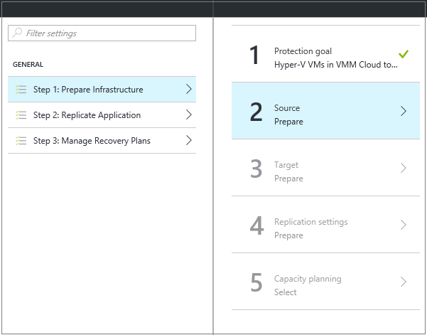
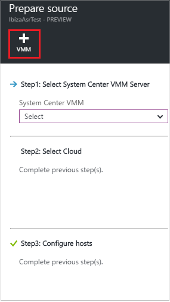
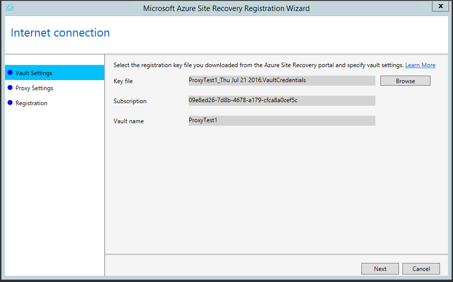
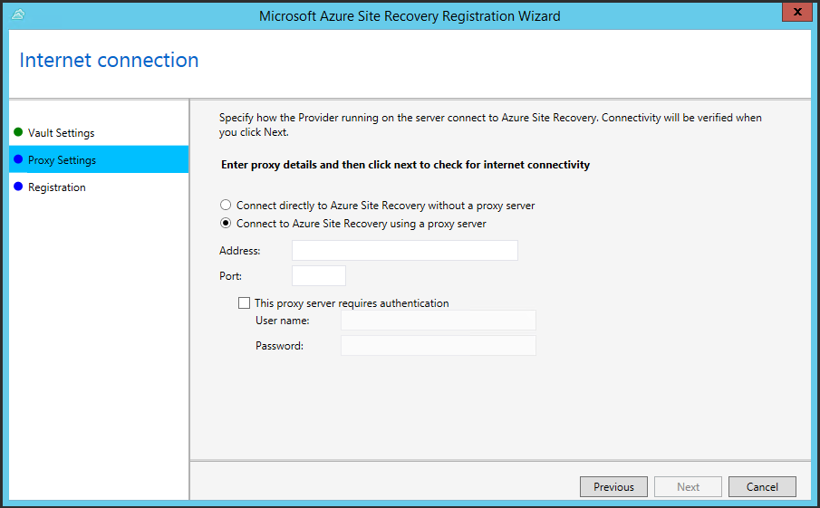
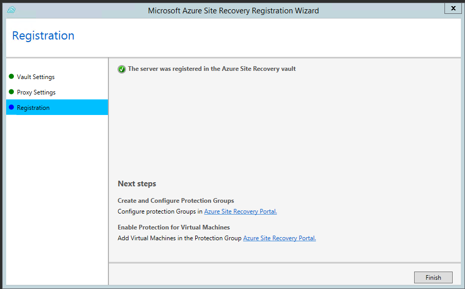
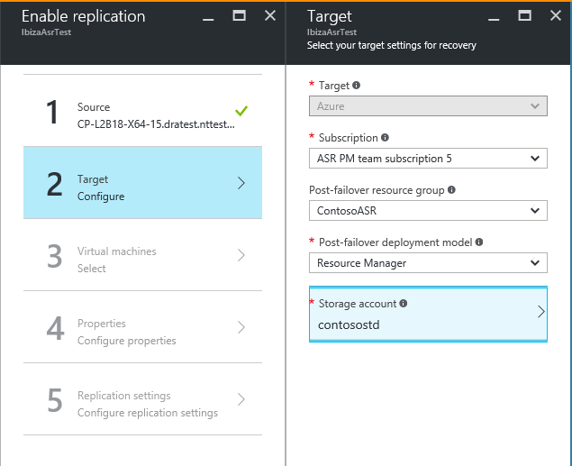
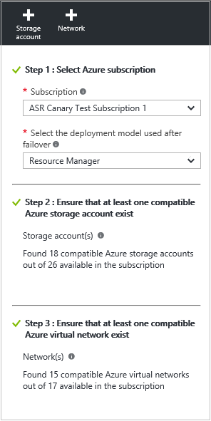
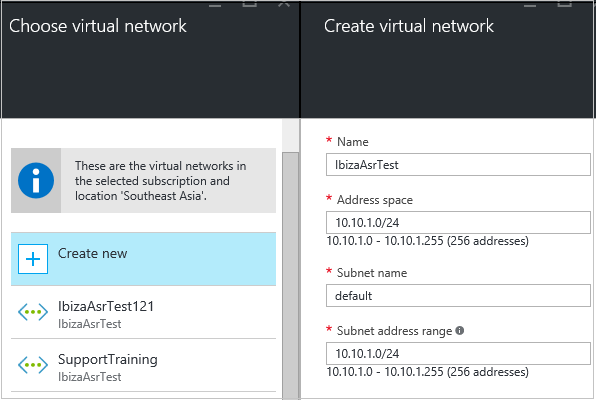

# Step 8: Set up the source and target for Hyper-V (with VMM) replication to Azure

After [creating a vault](vmm-to-azure-walkthrough-create-vault.md) and specifying what you want to replicate, use this article to configure source and target settings when replicating on-premises Hyper-V virtual machines in System Center Virtual Machine Manager (VMM) clouds to Azure, using the [Azure Site Recovery](site-recovery-overview.md) service in the Azure portal.

Post comments and questions at the bottom of this article, or on the [Azure Recovery Services Forum](https://social.msdn.microsoft.com/forums/azure/home?forum=hypervrecovmgr).

## Set up the source environment

S1. Click **Prepare Infrastructure** > **Source**.

    

2. In **Prepare source**, click **+ VMM** to add a VMM server.

    

3. In **Add Server**, check that **System Center VMM server** appears in **Server type** and that the VMM server meets the [prerequisites and URL requirements](#prerequisites).
4. Download the Azure Site Recovery Provider installation file.
5. Download the registration key. You need this when you run setup. The key is valid for five days after you generate it.

    

## Install the Provider on the VMM server

1. Run the Provider setup file on the VMM server.
2. In **Microsoft Update**, you can opt in for updates so that Provider updates are installed in accordance with your Microsoft Update policy.
3. In **Installation**, accept or modify the default Provider installation location and click **Install**.

    
4. When installation finishes, click **Register** to register the VMM server in the vault.
5. In the **Vault Settings** page, click **Browse** to select the vault key file. Specify the Azure Site Recovery subscription and the vault name.

    
6. In **Internet Connection**, specify how the Provider running on the VMM server will connect to Site Recovery over the internet.

   * If you want the Provider to connect directly, select **Connect directly to Azure Site Recovery without a proxy**.
   * If your existing proxy requires authentication, or you want to use a custom proxy, select **Connect to Azure Site Recovery using a proxy server**.
   * If you use a custom proxy, specify the address, port, and credentials.
   * If you're using a proxy, you should have already allowed the URLs described in [prerequisites](#on-premises-prerequisites).
   * If you use a custom proxy, a VMM RunAs account (DRAProxyAccount) will be created automatically using the specified proxy credentials. Configure the proxy server so that this account can authenticate successfully. The VMM RunAs account settings can be modified in the VMM console. In **Settings**, expand **Security** > **Run As Accounts**, and then modify the password for DRAProxyAccount. You’ll need to restart the VMM service so that this setting takes effect.

     
7. Accept or modify the location of an SSL certificate that’s automatically generated for data encryption. This certificate is used if you enable data encryption for a cloud protected by Azure in the Azure Site Recovery portal. Keep this certificate safe. When you run a failover to Azure you’ll need it to decrypt, if data encryption is enabled.
8. In **Server name**, specify a friendly name to identify the VMM server in the vault. In a cluster configuration, specify the VMM cluster role name.
9. Enable **Sync cloud metadata**, if you want to synchronize metadata for all clouds on the VMM server with the vault. This action only needs to happen once on each server. If you don't want to synchronize all clouds, you can leave this setting unchecked and synchronize each cloud individually in the cloud properties in the VMM console. Click **Register** to complete the process.

    
10. Registration starts. After registration finishes, the server is displayed in **Site Recovery Infrastructure** > **VMM Servers**.

## Install the Azure Recovery Services agent on Hyper-V hosts

1. After you've set up the Provider, you need to download the installation file for the Azure Recovery Services agent. Run setup on each Hyper-V server in the VMM cloud.

    
2. In **Prerequisites Check**, click **Next**. Any missing prerequisites will be automatically installed.

    
3. In **Installation Settings**, accept or modify the installation location, and the cache location. You can configure the cache on a drive that has at least 5 GB of storage available but we recommend a cache drive with 600 GB or more of free space. Then click **Install**.
4. After installation is complete, click **Close** to finish.

    

### Command line installation
You can install the Microsoft Azure Recovery Services Agent from command line using the following command:

     marsagentinstaller.exe /q /nu

### Set up internet proxy access to Site Recovery from Hyper-V hosts

The Recovery Services agent running on Hyper-V hosts needs internet access to Azure for VM replication. If you're accessing the internet through a proxy, set it up as follows:

1. Open the Microsoft Azure Backup MMC snap-in on the Hyper-V host. By default, a shortcut for Microsoft Azure Backup is available on the desktop or in C:\Program Files\Microsoft Azure Recovery Services Agent\bin\wabadmin.
2. In the snap-in, click **Change Properties**.
3. On the **Proxy Configuration** tab, specify proxy server information.

    
4. Check that the agent can reach the URLs described in the [prerequisites](#on-premises-prerequisites).

## Set up the target environment
Specify the Azure storage account to be used for replication, and the Azure network to which Azure VMs will connect after failover.

1. Click **Prepare infrastructure** > **Target**, select the subscription and the resource group where you want to create the failed over virtual machines. Choose the deployment model that you want to use in Azure (classic or resource management) for the failed over virtual machines.

	

2. Site Recovery checks that you have one or more compatible Azure storage accounts and networks.

  	

3. If you haven't created a storage account, and you want to create one using Resource Manager, click **+Storage account** to do that inline.  On the **Create storage account** blade specify an account name, type, subscription, and location. The account should be in the same location as the Recovery Services vault.

   

   * If you want to create a storage account using the classic model, do that in the Azure portal. [Learn more](../storage/common/storage-create-storage-account.md)
   * If you’re using a premium storage account for replicated data, set up an additional standard storage account, to store replication logs that capture ongoing changes to on-premises data.
5. If you haven't created an Azure network, and you want to create one using Resource Manager, click **+Network** to do that inline. On the **Create virtual network** blade specify a network name, address range, subnet details, subscription, and location. The network should be in the same location as the Recovery Services vault.

   

   If you want to create a network using the classic model, do that in the Azure portal. [Learn more](../virtual-network/virtual-networks-create-vnet-classic-pportal.md).

## Next steps

Go to [Step 9: Configure network mapping](vmm-to-azure-walkthrough-network-mapping.md)
