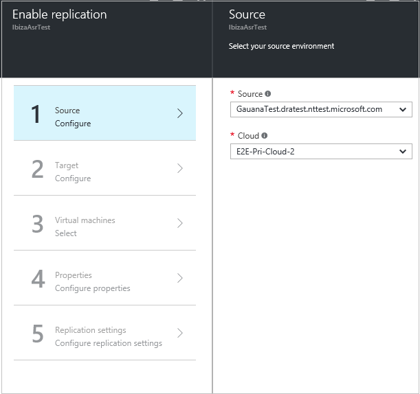

# Step 9: Enable replication to a secondary site for Hyper-V VMs

After setting up a replication policy, use this article to enable replication to a secondary System Center Virtual Machine Manager (VMM) site for on-premises Hyper-V virtual machines (VM), using [Azure Site Recovery](site-recovery-overview.md).

After reading this article, post any comments at the bottom, or on the [Azure Recovery Services Forum](https://social.msdn.microsoft.com/forums/azure/home?forum=hypervrecovmgr).

## Select VMs to replicate

1. Click **Step 2: Replicate application** > **Source**. 

    

2. In **Source**, select the VMM server, and the cloud in which the Hyper-V hosts you want to replicate are located. Then click **OK**.

    
3. In **Target**, verify the secondary VMM server and cloud.
4. In **Virtual machines**, select the VMs you want to protect from the list.

    

You can track progress of the **Enable Protection** action in **Jobs** > **Site Recovery jobs**. After the **Finalize Protection** job completes, the initial replication is complete, and the virtual machine is ready for failover.

Note that:

- You can also enable protection for virtual machines in the VMM console. Click **Enable Protection** on the toolbar in the virtual machine properties > **Azure Site Recovery** tab.
- After you've enabled replication, you can view properties for the VM in **Replicated Items**. On the **Essentials** dashboard, you can see information about the replication policy for the VM and its status. Click **Properties** for more details.

## Onboard existing VMs

If you have existing virtual machines in VMM that are replicating with Hyper-V Replica, you can onboard them for Azure Site Recovery replication as follows:

1. Ensure that the Hyper-V server hosting the existing VM is located in the primary cloud, and that the Hyper-V server hosting the replica virtual machine is located in the secondary cloud.
2. Make sure a replication policy is configured for the primary VMM cloud.
3. Enable replication for the primary virtual machine. Azure Site Recovery and VMM ensure that the same replica host and virtual machine is detected, and Azure Site Recovery will reuse and reestablish replication using the specified settings.

## Next steps

Go to [Step 10: Run a test failover](vmm-to-vmm-walkthrough-test-failover.md).
