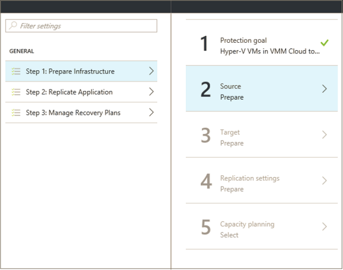
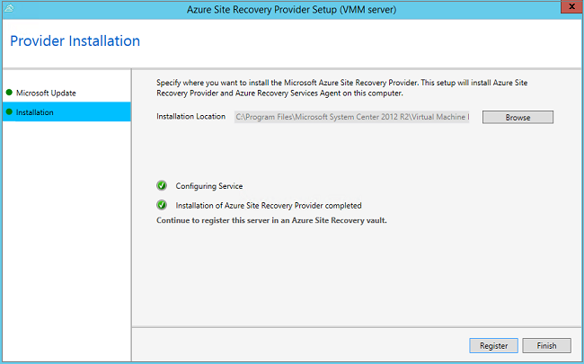

# Step 6: Set up the replication source and target

After creating a Recovery Services vault for Hyper-V replication to a secondary VMM site with [Azure Site Recovery](site-recovery-overview.md), use this article to set up the source and target replication locations. 

After reading this article, post any comments at the bottom, or on the [Azure Recovery Services Forum](https://social.msdn.microsoft.com/forums/azure/home?forum=hypervrecovmgr).

## Set up the source environment

Install the Azure Site Recovery Provider on VMM servers, and discover and register servers in the vault.

1. Click **Step 1: Prepare Infrastructure** > **Source**.

    
2. In **Prepare source**, click **+ VMM** to add a VMM server.

    
3. In **Add Server**, check that **System Center VMM server** appears in **Server type** and that the VMM server meets the [prerequisites](#prerequisites).
4. Download the Azure Site Recovery Provider installation file.
5. Download the registration key. You need this when you run setup. The key is valid for five days after you generate it.

    
6. Install the Azure Site Recovery Provider on the VMM server. You don't need to explicitly install anything on Hyper-V host servers.

## Install the Azure Site Recovery Provider

1. Run the Provider setup file on each VMM server. If VMM is deployed in a cluster, do the following the first time you install:
    -  Install the provider on an active node, and finish the installation to register the VMM server in the vault.
    - Then, install the Provider on the other nodes. Cluster nodes should all run the same version of the Provider.
2. Setup runs a few prerequisite checks, and requests permission to stop the VMM service. The VMM service will be restarted automatically when setup finishes. If you install on a VMM cluster, you're prompted to stop the Cluster role.
3. In **Microsoft Update**, you can opt in to specify that provider updates are installed in accordance with your Microsoft Update policy.
4. In **Installation**, accept or modify the default installation location, and click **Install**.

    
5. After installation is complete, click **Register** to register the server in the vault.

    
6. In **Vault name**, verify the name of the vault in which the server will be registered. Click *Next*.

    
7. In **Internet Connection**, specify how the provider running on the VMM server connects to Azure.

    

   - You can specify that the provider should connect directly to the internet, or via a proxy.
   - Specify proxy settings if needed.
   - If you use a proxy, a VMM RunAs account (DRAProxyAccount) is created automatically using the specified proxy credentials. Configure the proxy server so that this account can authenticate successfully. The RunAs account settings can be modified in the VMM console > **Settings** > **Security** > **Run As Accounts**. Restart the VMM service to update changes.
8. In **Registration Key**, select the key that you downloaded from Azure Site Recovery and copied to the VMM server.
9. The encryption setting is only used when you're replicating Hyper-V VMs in VMM clouds to Azure. If you're replicating to a secondary site it's not used.
10. In **Server name**, specify a friendly name to identify the VMM server in the vault. In a cluster configuration specify the VMM cluster role name.
11. In **Synchronize cloud metadata**, select whether you want to synchronize metadata for all clouds on the VMM server with the vault. This action only needs to happen once on each server. If you don't want to synchronize all clouds, you can leave this setting unchecked, and synchronize each cloud individually in the cloud properties in the VMM console.
12. Click **Next** to complete the process. After registration, metadata from the VMM server is retrieved by Azure Site Recovery. The server is displayed on the **VMM Servers** tab on the **Servers** page in the vault.

    
13. After the server is available in the Site Recovery console, in **Source** > **Prepare source** select the VMM server, and select the cloud in which the Hyper-V host is located. Then click **OK**.

You can also install the provider from the command line:

[!INCLUDE [site-recovery-rw-provider-command-line](../../includes/site-recovery-rw-provider-command-line.md)]

## Set up the target environment

Select the target VMM server and cloud:

1. Click **Prepare infrastructure** > **Target**, and select the target VMM server you want to use.
2. Clouds on the server that are synchronized with Site Recovery will be displayed. Select the target cloud.

   

## Next steps

Go to [Step 7: Configure network mapping](vmm-to-vmm-walkthrough-network-mapping.md).
