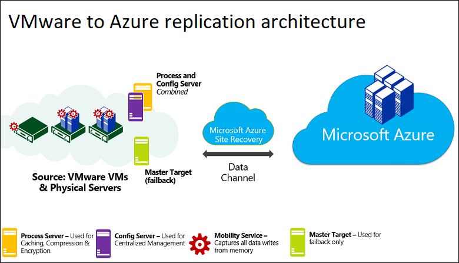
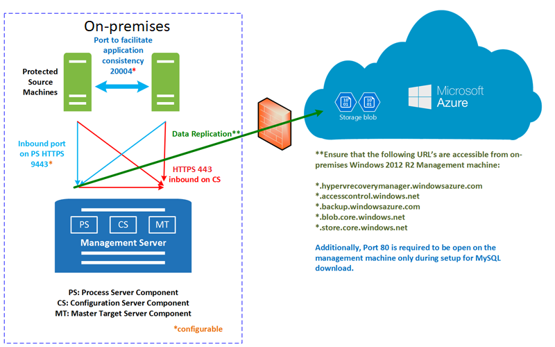
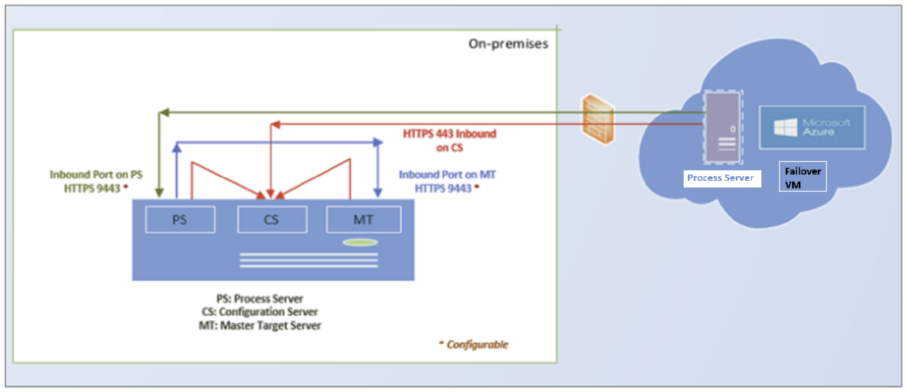

# VMware to Azure disaster recovery architecture

This article describes the architecture and processes used when you deploy disaster recovery replication, failover, and recovery of VMware virtual machines (VMs) between an on-premises VMware site and Azure using the [Azure Site Recovery](site-recovery-overview.md) service.

## Architectural components

The following table and graphic provide a high-level view of the components used for VMware disaster recovery to Azure.

**Component** | **Requirement** | **Details**
--- | --- | ---
**Azure** | An Azure subscription, Azure Storage account for cache, Managed Disk and Azure network. | Replicated data from on-premises VMs is stored in Azure storage. Azure VMs are created with the replicated data when you run a failover from on-premises to Azure. The Azure VMs connect to the Azure virtual network when they're created.
**Configuration server machine** | A single on-premises machine. We recommend that you run it as a VMware VM that can be deployed from a downloaded OVF template.   The machine runs all on-premises Site Recovery components, which include the configuration server, process server, and master target server. | **Configuration server**: Coordinates communications between on-premises and Azure, and manages data replication.   **Process server**: Installed by default on the configuration server. It receives replication data; optimizes it with caching, compression, and encryption; and sends it to Azure Storage. The process server also installs Azure Site Recovery Mobility Service on VMs you want to replicate, and performs automatic discovery of on-premises machines. As your deployment grows, you can add additional, separate process servers to handle larger volumes of replication traffic.   **Master target server**: Installed by default on the configuration server. It handles replication data during failback from Azure. For large deployments, you can add an additional, separate master target server for failback.
**VMware servers** | VMware VMs are hosted on on-premises vSphere ESXi servers. We recommend a vCenter server to manage the hosts. | During Site Recovery deployment, you add VMware servers to the Recovery Services vault.
**Replicated machines** | Mobility Service is installed on each VMware VM that you replicate. | We recommend that you allow automatic installation from the process server. Alternatively, you can install the service manually or use an automated deployment method, such as Configuration Manager.

**VMware to Azure architecture**

## Replication process

1. When you enable replication for a VM, initial replication to Azure storage begins, using the specified replication policy. Note the following:
    - For VMware VMs, replication is block-level, near-continuous, using the Mobility service agent running on the VM.
    - Any replication policy settings are applied:
        - **RPO threshold**. This setting does not affect replication. It helps with monitoring. An event is raised, and optionally an email sent, if the current RPO exceeds the threshold limit that you specify.
        - **Recovery point retention**. This setting specifies how far back in time you want to go when a disruption occurs. Maximum retention on premium storage is 24 hours. On standard storage it's 72 hours. 
        - **App-consistent snapshots**. App-consistent snapshot can be take every 1 to 12 hours, depending on your app needs. Snapshots are standard Azure blob snapshots. The Mobility agent running on a VM requests a VSS snapshot in accordance with this setting, and bookmarks that point-in-time as an application consistent point in the replication stream.

2. Traffic replicates to Azure storage public endpoints over the internet. Alternately, you can use Azure ExpressRoute with [Microsoft peering](../expressroute/expressroute-circuit-peerings.md#microsoftpeering). Replicating traffic over a site-to-site virtual private network (VPN) from an on-premises site to Azure isn't supported.
3. After initial replication finishes, replication of delta changes to Azure begins. Tracked changes for a machine are sent to the process server.
4. Communication happens as follows:

    - VMs communicate with the on-premises configuration server on port HTTPS 443 inbound, for replication management.
    - The configuration server orchestrates replication with Azure over port HTTPS 443 outbound.
    - VMs send replication data to the process server (running on the configuration server machine) on port HTTPS 9443 inbound. This port can be modified.
    - The process server receives replication data, optimizes and encrypts it, and sends it to Azure storage over port 443 outbound.
5. The replication data logs first land in a cache storage account in Azure. These logs are processed and the data is stored in an Azure Managed Disk (called as asr seed disk). The recovery points are created on this disk.

**VMware to Azure replication process**

## Failover and failback process

After replication is set up and you run a disaster recovery drill (test failover) to check that everything's working as expected, you can run failover and failback as you need to.

1. You run fail for a single machine, or create a recovery plans to fail over multiple VMs at the same time. The advantage of a recovery plan rather than single machine failover include:
    - You can model app-dependencies by including all the VMs across the app in a single recovery plan.
    - You can add scripts, Azure runbooks, and pause for manual actions.
2. After triggering the initial failover, you commit it to start accessing the workload from the Azure VM.
3. When your primary on-premises site is available again, you can prepare for fail back. In order to fail back, you need to set up a failback infrastructure, including:

    * **Temporary process server in Azure**: To fail back from Azure, you set up an Azure VM to act as a process server to handle replication from Azure. You can delete this VM after failback finishes.
    * **VPN connection**: To fail back, you need a VPN connection (or ExpressRoute) from the Azure network to the on-premises site.
    * **Separate master target server**: By default, the master target server that was installed with the configuration server on the on-premises VMware VM handles failback. If you need to fail back large volumes of traffic, set up a separate on-premises master target server for this purpose.
    * **Failback policy**: To replicate back to your on-premises site, you need a failback policy. This policy is automatically created when you create a replication policy from on-premises to Azure.
4. After the components are in place, failback occurs in three actions:

    - Stage 1: Reprotect the Azure VMs so that they replicate from Azure back to the on-premises VMware VMs.
    -  Stage 2: Run a failover to the on-premises site.
    - Stage 3: After workloads have failed back, you reenable replication for the on-premises VMs.
    
 
**VMware failback from Azure**

## Next steps

Follow [this tutorial](vmware-azure-tutorial.md) to enable VMware to Azure replication.
