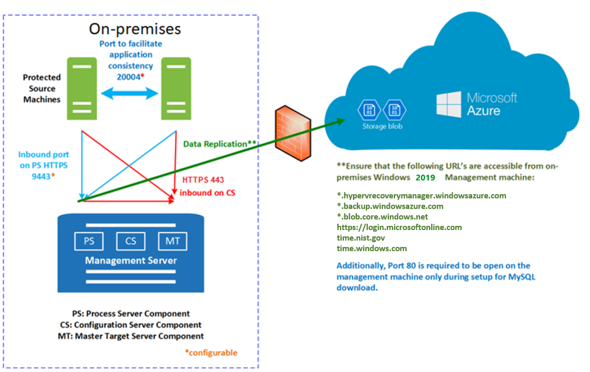

# VMware to Azure replication architecture

This article describes the architecture and processes used when you replicate, fail over, and recover VMware virtual machines (VMs) between an on-premises VMware site and Azure by using [Azure Site Recovery](site-recovery-overview.md).

## Architectural components

The following table and graphic provide a high-level view of the components used for VMware replication to Azure.

**Component** | **Requirement** | **Details**
--- | --- | ---
**Azure** | An Azure subscription, Azure Storage account, and Azure network. | Replicated data from on-premises VMs is stored in the storage account. Azure VMs are created with the replicated data when you run a failover from on-premises to Azure. The Azure VMs connect to the Azure virtual network when they're created.
**Configuration server machine** | A single on-premises machine. We recommend that you run it as a VMware VM that can be deployed from a downloaded OVF template.   The machine runs all on-premises Site Recovery components, which include the configuration server, process server, and master target server. | **Configuration server**: Coordinates communications between on-premises and Azure, and manages data replication.   **Process server**: Installed by default on the configuration server. It receives replication data; optimizes it with caching, compression, and encryption; and sends it to Azure Storage. The process server also installs Azure Site Recovery Mobility Service on VMs you want to replicate, and performs automatic discovery of on-premises machines. As your deployment grows, you can add additional, separate process servers to handle larger volumes of replication traffic.   **Master target server**: Installed by default on the configuration server. It handles replication data during failback from Azure. For large deployments, you can add an additional, separate master target server for failback.
**VMware servers** | VMware VMs are hosted on on-premises vSphere ESXi servers. We recommend a vCenter server to manage the hosts. | During Site Recovery deployment, you add VMware servers to the Recovery Services vault.
**Replicated machines** | Mobility Service is installed on each VMware VM that you replicate. | We recommend that you allow automatic installation from the process server. Alternatively, you can install the service manually or use an automated deployment method, such as System Center Configuration Manager.

**VMware to Azure architecture**

## Configuration steps

The broad steps for setting up VMware to Azure disaster recovery or migration are as follows:

1. **Set up Azure components**. You need an Azure account with the right permissions, an Azure storage account, an Azure virtual network, and a Recovery Services vault. [Learn more](tutorial-prepare-azure.md).
2. **Set up on-premises**. These include setting up an account on the VMware server so that Site Recovery can automatically discover VMs to replicate, setting up an account that can be used to install the Mobility service component on VMs you want to replicate, and verifying that VMware servers and VMs comply with prerequisites. You can also optionally prepare to connect to these Azure VMs after failover. Site Recovery replicates VM data to an Azure storage account, and creates Azure VMs using the data when you run a failover to Azure. [Learn more](vmware-azure-tutorial-prepare-on-premises.md).
3. **Set up replication**. You choose where you want to replicate to. You configure the source replication environment by setting up a single on-premises VMware VM (the configuration server) that runs all of the on-premises Site Recovery components that you need. After setup you register the configuration server machine in the Recovery Services vault. Then, you select the target settings. [Learn more](vmware-azure-tutorial.md).
4. **Create a replication policy**. You create a replication policy that specifies how replication should happen. 
    - **RPO threshold**: This monitoring setting states that if replication doesn't occur within the time specified, an alert (and optionally an email) is issued. For example, if you set the RPO threshold to 30 minutes, and an issue prevents replication from happening for 30 minutes, an event is generated. This setting doesn't affect replication. Replication is continuous, and recovery points are created every few minutes
    - **Retention**: Recovery point retention specifies how long recovery points should be kept in Azure. You can specify a value between 0 and 24 hours for premium storage, or up to 72 hours for standard storage. You can fail over to the latest recovery point, or to a stored point if you set the value higher than zero. After the retention window, recovery points are purged.
    - **Crash-consistent snapshots**: By default, Site Recovery takes crash-consistent snapshots and creates recovery points with them every few minutes. A recovery point is crash consistent if all of the interrelated data components are write-order consistent, as they were at the instant the recovery point was created. To better understand, imagine the status of the data on your PC hard drive after a power outage or similar event. A crash-consistent recovery point is usually sufficient if your application is designed to recover from a crash without any data inconsistencies.
    - **App-consistent snapshots**: If this value isn't zero, the Mobility service running on the VM attempts to generate file system-consistent snapshots and recovery points. The first snapshot is taken after initial replication is complete. Then, snapshots are taken at the frequency you specify. A recovery point is application-consistent if, in addition to being write-order consistent, running applications complete all  of their operations, and flush their buffers to disk (application quiescing). App-consistent recovery points are recommended for database applications such as SQL, Oracle, and Exchange. If a crash-consistent snapshot is sufficient, this value can be set to 0.  
    - **Multi-VM consistency**: You can optionally create a replication group. Then, when you enable replication, you can gather VMs into that group. VMs in a replication group replicate together, and have shared crash-consistent and app-consistent recovery points when failed over. You should use this option carefully, since it can affect workload performance as snapshots needed to be gathered across multiple machines. Only do this if VMs run the same workload and need to be consistent, and VMs have similar churns. You can add up to 8 VMs to a group. 
5. **Enable VM replication**. Finally, you enable replication for your on-premises VMware VMs. If you created an account to install the Mobility service, and specified that Site Recovery should do a push installation, then the Mobility service will be installed on each VM for which you enable replication. [Learn more](vmware-azure-tutorial.md#enable-replication). If you have created a replication group for multi-VM consistency, you can add VMs to that group.
6. **Test failover**. After everything's set up, you can do a test failover to check that VMs fail over to Azure as expected. [Learn more](tutorial-dr-drill-azure.md).
7. **Failover**. If you're just migrating the VMs to Azure - you run a full failover to do that. If you're setting up disaster recovery, you can run a full failover as you need to. For full disaster recovery, after failover to Azure, you can fail back to your on-premises site as and when it's available. [Learn more](vmware-azure-tutorial-failover-failback.md).

## Replication process

1. When you enable replication for a VM, it begins to replicate in accordance with the replication policy. 
2. Traffic replicates to Azure storage public endpoints over the internet. Alternately, you can use Azure ExpressRoute with [public peering](../expressroute/expressroute-circuit-peerings.md#azure-public-peering). Replicating traffic over a site-to-site virtual private network (VPN) from an on-premises site to Azure isn't supported.
3. An initial copy of the VM data is replicated to Azure storage.
4. After initial replication finishes, replication of delta changes to Azure begins. Tracked changes for a machine are held in a .hrl file.
5. Communication happens as follows:

    - VMs communicate with the on-premises configuration server on port HTTPS 443 inbound, for replication management.
    - The configuration server orchestrates replication with Azure over port HTTPS 443 outbound.
    - VMs send replication data to the process server (running on the configuration server machine) on port HTTPS 9443 inbound. This port can be modified.
    - The process server receives replication data, optimizes and encrypts it, and sends it to Azure storage over port 443 outbound.

**VMware to Azure replication process**

## Failover and failback process

After replication is set up and you run a disaster recovery drill (test failover) to check that everything's working as expected, you can run failover and failback as you need to.

1. You run fail for a single machine, or create a recovery plans to fail over multiple VMs at the same time. The advantage of a recovery plan rather than single machine failover include:
    - You can model app-dependencies by including all the VMs across the app in a single recovery plan.
    - You can add scripts, Azure runbooks, and pause for manual actions.
2. After triggering the initial failover, you commit it to start accessing the workload from the Azure VM.
3. When your primary on-premises site is available again, you can prepare for fail back. In order to fail back, you need to set up a failback infrastructure, including:

    * **Temporary process server in Azure**: To fail back from Azure, you set up an Azure VM to act as a process server to handle replication from Azure. You can delete this VM after failback finishes.
    * **VPN connection**: To fail back, you need a VPN connection (or ExpressRoute) from the Azure network to the on-premises site.
    * **Separate master target server**: By default, the master target server that was installed with the configuration server on the on-premises VMware VM handles failback. If you need to fail back large volumes of traffic, set up a separate on-premises master target server for this purpose.
    * **Failback policy**: To replicate back to your on-premises site, you need a failback policy. This policy was automatically created when you created your replication policy from on-premises to Azure.
4. After the components are in place, failback occurs in three actions:

    - Stage 1: Reprotect the Azure VMs so that they replicate from Azure back to the on-premises VMware VMs.
    -  Stage 2: Run a failover to the on-premises site.
    - Stage 3: After workloads have failed back, you reenable replication for the on-premises VMs.
    
 
**VMware failback from Azure**

## Next steps

Follow [this tutorial](vmware-azure-tutorial.md) to enable VMware to Azure replication.
