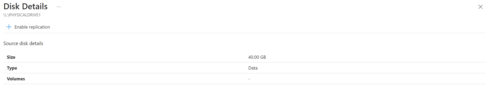
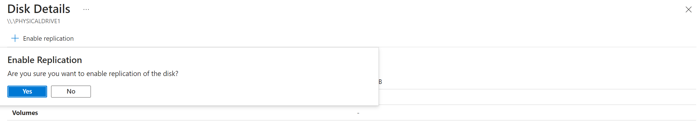

# Enable replication for a disk added to a VMware virtual machine 

This article describes how to enable replication for newly added data disks that are added to a VMware virtual machine, which already has disaster recovery enabled to an Azure region, using [Azure Site Recovery](site-recovery-overview.md).

Enabling replication for a disk you add to a virtual machine is now supported for VMware virtual machines also. 

**When you add a new disk to a VMware virtual machine that is replicating to an Azure region, the following occurs:** 
-	Replication health for the virtual machine shows a warning, and a note in the portal informs you that one or more disks are available for protection.
-	If you enable protection for the added disks, the warning will disappear after initial replication of the disk.
-	If you choose not to enable replication for the disk, you can select to dismiss the warning.

    

## Before you start

This article assumes that you've already set up disaster recovery for the VMware virtual machine to which you're adding the disk. If you haven't, follow the [VMware to Azure disaster recovery tutorial](vmware-azure-set-up-replication-tutorial-modernized.md).

## Enable replication for an added disk

To enable replication for an added disk, do the following:

1. In the vault > **Replicated Items**, select the virtual machine to which you added the disk.
2. Select **Disks** > **Data disks** section of the protected item, and then select the data disk for which you want to enable replication (these disks have a **Not protected** status).
    

    > [!NOTE]
    > If the enable replication operation for this disk fails, you can resolve the issues and retry the operation.

3.	In **Disk Details**, select **Enable replication**.

    

1. Confirm **Enable Replication** 
    
    

After the enable replication job runs and the initial replication finishes, the replication health warning for the disk issue is removed.

## Next steps

[Learn more](site-recovery-test-failover-to-azure.md) about running a test failover.

