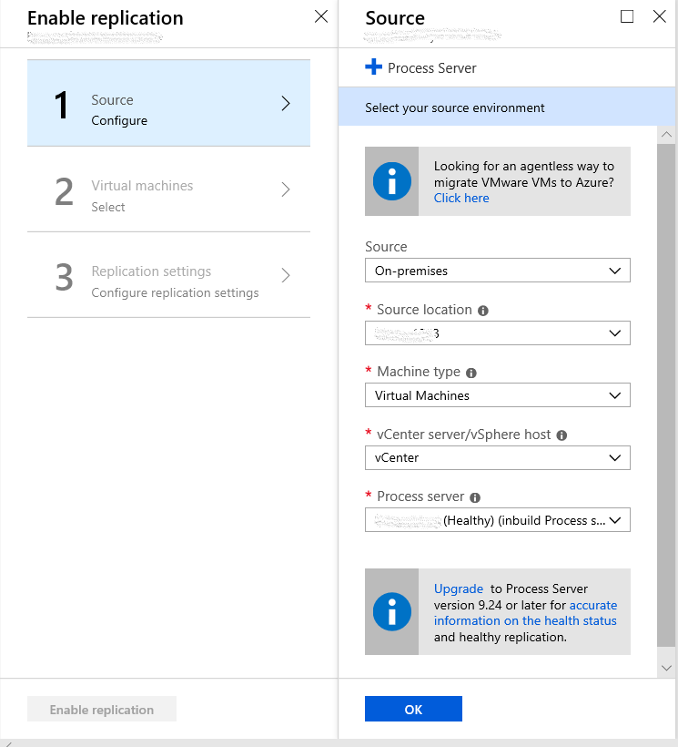
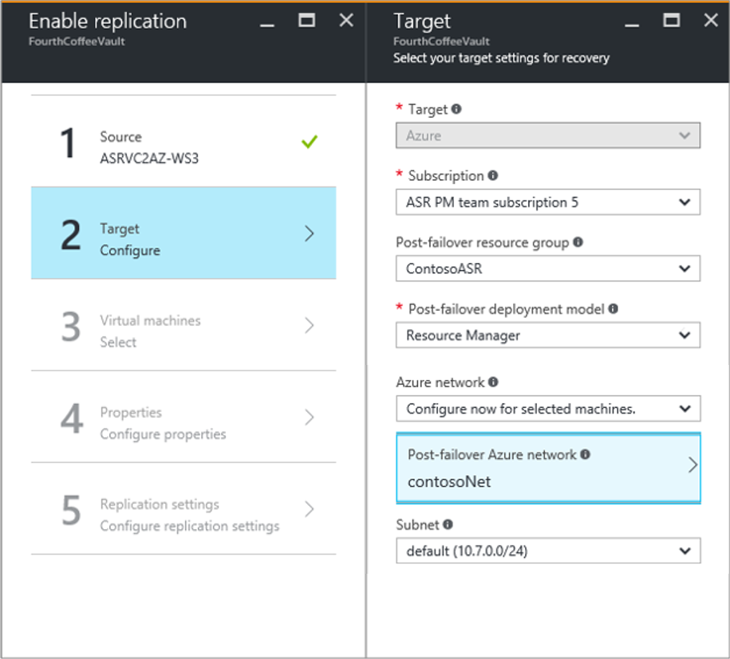
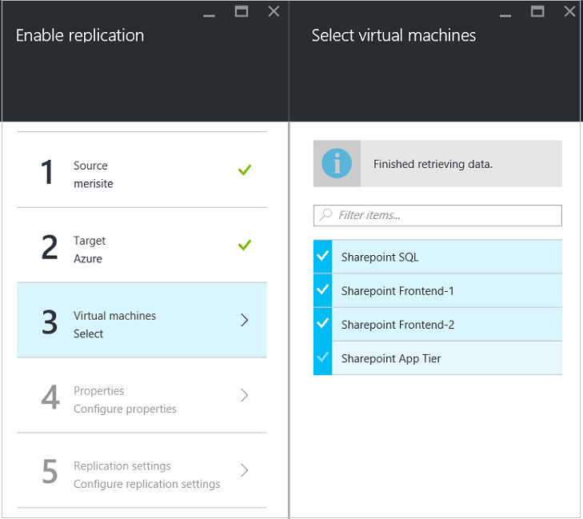
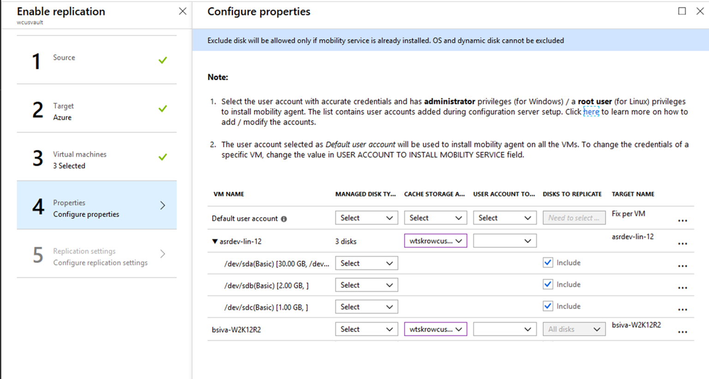
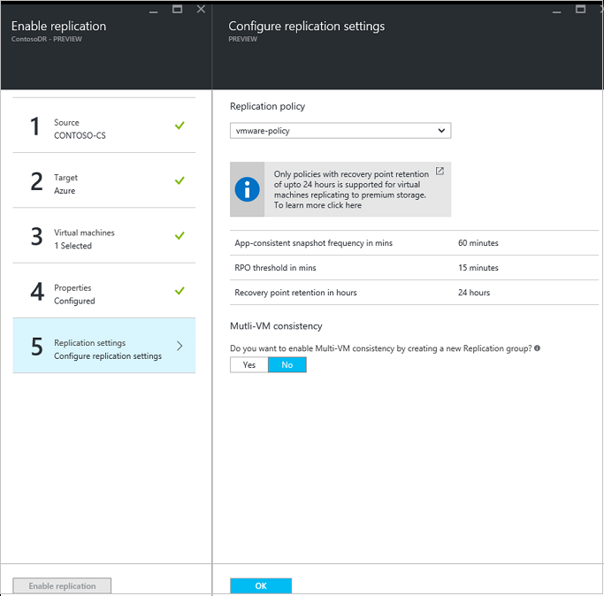
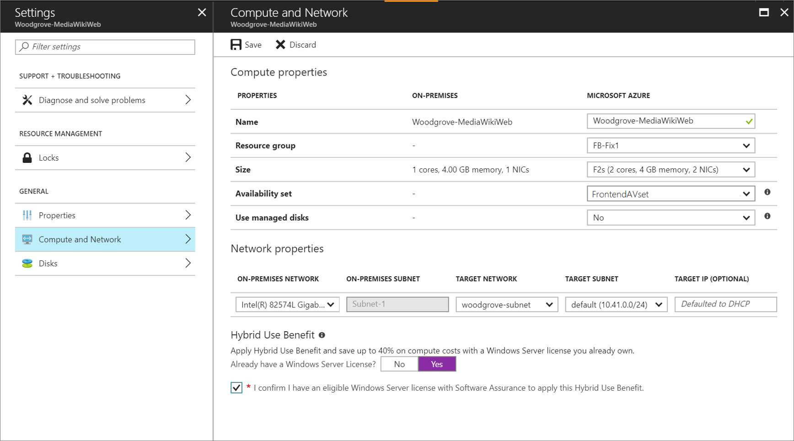

# Enable replication to Azure for VMware VMs

This article describes how to enable replication of on-premises VMware VMs to Azure.

## Prerequisites

This article assumes that you have:

- [Set up your on-premises source environment](vmware-azure-set-up-source.md).
- [Set up your target environment in Azure](vmware-azure-set-up-target.md).

## Before you start
When you're replicating VMware virtual machines, keep this information in mind:

* Your Azure user account needs to have certain [permissions](site-recovery-role-based-linked-access-control.md#permissions-required-to-enable-replication-for-new-virtual-machines) to enable replication of a new virtual machine to Azure.
* VMware VMs are discovered every 15 minutes. It can take 15 minutes or longer for VMs to appear in the Azure portal after discovery. Likewise, discovery can take 15 minutes or longer when you add a new vCenter server or vSphere host.
* It can take 15 minutes or longer for environment changes on the virtual machine (such as VMware tools installation) to be updated in the portal.
* You can check the last-discovered time for VMware VMs: See the **Last Contact At** field on the **Configuration Servers** page for the vCenter server/vSphere host.
* To add virtual machines for replication without waiting for the scheduled discovery, highlight the configuration server (but don’t click it), and select **Refresh**.
* When you enable replication, if the virtual machine is prepared, the process server automatically installs the Azure Site Recovery Mobility service on it.

## Enable replication

Before you follow the steps in this section, note the following information:
* Azure Site Recovery now replicates directly to managed disks for all new replications. The process server writes replication logs to a cache storage account in the target region. These logs are used to create recovery points in replica managed disks that have naming convention of asrseeddisk.
* Powershell support for replicating to managed disks is available from [Az.RecoveryServices module version 2.0.0 onwards](https://www.powershellgallery.com/packages/Az.RecoveryServices/2.0.0-preview) 
* At the time of failover, the recovery point that you select is used to create the target-managed disk.
* VMs that were previously configured to replicate to target storage accounts aren't affected.
* Replication to storage accounts for a new virtual machine is only available via a Representational State Transfer (REST) API and Powershell. Use Azure REST API version 2016-08-10 or 2018-01-10 for replicating to storage accounts.

Please follow below steps to Enable Replication:
1. Go to **Step 2: Replicate application** > **Source**. After you enable replication for the first time, select **+Replicate** in the vault to enable replication for additional virtual machines.
2. In the **Source** page > **Source**, select the configuration server.
3. For **Machine type**, select **Virtual Machines** or **Physical Machines**.
4. In **vCenter/vSphere Hypervisor**, select the vCenter server that manages the vSphere host, or select the host. This setting isn't relevant if you're replicating physical computers.
5. Select the process server. If there are no additional process servers created, inbuilt process server of configuration server will be available in the dropdown. Health status of each process server is indicated as per recommended limits and other parameters. Choose a healthy process server. A [critical](vmware-physical-azure-monitor-process-server.md#process-server-alerts) process server cannot be chosen. You can either [troubleshoot and resolve](vmware-physical-azure-troubleshoot-process-server.md) the errors **or** set up a [scale-out process server](vmware-azure-set-up-process-server-scale.md).
    

> [!NOTE]
> From [9.24 versions](service-updates-how-to.md#links-to-currently-supported-update-rollups), additional alerts are introduced to enhance the health alerts of process server. Upgrade Site Recovery components to 9.24 versions or above for all alerts to be generated.

6. For **Target**, select the subscription and resource group where you want to create the failed-over virtual machines. Choose the deployment model that you want to use in Azure for the failed-over VMs.
2. Select the Azure network and subnet that the Azure VMs will connect to after failover. The network must be in the same region as the Site Recovery service vault.

   Select **Configure now for selected machines** to apply the network setting to all virtual machines that you select for protection. Select **Configure later** to select the Azure network per virtual machine. If you don't have a network, you need to create one. To create a network by using Azure Resource Manager, select **Create new**. Select a subnet if applicable, and then select **OK**.
   
   

1. For **Virtual machines** > **Select virtual machines**, select each virtual machine that you want to replicate. You can only select virtual machines for which replication can be enabled. Then select **OK**. If you can't see or select any particular virtual machine, see [Source machine isn't listed in the Azure portal](https://aka.ms/doc-plugin-VM-not-showing) to resolve the issue.

    

1. For **Properties** > **Configure properties**, select the account that the process server uses to automatically install the Site Recovery Mobility service on the virtual machine. Also, choose the type of target managed disk to replicate to based on your data churn patterns.
10. By default, all the disks of a source virtual machine are replicated. To exclude disks from replication, clear the **Include** check box for any disks that you don't want to replicate. Then select **OK**. You can set additional properties later. Learn more about [excluding disks](vmware-azure-exclude-disk.md).

    

1. At **Replication settings** > **Configure replication settings**, verify that the correct replication policy is selected. You can modify replication policy settings at **Settings** > **Replication policies** > ***policy name*** > **Edit Settings**. Changes that you apply to a policy also apply to replicating and new virtual machines.
1. Enable **Multi-VM consistency** if you want to gather virtual machines into a replication group. Specify a name for the group, and then select **OK**.

    > [!NOTE]
    >    * Virtual machines in a replication group replicate together and have shared crash-consistent and app-consistent recovery points when they fail over.
    >    * Gather VMs and physical servers together so that they mirror your workloads. Enabling multi-VM consistency can affect workload performance. Do this only if the virtual machines are running the same workload, and you need consistency.

    
    
1. Select **Enable Replication**. You can track the progress of the **Enable Protection** job at **Settings** > **Jobs** > **Site Recovery Jobs**. After the **Finalize Protection** job runs, the virtual machine is ready for failover.

## View and manage VM properties

Next, verify the properties of the source virtual machine. Remember that the Azure VM name needs to conform with [Azure virtual machine requirements](vmware-physical-azure-support-matrix.md#replicated-machines).

1. Go to **Settings** > **Replicated items**, and then select the virtual machine. The **Essentials** page shows information about the VM's settings and status.
1. In **Properties**, you can view replication and failover information for the VM.
1. In **Compute and Network** > **Compute properties**, you can change multiple VM properties. 

    

    * Azure VM name: Modify the name to meet Azure requirements, if necessary.
    * Target VM size or VM type: The default VM size is chosen based on a few parameters that include Disk count, NIC count, CPU core count, Memory and available VM role sizes in target Azure region. Azure Site Recovery picks the first available VM size which satisfies all the criteria. You can select a different VM size based on your needs at any time before failover. Note that VM disk size is also based on source disk size, and it can only be changed after failover. Learn more about disk sizes and IOPS rates at [Scalability and performance targets for VM disks on Windows](../virtual-machines/windows/disk-scalability-targets.md).

    *  Resource group: You can select a [resource group](https://docs.microsoft.com/azure/virtual-machines/windows/infrastructure-resource-groups-guidelines), from which a virtual machine becomes a part of a post failover. You can change this setting at any time before failover. After failover, if you migrate the virtual machine to a different resource group, the protection settings for that virtual machine break.
    * Availability set: You can select an [availability set](https://docs.microsoft.com/azure/virtual-machines/windows/infrastructure-availability-sets-guidelines) if your virtual machine needs to be a part of a post failover. When you select an availability set, keep the following information in mind:

        * Only availability sets that belong to the specified resource group are listed.  
        * VMs that are on different virtual networks can't be a part of the same availability set.
        * Only virtual machines of the same size can be a part of an availability set.
1. You can also add information about the target network, subnet, and IP address that's assigned to the Azure VM.
2. In **Disks**, you can see the operating system and data disks on the VM that will be replicated.

### Configure networks and IP addresses

You can set the target IP address. If you don't provide an address, the failed-over virtual machine uses DHCP. If you set an address that isn't available at failover, the failover doesn't work. If the address is available in the test failover network, you can use the same target IP address for test failover.

The number of network adapters is dictated by the size that you specify for the target virtual machine, as follows:

- If the number of network adapters on the source virtual machine is less than or equal to the number of adapters that are allowed for the target VM's size, the target has the same number of adapters as the source.
- If the number of adapters for the source virtual machine exceeds the number that's allowed for the target VM's size, the target size maximum is used. For example, if a source virtual machine has two network adapters and the target VM's size supports four, the target virtual machine has two adapters. If the source VM has two adapters but the target size only supports one, the target VM has only one adapter.
- If the virtual machine has multiple network adapters, they all connect to the same network. Also, the first adapter that's shown in the list becomes the *default* network adapter in the Azure virtual machine. 

### Azure Hybrid Benefit

Microsoft Software Assurance customers can use Azure Hybrid Benefit to save on licensing costs for Windows Server computers that are migrated to Azure. The benefit also applies to Azure disaster recovery. If you're eligible, you can assign the benefit to the virtual machine that Site Recovery creates if there's a failover. To do that, follow these steps:
1. Go to the **Computer and Network properties** of the replicated virtual machine.
2. Answer when asked if you have a Windows Server license that makes you eligible for Azure Hybrid Benefit.
3. Confirm that you have an eligible Windows Server license with Software Assurance that you can use to apply the benefit to the VM that will be created at failover.
4. Save the settings for the replicated virtual machine.

Learn more about [Azure Hybrid Benefit](https://aka.ms/azure-hybrid-benefit-pricing).

## Resolve common issues

* Each disk should be smaller than 4 TB.
* The OS disk should be a basic disk, not a dynamic disk.
* For generation 2/UEFI-enabled virtual machines, the operating system family should be Windows, and the boot disk should be smaller than 300 GB.

## Next steps

After the virtual machine reaches a protected state, try a [failover](site-recovery-failover.md) to check whether your application appears in Azure.

* Learn how to [clean registration and protection settings](site-recovery-manage-registration-and-protection.md) to disable replication.
* Learn how to [automate replication for your virtual machines by using Powershell](vmware-azure-disaster-recovery-powershell.md).
