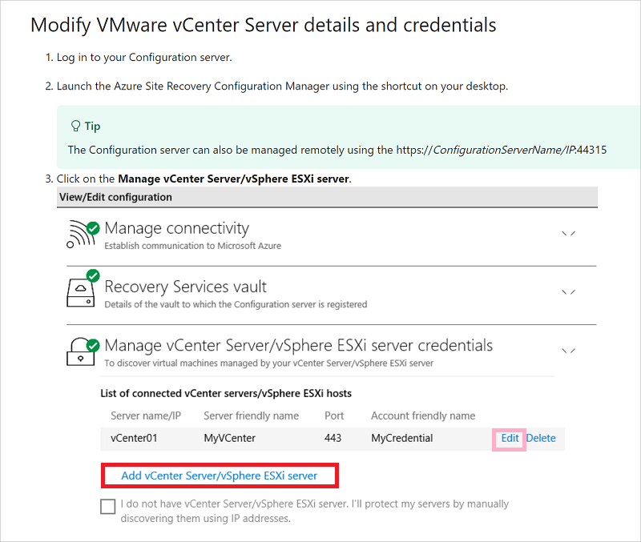
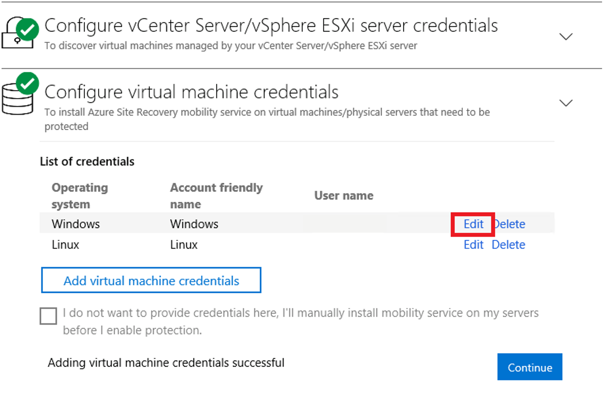
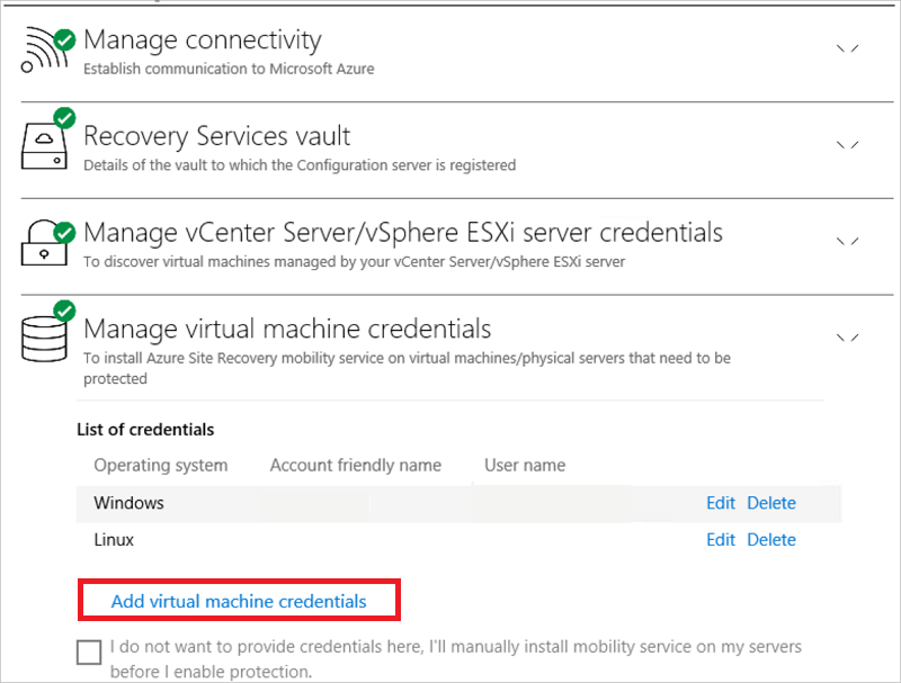
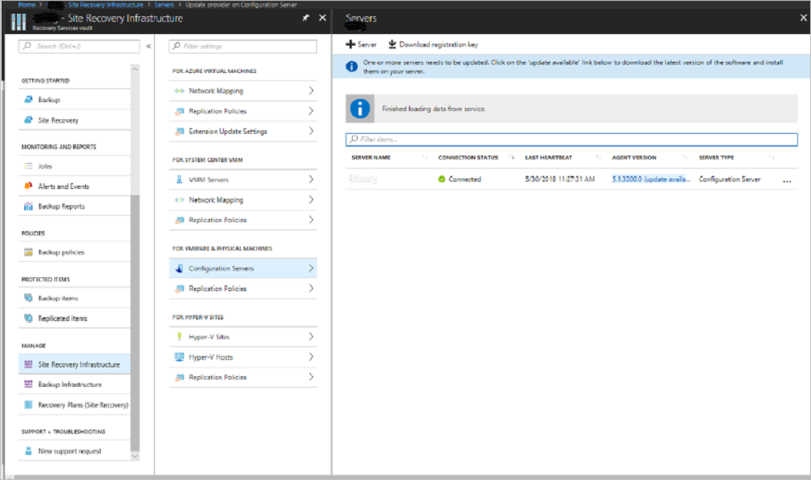
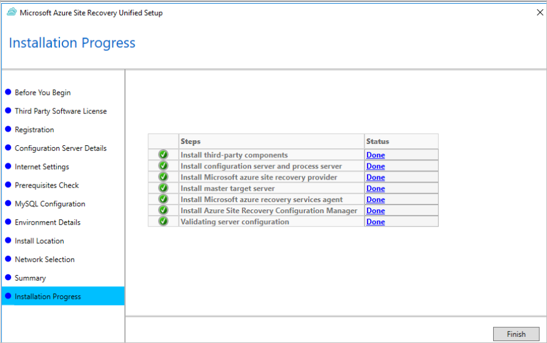
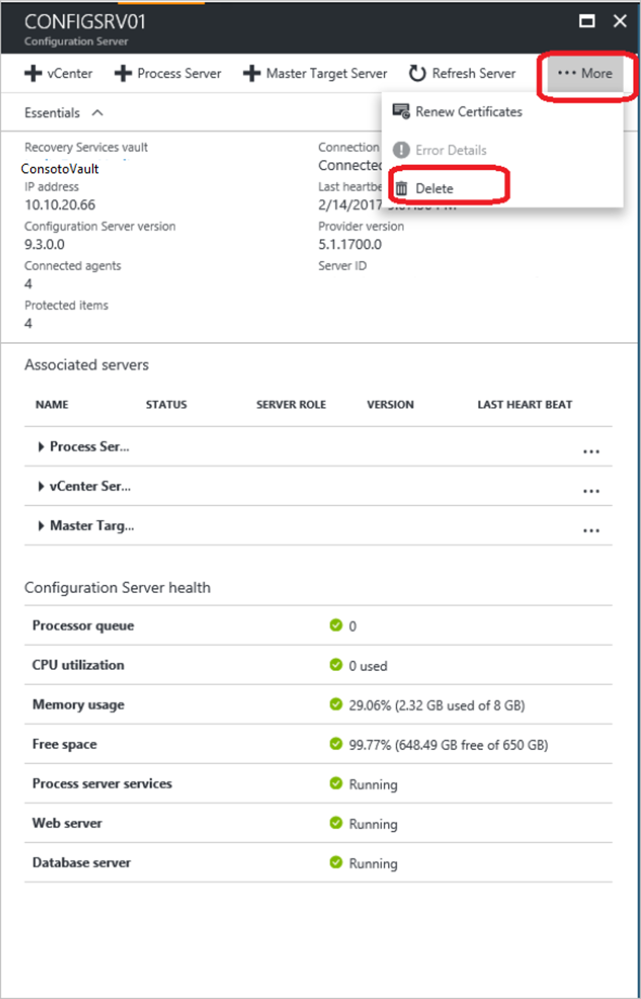

# Manage the configuration server for VMware VMs

You set up an on-premises configuration server when you use [Azure Site Recovery](site-recovery-overview.md) for disaster recovery of VMware VMs and physical servers to Azure. The configuration server coordinates communications between on-premises VMware and Azure and manages data replication. This article summarizes common tasks for managing the configuration server after it's deployed.

## Access configuration server

You can access the configuration server as follows:

* Sign in to the VM on which it's deployed, and Start **Azure Site Recovery Configuration Manager** from the desktop shortcut.
* Alternatively, you can access the configuration server remotely from https://*ConfigurationServerName*/:44315/ . Sign in with administrator credentials.

## Modify VMware server settings

1. To associate a different VMware server with the configuration server, after [sign-in](#access-configuration-server), select **Add vCenter Server/vSphere ESXi server**.
2. Enter the details, and then select **OK**.

## Modify credentials for automatic discovery

1. To update the credentials used to connect to the VMware server for automatic discovery of VMware VMs, after [sign-in](#access-configuration-server), choose the account and click **Edit**.
2. Enter the new credentials, and then select **OK**.

    

You can also modify the credentials through CSPSConfigtool.exe.

1. Login to the configuration server and launch CSPSConfigtool.exe
2. Choose the account you wish to modify and click **Edit**.
3. Enter the modified credentials and click **Ok**

## Modify credentials for Mobility Service installation

Modify the credentials used to automatically install Mobility Service on the VMware VMs you enable for replication.

1. After [sign-in](#access-configuration-server), select **Manage virtual machine credentials**
2. Choose the account you wish to modify and click **Edit**
3. Enter the new credentials, and then select **OK**.

    

You can also modify credentials through CSPSConfigtool.exe.

1. Login to the configuration server and launch CSPSConfigtool.exe
2. Choose the account you wish to modify and click **Edit**
3. Enter the new credentials and click **Ok**.

## Add credentials for Mobility service installation

If you missed adding credentials during OVF deployment of configuration server,

1. After [sign-in](#access-configuration-server), select **Manage virtual machine credentials**.
2. Click on **Add virtual machine credentials**.
    
3. Enter the new credentials and click on **Add**.

You can also add credentials through CSPSConfigtool.exe.

1. Login to the configuration server and launch CSPSConfigtool.exe
2. Click **Add**, enter the new credentials and click **Ok**.

## Modify proxy settings

Modify the proxy settings used by the configuration server machine for internet access to Azure. If you have a process server machine in addition to the default process server running on the configuration server machine, modify the settings on both machines.

1. After [sign-in](#access-configuration-server) to the configuration server, select **Manage connectivity**.
2. Update the proxy values. Then select **Save** to update the settings.

## Add a network adapter

The Open Virtualization Format (OVF) template deploys the configuration server VM with a single network adapter.

- You can [add an additional adapter to the VM](vmware-azure-deploy-configuration-server.md#add-an-additional-adapter), but you must add it before you register the configuration server in the vault.
- To add an adapter after you register the configuration server in the vault, add the adapter in the VM properties. Then you need to [re-register](#reregister-a-configuration-server-in-the-same-vault) the server in the vault.


## Reregister a configuration server in the same vault

You can reregister the configuration server in the same vault if you need to. If you have an additional process server machine, in addition to the default process server running on the configuration server machine, reregister both machines.


  1. In the vault, open **Manage** > **Site Recovery Infrastructure** > **Configuration Servers**.
  2. In **Servers**, select **Download registration key** to download the vault credentials file.
  3. Sign in to the configuration server machine.
  4. In **%ProgramData%\ASR\home\svsystems\bin**, open **cspsconfigtool.exe**.
  5. On the **Vault Registration** tab, select **Browse**, and locate the vault credentials file that you downloaded.
  6. If needed, provide proxy server details. Then select **Register**.
  7. Open an admin PowerShell command window, and run the following command:
   ```
      $pwd = ConvertTo-SecureString -String MyProxyUserPassword
      Set-OBMachineSetting -ProxyServer http://myproxyserver.domain.com -ProxyPort PortNumber – ProxyUserName domain\username -ProxyPassword $pwd
   ```

      >[!NOTE]
      >In order to **pull latest certificates** from configuration server to scale-out process server execute the  command
      > *“<Installation Drive\Microsoft Azure Site Recovery\agent\cdpcli.exe>" --registermt*

  8. Finally, restart the obengine by executing the following command.
  ```
          net stop obengine
          net start obengine
   ```


## Register a configuration server with a different vault

> [!WARNING]
> The following step disassociates the configuration server from the current vault, and the replication of all protected virtual machines under the configuration server is stopped.

1. Log in to the configuration server.
2. Open an admin PowerShell command window, and run the following command:

    ```
    reg delete HKLM\Software\Microsoft\Azure Site Recovery\Registration
    net stop dra
    ```
3. Launch the configuration server appliance browser portal using the shortcut on your desktop.
4. Perform the registration steps similar to a new configuration server [registration](vmware-azure-tutorial.md#register-the-configuration-server).

## Upgrade the configuration server

You run update rollups to update the configuration server. Updates can be applied for up to N-4 versions. For example:

- If you run 9.7, 9.8, 9.9, or 9.10, you can upgrade directly to 9.11.
- If you run 9.6 or earlier and you want to upgrade to 9.11, you must first upgrade to version 9.7. before 9.11.

Links to update rollups for upgrading to all versions of the configuration server are available in the [wiki updates page](https://social.technet.microsoft.com/wiki/contents/articles/38544.azure-site-recovery-service-updates.aspx).

Upgrade the server as follows:

1. In the vault, go to **Manage** > **Site Recovery Infrastructure** > **Configuration Servers**.
2. If an update is available, a link appears in the **Agent Version** > column.
    
3. Download the update installer file to the configuration server.

    

4. Double-click to run the installer.
5. The installer detects the current version running on the machine. Click **Yes** to start the upgrade.
6. When the upgrade completes the server configuration validates.

    

7. Click **Finish** to close the installer.

## Delete or unregister a configuration server

1. [Disable protection](site-recovery-manage-registration-and-protection.md#disable-protection-for-a-vmware-vm-or-physical-server-vmware-to-azure) for all VMs under the configuration server.
2. [Disassociate](vmware-azure-set-up-replication.md#disassociate-or-delete-a-replication-policy) and [delete](vmware-azure-set-up-replication.md#disassociate-or-delete-a-replication-policy) all replication policies from the configuration server.
3. [Delete](vmware-azure-manage-vcenter.md#delete-a-vcenter-server) all vCenter servers/vSphere hosts that are associated with the configuration server.
4. In the vault, open **Site Recovery Infrastructure** > **Configuration Servers**.
5. Select the configuration server that you want to remove. Then, on the **Details** page, select **Delete**.

    


### Delete with PowerShell

You can optionally delete the configuration server by using PowerShell.

1. [Install](https://docs.microsoft.com/powershell/azure/install-azurerm-ps?view=azurermps-4.4.0) the Azure PowerShell module.
2. Sign in to your Azure account by using this command:

    `Connect-AzureRmAccount`
3. Select the vault subscription.

     `Get-AzureRmSubscription –SubscriptionName <your subscription name> | Select-AzureRmSubscription`
3.  Set the vault context.

    ```
    $vault = Get-AzureRmRecoveryServicesVault -Name <name of your vault>
    Set-AzureRmSiteRecoveryVaultSettings -ARSVault $vault
    ```
4. Retrieve the configuration server.

    `$fabric = Get-AzureRmSiteRecoveryFabric -FriendlyName <name of your configuration server>`
6. Delete the configuration server.

    `Remove-AzureRmSiteRecoveryFabric -Fabric $fabric [-Force] `

> [!NOTE]
> You can use the **-Force** option in Remove-AzureRmSiteRecoveryFabric for forced deletion of the configuration server.

## Generate configuration server Passphrase

1. Sign in to your configuration server, and then open a command prompt window as an administrator.
2. To change the directory to the bin folder, execute the command **cd %ProgramData%\ASR\home\svsystems\bin**
3. To generate the passphrase file, execute **genpassphrase.exe -v > MobSvc.passphrase**.
4. Your passphrase will be stored in the file located at **%ProgramData%\ASR\home\svsystems\bin\MobSvc.passphrase**.

## Renew SSL certificates

The configuration server has an inbuilt web server, which orchestrates activities of the Mobility Service, process servers, and master target servers connected to it. The web server uses an SSL certificate to authenticate clients. The certificate expires after three years and can be renewed at any time.

### Check expiry

For configuration server deployments before May 2016, certificate expiry was set to one year. If you have a certificate that is going to expire, the following occurs:

- When the expiry date is two months or less, the service starts sending notifications in the portal, and by email (if you subscribed to Site Recovery notifications).
- A notification banner appears on the vault resource page. For more information, select the banner.
- If you see an **Upgrade Now** button, it indicates that some components in your environment haven't been upgraded to 9.4.xxxx.x or higher versions. Upgrade the components before you renew the certificate. You can't renew on older versions.

### Renew the certificate

1. In the vault, open **Site Recovery Infrastructure** > **Configuration Server**. Select the required configuration server.
2. The expiry date appears under **Configuration Server health**.
3. Select **Renew Certificates**.

## Update Windows licence

The licence provided with the OVF template is an evaluation licence valid for 180 days. For uninterrupted usage, you must activate Windows with a procured licence.

## Failback requirements

During reprotect and failback, the on-premises configuration server must be running and in a connected state. For successful failback, the virtual machine being failed back must exist in the configuration server database.

Ensure that you take regular scheduled backups of your configuration server. If a disaster occurs and the configuration server is lost, you must first restore the configuration server from a backup copy and ensure that the restored configuration server has the same IP address with which it was registered to the vault. Failback will not work if a different IP address is used for the restored configuration server.

## Next steps

Review the tutorials for setting up disaster recovery of [VMware VMs](vmware-azure-tutorial.md) to Azure.
