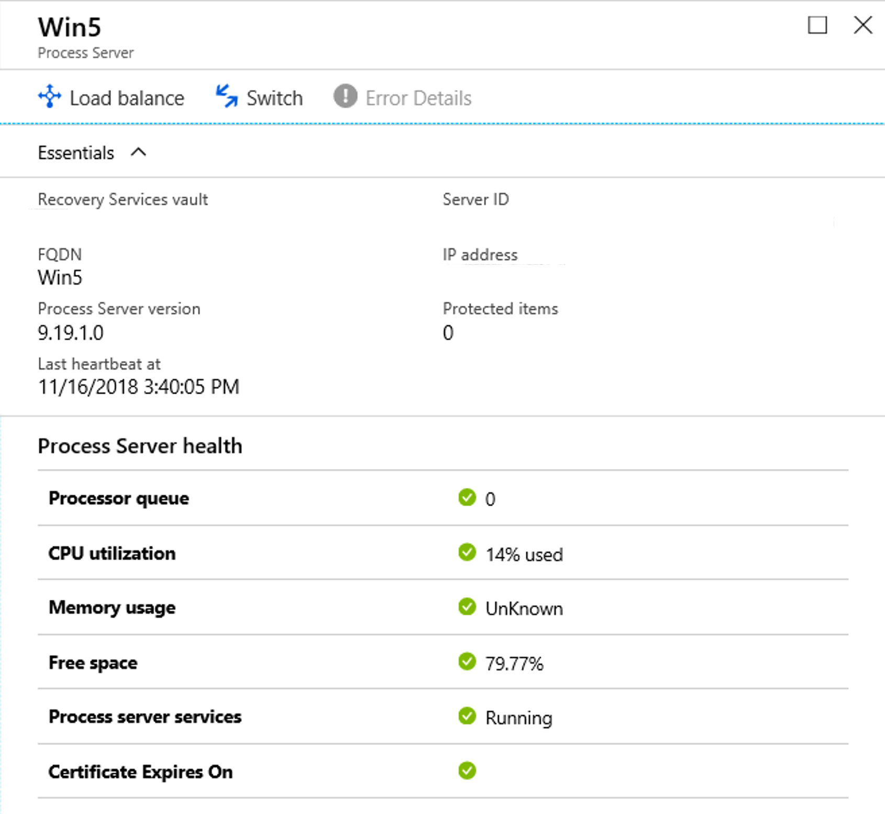
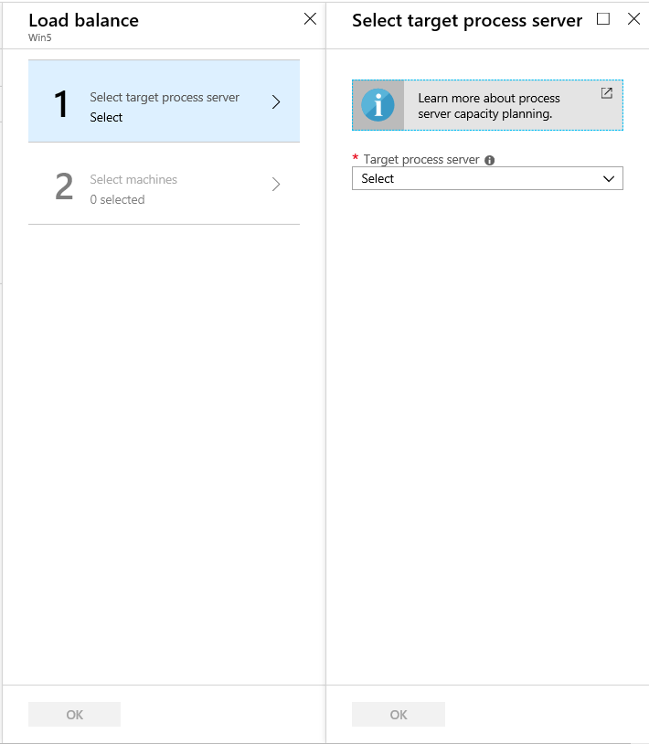
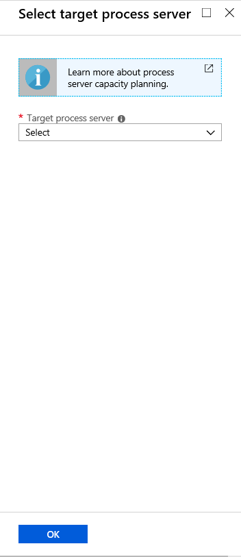

# Manage process servers

This article describes common tasks for managing the Site Recovery process server.

The process server is used to receive, optimize, and send replication data to Azure. It also performs a push installation of the Mobility service on VMware VMs and physical servers you want to replicate, and performs automatic discovery of on-premises machines. For replicating on-premises VMware VMs or physical servers to Azure, the process server is installed by default on the configuration server machine. 

- For large deployments, you might need additional on-premises process servers to scale capacity.
- For failback from Azure to on-premises, you must set up a temporary process server in Azure. You can delete this VM when failback is done. 

Learn more about the process server.


## Upgrade a process server

When you deploy a process server on-premises, or as an Azure VM for failback, the latest version of the process server is installed. The Site Recovery teams release fixes and enhancements on a regular basis, and we recommend you keep process servers up-to-date. You can upgrade a process server as follows:

[!INCLUDE [site-recovery-vmware-upgrade -process-server](../../includes/site-recovery-vmware-upgrade-process-server-internal.md)]


## Move VMs to balance the process server load

Balance the load by moving VMs between two process servers, as follows:

1. In the vault, under **Manage** click **Site Recovery Infrastructure**. Under **For VMware & Physical machines**, click **Configuration Servers**.
2. Click on the configuration server with which the process servers are registered.
3. Click on the process server for which you want to load balance traffic.

    

4. Click **Load balance**, select the target process server to which you want to move machines. Then click **OK**

    

2. Click **Select machines**, and choose the machines you want to move from the current to the target process server. Details of average data change are displayed against each virtual machine. Then click **OK**. 
3. In the vault, monitor the progress of the job under  **Monitoring** > **Site Recovery jobs**.

It will take around 15 minutes for changes to be reflected in the portal. For a quicker effect, [refresh the configuration server](vmware-azure-manage-configuration-server.md#refresh-configuration-server).

## Switch an entire workload to another process server

Move the entire workload handled by a process server to a different process server, as follows:

1. In the vault, under **Manage** click **Site Recovery Infrastructure**. Under **For VMware & Physical machines**, click **Configuration Servers**.
2. Click on the configuration server with which the process servers are registered.
3. Click on the process server from which you want to switch the workload.
4. Click on **Switch**, select the target process server to which you want to move the workload. Then click **OK**

    

5. In the vault, monitor the progress of the job under  **Monitoring** > **Site Recovery jobs**.

It will take around 15 minutes for changes to be reflected in the portal. For a quicker effect, [refresh the configuration server](vmware-azure-manage-configuration-server.md#refresh-configuration-server).

## Register a master target server

Master target server resides on configuration server and scale-out process servers. It must be registered with configuration server. In case there is a failure in this registration, it can impact the health of protected items. To register master target server with configuration server, login to the specific configuration server/scale-out process server on which the registration is required. Navigate to folder **%PROGRAMDATA%\ASR\Agent**, and run the following on administrator command prompt.

   ```
   cmd
   cdpcli.exe --registermt

   net stop obengine

   net start obengine

   exit
   ```

## Reregister a process server

Reregister a process server running on-premises or on an Azure VM with the configuration server as follows:

[!INCLUDE [site-recovery-vmware-register-process-server](../../includes/site-recovery-vmware-register-process-server.md)]

After you've saved the settings, do the following:

1. On the process server, open an administrator command prompt.
2. Browse to folder **%PROGRAMDATA%\ASR\Agent**, and run the command:

    ```
    cdpcli.exe --registermt
    net stop obengine
    net start obengine
    ```

## Modify proxy settings for an on-premises process server

If an on-premises process server uses a proxy to connect to Azure, you can modify the proxy settings as follows:

1. Sign into the process server machine. 
2. Open an Admin PowerShell command window, and run the following command:
   ```powershell
   $pwd = ConvertTo-SecureString -String MyProxyUserPassword
   Set-OBMachineSetting -ProxyServer http://myproxyserver.domain.com -ProxyPort PortNumber –ProxyUserName domain\username -ProxyPassword $pwd
   net stop obengine
   net start obengine
   ```
2. Browse to folder **%PROGRAMDATA%\ASR\Agent**, and run this command:
   ```
   cmd
   cdpcli.exe --registermt

   net stop obengine

   net start obengine

   exit
   ```

## Remove a process server

[!INCLUDE [site-recovery-vmware-unregister-process-server](../../includes/site-recovery-vmware-unregister-process-server.md)]

## Exclude folders from anti-virus software

If anti-virus software is running on a scale-out process server (or master target server), exclude the following folders from anti-virus operations:


- C:\Program Files\Microsoft Azure Recovery Services Agent
- C:\ProgramData\ASR
- C:\ProgramData\ASRLogs
- C:\ProgramData\ASRSetupLogs
- C:\ProgramData\LogUploadServiceLogs
- C:\ProgramData\Microsoft Azure Site Recovery
- Process server installation directory. For example: C:\Program Files (x86)\Microsoft Azure Site Recovery