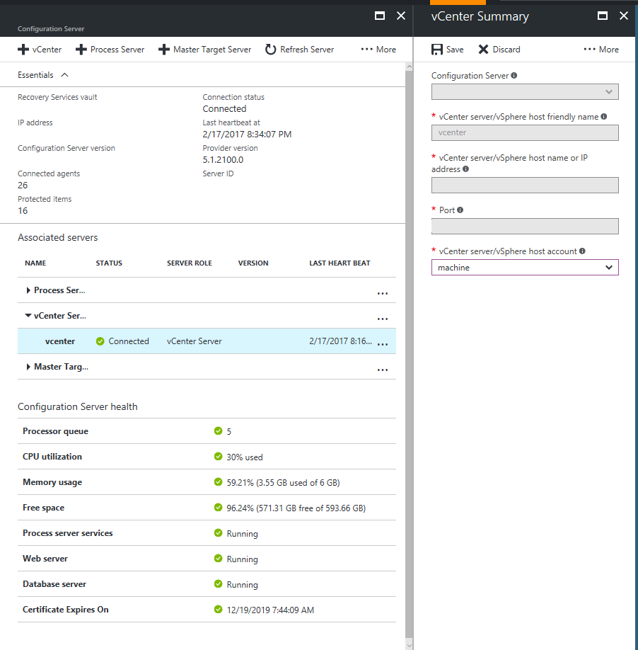
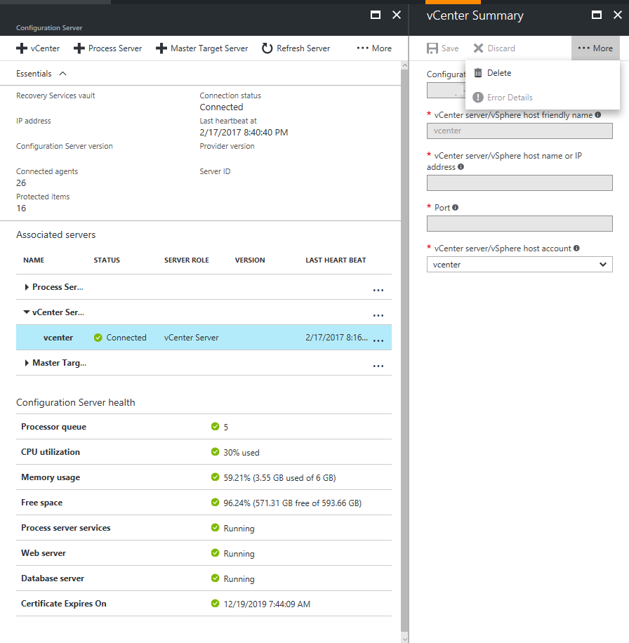
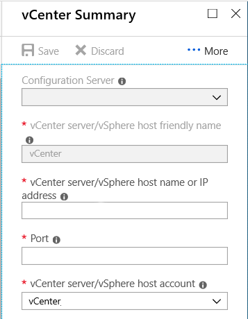

# Manage VMware vCenter server

This article discusses the various Site Recovery operations that can be performed on a VMware vCenter. Verify the [prerequisites](vmware-physical-azure-support-matrix.md#replicated-machines) before you start.

## Set up an account for automatic discovery

Site Recovery needs access to VMware for the process server to automatically discover virtual machines, and for failover and failback of virtual machines. Create an account for access as follows:

1. Log onto the configuration server machine.
2. Open the launch the cspsconfigtool.exe using the Desktop shortcut.
3. Click **Add Account** on the **Manage Account** tab.

   
1. Provide the account details, and click **OK** to add it.  The account should have the privileges summarized in the following table. 

It takes about 15 minutes for the account information to be synced up with the Site Recovery service.

### Account permissions

|**Task** | **Account** | **Permissions** | **Details**|
|--- | --- | --- | ---|
|**Automatic discovery/Migrate (without failback)** | You need at least a read-only user | Data Center object –> Propagate to Child Object, role=Read-only | User assigned at datacenter level, and has access to all the objects in the datacenter.   To restrict access, assign the **No access** role with the **Propagate to child** object, to the child objects (vSphere hosts, datastores, virtual machines, and networks).|
|**Replication/Failover** | You need at least a read-only user| Data Center object –> Propagate to Child Object, role=Read-only | User assigned at datacenter level, and has access to all the objects in the datacenter.   To restrict access, assign the **No access** role with the **Propagate to child** object to the child objects (vSphere hosts, datastores, virtual machines, and networks).   Useful for migration purposes, but not full replication, failover, failback.|
|**Replication/failover/failback** | We suggest you create a role (AzureSiteRecoveryRole) with the required permissions, and then assign the role to a VMware user or group | Data Center object –> Propagate to Child Object, role=AzureSiteRecoveryRole   Datastore -> Allocate space, browse datastore, low-level file operations, remove file, update virtual machine files   Network -> Network assign   Resource -> Assign VM to resource pool, migrate powered off VM, migrate powered on VM   Tasks -> Create task, update task   Virtual machine -> Configuration   Virtual machine -> Interact -> answer question, device connection, configure CD media, configure floppy media, power off, power on, VMware tools install   Virtual machine -> Inventory -> Create, register, unregister   Virtual machine -> Provisioning -> Allow virtual machine download, allow virtual machine files upload   Virtual machine -> Snapshots -> Remove snapshots | User assigned at datacenter level, and has access to all the objects in the datacenter.   To restrict access, assign the **No access** role with the **Propagate to child** object, to the child objects (vSphere hosts, datastores, virtual machines, and networks).|

## Add VMware server to the vault

1. In the Azure portal, open your vault > **Site Recovery Infrastructure** > **Configuration Severs**, and open the configuration server.
2. On the **Details** page, click **+vCenter**.

[!INCLUDE [site-recovery-add-vcenter](../../includes/site-recovery-add-vcenter.md)]

## Modify credentials

Modify the credentials used to connect to the vCenter server or ESXi host as follows:

1. Log onto the configuration server, and launch the cspsconfigtool.exe from the desktop.
2. Click **Add Account** on the **Manage Account** tab.

   
3. Provide the new account details, and click **OK** to add it. The account should have the privileges listed [above](#account-permissions).
4. On the Azure portal, open the vault > **Site Recovery Infrastructure** > **Configuration Severs**, and open the configuration server.
5. In the **Details** page, click **Refresh Server**.
6. After the Refresh Server job completes, select the vCenter Server, to open the vCenter **Summary** page.
7. Select the newly added account in the **vCenter server/vSphere host account** field, and click **Save**.

   

## Delete a vCenter server

1. In the Azure portal, open your vault > **Site Recovery Infrastructure** > **Configuration Severs**, and open the configuration server.
2. On the **Details** page, select the vCenter server.
3. Click on the **Delete** button.

   

## Modify the vCenter IP address and port

1. Sign in to the Azure portal.
2. Navigate to **Recovery Services vault** > **Site Recovery Infrastructure** > **Configuration Servers**.
3. Click on the configuration server the vCenter is assigned to.
4. In the **vCenter servers** section, click on the vCenter you want to modify.
5. On the vCenter summary page, update the IP address and port of the vCenter in the respective fields, and then save your changes.

   

6. For changes to become effective, wait for 15 minutes or [refresh the configuration server](vmware-azure-manage-configuration-server.md#refresh-configuration-server).

## Migrate all protected virtual machines to a new vCenter

To migrate all virtual machines to the new vCenter, do not add another vCenter account. This can lead to duplicate entries. Just update the IP address of the new vCenter:

1. Sign in to the Azure portal.
2. Navigate to **Recovery Services vault** > **Site Recovery Infrastructure** > **Configuration Servers**.
3. Click on the configuration server the old vCenter is assigned to.
4. In the **vCenter servers** section, click on the vCenter you are planning to migrate from.
5. On the vCenter summary page, update the IP address of new vCenter in the field **vCenter server/vSphere hostname or IP address**. Save your changes.

As soon as the IP address is updated, Site Recovery components will start receiving discovery information of virtual machines from the new vCenter. This will not impact the ongoing replication activities.

## Migrate few protected virtual machines to a new vCenter

> [!NOTE]
> This section is applicable only when you are migrating a few of your protected virtual machines to a new vCenter. If you want protect a new set of virtual machines from a new vCenter, [add new vCenter details to the configuration server](#add-vmware-server-to-the-vault) and start with **[Enable protection](vmware-azure-tutorial.md#enable-replication)**.

To move a few virtual machines to a new vCenter:

1. [Add the new vCenter details to the configuration server](#add-vmware-server-to-the-vault).
2. [Disable replication of the virtual machines](site-recovery-manage-registration-and-protection.md#disable-protection-for-a-vmware-vm-or-physical-server-vmware-to-azure) you are planning to migrate.
3. Complete the migration of selected virtual machines to the new vCenter.
4. Now, protect migrated virtual machines by [selecting the new vCenter when you enable protection](vmware-azure-tutorial.md#enable-replication).

> [!TIP]
> If the number of virtual machines being migrated is **higher** that the number of number of virtual machines retained in the old vCenter, update the IP address of the new vCenter using the instructions given here. For the few virtual machines that are retained on the old vCenter, [disable replication](site-recovery-manage-registration-and-protection.md#disable-protection-for-a-vmware-vm-or-physical-server-vmware-to-azure); [add new vCenter details to the configuration server](#add-vmware-server-to-the-vault), and start **[Enable protection](vmware-azure-tutorial.md#enable-replication)**.

## Frequently asked questions

1. If protected virtual machines are moved from one ESXi host to another, will it impact replication?

    No, this will not impact the ongoing replication. However, [ensure to deploy the master target server with sufficient privileges](vmware-azure-reprotect.md#deploy-a-separate-master-target-server)

2. What are the port numbers used to for communication between vCenter and other Site Recovery components?

    The default port is 443. Configuration server will access vCenter/vSphere host information through this port. If you wish to update this information, click [here](#modify-the-vcenter-ip-address-and-port).
