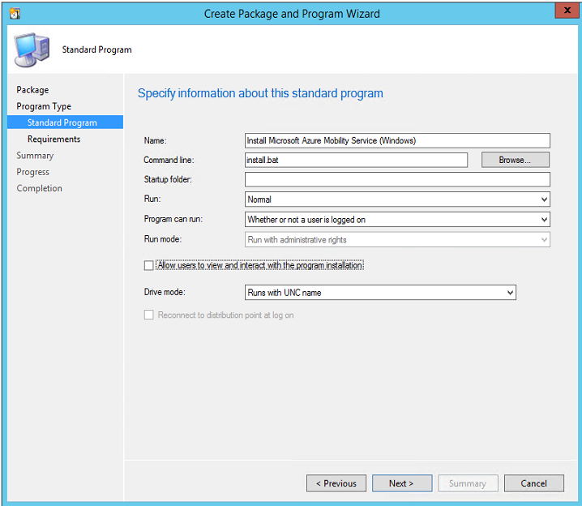
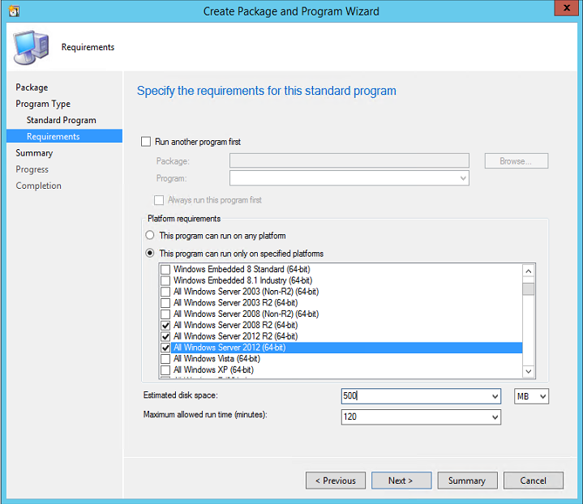
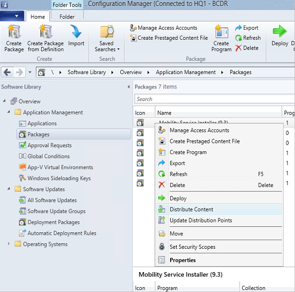
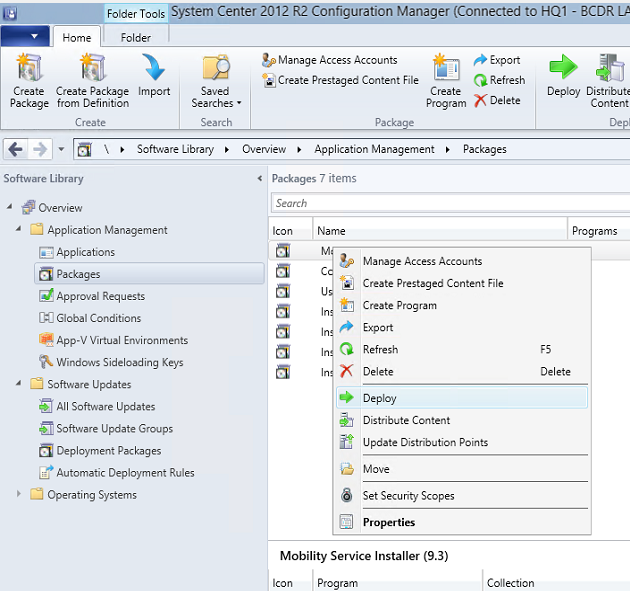
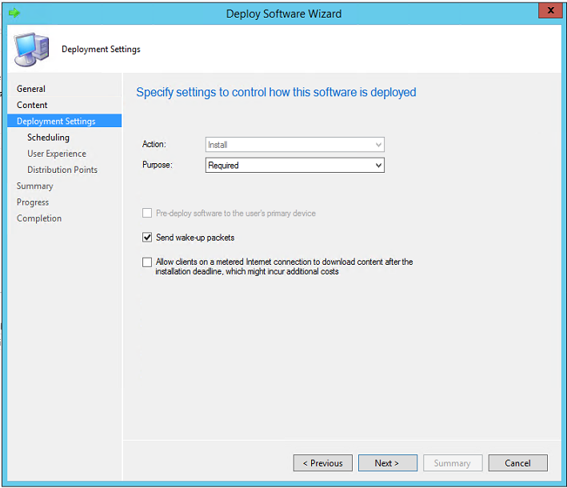
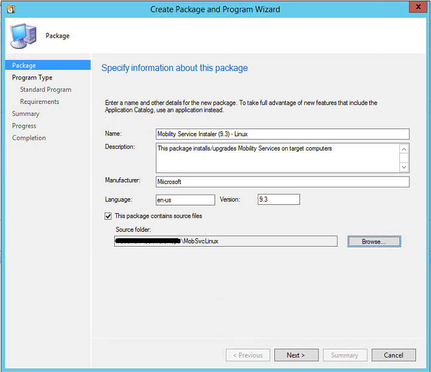
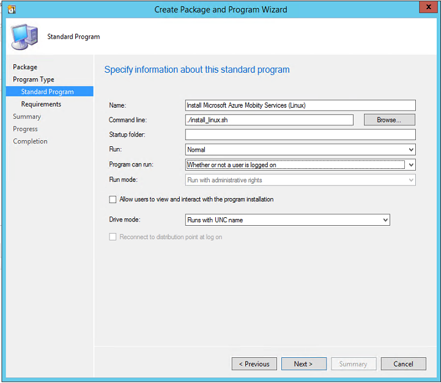
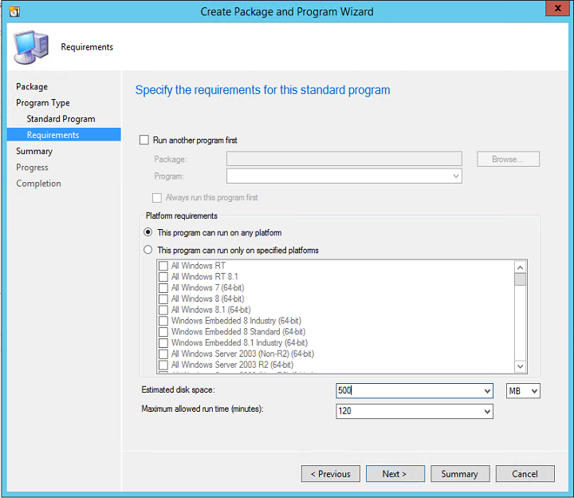
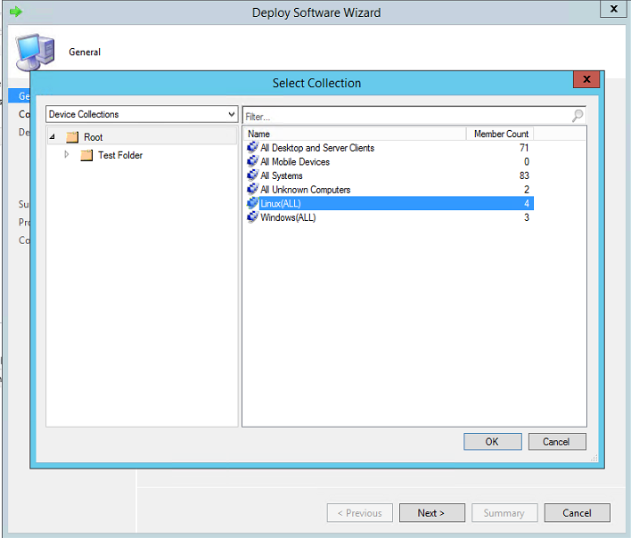

# Automate Mobility Service installation with System Center Configuration Manager

The Mobility service is installed on VMware VMs and physical servers that you want to replicate to Azure using [Azure Site Recovery](site-recovery-overview.md)

This article provides you an example of how you can use System Center Configuration Manager to deploy the Azure Site Recovery Mobility Service on a VMware VM. Using a software deployment tool like Configuration Manager has the following advantages:

* Schedule fresh installations and upgrades during your planned maintenance window for software updates
* Scale deployment to hundreds of servers simultaneously

This article uses System Center Configuration Manager 2012 R2 to demonstrate the deployment activity. We assumes you are using version **9.9.4510.1** or higher of the Mobility service.

Alternately, you can automate Mobility Service installation with [Azure Automation DSC](vmware-azure-mobility-deploy-automation-dsc.md).

## Prerequisites

1. A software deployment tool, like Configuration Manager, that's already deployed in your environment.
2. You should create two [device collections](https://technet.microsoft.com/library/gg682169.aspx), one for all **Windows servers**, and another for all **Linux servers**, that you want to protect by using Site Recovery.
3. A configuration server that is already registered in the Recovery Services vault.
4. A secure network file share (SMB share) that can be accessed by the configuration manager machine.

## Deploy on Windows machines
> [!NOTE]
> This article assumes that the IP address of the configuration server is 192.168.3.121, and that the secure network file share is \\\ContosoSecureFS\MobilityServiceInstallers.

### Prepare for deployment
1. Create a folder on the network share, and name it **MobSvcWindows**.
2. Sign in to your configuration server, and open an administrative command prompt.
3. Run the following commands to generate a passphrase file:

    `cd %ProgramData%\ASR\home\svsystems\bin`

    `genpassphrase.exe -v > MobSvc.passphrase`
4. Copy the **MobSvc.passphrase** file into the **MobSvcWindows** folder on your network share.
5. Browse to the installer repository on the configuration server by running the following command:

   `cd %ProgramData%\ASR\home\svsystems\pushinstallsvc\repository`

6. Copy the **Microsoft-ASR\_UA\_*version*\_Windows\_GA\_*date*\_Release.exe** to the **MobSvcWindows** folder on your network share.
7. Copy the following code, and save it as **install.bat** into the **MobSvcWindows** folder.

   > [!NOTE]
   > Replace the [CSIP] placeholders in this script with the actual values of the IP address of your configuration server.

```DOS
Time /t >> C:\Temp\logfile.log
REM ==================================================
REM ==== Clean up the folders ========================
RMDIR /S /q %temp%\MobSvc
MKDIR %Temp%\MobSvc
MKDIR C:\Temp
REM ==================================================

REM ==== Copy new files ==============================
COPY M*.* %Temp%\MobSvc
CD %Temp%\MobSvc
REN Micro*.exe MobSvcInstaller.exe
REM ==================================================

REM ==== Extract the installer =======================
MobSvcInstaller.exe /q /x:%Temp%\MobSvc\Extracted
REM ==== Wait 10s for extraction to complete =========
TIMEOUT /t 10
REM =================================================

REM ==== Perform installation =======================
REM =================================================

CD %Temp%\MobSvc\Extracted
whoami >> C:\Temp\logfile.log
SET PRODKEY=HKEY_LOCAL_MACHINE\SOFTWARE\Microsoft\Windows\CurrentVersion\Uninstall
REG QUERY %PRODKEY%\{275197FC-14FD-4560-A5EB-38217F80CBD1}
IF NOT %ERRORLEVEL% EQU 0 (
	echo "Product is not installed. Goto INSTALL." >> C:\Temp\logfile.log
	GOTO :INSTALL
) ELSE (
	echo "Product is installed." >> C:\Temp\logfile.log

	echo "Checking for Post-install action status." >> C:\Temp\logfile.log
	GOTO :POSTINSTALLCHECK
)

:POSTINSTALLCHECK
	REG QUERY "HKLM\SOFTWARE\Wow6432Node\InMage Systems\Installed Products\5" /v "PostInstallActions" | Find "Succeeded"
	If %ERRORLEVEL% EQU 0 (
		echo "Post-install actions succeeded. Checking for Configuration status." >> C:\Temp\logfile.log
		GOTO :CONFIGURATIONCHECK
	) ELSE (
		echo "Post-install actions didn't succeed. Goto INSTALL." >> C:\Temp\logfile.log
		GOTO :INSTALL
	)

:CONFIGURATIONCHECK
	REG QUERY "HKLM\SOFTWARE\Wow6432Node\InMage Systems\Installed Products\5" /v "AgentConfigurationStatus" | Find "Succeeded"
	If %ERRORLEVEL% EQU 0 (
		echo "Configuration has succeeded. Goto UPGRADE." >> C:\Temp\logfile.log
		GOTO :UPGRADE
	) ELSE (
		echo "Configuration didn't succeed. Goto CONFIGURE." >> C:\Temp\logfile.log
		GOTO :CONFIGURE
	)


:INSTALL
	echo "Perform installation." >> C:\Temp\logfile.log
	UnifiedAgent.exe /Role MS /InstallLocation "C:\Program Files (x86)\Microsoft Azure Site Recovery" /Platform "VmWare" /Silent
	IF %ERRORLEVEL% EQU 0 (
	    echo "Installation has succeeded." >> C:\Temp\logfile.log
		(GOTO :CONFIGURE)
    ) ELSE (
		echo "Installation has failed." >> C:\Temp\logfile.log
		GOTO :ENDSCRIPT
	)

:CONFIGURE
	echo "Perform configuration." >> C:\Temp\logfile.log
	cd "C:\Program Files (x86)\Microsoft Azure Site Recovery\agent"
	UnifiedAgentConfigurator.exe  /CSEndPoint "[CSIP]" /PassphraseFilePath %Temp%\MobSvc\MobSvc.passphrase
	IF %ERRORLEVEL% EQU 0 (
	    echo "Configuration has succeeded." >> C:\Temp\logfile.log
    ) ELSE (
		echo "Configuration has failed." >> C:\Temp\logfile.log
	)
	GOTO :ENDSCRIPT

:UPGRADE
	echo "Perform upgrade." >> C:\Temp\logfile.log
	UnifiedAgent.exe /Platform "VmWare" /Silent
	IF %ERRORLEVEL% EQU 0 (
	    echo "Upgrade has succeeded." >> C:\Temp\logfile.log
    ) ELSE (
		echo "Upgrade has failed." >> C:\Temp\logfile.log
	)
	GOTO :ENDSCRIPT

:ENDSCRIPT
	echo "End of script." >> C:\Temp\logfile.log


```

### Create a package

1. Sign in to your Configuration Manager console.
2. Browse to **Software Library** > **Application Management** > **Packages**.
3. Right-click **Packages**, and select **Create Package**.
4. Provide values for the name, description, manufacturer, language, and version.
5. Select the **This package contains source files** check box.
6. Click **Browse**, and select the network share where the installer is stored (\\\ContosoSecureFS\MobilityServiceInstaller\MobSvcWindows).

   

7. On the **Choose the program type that you want to create** page, select **Standard Program**, and click **Next**.

   

8. On the **Specify information about this standard program** page, provide the following inputs, and click **Next**. (The other inputs can use their default values.)

   | **Parameter name** | **Value** |
   |--|--|
   | Name | Install Microsoft Azure Mobility Service (Windows) |
   | Command line | install.bat |
   | Program can run | Whether or not a user is logged on |

   

9. On the next page, select the target operating systems. Mobility Service can be installed only on Windows Server 2012 R2, Windows Server 2012, and Windows Server 2008 R2.

   

10. To complete the wizard, click **Next** twice.


> [!NOTE]
> The script supports both new installations of Mobility Service agents and updates to agents that are already installed.

### Deploy the package
1. In the Configuration Manager console, right-click your package, and select **Distribute Content**.
   
2. Select the **[distribution points](https://technet.microsoft.com/library/gg712321.aspx#BKMK_PlanForDistributionPoints)** on to which the packages should be copied.
3. Complete the wizard. The package then starts replicating to the specified distribution points.
4. After the package distribution is done, right-click the package, and select **Deploy**.
   
5. Select the Windows Server device collection you created in the prerequisites section as the target collection for deployment.

   

6. On the **Specify the content destination** page, select your **Distribution Points**.
7. On the **Specify settings to control how this software is deployed** page, ensure that the purpose is **Required**.

   

8. On the **Specify the schedule for this deployment** page, specify a schedule. For more information, see [scheduling packages](https://technet.microsoft.com/library/gg682178.aspx).
9. On the **Distribution Points** page, configure the properties according to the needs of your datacenter. Then complete the wizard.

> [!TIP]
> To avoid unnecessary reboots, schedule the package installation during your monthly maintenance window or software updates window.

You can monitor the deployment progress by using the Configuration Manager console. Go to **Monitoring** > **Deployments** > *[your package name]*.

  

## Deploy on Linux machines
> [!NOTE]
> This article assumes that the IP address of the configuration server is 192.168.3.121, and that the secure network file share is \\\ContosoSecureFS\MobilityServiceInstallers.

### Prepare for deployment
1. Create a folder on the network share, and name it as **MobSvcLinux**.
2. Sign in to your configuration server, and open an administrative command prompt.
3. Run the following commands to generate a passphrase file:

    `cd %ProgramData%\ASR\home\svsystems\bin`

    `genpassphrase.exe -v > MobSvc.passphrase`
4. Copy the **MobSvc.passphrase** file into the **MobSvcLinux** folder on your network share.
5. Browse to the installer repository on the configuration server by running the command:

   `cd %ProgramData%\ASR\home\svsystems\pushinstallsvc\repository`

6. Copy the following files to the **MobSvcLinux** folder on your network share:
   * Microsoft-ASR\_UA\*RHEL6-64*release.tar.gz
   * Microsoft-ASR\_UA\*RHEL7-64\*release.tar.gz
   * Microsoft-ASR\_UA\*SLES11-SP3-64\*release.tar.gz
   * Microsoft-ASR\_UA\*SLES11-SP4-64\*release.tar.gz
   * Microsoft-ASR\_UA\*OL6-64\*release.tar.gz
   * Microsoft-ASR\_UA\*UBUNTU-14.04-64\*release.tar.gz


7. Copy the following code, and save it as **install_linux.sh** into the **MobSvcLinux** folder.
   > [!NOTE]
   > Replace the [CSIP] placeholders in this script with the actual values of the IP address of your configuration server.

```Bash
#!/usr/bin/env bash

rm -rf /tmp/MobSvc
mkdir -p /tmp/MobSvc
INSTALL_DIR='/usr/local/ASR'
VX_VERSION_FILE='/usr/local/.vx_version'

echo "=============================" >> /tmp/MobSvc/sccm.log
echo `date` >> /tmp/MobSvc/sccm.log
echo "=============================" >> /tmp/MobSvc/sccm.log

if [ -f /etc/oracle-release ] && [ -f /etc/redhat-release ]; then
    if grep -q 'Oracle Linux Server release 6.*' /etc/oracle-release; then
        if uname -a | grep -q x86_64; then
            OS="OL6-64"
            echo $OS >> /tmp/MobSvc/sccm.log
            cp *OL6*.tar.gz /tmp/MobSvc
        fi
    fi
elif [ -f /etc/redhat-release ]; then
    if grep -q 'Red Hat Enterprise Linux Server release 6.* (Santiago)' /etc/redhat-release || \
        grep -q 'CentOS Linux release 6.* (Final)' /etc/redhat-release || \
        grep -q 'CentOS release 6.* (Final)' /etc/redhat-release; then
        if uname -a | grep -q x86_64; then
            OS="RHEL6-64"
            echo $OS >> /tmp/MobSvc/sccm.log
            cp *RHEL6*.tar.gz /tmp/MobSvc
        fi
    elif grep -q 'Red Hat Enterprise Linux Server release 7.* (Maipo)' /etc/redhat-release || \
        grep -q 'CentOS Linux release 7.* (Core)' /etc/redhat-release; then
        if uname -a | grep -q x86_64; then
            OS="RHEL7-64"
            echo $OS >> /tmp/MobSvc/sccm.log
            cp *RHEL7*.tar.gz /tmp/MobSvc
                fi
    fi
elif [ -f /etc/SuSE-release ] && grep -q 'VERSION = 11' /etc/SuSE-release; then
    if grep -q "SUSE Linux Enterprise Server 11" /etc/SuSE-release && grep -q 'PATCHLEVEL = 3' /etc/SuSE-release; then
        if uname -a | grep -q x86_64; then
            OS="SLES11-SP3-64"
            echo $OS >> /tmp/MobSvc/sccm.log
            cp *SLES11-SP3*.tar.gz /tmp/MobSvc
        fi
    elif grep -q "SUSE Linux Enterprise Server 11" /etc/SuSE-release && grep -q 'PATCHLEVEL = 4' /etc/SuSE-release; then
        if uname -a | grep -q x86_64; then
            OS="SLES11-SP4-64"
            echo $OS >> /tmp/MobSvc/sccm.log
            cp *SLES11-SP4*.tar.gz /tmp/MobSvc
        fi
    fi
elif [ -f /etc/lsb-release ] ; then
    if grep -q 'DISTRIB_RELEASE=14.04' /etc/lsb-release ; then
       if uname -a | grep -q x86_64; then
           OS="UBUNTU-14.04-64"
           echo $OS >> /tmp/MobSvc/sccm.log
           cp *UBUNTU-14*.tar.gz /tmp/MobSvc
       fi
    fi
else
    exit 1
fi

if [ -z "$OS" ]; then
    exit 1
fi

Install()
{
    echo "Perform Installation." >> /tmp/MobSvc/sccm.log
    ./install -q -d ${INSTALL_DIR} -r MS -v VmWare
    RET_VAL=$?
    echo "Installation Returncode: $RET_VAL" >> /tmp/MobSvc/sccm.log
    if [ $RET_VAL -eq 0 ]; then
        echo "Installation has succeeded. Proceed to configuration." >> /tmp/MobSvc/sccm.log
        Configure
    else
        echo "Installation has failed." >> /tmp/MobSvc/sccm.log
        exit $RET_VAL
    fi
}

Configure()
{
    echo "Perform configuration." >> /tmp/MobSvc/sccm.log
    ${INSTALL_DIR}/Vx/bin/UnifiedAgentConfigurator.sh -i [CSIP] -P MobSvc.passphrase
    RET_VAL=$?
    echo "Configuration Returncode: $RET_VAL" >> /tmp/MobSvc/sccm.log
    if [ $RET_VAL -eq 0 ]; then
        echo "Configuration has succeeded." >> /tmp/MobSvc/sccm.log
    else
        echo "Configuration has failed." >> /tmp/MobSvc/sccm.log
        exit $RET_VAL
    fi
}

Upgrade()
{
    echo "Perform Upgrade." >> /tmp/MobSvc/sccm.log
    ./install -q -v VmWare
    RET_VAL=$?
    echo "Upgrade Returncode: $RET_VAL" >> /tmp/MobSvc/sccm.log
    if [ $RET_VAL -eq 0 ]; then
        echo "Upgrade has succeeded." >> /tmp/MobSvc/sccm.log
    else
        echo "Upgrade has failed." >> /tmp/MobSvc/sccm.log
        exit $RET_VAL
    fi
}

cp MobSvc.passphrase /tmp/MobSvc
cd /tmp/MobSvc

tar -zxvf *.tar.gz

if [ -e ${VX_VERSION_FILE} ]; then
    echo "${VX_VERSION_FILE} exists. Checking for configuration status." >> /tmp/MobSvc/sccm.log
    agent_configuration=$(grep ^AGENT_CONFIGURATION_STATUS "${VX_VERSION_FILE}" | cut -d"=" -f2 | tr -d " ")
    echo "agent_configuration=$agent_configuration" >> /tmp/MobSvc/sccm.log
     if [ "$agent_configuration" == "Succeeded" ]; then
        echo "Agent is already configured. Proceed to Upgrade." >> /tmp/MobSvc/sccm.log
        Upgrade
    else
        echo "Agent is not configured. Proceed to Configure." >> /tmp/MobSvc/sccm.log
        Configure
    fi
else
    Install
fi

cd /tmp

```

### Create a package

1. Sign in  to your Configuration Manager console.
2. Browse to **Software Library** > **Application Management** > **Packages**.
3. Right-click **Packages**, and select **Create Package**.
4. Provide values for the name, description, manufacturer, language, and version.
5. Select the **This package contains source files** check box.
6. Click **Browse**, and select the network share where the installer is stored (\\\ContosoSecureFS\MobilityServiceInstaller\MobSvcLinux).

   

7. On the **Choose the program type that you want to create** page, select **Standard Program**, and click **Next**.

   

8. On the **Specify information about this standard program** page, provide the following inputs, and click **Next**. (The other inputs can use their default values.)

    | **Parameter name** | **Value** |
   |--|--|
   | Name | Install Microsoft Azure Mobility Service (Linux) |
   | Command line | ./install_linux.sh |
   | Program can run | Whether or not a user is logged on |

   

9. On the next page, select **This program can run on any platform**.
   

10. To complete the wizard, click **Next** twice.

> [!NOTE]
> The script supports both new installations of Mobility Service agents and updates to agents that are already installed.

### Deploy the package
1. In the Configuration Manager console, right-click your package, and select **Distribute Content**.
   
2. Select the **[distribution points](https://technet.microsoft.com/library/gg712321.aspx#BKMK_PlanForDistributionPoints)** on to which the packages should be copied.
3. Complete the wizard. The package then starts replicating to the specified distribution points.
4. After the package distribution is done, right-click the package, and select **Deploy**.
   
5. Select the Linux Server device collection you created in the prerequisites section as the target collection for deployment.

   

6. On the **Specify the content destination** page, select your **Distribution Points**.
7. On the **Specify settings to control how this software is deployed** page, ensure that the purpose is **Required**.

   

8. On the **Specify the schedule for this deployment** page, specify a schedule. For more information, see [scheduling packages](https://technet.microsoft.com/library/gg682178.aspx).
9. On the **Distribution Points** page, configure the properties according to the needs of your datacenter. Then complete the wizard.

Mobility Service gets installed on the Linux Server Device Collection, according to the schedule you configured.


## Uninstall the Mobility service
You can create Configuration Manager packages to uninstall Mobility Service. Use the following script to do so:

```
Time /t >> C:\logfile.log
REM ==================================================
REM ==== Check if Mob Svc is already installed =======
REM ==== If not installed no operation required ========
REM ==== Else run uninstall command =====================
REM ==== {275197FC-14FD-4560-A5EB-38217F80CBD1} is ====
REM ==== guid for Mob Svc Installer ====================
whoami >> C:\logfile.log
NET START | FIND "InMage Scout Application Service"
IF  %ERRORLEVEL% EQU 1 (GOTO :INSTALL) ELSE GOTO :UNINSTALL
:NOOPERATION
                echo "No Operation Required." >> c:\logfile.log
                GOTO :ENDSCRIPT
:UNINSTALL
                echo "Uninstall" >> C:\logfile.log
                MsiExec.exe /qn /x {275197FC-14FD-4560-A5EB-38217F80CBD1} /L+*V "C:\ProgramData\ASRSetupLogs\UnifiedAgentMSIUninstall.log"
:ENDSCRIPT

```

## Next steps
You are now ready to [enable protection](vmware-azure-enable-replication.md) for your virtual machines.
