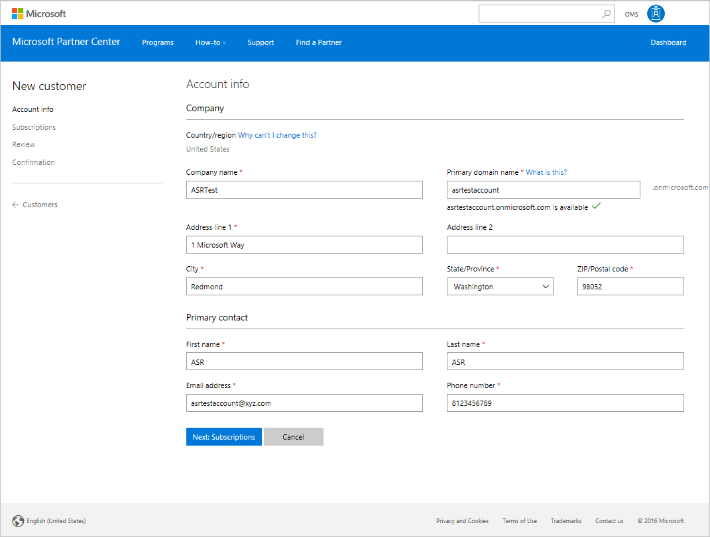
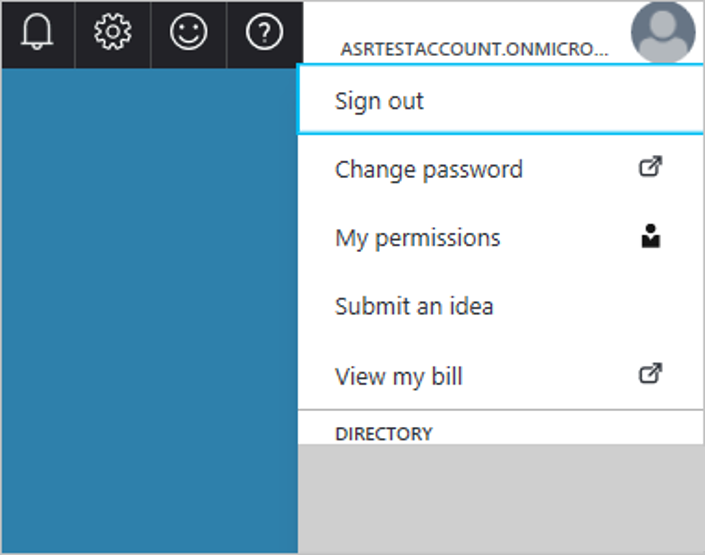
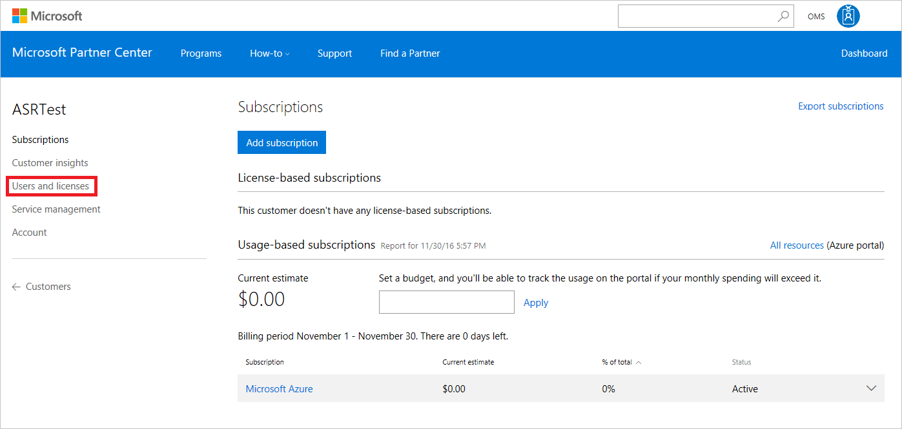

# Set up VMware disaster recovery in a multi-tenancy environment with the Cloud Solution Provider (CSP) program

The [CSP program](https://partner.microsoft.com/cloud-solution-provider) fosters better-together stories for Microsoft cloud services, including Microsoft 365, Enterprise Mobility Suite, and Microsoft Azure. With CSP, partners own the end-to-end relationship with customers, and become the primary relationship contact point. Partners can deploy Azure subscriptions for customers, and combine the subscriptions with their own value-added, customized offerings.

With [Azure Site Recovery](site-recovery-overview.md), as partners you can manage disaster recovery for customers directly through CSP. Alternately, you can use CSP to set up Site Recovery environments, and let customers manage their own disaster recovery needs in a self-service manner. In both scenarios, partners are the liaison between Site Recovery and their customers. Partners service the customer relationship, and bill customers for Site Recovery usage.

This article describes how you as a partner can create and manage tenant subscriptions through CSP, for a multi-tenant VMware replication scenario.

## Prerequisites

To set up VMware replication, you need to do the following:

- [Prepare](tutorial-prepare-azure.md) Azure resources, including an Azure subscription, an Azure virtual network, and a storage account.
- [Prepare](vmware-azure-tutorial-prepare-on-premises.md) on-premises VMware servers and VMs.
- For each tenant, create a separate management server that can communicate with the tenant VMs, and your vCenter servers. Only you as a partner should have access rights to this management server. Learn more about [multi-tenant environments](vmware-azure-multi-tenant-overview.md).

## Create a tenant account

1. Through [Microsoft Partner Center](https://partnercenter.microsoft.com/), sign in to your CSP account.
2. On the **Dashboard** menu, select **Customers**.
3. On the page that opens, click the **Add customer** button.
4. In **New Customer** page, fill in the account information details for the tenant.

	

5. Then click **Next: Subscriptions**.
6. On the subscriptions selection page, select **Microsoft Azure** check box. You can add other subscriptions now or at any other time.
7. On the **Review** page, confirm the tenant details, and then click **Submit**.
8. After you've created the tenant account, a confirmation page appears, displaying the details of the default account and the password for that subscription. Save the information, and change the password later as necessary, through the Azure portal sign-in page.

You can share this information with the tenant as is, or you can create and share a separate account if necessary.

## Access the tenant account

You can access the tenant’s subscription through the Microsoft Partner Center Dashboard.

1. On the **Customers** page, click the name of the tenant account.
2. In the **Subscriptions** page of the tenant account, you can monitor the existing account subscriptions and add more subscriptions, as required.
3. To manage the tenant’s disaster-recovery operations, select **All resources (Azure portal)**. This grants you access to the tenant’s Azure subscriptions.

	  

4. You can verify access by clicking the Microsoft Entra ID link on the top right of the Azure portal.

	

You can now perform and manage all Site Recovery operations for the tenant in the Azure portal. To access the tenant subscription through CSP for managed disaster recovery, follow the previously described process.

## Assign tenant access to the subscription

1. Ensure that the disaster recovery infrastructure is set up. Partners access tenant subscriptions through the CSP portal, regardless of whether disaster recovery is managed or self-service. Set up the vault and register infrastructure to the tenant subscriptions.
1. Provide the tenant with the [account you created](#create-a-tenant-account).

You can add a new user to the tenant subscription through the CSP portal as follows:

1. Go to the tenant’s CSP subscription page, and then select the **Users and licenses** option.

    

1. Create a new user by entering the relevant details and selecting permissions, or by uploading the list of users in a CSV file.

1. After you've created a new user, go back to the Azure portal. 

The following steps describe how to assign a role to a user. For detailed steps, see [Assign Azure roles using the Azure portal](../role-based-access-control/role-assignments-portal.md).

1. In the **Subscription** page, select the relevant subscription.

1. In the navigation menu, select **Access control (IAM)**.

1. Select **Add** > **Add role assignment**.

   :::image type="content" source="../../includes/role-based-access-control/media/add-role-assignment-menu-generic.png" alt-text="Screenshot that shows Access control (IAM) page with Add role assignment menu open.":::

1. On the **Role** tab, select a role.

    For most management operations, the *Contributor* role is sufficient. Users with this access level can do everything on a subscription except change access levels (for which *Owner*-level access is required).

    Site Recovery also has three [predefined user roles](site-recovery-role-based-linked-access-control.md), that can be used to further restrict access levels as required.

    :::image type="content" source="../../includes/role-based-access-control/media/add-role-assignment-role-generic.png" alt-text="Screenshot that shows Add role assignment page with the Role tab selected.":::

1. On the **Members** tab, select **User, group, or service principal**, and then select a user with the relevant access level. The users that were created through the CSP portal are displayed here.

1. On the **Review + assign** tab, select **Review + assign** to assign the role.

## Multi-tenant environments

There are three major multi-tenant models:

* **Shared Hosting Services Provider (HSP)**: The partner owns the physical infrastructure, and uses shared resources (vCenter, datacenters, physical storage, and so on) to host multiple tenant VMs on the same infrastructure. The partner can provide disaster-recovery management as a managed service, or the tenant can own disaster recovery as a self-service solution.

* **Dedicated Hosting Services Provider**: The partner owns the physical infrastructure, but uses dedicated resources (multiple vCenters, physical datastores, and so on) to host each tenant’s VMs on a separate infrastructure. The partner can provide disaster-recovery management as a managed service, or the tenant can own it as a self-service solution.

* **Managed Services Provider (MSP)**: The customer owns the physical infrastructure that hosts the VMs, and the partner provides disaster-recovery enablement and management.

By setting up tenant subscriptions as described in this article, you can quickly start enabling customers in any of the relevant multi-tenant models. You can learn more about the different multi-tenant models and enabling on-premises access controls [here](vmware-azure-multi-tenant-overview.md).

## Next steps
- Learn more about [Azure role-based access control (Azure RBAC)](site-recovery-role-based-linked-access-control.md) to manage Azure Site Recovery deployments.
- Learn more about VMware to Azure [replication architecture](vmware-azure-architecture.md).
- [Review the tutorial](vmware-azure-tutorial.md) for replicating VMware VMs to Azure.
Learn more about [multi-tenant environments](vmware-azure-multi-tenant-overview.md) for replicating VMware VMs to Azure.
