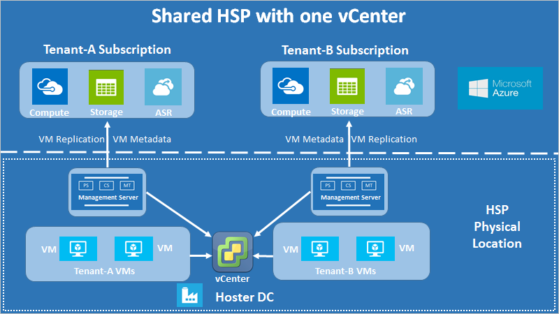
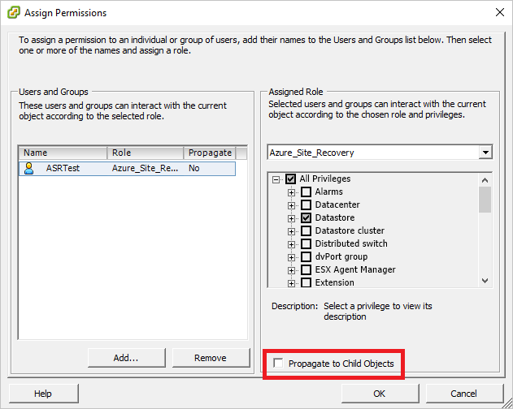
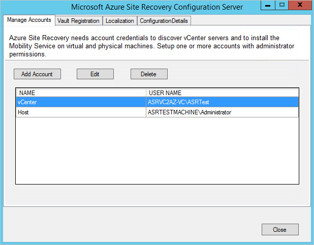
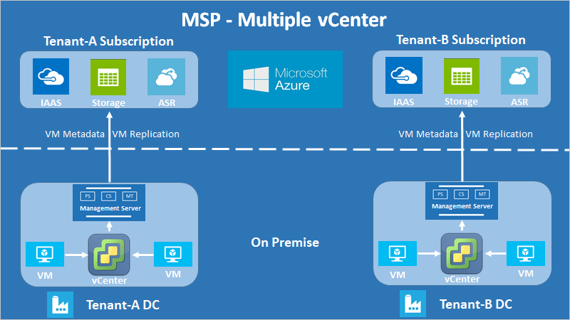

# Overview of multi-tenant support for VMware disaster recovery to Azure with CSP

[Azure Site Recovery](site-recovery-overview.md) supports multi-tenant environments for tenant subscriptions. It also supports multi-tenancy for tenant subscriptions that are created and managed through the Microsoft Cloud Solution Provider (CSP) program.

This article provides an overview of implementing and managing multi-tenant VMware to Azure replication.

## Multi-tenant environments

There are three major multi-tenant models:

* **Shared Hosting Services Provider (HSP)**: The partner owns the physical infrastructure, and uses shared resources (vCenter, datacenters, physical storage, and so on) to host multiple tenant VMs on the same infrastructure. The partner can provide disaster-recovery management as a managed service, or the tenant can own disaster recovery as a self-service solution.

* **Dedicated Hosting Services Provider**: The partner owns the physical infrastructure, but uses dedicated resources (multiple vCenters, physical datastores, and so on) to host each tenant’s VMs on a separate infrastructure. The partner can provide disaster-recovery management as a managed service, or the tenant can own it as a self-service solution.

* **Managed Services Provider (MSP)**: The customer owns the physical infrastructure that hosts the VMs, and the partner provides disaster-recovery enablement and management.

## Shared-hosting services provider (HSP)

The other two scenarios are subsets of the shared-hosting scenario, and they use the same principles. The differences are described at the end of the shared-hosting guidance.

The basic requirement in a multi-tenant scenario is that tenants must be isolated. One tenant should not be able to observe what another tenant has hosted. In a partner-managed environment, this requirement is not as important as it is in a self-service environment, where it can be critical. This article assumes that tenant isolation is required.

The architecture is shown in the following diagram.

  

**Shared-hosting with one vCenter server**

In the diagram, each customer has a separate management server. This configuration limits tenant access to tenant-specific VMs, and enables tenant isolation. VMware VM replication uses the configuration server to discover VMs, and install agents. The same principles apply to multi-tenant environments, with the addition of restricting VM discovery using vCenter access control.

The data isolation requirement means that all sensitive infrastructure information (such as access credentials) remains undisclosed to tenants. For this reason, we recommend that all components of the management server remain under the exclusive control of the partner. The management server components are:

* Configuration server
* Process server
* Master target server

A separate scaled-out process server is also under the partner's control.

## Configuration server accounts

Every configuration server in the multi-tenant scenario uses two accounts:

- **vCenter access account**: This account is used to discover tenant VMs. It has vCenter access permissions assigned to it. To help avoid access leaks, we recommend that partners enter these credentials themselves in the configuration tool.

- **Virtual machine access account**: This account is used to install the Mobility service agent on tenant VMs, with an automatic push. It is usually a domain account that a tenant might provide to a partner, or an account that the partner might manage directly. If a tenant doesn't want to share the details with the partner directly, they can enter the credentials through limited-time access to the configuration server. Or, with the partner's assistance, they can install the Mobility service agent manually.

## vCenter account requirements

Configure the configuration server with an account that has a special role assigned to it.

- The role assignment must be applied to the vCenter access account for each vCenter object, and not propagated to the child objects. This configuration ensures tenant isolation, because access propagation can result in accidental access to other objects.

    

- The alternative approach is to assign the user account and role at the datacenter object, and propagate them to the child objects. Then give the account a **No access** role for every object (such as VMs that belong to other tenants) that should be inaccessible to a particular tenant. This configuration is cumbersome. It exposes accidental access controls, because every new child object is also automatically granted access that's inherited from the parent. Therefore, we recommend that you use the first approach.

### Create a vCenter account

1. Create a new role by cloning the predefined *Read-only* role, and then give it a convenient name (such as Azure_Site_Recovery, as shown in this example).
2. Assign the following permissions to this role:

   * **Datastore**: Allocate space, Browse datastore, Low-level file operations, Remove file, Update virtual machine files
   * **Network**: Network assign
   * **Resource**: Assign VM to resource pool, Migrate powered off VM, Migrate powered on VM
   * **Tasks**: Create task, Update task
   * **VM - Configuration**: All
   * **VM - Interaction** > Answer question, Device connection, Configure CD media, Configure floppy media, Power off, Power on, VMware tools install
   * **VM - Inventory** > Create from existing, Create new, Register, Unregister
   * **VM - Provisioning** > Allow virtual machine download, Allow virtual machine files upload
   * **VM - Snapshot management** > Remove snapshots

       

3. Assign access levels to the vCenter account (used in the tenant configuration server) for various objects, as follows:

>| Object | Role | Remarks |
>| --- | --- | --- |
>| vCenter | Read-Only | Needed only to allow vCenter access for managing different objects. You can remove this permission if the account is never going to be provided to a tenant or used for any management operations on the vCenter. |
>| Datacenter | Azure_Site_Recovery |  |
>| Host and host cluster | Azure_Site_Recovery | Re-ensures that access is at the object level, so that only accessible hosts have tenant VMs before failover and after failback. |
>| Datastore and datastore cluster | Azure_Site_Recovery | Same as preceding. |
>| Network | Azure_Site_Recovery |  |
>| Management server | Azure_Site_Recovery | Includes access to all components (CS, PS, and MT) outside the CS machine. |
>| Tenant VMs | Azure_Site_Recovery | Ensures that any new tenant VMs of a particular tenant also get this access, or they will not be discoverable through the Azure portal. |

The vCenter account access is now complete. This step fulfills the minimum permissions requirement to complete failback operations. You can also use these access permissions with your existing policies. Just modify your existing permissions set to include role permissions from step 2, detailed previously.

### Failover only
To restrict disaster recovery operations up until failover only (that is, without failback capabilities), use the previous procedure, with these exceptions:

- Instead of assigning the *Azure_Site_Recovery* role to the vCenter access account, assign only a *Read-Only* role to that account. This permission set allows VM replication and failover, and it does not allow failback.
- Everything else in the preceding process remains as is. To ensure tenant isolation and restrict VM discovery, every permission is still assigned at the object level only, and not propagated to child objects.

### Deploy resources to the tenant subscription

1. On the Azure portal, create a resource group, and then deploy a Recovery Services vault per the usual process.
2. Download the vault registration key.
3. Register the CS for the tenant by using the vault registration key.
4. Enter the credentials for the two access accounts, the account to access the vCenter server, and the account to access the VM.

	

### Register servers in the vault

1. In the Azure portal, in the vault that you created earlier, register the vCenter server to the configuration server, using the vCenter account you created.
2. Finish the "Prepare infrastructure" process for Site Recovery per the usual process.
3. The VMs are now ready to be replicated. Verify that only the tenant’s VMs are displayed in **Replicate** > **Select virtual machines**.

## Dedicated hosting solution

As shown in the following diagram, the architectural difference in a dedicated hosting solution is that each tenant’s infrastructure is set up for that tenant only.

  
**Dedicated hosting scenario with multiple vCenters**

## Managed service solution

As shown in the following diagram, the architectural difference in a managed service solution is that each tenant’s infrastructure is also physically separate from other tenants' infrastructure. This scenario usually exists when the tenant owns the infrastructure and wants a solution provider to manage disaster recovery.

  
**Managed service scenario with multiple vCenters**

## Next steps
- [Learn more](site-recovery-role-based-linked-access-control.md) about role-based access control in Site Recovery.
- Learn how to [set up disaster recovery of VMware VMs to Azure](vmware-azure-tutorial.md).
- Learn more about [multi-tenancy with CSP for VMWare VMs](vmware-azure-multi-tenant-csp-disaster-recovery.md).
