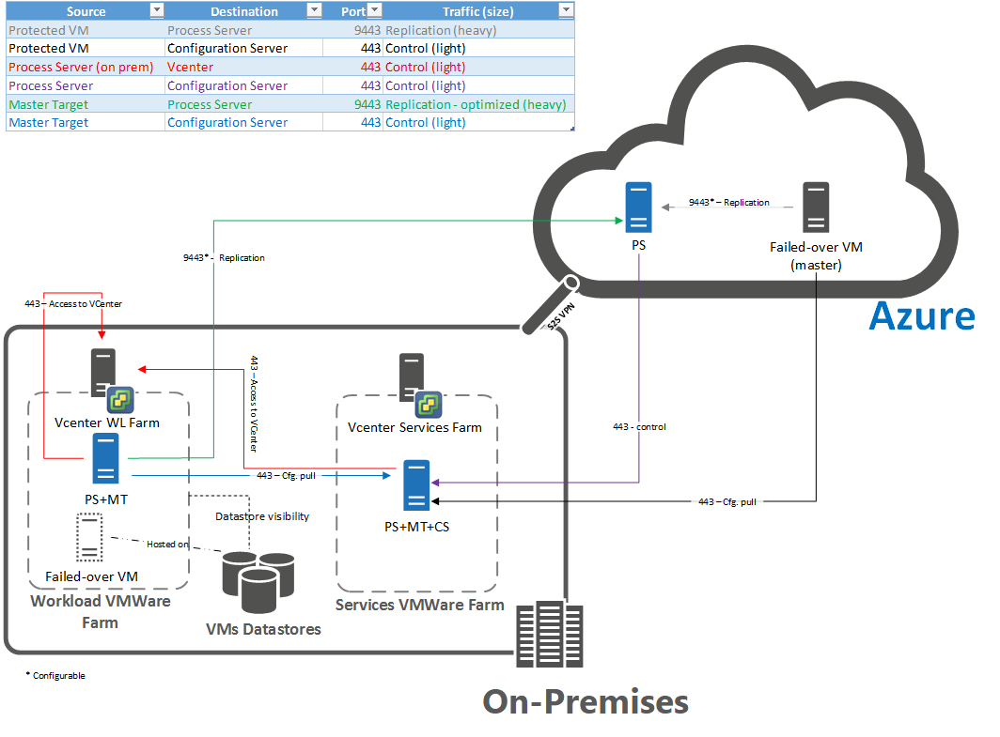

# Reprotect and fail back machines to an on-premises site after failover to Azure

After [failover](site-recovery-failover.md) of on-premises VMware VMs or physical servers to Azure, the first step in failing back to your on-premises site is to reprotect the Azure VMs that were created during failover. This article describes how to do this. 

For a quick overview, watch the following video about how to fail over from Azure to an on-premises site.  
> [!VIDEO https://channel9.msdn.com/Series/Azure-Site-Recovery/VMware-to-Azure-with-ASR-Video5-Failback-from-Azure-to-On-premises/player]

## Before you begin

If you used a template to create your virtual machines, ensure that each virtual machine has its own UUID for the disks. If the on-premises virtual machine's UUID clashes with the UUID of the master target because both were created from the same template, reprotection fails. Deploy another master target that wasn't created from the same template. Note the following information:
- If you are trying to fail back to an alternate vCenter, make sure that your new vCenter and the master target server are discovered. A typical symptom is that the datastores aren't accessible or aren't visible in the **Reprotect** dialog box.
- To replicate back to on-premises, you need a failback policy. This policy is automatically created when you create a forward direction policy. Note the following information:
    - This policy is auto associated with the configuration server during creation.
    - This policy isn't editable.
    - The set values of the policy are (RPO Threshold = 15 Mins, Recovery Point Retention = 24 Hours, App Consistency Snapshot Frequency = 60 Mins).
- During reprotection and failback, the on-premises configuration server must be running and connected.
- If a vCenter server manages the virtual machines to which you'll fail back, make sure that you have the [required permissions](vmware-azure-tutorial-prepare-on-premises.md#prepare-an-account-for-automatic-discovery) for discovery of VMs on vCenter servers.
- Delete snapshots on the master target server before you reprotect. If snapshots are present on the on-premises master target or on the virtual machine, reprotection fails. The snapshots on the virtual machine are automatically merged during a reprotect job.
- All virtual machines of a replication group must be of the same operating system type (either all Windows or all Linux). A replication group with mixed operating systems currently isn't supported for reprotect and failback to on-premises. This is because the master target must be of the same operating system as the virtual machine. All the virtual machines of a replication group must have the same master target. 
- A configuration server is required on-premises when you fail back. During failback, the virtual machine must exist in the configuration server database. Otherwise, failback is unsuccessful. Make sure that you make regularly scheduled backups of your configuration server. If there's a disaster, restore the server with the same IP address so that failback works.
- Reprotection and failback require a site-to-site (S2S) VPN to replicate data. Provide the network so that the failed-over virtual machines in Azure can reach (ping) the on-premises configuration server. You also might want to deploy a process server in the Azure network of the failed-over virtual machine. This process server must also be able to communicate with the on-premises configuration server.
- Make sure that you open the following ports for failover and failback:

    

- Read all the [prerequisites for ports and URL whitelisting](vmware-azure-deploy-configuration-server.md#prerequisites).

## Deploy a process server in Azure

You might need a process server in Azure before you fail back to your on-premises site:
- The process server receives data from the protected virtual machine in Azure, and then sends data to the on-premises site.
- A low-latency network is required between the process server and the protected virtual machine. In general, you need to consider latency when deciding whether you need a process server in Azure:
    - If you have an Azure ExpressRoute connection set up, you can use an on-premises process server to send data because the latency between the virtual machine and the process server is low.
    - However, if you have only a S2S VPN, we recommend deploying the process server in Azure.
    - We recommend using an Azure-based process server during failback. The replication performance is higher if the process server is closer to the replicating virtual machine (the failed-over machine in Azure). For a proof of concept, you can use the on-premises process server and ExpressRoute with private peering.

To deploy a process server in Azure:

1. If you need to deploy a process server in Azure, see [Set up a process server in Azure for failback](vmware-azure-set-up-process-server-azure.md).
2. The Azure VMs send replication data to the process server. Configure networks so that the Azure VMs can reach the process server.
3. Remember that replication from Azure to on-premises can happen only over the S2S VPN or over the private peering of your ExpressRoute network. Ensure that enough bandwidth is available over that network channel.

## Deploy a separate master target server

The master target server receives failback data. By default, the master target server runs on the on-premises configuration server. However, depending on the volume of failed-back traffic, you might need to create a separate master target server for failback. Here's how to create one:

* [Create a Linux master target server](vmware-azure-install-linux-master-target.md) for failback of Linux VMs. This is required. Note that, Master target server on LVM is not supported.
* Optionally, create a separate master target server for Windows VM failback. To do this, run Unified Setup again, and select to create a master target server. [Learn more](site-recovery-plan-capacity-vmware.md#deploy-additional-master-target-servers). 

After you create a master target server, do the following tasks:

- If the virtual machine is present on-premises on the vCenter server, the master target server needs access to the on-premises virtual machine's Virtual Machine Disk (VMDK) file. Access is required to write the replicated data to the virtual machine's disks. Ensure that the on-premises virtual machine's datastore is mounted on the master target's host with read/write access.
- If the virtual machine isn't present on-premises on the vCenter server, the Site Recovery service needs to create a new virtual machine during reprotection. This virtual machine is created on the ESX host on which you create the master target. Choose the ESX host carefully, so that the failback virtual machine is created on the host that you want.
- You can't use Storage vMotion for the master target server. Using Storage vMotion for the master target server might cause the failback to fail. The virtual machine can't start because the disks aren't available to it. To prevent this from occurring, exclude the master target servers from your vMotion list.
- If a master target undergoes a Storage vMotion task after reprotection, the protected virtual machine disks that are attached to the master target migrate to the target of the vMotion task. If you try to fail back after this, detachment of the disk fails because the disks are not found. It then becomes hard to find the disks in your storage accounts. You need to find them manually and attach them to the virtual machine. After that, the on-premises virtual machine can be booted.
- Add a retention drive to your existing Windows master target server. Add a new disk and format the drive. The retention drive is used to stop the points in time when the virtual machine replicates back to the on-premises site. Following are some criteria of a retention drive. If these criteria aren't met, the drive isn't listed for the master target server:
    - The volume isn't used for any other purpose, such as a target of replication.
    - The volume isn't in lock mode.
    - The volume isn't a cache volume. The master target installation can't exist on that volume. The custom installation volume for the process server and master target isn't eligible for a retention volume. When the process server and master target are installed on a volume, the volume is a cache volume of the master target.
    - The file system type of the volume isn't FAT or FAT32.
    - The volume capacity is nonzero.
    - The default retention volume for Windows is the R volume.
    - The default retention volume for Linux is /mnt/retention.
- You must add a new drive if you're using an existing process server/configuration server machine or a scale or process server/master target server machine. The new drive must meet the preceding requirements. If the retention drive isn't present, it doesn't appear in the selection drop-down list on the portal. After you add a drive to the on-premises master target, it takes up to 15 minutes for the drive to appear in the selection on the portal. You can also refresh the configuration server if the drive doesn't appear after 15 minutes.
- Install VMware tools or open-vm-tools on the master target server. Without the tools, the datastores on the master target's ESXi host can't be detected.
- Set the `disk.EnableUUID=true` setting in the configuration parameters of the master target virtual machine in VMware. If this row doesn't exist, add it. This setting is required to provide a consistent UUID to the VMDK so that it mounts correctly.
- The ESX host on which the master target is created must have at least one virtual machine file system (VMFS) datastore attached to it. If no VMFS datastores are attached, the **Datastore** input on the reprotect page is empty and you can't proceed.
- The master target server can't have snapshots on the disks. If there are snapshots, reprotection and failback fail.
- The master target can't have a Paravirtual SCSI controller. The controller can only be an LSI Logic controller. Without an LSI Logic controller, reprotection fails.
- For any instance, the master target can have at most 60 disks attached to it. If the number of virtual machines being reprotected to the on-premises master target has more than a total number of 60 disks, reprotects to the master target begin to fail. Ensure that you have enough master target disk slots, or deploy additional master target servers.
    

## Enable reprotection

After a virtual machine boots in Azure, it takes some time for the agent to register back to the configuration server (up to 15 minutes). During this time, you won't be able to reprotect and an error message indicates that the agent isn't installed. If this happens, wait for a few minutes, and then try reprotection again:

1. Select **Vault** > **Replicated items**. Right-click the virtual machine that failed over, and then select **Re-Protect**. Or, from the command buttons, select the machine, and then select **Re-Protect**.
2. Verify that the **Azure to On-premises** direction of protection is selected.
3. In **Master Target Server** and **Process Server**, select the on-premises master target server and the process server.  
4. For **Datastore**, select the datastore to which you want to recover the disks on-premises. This option is used when the on-premises virtual machine is deleted, and you need to create new disks. This option is ignored if the disks already exist. You still need to specify a value.
5. Select the retention drive.
6. The failback policy is automatically selected.
7. Select **OK** to begin reprotection. A job begins to replicate the virtual machine from Azure to the on-premises site. You can track the progress on the **Jobs** tab. When the reprotection succeeds, the virtual machine enters a protected state.

Note the following information:
- If you want to recover to an alternate location (when the on-premises virtual machine is deleted), select the retention drive and datastore that are configured for the master target server. When you fail back to the on-premises site, the VMware virtual machines in the failback protection plan use the same datastore as the master target server. A new virtual machine is then created in vCenter.
- If you want to recover the virtual machine on Azure to an existing on-premises virtual machine, mount the on-premises virtual machine's datastores with read/write access on the master target server's ESXi host.

    

- You can also reprotect at the level of a recovery plan. A replication group can be reprotected only through a recovery plan. When you reprotect by using a recovery plan, you must provide the values for every protected machine.
- Use the same master target server to reprotect a replication group. If you use a different master target server to reprotect a replication group, the server can't provide a common point in time.
- The on-premises virtual machine is turned off during reprotection. This helps ensure data consistency during replication. Don't turn on the virtual machine after reprotection finishes.

## Common issues

- If you perform a read-only user vCenter discovery and protect virtual machines, protection succeeds, and failover works. During reprotection, failover fails because the datastores can't be discovered. A symptom is that the datastores aren't listed during reprotection. To resolve this problem, you can update the vCenter credentials with an appropriate account that has permissions and then retry the job. 
- When you fail back a Linux virtual machine and run it on-premises, you can see that the Network Manager package has been uninstalled from the machine. This uninstallation occurs because the Network Manager package is removed when the virtual machine is recovered in Azure.
- When a Linux virtual machine is configured with a static IP address and is failed over to Azure, the IP address is acquired from DHCP. When you fail over to on-premises, the virtual machine continues to use DHCP to acquire the IP address. Manually sign in to the machine, and then set the IP address back to a static address if necessary. A Windows virtual machine can acquire its static IP address again.
- If you use either the ESXi 5.5 free edition or the vSphere 6 Hypervisor free edition, failover succeeds, but failback doesn't succeed. To enable failback, upgrade to either program's evaluation license.
- If you can't reach the configuration server from the process server, use Telnet to check connectivity to the configuration server on port 443. You can also try to ping the configuration server from the process server. A process server should also have a heartbeat when it's connected to the configuration server.
- A Windows Server 2008 R2 SP1 server that is protected as a physical on-premises server can't be failed back from Azure to an on-premises site.
- You can't fail back in the following circumstances:
    - You migrated machines to Azure. [Learn more](migrate-overview.md#what-do-we-mean-by-migration).
    - You moved a VM to another resource group.
    - You deleted the Azure VM.
    - You disabled protection of the VM.
    - You created the VM manually in Azure. The machine should have been initially protected on-premises and failed over to Azure before reprotection.
    - You can fail only to an ESXi host. You can't failback VMware VMs or physical servers to Hyper-V hosts, physical machines, or VMware workstations.

## Next steps

After the virtual machine has entered a protected state, you can [initiate a failback](vmware-azure-failback.md). The failback shuts down the virtual machine in Azure and boots the on-premises virtual machine. Expect some downtime for the application. Choose a time for failback when the application can tolerate downtime.

