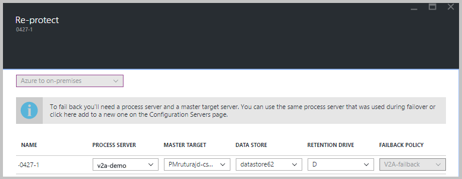

# Reprotect from Azure to on-premises

After [failover](site-recovery-failover.md) of on-premises VMware VMs or physical servers to Azure, the first step in failing back to your on-premises site is to reprotect the Azure VMs that were created during failover. This article describes how to do this. 

## Before you begin

1. Follow the steps in [this article](vmware-azure-prepare-failback.md) to prepare for reprotection and failback, including setting up a process server in Azure, and an on-premises master target server, and configuring a site-to-site VPN, or ExpressRoute private peering, for failback.
2. Make sure that the the on-premises configuration server is running and connected to Azure. During failover to Azure, the on-premises site might not be accessible, and the configuration server might be unavailable or shut down. During failback, the VM must exist in the configuration server database. Otherwise, failback is unsuccessful.
3. Delete any snapshots on the on-premises master target server. Reprotection won't work if there are snapshots.  The snapshots on the VM are automatically merged during a reprotect job.
4. If you're reprotecting VMs gathered into a replication group for multi-VM consistency, make sure they all have the same operating system (Windows or Linux) and make sure that the master target server you deploy has the same type of operating system. All VMs in a replication group must use the same master target server.
5. Open [the required ports](vmware-azure-prepare-failback.md#ports-for-reprotectionfailback) for failback.
6. Ensure that the vCenter Server is connected before failback. Otherwise, disconnecting disks and attaching them back to the virtual machine fails.
7. If a vCenter server manages the VMs to which you'll fail back, make sure that you have the required permissions. If you perform a read-only user vCenter discovery and protect virtual machines, protection succeeds, and failover works. However, during reprotection, failover fails because the data stores can't be discovered, and aren't listed during reprotection. To resolve this problem, you can update the vCenter credentials with an [appropriate account/permissions](vmware-azure-tutorial-prepare-on-premises.md#prepare-an-account-for-automatic-discovery), and then retry the job. 
8. If you used a template to create your virtual machines, ensure that each VM has its own UUID for the disks. If the on-premises VM UUID clashes with the UUID of the master target server because both were created from the same template, reprotection fails. Deploy from a different template.
9. If you're failing back to an alternate vCenter Server, make sure that the new vCenter Server and the master target server are discovered. Typically if they're not the data stores aren't accessible, or aren't visible in **Reprotect**.
10. Verify the following scenarios in which you can't fail back:
    - If you're using either the ESXi 5.5 free edition or the vSphere 6 Hypervisor free edition. Upgrade to a different version.
    - If you have a Windows Server 2008 R2 SP1 physical server.
    - VMware VMs can't fail back to Hyper-V.
    - VMs that have been migrated.
    - A VM that's been moved to another resource group.
    - A replica Azure VM that's been deleted.
    - A replica Azure VM that isn't protected (replicating to the on-premises site).
10. [Review the types of failback](concepts-types-of-failback.md) you can use - original location recovery and alternate location recovery.

## Enable reprotection

Enable replication. You can reprotect specific VMs, or a recovery plan:

- If you reprotect a recovery plan, you must provide the values for every protected machine.
- If VMs belong to a replication group for multi-VM consistency, they can only be reprotected using a recovery plan. VMs in a replication group must use the same master target server

>[!NOTE]
>The amount of data sent from Azure to erstwhile source during reprotect, can be anything between 0 bytes and sum of disk size for all protected machines, and can't be calculated.

### Before you start

- After a VM boots in Azure after failover, it takes some time for the agent to register back to the configuration server (up to 15 minutes). During this time, you won't be able to reprotect and an error message indicates that the agent isn't installed. If this happens, wait for a few minutes, and then reprotect.
- If you want to fail back the Azure VM to an existing on-premises VM, mount the on-premises VM data stores with read/write access on the master target server's ESXi host.
- If you want to fail back to an alternate location, for example if the on-premises VM doesn't exist, select the retention drive and data store that are configured for the master target server. When you fail back to the on-premises site, the VMware virtual machines in the failback protection plan use the same data store as the master target server. A new VM is then created in vCenter.

Enable reprotection as follows:

1. Select **Vault** > **Replicated items**. Right-click the virtual machine that failed over, and then select **Re-protect**. Or, from the command buttons, select the machine, and then select **Re-protect**.
2. Verify that the **Azure to on-premises** direction of protection is selected.
3. In **MASTER TARGET** and **PROCESS SERVER**, select the on-premises master target server and the process server.  
4. For **DATA STORE**, select the data store to which you want to recover the disks on-premises. This option is used when the on-premises virtual machine is deleted, and you need to create new disks. This option is ignored if the disks already exist. You still need to specify a value.
5. Select the retention drive.
6. The failback policy is automatically selected.
7. Select **OK** to begin reprotection.

    
    
8. A job begins to replicate the Azure VM to the on-premises site. You can track the progress on the **Jobs** tab.
    - When the reprotection succeeds, the VM enters a protected state.
    - The on-premises VM is turned off during reprotection. This helps ensure data consistency during replication.
    - Don't turn on the on-premises VM after reprotection finishes.
   

## Next steps

- If you encounter any issues, review the [troubleshooting article](vmware-azure-troubleshoot-failback-reprotect.md).
- After the Azure VMs are protected, you can [run a failback](vmware-azure-failback.md). Failback shuts down the Azure VM and boots the on-premises VM. Expect some downtime for the application, and choose a failback time accordingly.

