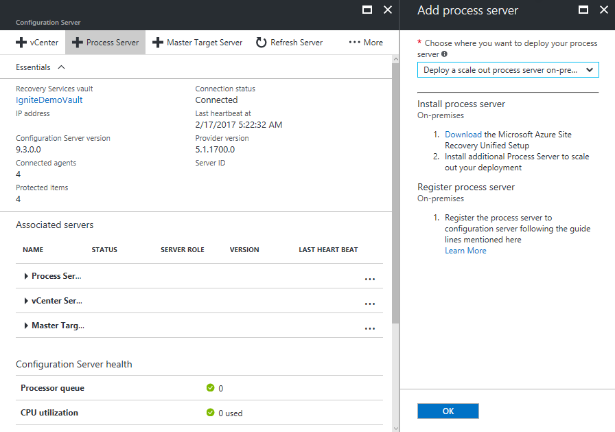

# Scale with additional process servers

By default, when you're replicating VMware VMs or physical servers to Azure using [Site Recovery](site-recovery-overview.md), a process server is installed on the configuration server machine, and is used to coordinate data transfer between Site Recovery and your on-premises infrastructure. To increase capacity and scale out your replication deployment, you can add additional standalone process servers. This article describes how to setup a scale-out process server.

## Before you start

### Capacity planning

Make sure you've performed [capacity planning](site-recovery-plan-capacity-vmware.md) for VMware replication. This helps you to identify how and when you should deploy additional process servers.

From 9.24 version, guidance is added during selection of process server for new replications. Process server will be marked Healthy, Warning and Critical based on certain criteria. To understand different scenarios that can influence state of process server, review the [process server alerts](vmware-physical-azure-monitor-process-server.md#process-server-alerts).

> [!NOTE]
> Use of a cloned Process Server component is not supported. Follow the steps in this article for each PS scale-out.

### Sizing requirements 

Verify the sizing requirements summarized in the table. In general, if you have to scale your deployment to more than 200 source machines, or you have a total daily churn rate of more than 2 TB, you need additional process servers to handle the traffic volume.

| **Additional process server** | **Cache disk size** | **Data change rate** | **Protected machines** |
| --- | --- | --- | --- |
|4 vCPUs (2 sockets * 2 cores \@ 2.5 GHz), 8-GB memory |300 GB |250 GB or less |Replicate 85 or less machines. |
|8 vCPUs (2 sockets * 4 cores \@ 2.5 GHz), 12-GB memory |600 GB |250 GB to 1 TB |Replicate between 85-150 machines. |
|12 vCPUs (2 sockets * 6 cores \@ 2.5 GHz) 24-GB memory |1 TB |1 TB to 2 TB |Replicate between 150-225 machines. |

Where each protected source machine is configured with 3 disks of 100 GB each.

### Prerequisites

The prerequisites for the additional process server are summarized in the following table.

[!INCLUDE [site-recovery-configuration-server-requirements](../../includes/site-recovery-configuration-and-scaleout-process-server-requirements.md)]

## Download installation file

Download the installation file for the process server as follows:

1. Sign in to the Azure portal, and browse to your Recovery Services Vault.
2. Open **Site Recovery Infrastructure** > **VMWare and Physical Machines** > **Configuration Servers** (under For VMware & Physical Machines).
3. Select the configuration server to drill down into the server details. Then click **+ Process Server**.
4. In **Add Process server** >  **Choose where you want to deploy your process server**, select **Deploy a Scale-out Process Server on-premises**.

   
1. Click **Download the Microsoft Azure Site Recovery Unified Setup**. This downloads the latest version of the installation file.

   > [!WARNING]
   > The process server installation version should be the same as, or earlier than, the configuration server version you have running. A simple way to ensure version compatibility is to use the same installer, that you most recently used to install or update your configuration server.

## Install from the UI

Install as follows. After setting up the server, you migrate source machines to use it.

[!INCLUDE [site-recovery-configuration-server-requirements](../../includes/site-recovery-add-process-server.md)]


## Install from the command line

Install by running the following command:

```
UnifiedSetup.exe [/ServerMode <CS/PS>] [/InstallDrive <DriveLetter>] [/MySQLCredsFilePath <MySQL credentials file path>] [/VaultCredsFilePath <Vault credentials file path>] [/EnvType <VMWare/NonVMWare>] [/PSIP <IP address to be used for data transfer] [/CSIP <IP address of CS to be registered with>] [/PassphraseFilePath <Passphrase file path>]
```

Where command line parameters are as follows:

[!INCLUDE [site-recovery-unified-setup-parameters](../../includes/site-recovery-unified-installer-command-parameters.md)]

For example:

```
MicrosoftAzureSiteRecoveryUnifiedSetup.exe /q /x:C:\Temp\Extracted
cd C:\Temp\Extracted
UNIFIEDSETUP.EXE /AcceptThirdpartyEULA /servermode "PS" /InstallLocation "D:\" /EnvType "VMWare" /CSIP "10.150.24.119" /PassphraseFilePath "C:\Users\Administrator\Desktop\Passphrase.txt" /DataTransferSecurePort 443
```
### Create a proxy settings file

If you need to set up a proxy, the ProxySettingsFilePath parameter takes a file as input. You can create the file as follows, and pass it as input ProxySettingsFilePath parameter.

```
* [ProxySettings]
* ProxyAuthentication = "Yes/No"
* Proxy IP = "IP Address"
* ProxyPort = "Port"
* ProxyUserName="UserName"
* ProxyPassword="Password"
```

## Next steps
Learn about [managing process server settings](vmware-azure-manage-process-server.md)
