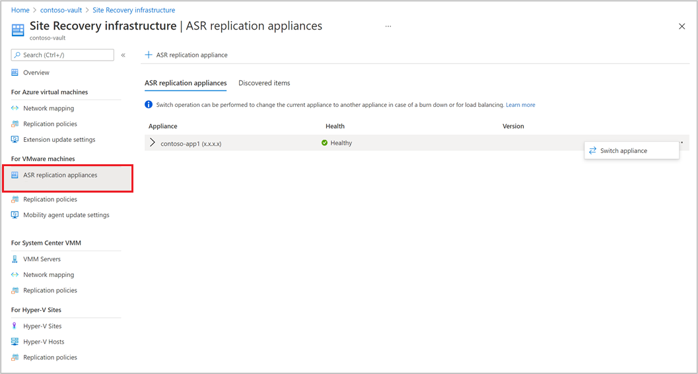
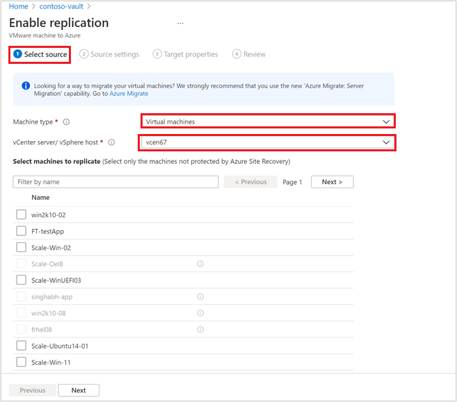
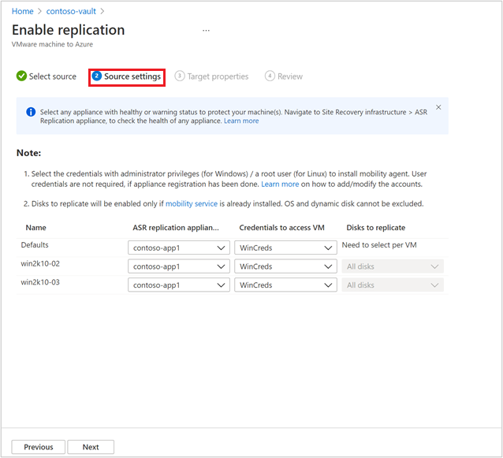
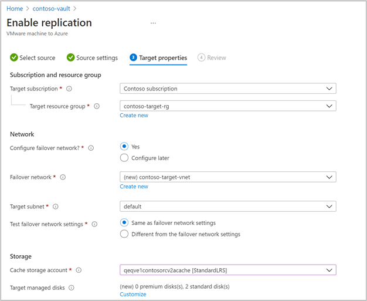
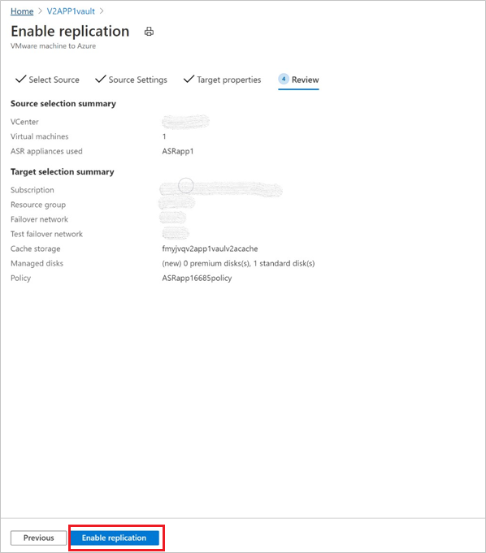

# Set up disaster recovery to Azure for on-premises VMware VMs - Modernized

This article describes how to enable replication for on-premises VMware VMs, for disaster recovery to Azure using the Modernized VMware/Physical machine protection experience.

For information on how to set up disaster recovery in Azure Site Recovery Classic releases, see [the tutorial](vmware-azure-tutorial.md).

This is the second tutorial in a series that shows you how to set up disaster recovery to Azure for on-premises VMware VMs. In the previous tutorial, we [prepared the on-premises Azure Site Recovery replication appliance](deploy-vmware-azure-replication-appliance-modernized.md) for disaster recovery to Azure.

In this tutorial, you learn how to:

> [!div class="checklist"]
> * Set up the source replication settings.
> * Set up the replication target settings.
> * Enable replication for a VMware VM.

## Get started

VMware to Azure replication includes the following procedures:

- Sign in to the [Azure portal](https://portal.azure.com/).
- Prepare an Azure account.
- Prepare an account on the vCenter server or vSphere ESXi host, to automate VM discovery.
- [Create a recovery Services vault](./quickstart-create-vault-template.md?tabs=CLI)
- Prepare infrastructure - [deploy an Azure Site Recovery replication appliance](deploy-vmware-azure-replication-appliance-modernized.md)
- Enable replication

## Prepare Azure account

To create and register the Azure Site Recovery replication appliance, you need an Azure account with:

- Contributor or Owner permissions on the Azure subscription.
- Permissions to register Azure Active Directory (AAD) apps.
- Owner or Contributor and User Access Administrator permissions on the Azure subscription to create a Key Vault, used during agentless VMware migration.

If you just created a free Azure account, you're the owner of your subscription. If you're not the subscription owner, work with the owner for the required permissions.

Use the following steps to assign the required permissions:

1. In the Azure portal, search for **Subscriptions**, and under **Services**, select **Subscriptions** search box to search for the required Azure subscription.

2. In the **Subscriptions page**, select the subscription in which you created the Recovery Services vault.

3. In the subscription, select **Access control** (IAM) > **Check access**. In **Check access**, search for the relevant user account.

4. In **Add a role assignment**, Select **Add,** select the Contributor or Owner role, and select the account. Then Select **Save**.

5. To register the Azure Site Recovery replication appliance, your Azure account needs permissions to register the Azure Active Directory apps.

**Follow these steps to assign required permissions**:

1. In Azure portal, navigate to **Azure Active Directory** > **Users** > **User Settings**. In **User settings**, verify that Azure AD users can register applications (set to *Yes* by default).

2. In case the **App registrations** settings is set to *No*, request the tenant/global admin to assign the required permission. Alternately, the tenant/global admin can assign the Application Developer role to an account to allow the registration of Azure Active Directory App.

## Grant required permissions to the vault

You will also need to grant the managed identity permissions to the cache storage accounts. You can create the storage account in advance and use the same for enabling replication. 

Ensure that the following role permissions are present depending on the type of storage account:

- Resource Manager based storage accounts (Standard Type):
  - [Contributor](../role-based-access-control/built-in-roles.md#contributor)
  - [Storage Blob Data Contributor](../role-based-access-control/built-in-roles.md#storage-blob-data-contributor)
- Resource Manager based storage accounts (Premium Type):
  - [Contributor](../role-based-access-control/built-in-roles.md#contributor)
  - [Storage Blob Data Owner](../role-based-access-control/built-in-roles.md#storage-blob-data-owner)

## Prepare an account for automatic discovery

Site Recovery needs access to VMware servers to:

- Automatically discover VMs. At least a read-only account is required.
- Orchestrate replication, failover, and failback. You need an account that can run operations such
  as creating and removing disks, and powering on VMs.

Create the account as follows:

1. To use a dedicated account, create a role at the vCenter level. Give the role a name such as
   **Azure_Site_Recovery**.
2. Assign the role the permissions summarized in the table below.
3. Create a user on the vCenter server or vSphere host. Assign the role to the user.

### VMware account permissions

**Task** | **Role/Permissions** | **Details**
--- | --- | ---
**VM discovery** | At least a read-only user   Data Center object -> Propagate to Child Object, role=Read-only | User assigned at datacenter level, and has access to all the objects in the datacenter.   To restrict access, assign the **No access** role with the **Propagate to child** object, to the child objects (vSphere hosts, datastores, VMs and networks).
**Full replication, failover, failback** |  Create a role (Azure_Site_Recovery) with the required permissions, and then assign the role to a VMware user or group   Data Center object –> Propagate to Child Object, role=Azure_Site_Recovery   Datastore -> Allocate space, browse datastore, low-level file operations, remove file, update virtual machine files   Network -> Network assign   Resource -> Assign VM to resource pool, migrate powered off VM, migrate powered on VM   Tasks -> Create task, update task   Virtual machine -> Configuration   Virtual machine -> Interact -> answer question, device connection, configure CD media, configure floppy media, power off, power on, VMware tools install   Virtual machine -> Inventory -> Create, register, unregister   Virtual machine -> Provisioning -> Allow virtual machine download, allow virtual machine files upload   Virtual machine -> Snapshots -> Remove snapshots, Create snapshot, Revert snapshot.| User assigned at datacenter level, and has access to all the objects in the datacenter.   To restrict access, assign the **No access** role with the **Propagate to child** object, to the child objects (vSphere hosts, datastores, VMs and networks).

## Prepare infrastructure - set up Azure Site Recovery Replication appliance

You need to [set up an Azure Site Recovery replication appliance on the on-premises environment](deploy-vmware-azure-replication-appliance-modernized.md) to channel mobility agent communications.

## Enable replication of VMware VMs

After an Azure Site Recovery replication appliance is added to a vault, you can get started with protecting the machines.

Ensure the [pre-requisites](vmware-physical-azure-support-matrix.md) across storage and networking are met.

Follow these steps to enable replication:

1. Select **Site Recovery** under **Getting Started** section. Click **Enable Replication (Modernized)** under the VMware section.

2. Choose the machine type you want to protect through Azure Site Recovery.

   > [!NOTE]
   > In Modernized, the support is limited to virtual machines.

   

3. After choosing the machine type, select the vCenter server added to Azure Site Recovery replication appliance, registered in this vault.

4.	Search the source machine name to protect it. To review the selected machines, select **Selected resources**.

5. After you select the list of VMs, select **Next** to proceed to source settings. Here, select the [replication appliance](#appliance-selection) and VM credentials. These credentials will be used to push mobility agent on the machine by Azure Site Recovery replication appliance to complete enabling Azure Site Recovery. Ensure accurate credentials are chosen.

   >[!NOTE]
   >For Linux OS, ensure to provide the root credentials. For Windows OS, a user account with admin privileges should be added. These credentials will be used to push Mobility Service on to the source machine during enable replication operation.

   

6. Select **Next** to provide target region properties. By default, Vault subscription and Vault resource group are selected. You can choose a subscription and resource group of your choice. Your source machines will be deployed in this subscription and resource group when you failover in the future.

   

7. Next, you can select an existing Azure network or create a new target network to be used during failover. If you select **Create new**, you will be redirected to create virtual network context blade and asked to provide address space and subnet details. This network will be created in the target subscription and target resource group selected in the previous step.

8. Then, provide the test failover network details.

   > [!NOTE]
   > Ensure that the test failover network is different from the failover network. This is to make sure the failover network is readily available in case of an actual disaster.

9. Select the storage.

    - Cache storage account:
      Now, choose the cache storage account which Azure Site Recovery uses for staging purposes - caching and storing logs before writing the changes on to the managed disks.

      By default, a new LRS v1 type storage account will be created by Azure Site Recovery for the first enable replication operation in a vault. For the next operations, the same cache storage account will be re-used.
    -  Managed disks

       By default, Standard HDD managed disks are created in Azure. You can customize the type of Managed disks by Selecting **Customize**. Choose the type of disk based on the business requirement. Ensure [appropriate disk type is chosen](../virtual-machines/disks-types.md#disk-type-comparison) based on the IOPS of the source machine disks. For pricing information, see managed disk pricing document [here](https://azure.microsoft.com/pricing/details/managed-disks/).

       >[!NOTE]
       > If Mobility Service is installed manually before enabling replication, you can change the type of managed disk, at a disk level. Else, by default, one managed disk type can be chosen at a machine level

10. Create a new replication policy if needed.

     A default replication policy gets created under the vault with 3 days recovery point retention and app-consistent recovery points disabled by default. You can create a new replication policy or modify the existing one as per your RPO requirements.

     - Select **Create new**.

     - Enter the **Name**.

     - Enter a value for **Retention period (in days)**. You can enter any value ranging from 0 to 15.

     - **Enable app consistency frequency** if you wish and enter a value for **App-consistent snapshot frequency (in hours)** as per business requirements.

     - Select **OK** to save the policy.

     The policy will be created and can be used for protecting the chosen source machines.

11. After choosing the replication policy, select **Next**. Review the Source and Target properties. Select **Enable  Replication** to initiate the operation.

    

    A job is created to enable replication of the selected machines. To track the progress, navigate to Site Recovery jobs in the recovery services vault.

## Appliance selection

- You can select any of the Azure Site Recovery replication appliances registered under a vault to protect a machine.
- Same replication appliance can be used both for forward and backward protection operations, if it is in a non-critical state. It should not impact the performance of the replications.

## Next steps
After enabling replication, run a drill to make sure everything's working as expected.
> [!div class="nextstepaction"]
> [Run a disaster recovery drill](site-recovery-test-failover-to-azure.md)