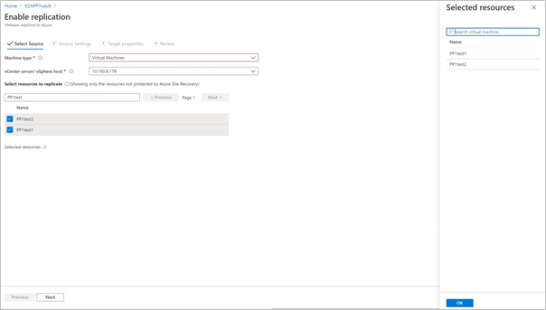
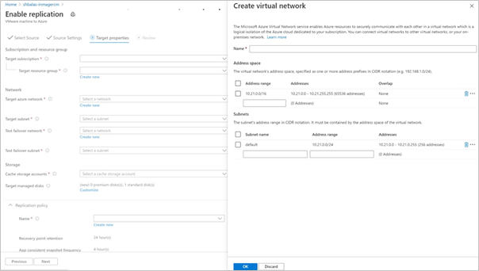

# Set up disaster recovery to Azure for on-premises VMware VMs - Preview

This article describes how to enable replication for on-premises VMware VMs, for disaster recovery to Azure using the [Azure Site Recovery](site-recovery-overview.md) service - Preview.

For information on how to set up disaster recovery in Classic releases, see [this article](vmware-azure-tutorial.md)

This is the third tutorial in a series that shows you how to set up disaster recovery to Azure for on-premises VMware VMs. In the previous tutorial, we [prepared the on-premises VMware environment](vmware-azure-tutorial-prepare-on-premises.md) for disaster recovery to Azure.

In this tutorial, you learn how to:

> [!div class="checklist"]
> * Set up the source replication settings, and an on-premises Site Recovery configuration server.
> * Set up the replication target settings.
> * Create a replication policy.
> * Enable replication for a VMware VM.

> [!NOTE]
> Tutorials show you the simplest deployment path for a scenario. They use default options where possible, and don't show all possible settings and paths. For detailed instructions, review the article in the How To section of the Site Recovery Table of Contents.

## Select a protection goal

1. In **Recovery Services vaults**, select the vault name. We're using **ContosoVMVault** for this scenario.
2. In **Getting Started**, select Site Recovery. Then select **Prepare Infrastructure**.
3. In **Protection goal** > **Where are your machines located**, select **On-premises**.
4. In **Where do you want to replicate your machines**, select **To Azure**.
5. In **Are your machines virtualized**, select **Yes, with VMware vSphere Hypervisor**. Then select **OK**.

## Get started

VMware to Azure replication includes the following procedures:

- Sign in to the [Azure portal](https://portal.azure.com/).
- To get started, navigate to [[Azure private preview portal](https://aka.ms/rcmcanary). And do the steps detailed in the following sections.
- Prepare Azure account
- Prepare infrastructure
- [Create a recovery Services vault](/azure/site-recovery/quickstart-create-vault-template?tabs=CLI)
- Create Azure Site recovery replication appliances
- Enable replication

## Prepare Azure account

To create and register the Azure Site Recovery replication appliance, you need an Azure account with:

- Contributor or Owner permissions on the Azure subscription.
- Permissions to register Azure Active Directory (AAD) apps.
- Owner or Contributor and User Access Administrator permissions on the Azure subscription to create a Key Vault, used during agentless VMware migration.

If you just created a free Azure account, you're the owner of your subscription. If you're not the subscription owner, work with the owner for the required permissions.

Use the following steps to assign the required permissions:

1. In the Azure portal, search for **Subscriptions**, and under **Services**, select **Subscriptions** search box to search for the required Azure subscription.

2. In the **Subscriptions page**, select the subscription in which you created the Recovery Services vault.

3. In the subscription, select **Access control** (IAM) > **Check access**. In **Check access**, search for the relevant user account.

4. In **Add a role assignment**, Select **Add,** select the Contributor or Owner role, and select the account. Then Select **Save**.

5. To register the Azure Site Recovery replication appliance, your Azure account needs permissions to register the AAD apps.

Follow these steps to assign required permissions:

1. In Azure portal, navigate to **Azure Active Directory** > **Users** > **User Settings**. In **User settings**, verify that Azure AD users can register applications (set to *Yes* by default).

2. In case the **App registrations** settings is set to *No*, request the tenant/global admin to assign the required permission. Alternately, the tenant/global admin can assign the Application Developer role to an account to allow the registration of AAD App.

## Prepare infrastructure - set up Azure Site Recovery Replication appliance

You need to [set up an Azure Site Recovery replication appliance on the on-premises environment](deploy-vmware-azure-replication-appliance-preview.md) to channel mobility agent communications.

## Enable replication of VMware VMs

After an Azure Site Recovery replication appliance is added to a vault, you can get started with protecting the machines.

Ensure the following pre-requisites across storage and networking are met:

- [Linux storage](vmware-physical-azure-support-matrix.md#linux-file-systemsguest-storage)
- [Network](vmware-physical-azure-support-matrix.md#network)
- [Azure VM network post failover](vmware-physical-azure-support-matrix.md#azure-vm-network-after-failover)
- [Storage](vmware-physical-azure-support-matrix.md#storage)
- [Replication channels](vmware-physical-azure-support-matrix.md#replication-channels)
- [Azure storage](vmware-physical-azure-support-matrix.md#azure-storage)
- [Azure compute](vmware-physical-azure-support-matrix.md#azure-compute)
- [Azure VM requirements](vmware-physical-azure-support-matrix.md#azure-vm-requirements)
- [Churn limits](vmware-physical-azure-support-matrix.md#churn-limits)
- [Vault level tasks](vmware-physical-azure-support-matrix.md#vault-tasks)

Follow these steps to enable replication:

1. Select **Enable replication** under **Getting Started** section.

   

2. **Choose** the machine type you want to protect through Azure Site Recovery.

   
   > [!NOTE]
   > In Preview, the support is limited to virtual machines.

3. After choosing Virtual machines, you need to choose the vCenter server added to Azure Site Recovery replication appliances, registered in this vault.

4. Later, search the source VM name to protect the machines of your choice. To review the selected VMs, select **Selected resources**.

  

5. After you choose the list of VMs, select **Next** to proceed to source settings. Here, select the replication appliance and VM credentials. These credentials will be used to push mobility agent on the VM by configuration server to complete enabling Azure Site Recovery. Ensure accurate credentials are chosen.

6. Select **Next** to provide target region properties. By default, Vault subscription and Vault resource group are selected. You can choose a subscription and resource group of your choice. Your source machines will be deployed in this subscription and resource group when you failover in the future.

7. Later, you can choose an Azure network or create a new target network to be used during Failover. If you select **Create new**, you will be redirected to create virtual network context blade and asked to provide address space and subnet details. This network will be created in the target subscription and target resource group selected in the previous step.

8. Then, provide test failover network details.

   > [!NOTE]
   > Ensure that the test failover network is different from the failover network. This is to make sure the failover network is readily available readily in case of an actual disaster.

9. Select the storage

   - Cache storage account:
    -  Now, choose cache storage account which Azure Site Recovery uses for staging purposes – caching and storing logs before writing the changes on to the managed disks.

    - By default, a new LRS v1 type storage account will be created by Azure Site Recovery for the first enable replication operation in a vault. For the next operations, same cache storage account will be re-used.
  -  Managed disks
    -  By default, premium SSD managed disks are created in Azure. You can customize the type of Managed disks by Selecting on **Customize**. Choose the type of disk based on the business requirement. Ensure [appropriate disk type is chosen](/azure/virtual-machines/disks-types#disk-comparison) based on the IOPS of the source machine disks. For pricing information, refer to the managed disk pricing document [here](https://azure.microsoft.com/pricing/details/managed-disks/).

  

  >[!NOTE]
  > If mobility agent is installed manually before enabling replication, you can change the type of managed disk at a disk level. Else, by default, one managed disk type can be chosen at a machine level.

10. Create a new replication policy if needed.

   A default replication policy gets created under the vault with 72 hour recovery point retention and 4 hour app consistency frequency.  You can create a new replication policy as per your RPO requirements.

  - Select **Create new**.

  - Enter the Name.

  - Enter **Recovery point retention** in hours

  - Select **App-consistent snapshot frequency in hours** as per business requirements

  - Select **OK** to save the policy.

   The policy will be created and can used for protecting the chosen source machines.

11. After choosing the replication policy, select **Next**. Review the Source and Target properties. Select **Enable Replication** to initiate the operation.

    

A job is created to enable replication of the selected machines. To track the progress, navigate to Site Recovery jobs in the recovery services vault.

## Next steps
After enabling replication, run a drill to make sure everything's working as expected.
> [!div class="nextstepaction"]
> [Run a disaster recovery drill](site-recovery-test-failover-to-azure.md)
