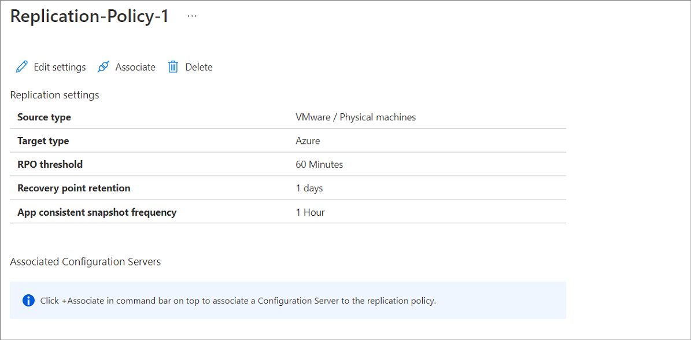
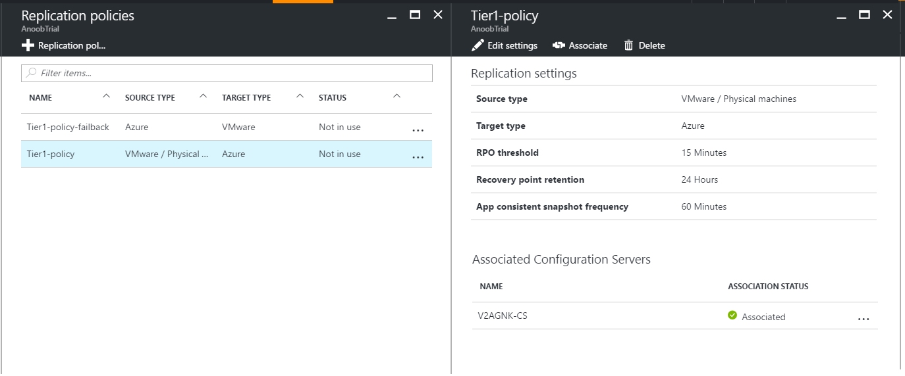

# Configure and manage replication policies for VMware disaster recovery

This article describes how to configure a replication policy when you're replicate VMware VMs to Azure, using [Azure Site Recovery](site-recovery-overview.md).

## Create a policy

1. Select **Manage** > **Site Recovery Infrastructure**.
2. In **For VMware and Physical machines**, select **Replication policies**.
3. Click **+Replication policy**, and specify the policy name.
4. In **RPO threshold**, specify the RPO limit. Alerts are generated when continuous replication exceeds this limit.
5. In **Recovery point retention**, specify (in hours) the duration of the retention window for each recovery point. Protected machines can be recovered to any point within a retention window. Up to 24 hours of retention is supported for machines replicated to premium storage. Up to 72 hours is supported for standard storage.
6. In **App-consistent snapshot frequency**, choose from the dropdown how often (in hours) recovery points that contain application-consistent snapshots should be created. If you wish to turn off generation of application consistency points, choose "Off" value in the dropdown.
7. Click **OK**. The policy should be created in 30 to 60 seconds.

When you create a replication policy, a matching failback replication policy is automatically created, with the suffix "failback". After creating the policy, you can edit it by selecting it > **Edit Settings**.

## Associate a configuration server

Associate the replication policy with your on-premises configuration server.

1. Click **Associate**, and select the configuration server.

    
2. Click **OK**. The configuration server should be associated in one to two minutes.

    

## Edit a policy

You can modify a replication policy after creating it.

- Changes in the policy are applied to all machines using the policy.
- If you want to associate replicated machines with a different replication policy, you need to disable and reenable protection for the relevant machines.

Edit a policy as follows:
1. Select **Manage** > **Site Recovery Infrastructure** > **Replication Policies**.
2. Select the replication policy you wish to modify.
3. Click **Edit settings**, and update the RPO threshold/recovery point retention hours/app-consistent snapshot frequency fields as required.
4. If you wish to turn off generation of application consistency points, choose "Off" value in the dropdown of the field **App-consistent snapshot frequency**.
5. Click **Save**. The policy should be updated in 30 to 60 seconds.

## Disassociate or delete a replication policy

1. Choose the replication policy.
    a. To dissociate the policy from the configuration server, make sure that no replicated machines are using the policy. Then, click **Dissociate**.
    b. To delete the policy, make sure it's not associated with a configuration server. Then, click **Delete**. It should take 30-60 seconds to delete.
2. Click **OK**.
