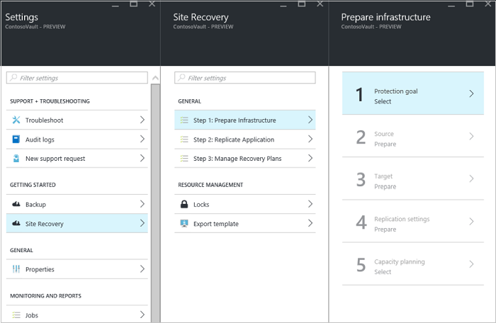

# Set up the source environment for VMware to Azure replication

This article describes how to set up your source on-premises environment, to replicate VMware VMs to Azure. It includes steps for selecting your replication scenario, setting up an on-premises machine as the Site Recovery configuration server, and automatically discovering on-premises VMs. 

## Prerequisites

The article assumes that you have already:
- [Set up resources](tutorial-prepare-azure.md) in the [Azure portal](http://portal.azure.com).
- [Set up on-premises VMware](vmware-azure-tutorial-prepare-on-premises.md), including a dedicated account for automatic discovery.

## Choose your protection goals

1. In the Azure portal, go to the **Recovery Services** vault blade and select your vault.
2. On the resource menu of the vault, go to **Getting Started** > **Site Recovery** > **Step 1: Prepare Infrastructure** > **Protection goal**.

    
3. In **Protection goal**, select **To Azure**, and choose **Yes, with VMware vSphere Hypervisor**. Then click **OK**.

    

## Set up the configuration server

You can set up the configuration server as an on-premises VMware VM through an Open Virtualization Application (OVA) template. [Learn more](concepts-vmware-to-azure-architecture.md) about the components that will be installed on the VMware VM.

1. Learn about the [prerequisites](vmware-azure-deploy-configuration-server.md#prerequisites) for configuration server deployment.
2. [Check capacity numbers](vmware-azure-deploy-configuration-server.md#capacity-planning) for deployment.
3. [Download](vmware-azure-deploy-configuration-server.md#download-the-template) and [import](vmware-azure-deploy-configuration-server.md#import-the-template-in-vmware) the OVA template to set up an on-premises VMware VM that runs the configuration server. The licence provided with the template is an evaluation licence and is valid for 180 days. Post this period, customer needs to activate the windows with a procured licence.
4. Turn on the VMware VM, and [register it](vmware-azure-deploy-configuration-server.md#register-the-configuration-server-with-azure-site-recovery-services) in the Recovery Services vault.

## Add the VMware account for automatic discovery

[!INCLUDE [site-recovery-add-vcenter-account](../../includes/site-recovery-add-vcenter-account.md)]

## Connect to the VMware server

To allow Azure Site Recovery to discover virtual machines running in your on-premises environment, you need to connect your VMware vCenter Server or vSphere ESXi hosts with Site Recovery.

Select **+vCenter** to start connecting a VMware vCenter server or a VMware vSphere ESXi host.

[!INCLUDE [site-recovery-add-vcenter](../../includes/site-recovery-add-vcenter.md)]

## Common issues
[!INCLUDE [site-recovery-vmware-to-azure-install-register-issues](../../includes/site-recovery-vmware-to-azure-install-register-issues.md)]

## Next steps
[Set up your target environment](./vmware-azure-set-up-target.md) in Azure.
