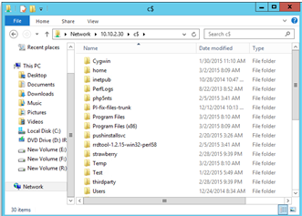

# Troubleshoot Mobility service push installation

The Mobility service installation is a key step to enable replication. The success of this step depends on meeting prerequisites and working with supported configurations. The most common failures you might face during the Mobility service installation are due to:

* [Credential/Privilege errors](#credentials-check-errorid-95107--95108)
* [Login failures](#login-failures-errorid-95519-95520-95521-95522)
* [Connectivity errors](#connectivity-failure-errorid-95117--97118)
* [File and printer sharing errors](#file-and-printer-sharing-services-check-errorid-95105--95106)
* [Windows Management Instrumentation (WMI) failures](#windows-management-instrumentation-wmi-configuration-check-error-code-95103)
* [Unsupported operating systems](#unsupported-operating-systems)
* [Unsupported boot configurations](#unsupported-boot-disk-configurations-errorid-95309-95310-95311)
* [Volume Shadow copy Service (VSS) installation failures](#vss-installation-failures)
* [Device name in GRUB configuration instead of device UUID](#enable-protection-failed-as-device-name-mentioned-in-the-grub-configuration-instead-of-uuid-errorid-95320)
* [Logical Volume Manager (LVM) volume](#lvm-support-from-920-version)
* [Reboot warnings](#install-mobility-service-completed-with-warning-to-reboot-errorid-95265--95266)

When you enable replication, Azure Site Recovery tries to install the Mobility service agent on your virtual machine (VM). As part of this process, the configuration server tries to connect with the virtual machine and copy the agent. To enable successful installation, follow the step-by-step troubleshooting guidance.

## Credentials check (ErrorID: 95107 & 95108)

Verify if the user account chosen during enable replication is valid and accurate. Azure Site Recovery requires the **root** account or user account with **administrator privileges** to perform a push installation. Otherwise, the push installation will be blocked on the source machine.

For Windows (**error 95107**), verify that the user account has administrative access on the source computer, with either a local account or domain account. If you aren't using a domain account, you need to disable Remote User Access control on the local computer.

* To manually add a registry key that disables Remote User Access control:

  * `HKEY_LOCAL_MACHINE\SOFTWARE\Microsoft\Windows\CurrentVersion\Policies\System`
  * Add a new `DWORD`: `LocalAccountTokenFilterPolicy`
  * Set the value to `1`

* To add the registry key, from a command prompt, run the following command:

  `REG ADD HKEY_LOCAL_MACHINE\SOFTWARE\Microsoft\Windows\CurrentVersion\Policies\System /v LocalAccountTokenFilterPolicy /t REG_DWORD /d 1`

For Linux (**error 95108**), you must choose the **root** account for successful installation of Mobility service agent. Additionally, SSH File Transfer Protocol (SFTP) services should be running. To enable the SFTP subsystem and password authentication in the _sshd_config_ file:

1. Sign in as **root**.
1. Go to _/etc/ssh/sshd_config file_, find the line that begins with `PasswordAuthentication`.
1. Uncomment the line, and change the value to `yes`.
1. Find the line that begins with `Subsystem`, and uncomment the line.
1. Restart the `sshd` service.

If you wish to modify the credentials of the chosen user account, follow [these instructions](vmware-azure-manage-configuration-server.md#modify-credentials-for-mobility-service-installation).

## Insufficient privileges failure (ErrorID: 95517)

When the user chosen to install the Mobility agent doesn't have administrator privileges, the configuration server/scale-out process server won't be allowed to copy the Mobility agent software to source machine. This error is a result of an access denied failure. Ensure that the user account has administrator privileges.

If you wish to modify the credentials of the chosen user account, follow [these instructions](vmware-azure-manage-configuration-server.md#modify-credentials-for-mobility-service-installation).

## Insufficient privileges failure (ErrorID: 95518)

When the domain trust relationship establishment between the primary domain and workstation fails while trying to sign in to the source machine, the Mobility agent installation fails with error ID 95518. Ensure that the user account used to install the Mobility agent has administrative privileges to sign in through primary domain of the source machine.

If you wish to modify the credentials of chosen user account, follow the [these instructions](vmware-azure-manage-configuration-server.md#modify-credentials-for-mobility-service-installation).

## Login failures (ErrorID: 95519, 95520, 95521, 95522)

This section describes credential and login error messages.

### Credentials of the user account have been disabled (ErrorID: 95519)

The user account chosen during enable replication was disabled. To enable the user account, refer to [this article](/powershell/module/Microsoft.PowerShell.LocalAccounts/Enable-LocalUser) or run the following command by replacing text _username_ with the actual user name.

`net user 'username' /active:yes`

### Credentials locked out because of multiple failed login attempts (ErrorID: 95520)

Multiple failed retry efforts to access a machine will lock the user account. The failure can be due to:

* Credentials provided during configuration setup are incorrect.
* The user account chosen during enable replication is wrong.

Modify the credentials chosen by following [these instructions](vmware-azure-manage-configuration-server.md#modify-credentials-for-mobility-service-installation) and retry the operation.

### Logon servers aren't available on the source machine (ErrorID: 95521)

This error occurs when the logon servers aren't available on the source machine. If logon servers aren't available, login requests will fail and the Mobility agent can't be installed. For a successful login, ensure that logon servers are available on the source machine and start the Netlogon service. For more information, see [Windows Logon Scenarios](/windows-server/security/windows-authentication/windows-logon-scenarios).

### Logon service isn't running on the source machine (ErrorID: 95522)

The login service isn't running on your source machine and caused failure of the login request. The Mobility agent can't be installed. To resolve the error, use one of the following methods to start the `Netlogon` service on the source machine:

* To start the `Netlogon` service from a command prompt, run the command `net start Netlogon`.
* From Task Manager, start the `Netlogon` service.

## Connectivity failure (ErrorID: 95117 & 97118)

Configuration server/scale-out process server tries to connect to the source VM to install the Mobility agent. This error occurs when the source machine isn't reachable because there are network connectivity issues.

To resolve the error:

* Verify that the user account has administrative access on the source computer, with either a local account or domain account. If you aren't using a domain account, you need to disable Remote User Access control on the local computer.
  * To manually add a registry key that disables Remote User Access control:
    * `HKEY_LOCAL_MACHINE\SOFTWARE\Microsoft\Windows\CurrentVersion\Policies\System`
    * Add a new `DWORD`: `LocalAccountTokenFilterPolicy`
    * Set the value to `1`
  * To add the registry key, from a command prompt, run the following command:

    `REG ADD HKEY_LOCAL_MACHINE\SOFTWARE\Microsoft\Windows\CurrentVersion\Policies\System /v LocalAccountTokenFilterPolicy /t REG_DWORD /d 1`

* Ensure you can ping your source machine from the configuration server. If you've chosen the scale-out process server during enable replication, ensure you can ping your source machine from the process server.

* Ensure that the File and Printer sharing service is enabled on your virtual machine. Check the steps [here](vmware-azure-troubleshoot-push-install.md#file-and-printer-sharing-services-check-errorid-95105--95106).

* Ensure that WMI service is enabled on your virtual machine. Check the steps [here](vmware-azure-troubleshoot-push-install.md#windows-management-instrumentation-wmi-configuration-check-error-code-95103).

* Ensure that the network shared folders on your virtual machine, are accessible from the process server. Check the steps [here](vmware-azure-troubleshoot-push-install.md#check-access-for-network-shared-folders-on-source-machine-errorid-9510595523).

* From the configuration server or scale-out process server command line, use `Telnet` to ping the source VM on port 135 as shown in the following command. This command checks if there are any network connectivity issues or firewall port blocking issues.

  `telnet <Source IP address> <135>`

* Additionally, for a Linux VM:
  * Check if latest OpenSSH, OpenSSH Server, and OpenSSL packages are installed.
  * Check and ensure that Secure Shell (SSH) is enabled and is running on port 22.
  * SFTP services should be running. To enable SFTP subsystem and password authentication in the _sshd_config_ file:

    1. Sign in as **root**.
    1. Go to _/etc/ssh/sshd_config_ file, find the line that begins with `PasswordAuthentication`.
    1. Uncomment the line, and change the value to `yes`.
    1. Find the line that begins with `Subsystem`, and uncomment the line
    1. Restart the `sshd` service.

* A connection attempt could have failed if there are no proper responses after a period of time, or an established connection failed because a connected host failed to respond.
* It may be a connectivity/network/domain related issue. It could also be because DNS name resolving issue or TCP port exhaustion issue. Check if there are any such known issues in your domain.

## Connectivity failure (ErrorID: 95523)

This error occurs when the network that the source machine resides isn't found, might have been deleted, or is no longer available. The only way to resolve the error is to ensure that the network exists.

## Check access for network shared folders on source machine (ErrorID: 95105,95523)

Verify if the network shared folders on your virtual machine, are accessible from Process Server (PS) remotely using specified credentials. To confirm access: 

1. Log in to your Process Server machine.
2. Open File Explorer. In the address bar, type `\\<SOURCE-MACHINE-IP>\C$` and click Enter.

    

3. File explorer will prompt for credentials. Enter the username and password and click OK. <br><br/>

    

    >[!NOTE]
    > If source machine is domain joined, provide the domain name along with user name as `<domainName>\<username>`. If source machine is in work group, provide only the user name.

4. If connection is successful, the folders of source machine will be visible remotely from Process Server.

    

If connection is unsuccessful, please check whether all pre-requisites are met.

## File and Printer sharing services check (ErrorID: 95105 & 95106)

After a connectivity check, verify if the File and Printer sharing service is enabled on your virtual machine. These settings are required to copy the Mobility agent to the source machine.

For **Windows 2008 R2 and prior versions**:

* To enable file and print sharing through Windows Firewall,
  1. Open **Control Panel** > **System and Security** > **Windows Firewall**. In the left pane, select **Advanced settings** > **Inbound Rules** in console tree.
  1. Locate rules File and Printer Sharing (NB-Session-In) and File and Printer Sharing (SMB-In).
  1. For each rule, right-click the rule, and then click **Enable Rule**.

* To enable file sharing with Group Policy:
  1. Go to **Start**, type `gpmc.msc` and search.
  1. In the navigation pane, open the following folders: **Local Computer Policy** > **User Configuration** > **Administrative Templates** > **Windows Components** > **Network Sharing**.
  1. In the details pane, double-click **Prevent users from sharing files within their profile**.

     To disable the Group Policy setting, and enable the user's ability to share files, select **Disabled**.

  1. Select **OK** to save your changes.

  To learn more, see [Enable or disable File Sharing with Group Policy](/previous-versions/windows/it-pro/windows-server-2008-R2-and-2008/cc754359(v=ws.10)).

To enable file and printer sharing for later versions of Windows or Linux, follow the instructions in [Install the Mobility service for disaster recovery of VMware VMs and physical servers](vmware-azure-install-mobility-service.md) .

## Windows Management Instrumentation (WMI) configuration check (Error code: 95103)

After file and printer services check, enable the WMI service for private, public, and domain profiles through the firewall. These settings are required to complete remote execution on the source machine.

To enable WMI:

1. Go to **Control Panel** > **Security** and select **Windows Firewall**.
1. Select **Change Settings** and then select the **Exceptions** tab.
1. In the **Exceptions** window, select the check box for Windows Management Instrumentation (WMI) to enable WMI traffic through the firewall.

You can also enable WMI traffic through the firewall from the command prompt with the following command:

`netsh advfirewall firewall set rule group="windows management instrumentation (wmi)" new enable=yes`

Other WMI troubleshooting articles could be found at the following articles.

* [Basic WMI testing](https://techcommunity.microsoft.com/t5/ask-the-performance-team/bg-p/AskPerf)
* [WMI troubleshooting](/windows/win32/wmisdk/wmi-troubleshooting)
* [Troubleshooting problems with WMI scripts and WMI services](/previous-versions/tn-archive/ff406382(v=msdn.10))

## Unsupported operating systems

Another common reason for failure could be because of an unsupported operating system. Use a supported operating system and kernel version for a successful installation of the Mobility service. Avoid the use of private patches.

To view the list of operating systems and kernel versions supported by Azure Site Recovery, see the [support matrix document](vmware-physical-azure-support-matrix.md#replicated-machines).

## Unsupported boot disk configurations (ErrorID: 95309, 95310, 95311)

### Boot and system partitions / volumes aren't the same disk (ErrorID: 95309)

Before the 9.20 version, boot and system partitions/volumes on different disks were an unsupported configuration. Beginning with the [9.20 version](https://support.microsoft.com/help/4478871/update-rollup-31-for-azure-site-recovery), this configuration is supported.

### The boot disk isn't available (ErrorID: 95310)

A virtual machine without a boot disk can't be protected. A boot disk ensures a smooth recovery of a virtual machine during a failover operation. Absence of a boot disk results in a failure to boot the machine after failover. Ensure that the virtual machine contains a boot disk and retry the operation. Also, multiple boot disks on the same machine aren't supported.

### Multiple Boot disks present on the source machine (ErrorID: 95311)

A virtual machine with multiple boot disks isn't a [supported configuration](vmware-physical-azure-support-matrix.md#linux-file-systemsguest-storage).

## System partition on multiple disks (ErrorID: 95313)

Before the 9.20 version, a root partition or volume setup on multiple disks was an unsupported configuration. Beginning with the [9.20 version](https://support.microsoft.com/help/4478871/update-rollup-31-for-azure-site-recovery), this configuration is supported.

## Enable protection failed as device name mentioned in the GRUB configuration instead of UUID (ErrorID: 95320)

### Possible Cause

The Grand Unified Bootloader (GRUB) configuration files (_/boot/grub/menu.lst_, _/boot/grub/grub.cfg_, _/boot/grub2/grub.cfg_, or _/etc/default/grub_) may contain the value for the parameters **root** and **resume** as the actual device names instead of a universally unique identifier (UUID). Site Recovery mandates the UUID approach as the device names may change across reboot of the VM. For example, the VM may not come online with the same name on failover and that results in issues.

For example:

- The following line is from the GRUB file _/boot/grub2/grub.cfg_:

  `linux /boot/vmlinuz-3.12.49-11-default root=/dev/sda2  ${extra_cmdline} resume=/dev/sda1 splash=silent quiet showopts`

- The following line is from the GRUB file _/boot/grub/menu.lst_:

  `kernel /boot/vmlinuz-3.0.101-63-default root=/dev/sda2 resume=/dev/sda1 splash=silent crashkernel=256M-:128M showopts vga=0x314`

> [!NOTE]
> The GRUB lines contain actual device names for the parameters **root** and **resume** rather than the UUID.

### How to Fix

The device names should be replaced with the corresponding UUID.

1. Find the UUID of the device by executing the command `blkid \<device name>`.

   For example:

   ```shell
   blkid /dev/sda1
   /dev/sda1: UUID="6f614b44-433b-431b-9ca1-4dd2f6f74f6b" TYPE="swap"
   blkid /dev/sda2
   /dev/sda2: UUID="62927e85-f7ba-40bc-9993-cc1feeb191e4" TYPE="ext3"
   ```

1. Now replace the device name with its UUID in the format like `root=UUID=\<UUID>`. For example, if we replace the device names with UUID for root and resume parameter mentioned in the files _/boot/grub2/grub.cfg_, _/boot/grub2/grub.cfg_, or _/etc/default/grub_ then the lines in the files look like the following line:

   `kernel /boot/vmlinuz-3.0.101-63-default root=UUID=62927e85-f7ba-40bc-9993-cc1feeb191e4 resume=UUID=6f614b44-433b-431b-9ca1-4dd2f6f74f6b splash=silent crashkernel=256M-:128M showopts vga=0x314`

1. Restart the protection.

## Install Mobility service completed with warning to reboot (ErrorID: 95265 & 95266)

Site Recovery Mobility service has many components, one of which is called filter driver. The filter driver is loaded into system memory only during a system reboot. Filter driver fixes can only be realized when a new filter driver is loaded at the time of a system reboot.

> [!IMPORTANT]
> This is a warning and existing replication will work even after the new agent update. You can choose to reboot anytime you want to get the benefits of new filter driver but if you don't reboot, the old filter driver keeps on working. So, after an update without a reboot, except for the filter driver, **benefits of other enhancements and fixes in Mobility service get realized**. Although recommended, it isn't mandatory to reboot after every upgrade. For information about when a reboot is mandatory, set the [Reboot after Mobility service upgrade](service-updates-how-to.md#reboot-after-mobility-service-upgrade) section in Service updates in Azure Site Recovery.

> [!TIP]
>For best practices on scheduling upgrades during your maintenance window, see the [Support for latest operating system/kernel](service-updates-how-to.md#support-for-latest-operating-systemskernels) in Service updates in Azure Site Recovery.

## LVM support from 9.20 version

Before the 9.20 version, Logical Volume Manager (LVM) was supported for data disks only. The `/boot` partition should be on a disk partition and not an LVM volume.

Beginning with the [9.20 version](https://support.microsoft.com/help/4478871/update-rollup-31-for-azure-site-recovery), the [OS disk on LVM](vmware-physical-azure-support-matrix.md#linux-file-systemsguest-storage) is supported.

## Insufficient space (ErrorID: 95524)

When the Mobility agent is copied to the source machine, at least 100 MB free space is required. Ensure that your source machine has the required amount of free space and retry the operation.

## Low system resources

The possible Error IDs seen for this issue are 95572 and 95573. This issue occurs when the system has low available memory, and is not able to allocate memory for mobility service installation. Ensure that enough memory has been freed up for the installation to proceed and complete successfully.

## VSS Installation failures

The Volume Shadow copy Service (VSS) installation is a part of Mobility agent installation. This service is used in the process to generate application consistent recovery points. Failures during VSS installation can occur due to multiple reasons. To identify the exact errors, refer to _C:\ProgramData\ASRSetupLogs\ASRUnifiedAgentInstaller.log_. Some of the common errors and the resolution steps are highlighted in the following section.

### VSS error -2147023170 [0x800706BE] - exit code 511

This issue is most often seen when antivirus software is blocking the operations of Azure Site Recovery services.

To resolve this issue:

1. Review the list of [folder exclusions from Antivirus program](vmware-azure-set-up-source.md#azure-site-recovery-folder-exclusions-from-antivirus-program).
1. Follow the guidelines published by your antivirus provider to unblock the registration of DLL in Windows.

### VSS error 7 [0x7] - exit code 511

This error is a runtime error that's caused because there's insufficient memory to install VSS. Increase the disk space for successful completion of this operation.

### VSS error -2147023824 [0x80070430] - exit code 517

This error occurs when Azure Site Recovery VSS Provider service is [marked for deletion](/previous-versions/ms838153(v=msdn.10)). Try to install VSS manually on the source machine by running the following command:

`"C:\Program Files (x86)\Microsoft Azure Site Recovery\agent\InMageVSSProvider_Install.cmd"`

### VSS error -2147023841 [0x8007041F] - exit code 512

This error occurs when Azure Site Recovery VSS Provider service database is [locked](/previous-versions/ms833798(v=msdn.10)).Try to install VSS manually on the source machine by running the following command from a command prompt:

`"C:\Program Files (x86)\Microsoft Azure Site Recovery\agent\InMageVSSProvider_Install.cmd"`

When there's a failure, check if any antivirus program or other services are stuck in a **Starting** state. A process in a **Starting** state can retain the lock on database services. It will lead to failures in installing VSS provider. Ensure that no service is in a **Starting** state and then retry the above operation.

### VSS exit code 806

This error occurs when the user account used for installation doesn't have permissions to execute the `CSScript` command. Provide necessary permissions to the user account to execute the script and retry the operation.

### Other VSS errors

Try to install VSS provider service manually on the source machine by running the following command from a command prompt:

`"C:\Program Files (x86)\Microsoft Azure Site Recovery\agent\InMageVSSProvider_Install.cmd"`

## VSS error - 0x8004E00F

This error typically occurs during the installation of the Mobility agent because of issues in `DCOM` and `DCOM` is in a critical state.

Use the following procedure to determine the cause of the error.

### Examine the installation logs

1. Open the installation log located at _C:\ProgramData\ASRSetupLogs\ASRUnifiedAgentInstaller.log_.
2. The presence of the following error indicates this issue:

    ```Output
    Unregistering the existing application...
    Create the catalogue object
    Get the collection of Applications

    ERROR:

    - Error code: -2147164145 [0x8004E00F]
    - Exit code: 802
    ```

To resolve the issue:

Contact the [Microsoft Windows platform team](https://aka.ms/Windows_Support) to obtain assistance with resolving the DCOM issue.

When the DCOM issue is resolved, reinstall the Azure Site Recovery VSS Provider manually using the following command from a command prompt:

`"C:\Program Files (x86)\Microsoft Azure Site Recovery\agent\InMageVSSProvider_Install.cmd"`

If application consistency isn't critical for your disaster recovery requirements, you can bypass the VSS Provider installation.

To bypass the Azure Site Recovery VSS Provider installation and manually install Azure Site Recovery VSS Provider post installation:

1. Install the Mobility service. The Installation will fail at the step: **Post install configuration**.
1. To bypass the VSS installation:
   1. Open the Azure Site Recovery Mobility Service installation directory located at:

      _C:\Program Files (x86)\Microsoft Azure Site Recovery\agent_

   1. Modify the Azure Site Recovery VSS Provider installation scripts _InMageVSSProvider_Install_ and _InMageVSSProvider_Uninstall.cmd_ to always succeed by adding the following lines:

      ```plaintext
      rem @echo off
      setlocal
      exit /B 0
      ```

1. Do a manual installation of the Mobility Agent.
1. When the installation succeeds and moves to the next step, **Configure**, remove the lines you added.
1. To install the VSS provider, open a command prompt as administrator and run the following command:

   `"C:\Program Files (x86)\Microsoft Azure Site Recovery\agent\InMageVSSProvider_Install.cmd"`

1. Verify that the Azure Site Recovery VSS Provider is installed as a service in Windows Services. Open the Component Service MMC to confirm that the VSS Provider is listed.
1. If the VSS Provider install continues to fail, work with technical support to resolve the permissions errors in Cryptographic Application Programming Interface (CAPI2).

## VSS Provider installation fails because the cluster service being enabled on non-cluster machine

This issue causes the Azure Site Recovery Mobility Agent installation to fail during the Azure Site Recovery VSS Provider installation. The failure is because there's an issue with `COM+` that prevents the VSS provider installation.

### To identify the issue

In the log located on configuration server at _C:\ProgramData\ASRSetupLogs\UploadedLogs\<date-time>UA_InstallLogFile.log_ you'll find the following exception:

```plaintext
COM+ was unable to talk to the Microsoft Distributed Transaction Coordinator (Exception from HRESULT: 0x8004E00F)
```

To resolve the issue:

1. Verify that this machine is a non-cluster machine and that the cluster components aren't being used.
1. If the components aren't being used, remove the cluster components from the machine.

## Drivers are missing on the source server

If the Mobility Agent installation fails, examine the logs under _C:\ProgramData\ASRSetupLogs_ to determine if some of the required drivers are missing in some control sets.

To resolve the issue:

1. Using a registry editor such as `regedit.msc`, open the registry.
1. Open the `HKEY_LOCAL_MACHINE\SYSTEM` node.
1. In the `SYSTEM` node, locate the control sets.
1. Open each control set and verify that following Windows drivers are present:

   * Atapi
   * Vmbus
   * Storflt
   * Storvsc
   * Intelide

1. Reinstall any missing drivers.

## Next steps

[Learn more](vmware-azure-tutorial.md) about how to set up disaster recovery for VMware VMs.
