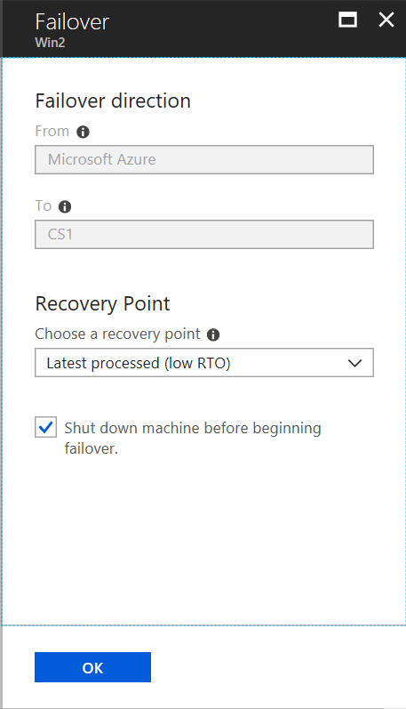

# Fail over and fail back VMware VMs and physical servers replicated to Azure

This tutorial describes how to fail over a VMware VM to Azure. After you've failed over, you fail
back to your on-premises site when it's available. In this tutorial, you learn how to:

> [!div class="checklist"]
> * Verify the VMware VM properties to check conform with Azure requirements
> * Run a failover to Azure
> * Create a process server and master target server for failback
> * Reprotect Azure VMs to the on-premises site
> * Fail over from Azure to on-premises
> * Reprotect on-premises VMs, to start replicating to Azure again

>[!NOTE]
>Tutorials are designed to show you the simplest deployment path for a scenario. They use default options where possible, and don't show all possible settings and paths. If you want to learn about the test failover steps in detail, read the [How-to Guide](site-recovery-failover.md).

This is the fifth tutorial in a series. This tutorial assumes that you have already completed the
tasks in the previous tutorials.

1. [Prepare Azure](tutorial-prepare-azure.md)
2. [Prepare on-premises VMware](vmware-azure-tutorial-prepare-on-premises.md)
3. [Set up disaster recovery](vmware-azure-tutorial.md)
4. [Run a disaster recovery drill](tutorial-dr-drill-azure.md)
5. In addition to the above steps, it is helpful to [review the architecture](vmware-azure-architecture.md) for the disaster recovery scenario.

## Failover and failback

Failover and failback have four stages:

1. **Fail over to Azure**: Fail machines over from the on-premises site to Azure.
2. **Reprotect Azure VMs**: Reprotect the Azure VMs, so that they start replicating back to the
   on-premises VMware VMs. The on-premises VM is turned off during reprotection. This helps ensure data consistency during replication.
3. **Fail over to on-premises**: Run a failover, to fail back from Azure.
4. **Reprotect on-premises VMs**: After data has failed back, reprotect the on-premises VMs that
   you failed back to, so that they start replicating to Azure.

## Verify VM properties

Verify the VM properties, and make sure that the VM complies with [Azure requirements](vmware-physical-azure-support-matrix.md#replicated-machines).

1. In **Protected Items**, click **Replicated Items** > VM.

2. In the **Replicated item** pane, there's a summary of VM information, health status, and the
   latest available recovery points. Click **Properties** to view more details.

3. In **Compute and Network**, you can modify the Azure name, resource group, target size,
   [availability set](../virtual-machines/windows/tutorial-availability-sets.md), and
   [managed disk settings](#managed-disk-considerations)

4. You can view and modify network settings, including the network/subnet in which the Azure VM
   will be located after failover, and the IP address that will be assigned to it.

5. In **Disks**, you can see information about the operating system and data disks on the VM.

## Run a failover to Azure

1. In **Settings** > **Replicated items**, click the VM > **Failover**.

2. In **Failover**, select a **Recovery Point** to fail over to. You can use one of the following options:
   - **Latest**: This option first processes all the data sent to Site Recovery. It
     provides the lowest RPO (Recovery Point Objective) because the Azure VM created after failover
     has all the data that was replicated to Site Recovery when the failover was triggered.
   - **Latest processed**: This option fails over the VM to the latest recovery point processed by
     Site Recovery. This option provides a low RTO (Recovery Time Objective), because no time is
     spent processing unprocessed data.
   - **Latest app-consistent**: This option fails over the VM to the latest app-consistent recovery
     point processed by Site Recovery.
   - **Custom**: Specify a recovery point.

3. Select **Shut down machine before beginning failover** to attempt to do a shutdown of source
   virtual machines before triggering the failover. Failover continues even if shutdown fails. You
   can follow the failover progress on the **Jobs** page.

In some scenarios, failover requires additional processing that takes around eight to ten minutes to complete. You might notice **longer test failover times** for VMware virtual machines using mobility service of version older than 9.8, physical servers, VMware Linux virtual machines, Hyper-V virtual machines protected as physical servers, VMware VMs that don't have the DHCP service enabled, and VMware VMs that don't have the following boot drivers: storvsc, vmbus, storflt, intelide, atapi.

> [!WARNING]
> **Don't cancel a failover in progress**: Before failover is started, VM replication is stopped.
> If you cancel a failover in progress, failover stops, but the VM won't replicate again.

## Connect to failed over virtual machine in Azure

1. If you want to connect to Azure VMs using RDP/SSH after failover, follow the requirements summarized in the table [here](site-recovery-test-failover-to-azure.md#prepare-to-connect-to-azure-vms-after-failover).
2. After failover, go to the virtual machine and validate by [connecting](../virtual-machines/windows/connect-logon.md) to it.
3. Post validation, click on **Commit** to finalize the recovery point of the virtual machine after failover. Post commit, all the other available recovery points are deleted. This completes the failover activity.

>[!TIP]
> **Change recovery point** helps you in choosing a different recovery point after failover if you are not satisfied with the failed over virtual machine. After **commit**, this option will no longer be available.

Follow the steps described [here](site-recovery-failover-to-azure-troubleshoot.md) to troubleshoot any connectivity issues post failover.

## Preparing for reprotection of Azure VM

### Create a process server in Azure

The process server receives data from the Azure VM, and sends it to the on-premises site. A low-latency network is required between the process server and the protected VM.

- For test purposes, if you have an Azure ExpressRoute connection, you can use the on-premises process server (in-built process server) that's automatically installed on the configuration server.
- If you have a VPN connection, or you're running failback in a production environment, you must set up an Azure VM as an Azure-based process server for failback.
- To set up a process server in Azure, follow the instructions in [this article](vmware-azure-set-up-process-server-azure.md).

### Configure the master target server

A master target server receives and handles replication data during failback from Azure. By default, it is available on the on-premises configuration server. In this tutorial, let's use the default master target server.

>[!NOTE]
>Protecting a Linux based virtual machine requires creation of a separate Master Target Server. [Click here](vmware-azure-install-linux-master-target.md) to learn more.

If the VM is on an **ESXi host that's managed by a vCenter** server, the master target server must have
access to the VM's datastore (VMDK), to write replicated data to the VM disks. Make sure that the
VM datastore is mounted on the master target's host, with read/write access.

If the VM is on an **ESXi that isn't managed by a vCenter server**, Site Recovery service creates a new
VM during reprotection. The VM is created on the ESX host on which you create the master target.
The hard disk of the VM must be in a datastore that's accessible by the host on which the
master target server is running.

If the VM **doesn't use vCenter**, you should complete discovery of the host on which the master target
server is running, before you can reprotect the machine. This is true for failing back physical
servers too. Another option, if the on-premises VM exists, is to delete it before you do a
failback. Failback then creates a new VM on the same host as the master target ESX host. When you
fail back to an alternate location, the data is recovered to the same datastore and the same ESX
host as that used by the on-premises master target server.

You can't use Storage vMotion on the master target server. If you do, failback won't work, because
the disks aren't available to it. Exclude the master target servers from your vMotion list.

>[!Warning]
>If you use a different master target server to reprotect a replication group, the server cannot provide a common point in time.

## Reprotect Azure VMs

Reprotecting Azure VM leads to replication of data on to on-premises VM. This is a mandatory step before performing failover from Azure to on-premises VM. Follow the below given instructions to execute reprotection.

1. In **Settings** > **Replicated items**, right-click the VM that was failed over > **Re-Protect**.
2. In **Re-protect**, verify that **Azure to On-premises**, is selected.
3. Specify the on-premises master target server, and the process server.
4. In **Datastore**, select the master target datastore to which you want to recover the disks on-premises. If the VM has been deleted, new disks are created on this datastore. This setting is ignored if the disks already exist, but you do need to specify a value.
5. Select the master target retention drive. The failback policy is automatically selected.
6. Click **OK** to begin reprotection. A job begins to replicate the virtual machine from Azure to the on-premises site. You can track the progress on the **Jobs** tab.
7. After the status of VM on **Replicated items** changes to **Protected**, the machine is ready for failover to on-premises.

> [!NOTE]
> Azure VM can be recovered to an existing on-premises VM or an alternate location. Read [this article](concepts-types-of-failback.md) to learn more.

## Run a failover from Azure to on-premises

To replicate back to on-premises, a failback policy is used. This policy is automatically created when you created a replication policy for replication to Azure:

- The policy is automatically associated with the configuration server.
- The policy can't be modified.
- The policy values are:
    - RPO threshold = 15 minutes
    - Recovery point retention = 24 hours
    - App-consistent snapshot frequency = 60 minutes

Run the failover as follows:

1. On the **Replicated Items** page, right-click the machine > **Failover**.
2. In **Confirm Failover**, verify that the failover direction is from Azure.
    
3. Select the recovery point that you want to use for the failover. An app-consistent recovery point occurs before the most recent point in time, and it will cause some data loss.

    >[!WARNING]
    >When failover runs, Site Recovery shuts down the Azure VMs, and boots up the on-premises VM. There will be some downtime, so choose an appropriate time.

4. The progress of the job can be tracked on **Recovery Services Vault** > **Monitoring and Reports** > **Site Recovery Jobs**.
5. After completion of failover, right-click the virtual machine, and click **Commit**. This triggers a job that removes the Azure VMs.
6. Verify that Azure VMs have been shut down as expected.

## Reprotect on-premises machines to Azure

Data should now be back on your on-premises site, but it isn't replicating to Azure. You can start
replicating to Azure again as follows:

1. In the vault > **Protected items** >**Replicated Items**, select the failed back VM, and click **Re-Protect**.
2. Select the process server that is to be used to send the replicated data to Azure, and click **OK**.

After the reprotection finishes, the VM replicates back to Azure, and you can run a failover as required.
