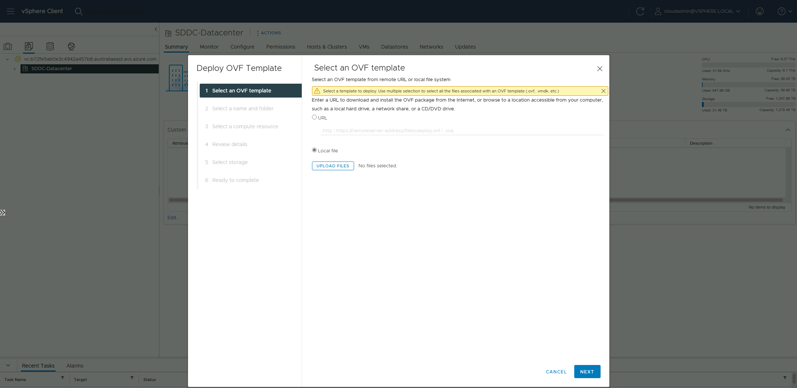
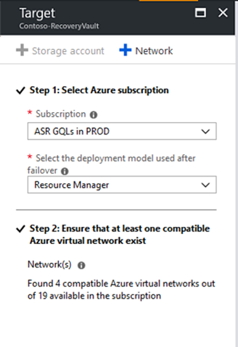

# Set up disaster recovery to Azure for on-premises VMware VMs - Classic

This article describes how to enable replication for on-premises VMware VMs, for disaster recovery to Azure using the [Azure Site Recovery](site-recovery-overview.md) service - Classic.

For information about disaster recovery in Azure Site Recovery Modernized, see [this article](vmware-azure-set-up-replication-tutorial-modernized.md)

This is the third tutorial in a series that shows how to set up disaster recovery to Azure for on-premises VMware VMs. In the previous tutorial, we [prepared the on-premises VMware environment](vmware-azure-tutorial-prepare-on-premises.md) for disaster recovery to Azure.

In this tutorial, you learn how to:

> [!div class="checklist"]
> * Set up the source replication settings, and an on-premises Site Recovery configuration server.
> * Set up the replication target settings.
> * Create a replication policy.
> * Enable replication for a VMware VM.

> [!NOTE]
> Tutorials show you the simplest deployment path for a scenario. They use default options where possible, and don't show all possible settings and paths. For detailed instructions, review the article in the How To section of the Site Recovery Table of Contents.

## Before you start

Complete the previous tutorials:
1. Make sure you've [set up Azure](tutorial-prepare-azure.md) for on-premises VMware disaster recovery to Azure.
2. Follow [these steps](vmware-azure-tutorial-prepare-on-premises.md) to prepare your on-premises VMware deployment for disaster recovery to Azure.
3. In this tutorial, we show you how to replicate a single VM. If you're deploying multiple VMware VMs, you should use the [Deployment Planner Tool](https://aka.ms/asr-deployment-planner). [Learn more](site-recovery-deployment-planner.md) about this tool.
4. This tutorial uses a number of options you might want to do differently:
    - The tutorial uses an OVA template to create the configuration server VMware VM. If you can't do this for some reason, follow [these instructions](physical-manage-configuration-server.md) to set up the configuration server manually.
    - In this tutorial, Site Recovery automatically downloads and installs MySQL to the configuration server. If you prefer, you can set it up manually instead. [Learn more](vmware-azure-deploy-configuration-server.md#configure-settings).

## Select a protection goal

1. In **Recovery Services vaults**, select the vault name. We're using **ContosoVMVault** for this scenario.
2. In **Getting Started**, select Site Recovery. Then, select **Prepare Infrastructure**.
3. In **Protection goal** > **Where are your machines located**, select **On-premises**.
4. In **Where do you want to replicate your machines**, select **To Azure**.
5. In **Are your machines virtualized**, select **Yes, with VMware vSphere Hypervisor**. Then, select **OK**.

## Set up the source environment

In your source environment, you need a single, highly available, on-premises machine to host these on-premises Site Recovery components:

- **Configuration server**: The configuration server coordinates communications between on-premises and Azure, and manages data replication.
- **Process server**: The process server acts as a replication gateway. It receives replication data; optimizes it with caching, compression, and encryption, and sends it to a cache storage account in Azure. The process server also installs the Mobility Service agent on VMs you want to replicate, and performs automatic discovery of on-premises VMware VMs.
- **Master target server**: The master target server handles replication data during failback from Azure.

All of these components are installed together on the single on-premises machines that's known as the *configuration server*. By default, for VMware disaster recovery, we set up the configuration server as a highly available VMware VM. To do this, you download a prepared Open Virtualization Application (OVA) template, and import the template into VMware to create the VM.

- The latest version of the configuration server is available in the portal. You can also download it directly from the [Microsoft Download Center](https://aka.ms/asrconfigurationserver).
- If for some reason you can't use an OVA template to set up a VM, follow [these instructions](physical-manage-configuration-server.md) to set up the configuration server manually.
- The license provided with OVF template is an evaluation license valid for 180 days. Windows running on the VM must be activated with the required license.

### Download the VM template

1. In the vault, go to **Prepare Infrastructure** > **Source**.
2. In **Prepare source**, select **+Configuration server**.
3. In **Add Server**, check that **Configuration server for VMware** appears in **Server type**.
4. Download the OVA template for the configuration server.

## Import the template in VMware

1. Sign in to the VMware vCenter server or vSphere ESXi host with the VMware vSphere Client.
2. On the **File** menu, select **Deploy OVF Template** to start the **Deploy OVF Template Wizard**.

     

3. On **Select source**, enter the location of the downloaded OVF.
4. On **Review details**, select **Next**.
5. On **Select name and folder** and **Select configuration**, accept the default settings.
6. On **Select storage**, for best performance select **Thick Provision Eager Zeroed** in **Select virtual disk format**.
7. On the rest of the wizard pages, accept the default settings.
8. On **Ready to complete**, to set up the VM with the default settings, select **Power on after deployment** > **Finish**.

   > [!TIP]
   > If you want to add an additional NIC, clear **Power on after deployment** > **Finish**. By default, the template contains a single NIC. You can add additional NICs after deployment.

## Add an additional adapter

If you want to add an additional NIC to the configuration server, add it before you register the server in the vault. Adding additional adapters isn't supported after registration.

1. In the vSphere Client inventory, right-click the VM and select **Edit Settings**.
2. In **Hardware**, select **Add** > **Ethernet Adapter**. Then select **Next**.
3. Select an adapter type and a network.
4. To connect the virtual NIC when the VM is turned on, select **Connect at power on**. Select **Next** > **Finish**. Then select **OK**.

## Register the configuration server

After the configuration server is set up, you register it in the vault.

1. From the VMware vSphere Client console, turn on the VM.
2. The VM boots up into a Windows Server 2016 installation experience. Accept the license agreement, and enter an administrator password.
3. After the installation finishes, sign in to the VM as the administrator.
4. The first time you sign in, the Azure Site Recovery Configuration Tool starts within a few seconds.
5. Enter a name that's used to register the configuration server with Site Recovery. Then select **Next**.
6. The tool checks that the VM can connect to Azure. After the connection is established, select **Sign in** to sign in to your Azure subscription. The credentials must have access to the vault in which you want to register the configuration server. Ensure that necessary [roles](vmware-azure-deploy-configuration-server.md#azure-active-directory-permission-requirements) are assigned to this user.
7. The tool performs some configuration tasks and then reboots.
8. Sign in to the machine again. In a few seconds, the Configuration Server Management Wizard starts automatically.

### Configure settings and add the VMware server

Finish setting up and registering the configuration server. Before proceeding, ensure all [pre-requisites](vmware-azure-deploy-configuration-server.md#prerequisites) are met for successful set up of configuration server.

1. In the configuration server management wizard, select **Setup connectivity**. From the dropdowns, first select the NIC that the in-built process server uses for discovery and push installation of mobility service on source machines, and then select the NIC that Configuration Server uses for connectivity with Azure. Then select **Save**. You cannot change this setting after it's configured.
2. In **Select Recovery Services vault**, select your Azure subscription and the relevant resource group and vault.
3. In **Install third-party software**, accept the license agreement. Select **Download and Install** to install MySQL Server. If you placed MySQL in the path, this step can be skipped. Learn [more](vmware-azure-deploy-configuration-server.md#configure-settings)
4. In **Validate appliance configuration**, prerequisites are verified before you continue.
5. In **Configure vCenter Server/vSphere ESXi server**, enter the FQDN or IP address of the vCenter server, or vSphere host, where the VMs you want to replicate are located. Enter the port on which the server is listening. Enter a friendly name to be used for the VMware server in the vault.
6. Enter user credentials to be used by the configuration server to connect to the VMware server. Ensure that the user name and password are correct and is a part of the Administrators group of the virtual machine to be protected. Site Recovery uses these credentials to automatically discover VMware VMs that are available for replication. Select **Add**, and then select **Continue**.
7. In **Configure virtual machine credentials**, enter the user name and password that will be used to automatically install Mobility Service on VMs when replication is enabled.
    - For Windows machines, the account needs local administrator privileges on the machines you want to replicate.
    - For Linux, provide details for the root account.
8. Select **Finalize configuration** to complete registration.
9. After registration finishes, open the Azure portal and verify that the configuration server and VMware server are listed on **Recovery Services Vault** > **Manage** > **Site Recovery Infrastructure** > **Configuration Servers**.

After the configuration server is registered, Site Recovery connects to VMware servers by using the specified settings, and discovers VMs.

> [!NOTE]
> It can take 15 minutes or more for the account name to appear in the portal. To update
> immediately, select **Configuration Servers** > ***server name*** > **Refresh Server**.

## Set up the target environment

Select and verify target resources.

1. Select **Prepare infrastructure** > **Target**. Select the Azure subscription you want to use. We're using a Resource Manager model.
2. Site Recovery checks that you have one or more virtual networks. You should have these when you set up the Azure components in the [first tutorial](tutorial-prepare-azure.md) in this tutorial series.

   

## Create a replication policy

1. Open the [Azure portal](https://portal.azure.com). Search for and select **Recovery Services vaults**.
2. Select the Recovery Services vault (**ContosoVMVault** in this tutorial).
3. To create a replication policy, select **Site Recovery infrastructure** > **Replication Policies** > **+Replication Policy**.
4. In **Create replication policy**, enter the policy name. We're using **VMwareRepPolicy**.
5. In **RPO threshold**, use the default of 60 minutes. This value defines how often recovery points are created. An alert is generated if continuous replication exceeds this limit.
6. In **Recovery point retention**, specify how longer each recovery point is retained. For this tutorial we're using 72 hours. Replicated VMs can be recovered to any point in a retention window.
7. In **App-consistent snapshot frequency**, specify how often app-consistent snapshots are created. We're using the default of 60 minutes. Select **OK** to create the policy.

   

- The policy is automatically associated with the configuration server.
- A matching policy is automatically created for failback by default. For example, if the replication policy is **rep-policy**, then the failback policy is **rep-policy-failback**. This policy isn't used until you initiate a failback from Azure.

> [!Note]
> In VMware-to-Azure scenario the crash-consistent snapshot is taken at 5 min interval.

## Enable replication

Enable replication for VMs as follows:

1. Select **Replicate application** > **Source**.
2. In **Source**, select **On-premises**, and select the configuration server in **Source location**.
3. In **Machine type**, select **Virtual Machines**.
4. In **vCenter/vSphere Hypervisor**, select the vSphere host, or vCenter server that manages the host.
5. Select the process server (installed by default on the configuration server VM). Then select **OK**. Health status of each process server is indicated as per recommended limits and other parameters. Choose a healthy process server. A [critical](vmware-physical-azure-monitor-process-server.md#process-server-alerts) process server cannot be chosen. You can either [troubleshoot and resolve](vmware-physical-azure-troubleshoot-process-server.md) the errors **or** set up a [scale-out process server](vmware-azure-set-up-process-server-scale.md).
6. In **Target**, select the subscription and the resource group in which you want to create the failed-over VMs. We're using the Resource Manager deployment model.
7. Select the Azure network and subnet to which Azure VMs connect when they're created after failover.
8. Select **Configure now for selected machines** to apply the network setting to all VMs on which you enable replication. Select **Configure later** to select the Azure network per machine.
9. In **Virtual Machines** > **Select virtual machines**, select each machine you want to replicate. You can only select machines for which replication can be enabled. Then select **OK**. If you are not able to view/select any particular virtual machine, [learn more](./vmware-azure-troubleshoot-replication.md) about resolving the issue.
10. In **Properties** > **Configure properties**, select the account to be used by the process server to automatically install Mobility Service on the machine.
11. In **Replication settings** > **Configure replication settings**, verify that the correct replication policy is selected.
12. Select **Enable Replication**. Site Recovery installs the Mobility Service when replication is enabled for a VM.
13. You can track progress of the **Enable Protection** job in **Settings** > **Jobs** > **Site Recovery Jobs**. After the **Finalize Protection** job runs and a recovery point generation is complete, the machine is ready for failover.
14. It can take 15 minutes or longer for changes to take effect and appear in the portal.
15. To monitor VMs you add, check the last discovered time for VMs in **Configuration Servers** > **Last Contact At**. To add VMs without waiting for the scheduled discovery, highlight the configuration server (don't select it) and select **Refresh**.

## Next steps
After enabling replication, run a drill to make sure everything's working as expected.
> [!div class="nextstepaction"]
> [Run a disaster recovery drill](site-recovery-test-failover-to-azure.md)
