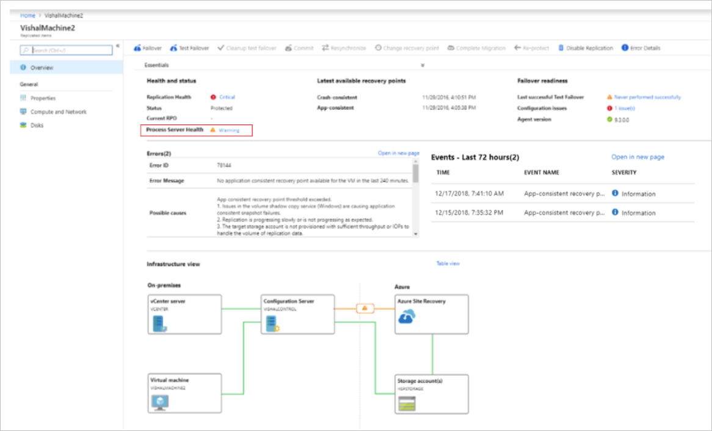
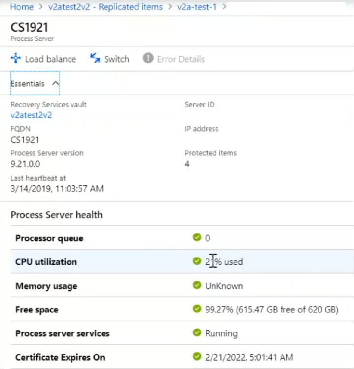

# Monitor the process server

This article describes how to monitor the [Site Recovery](site-recovery-overview.md) process server.

- The process server is used when you set up disaster recovery of on-premises VMware VMs and physical servers to Azure.
- By default the process server runs on the configuration server. It's installed by default when you deploy the configuration server.
- Optionally, to scale and handle larger numbers of replicated machines and higher volumes of replication traffic, you can deploy additional, scale-out process servers.

[Learn more](vmware-physical-azure-config-process-server-overview.md) about the role and deployment of process servers.

## Monitoring overview

Since the process server has so many roles, particularly in replicated data caching, compression, and transfer to Azure, it's important to monitor process server health on an ongoing basis.

There are a number of situations that commonly affect process server performance. Issues affecting performance will have a cascading effect on VM health, eventually pushing both the process server and its replicated machines into a critical state. Situations include:

- High numbers of VMs use a process server, approaching or exceeding recommended limitations.
- VMs using the process server have a high churn rate.
- Network throughput between VMs and the process server isn't enough to upload replication data to the process server.
- Network throughput between the process server and Azure isn't sufficient to upload replication data from the process server to Azure.

All of these issues can affect the recovery point objective (RPO) of VMs. 

**Why?** Because generating a recovery point for a VM requires all disks on the VM to have a common point. If one disk has a high churn rate, replication is slow, or the process server isn't optimal, it impacts how efficiently recovery points are created.

## Monitor proactively

To avoid issues with the process server, it's important to:

- Understand specific requirements for process servers using [capacity and sizing guidance](site-recovery-plan-capacity-vmware.md#capacity-considerations), and make sure process servers are deployed and running according to recommendations.
- Monitor alerts, and troubleshoot issues as they occur, to keep process servers running efficiently.

## Process server alerts

The process server generates a number of health alerts, summarized in the following table.

**Alert type** | **Details**
--- | ---
![Healthy][green] | Process server is connected and healthy.
![Warning][yellow] | CPU utilization > 80% for the last 15 minutes
![Warning][yellow] | Memory usage > 80% for the last 15 minutes
![Warning][yellow] | Cache folder free space < 30% for the last 15 minutes
![Warning][yellow] | Site Recovery monitors pending/outgoing data every five minutes, and estimates that data in the process server cache can't be uploaded to Azure within 30 minutes.
![Warning][yellow] | Process server services aren't running for the last 15 minutes
![Critical][red] | CPU utilization > 95% for the last 15 minutes
![Critical][red] | Memory usage > 95% for the last 15 minutes
![Critical][red] | Cache folder free space < 25% for the last 15 minutes
![Critical][red] | Site Recovery monitors pending/outgoing data every five minutes, and estimates that data in the process server cache can't be uploaded to Azure within 45 minutes.
![Critical][red] | No heartbeat from the process server for 15 minutes.

> [!NOTE]
> The overall health status of the process server is based on the worst alert generated.

## Monitor process server health

You can monitor the health state of your process servers as follows: 

1. To monitor the replication health and status of a replicated machine, and of its process server, in vault > **Replicated items**, click the machine you want to monitor.
2. In **Replication Health**, you can monitor the VM health status. Click the status to drill down for error details.

    

4. In **Process Server Health**, you can monitor the status of the process server. Drill down for details.

    

5. Health can also be monitored using the graphical representation on the VM page.
    - A scale-out process server will be highlighted in orange if there are warnings associated with it, and red if it has any critical issues. 
    - If the process server is running in the default deployment on the configuration server, then the configuration server will be highlighted accordingly.
    - To drill down, click on the configuration server or process server. Note any issues, and any remediation recommendations.

You can also monitor process servers in the vault under **Site Recovery Infrastructure**. In **Manage your Site Recovery infrastructure**, click **Configuration Servers**. Select the configuration server associated with the process server, and drill down into process server details.

## Next steps

- If you have any process servers issues, follow our [troubleshooting guidance](vmware-physical-azure-troubleshoot-process-server.md)
- If you need more help, post your question in the [Microsoft Q&A question page for Azure Site Recovery](https://docs.microsoft.com/answers/topics/azure-site-recovery.html). 

[green]: ./media/vmware-physical-azure-monitor-process-server/green.png
[yellow]: ./media/vmware-physical-azure-monitor-process-server/yellow.png
[red]: ./media/vmware-physical-azure-monitor-process-server/red.png
