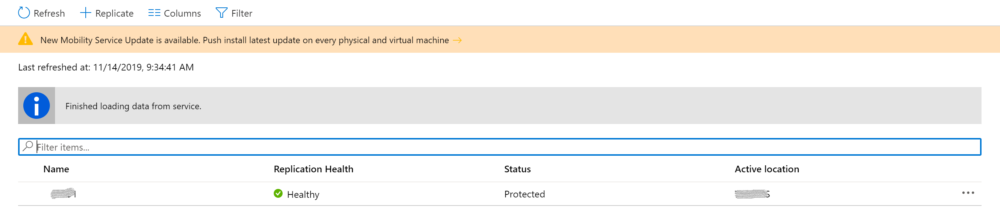
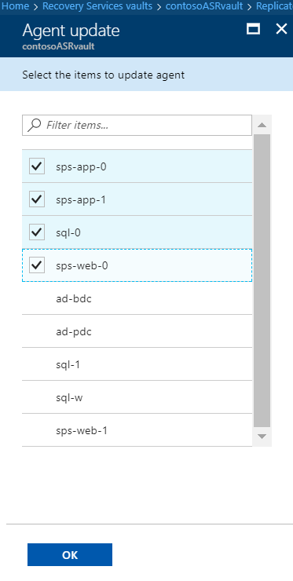

# Manage the Mobility agent 

You set up mobility agent on your server when you use Azure Site Recovery for disaster recovery of VMware VMs and physical servers to Azure. Mobility agent coordinates communications between your protected machine, configuration server/scale-out process server and manages data replication. This article summarizes common tasks for managing mobility agent after it's deployed.

>[!TIP]
>To download installer for a specific OS/Linux distro, refer to the guidance [here](vmware-physical-mobility-service-overview.md#locate-installer-files). To automatically update from portal, you do not need to download the installer. [ASR automatically fetches the installer from configuration server and updates the agent](#update-mobility-service-from-azure-portal).

[!INCLUDE [updated-for-az](../../includes/updated-for-az.md)]

## Update mobility service from Azure portal

1. Before you start ensure that the configuration server, scale-out process servers, and any master target servers that are a part of your deployment are updated before you update the Mobility Service on protected machines.
    1. From 9.36 version onwards, for SUSE Linux Enterprise Server 11 SP3, RHEL 5, CentOS 5, Debian 7 ensure the latest installer is [available on the configuration server and scale-out process server](vmware-physical-mobility-service-overview.md#download-latest-mobility-agent-installer-for-suse-11-sp3-suse-11-sp4-rhel-5-cent-os-5-debian-7-debian-8-debian-9-oracle-linux-6-and-ubuntu-1404-server).
1. In the portal open the vault > **Replicated items**.
1. If the configuration server is the latest version, you see a notification that reads "New Site recovery replication agent update is available. Click to install."

     

4. Click the notification, and in **Agent update**, select the machines on which you want to upgrade the Mobility service. Then click **OK**.

     

5. The Update Mobility Service job starts for each of the selected machines. Mobility agent is updated to the version of configuration server. For example, if configuration server is on version 9.33, the mobility agent on a protected VM is also updated to 9.33 version.

## Update Mobility service through powershell script on Windows server

Before you start ensure that the configuration server, scale-out process servers, and any master target servers that are a part of your deployment are updated before you update the Mobility Service on protected machines.

Use following script to upgrade mobility service on a server through power shell cmdlet

```azurepowershell
Update-AzRecoveryServicesAsrMobilityService -ReplicationProtectedItem $rpi -Account $fabric.fabricSpecificDetails.RunAsAccounts[0]
```

## Update mobility service manually on each protected server

1. Before you start ensure that the configuration server, scale-out process servers, and any master target servers that are a part of your deployment are updated before you update the Mobility Service on protected machines.

2. [Locate the agent installer](vmware-physical-mobility-service-overview.md#locate-installer-files) based on the operating system of the server.

>[!IMPORTANT]
> If you are replicating Azure IaaS VM from one Azure region to another, don't use this method. Refer to [our guidance](azure-to-azure-autoupdate.md) for information on all available options.

3. Copy the installation file on to the protected machine, and run it to update the mobility agent.

## Update account used for push installation of Mobility service

When you deployed Site Recovery, to enable push installation of the Mobility service, you specified an account that the Site Recovery process server uses to access the machines and install the service when replication is enabled for the machine. If you want to update the credentials for this account, follow [these instructions](vmware-azure-manage-configuration-server.md#modify-credentials-for-mobility-service-installation).

## Uninstall Mobility service

### On a Windows machine

Uninstall from the UI or from a command prompt.

- **From the UI**: In the Control Panel of the machine, select **Programs**. Select **Microsoft Azure Site Recovery Mobility Service/Master Target server** > **Uninstall**.
- **From a command prompt**: Open a command prompt window as an administrator on the machine. Run the following command: 
    ```
    MsiExec.exe /qn /x {275197FC-14FD-4560-A5EB-38217F80CBD1} /L+*V "C:\ProgramData\ASRSetupLogs\UnifiedAgentMSIUninstall.log"
    ```

### On a Linux machine
1. On the Linux machine, sign in as a **root** user.
2. In a terminal, go to /usr/local/ASR.
3. Run the following command:
   ```bash
   ./uninstall.sh -Y
   ```
   
## Install Site Recovery VSS provider on source machine

Azure Site Recovery VSS provider is required on the source machine to generate application consistency points. If the installation of the provider didn't succeed through push installation, follow the below given guidelines to install it manually.

1. Open admin cmd window.
2. Navigate to the mobility service installation location. (Eg - C:\Program Files (x86)\Microsoft Azure Site Recovery\agent)
3. Run the script InMageVSSProvider_Uninstall.cmd . This will uninstall the service if it already exists.
4. Run the script InMageVSSProvider_Install.cmd to install the VSS provider manually.

## Next steps

- [Set up disaster recovery for VMware VMs](vmware-azure-tutorial.md)
- [Set up disaster recovery for physical servers](physical-azure-disaster-recovery.md)
