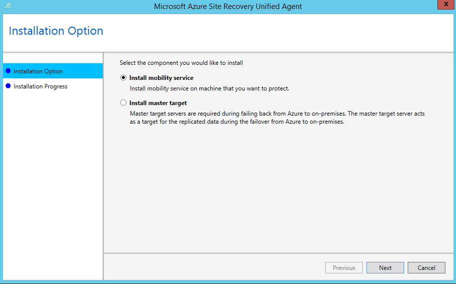
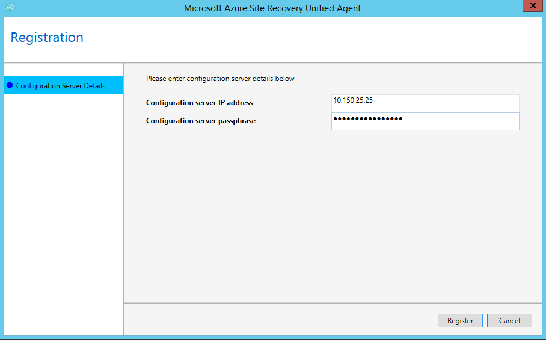
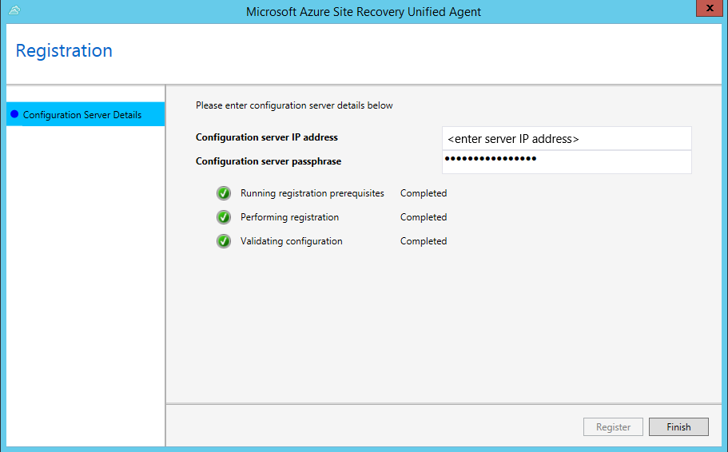

# About the Mobility service for VMware VMs and physical servers

When you set up disaster recovery for VMware VMs and physical servers using [Azure Site Recovery](site-recovery-overview.md), you install the Site Recovery Mobility service on each on-premises VMware VM and physical server.  The Mobility service captures data writes on the machine, and forwards them to the Site Recovery process server. You can deploy the Mobility Service using the following methods:

- [Push installation](#push-installation): Site Recovery installs mobility agent on the server when protection is enabled via Azure portal.
- Install manually: You can install the Mobility service manually on each machine through [UI](#install-mobility-agent-through-ui) or [command prompt](#install-mobility-agent-through-command-prompt).
- [Automated deployment](vmware-azure-mobility-install-configuration-mgr.md): You can automate installation with software deployment tools such as Configuration Manager.

## Anti-virus on replicated machines

If machines you want to replicate have active anti-virus software running, make sure you exclude the Mobility service installation folder from anti-virus operations (*C:\ProgramData\ASR\agent*). This ensures that replication works as expected.

## Push installation

Push installation is an integral part of "[Enable Replication](vmware-azure-enable-replication.md#enable-replication)" job triggered in the portal. After choosing the set of virtual machines you wish to protect and trigger "Enable Replication", configuration server pushes mobility agent on to the servers, installs the agent and complete registration of agent with configuration server. For successful completion of this operation,

- Ensure that all push installation [prerequisites](vmware-azure-install-mobility-service.md) are met.
- Ensure that all configurations of servers fall under [support matrix of VMware to Azure DR scenario](vmware-physical-azure-support-matrix.md).

Details of push installation workflow has been described in the following sections.

### From [9.23 version](https://support.microsoft.com/en-in/help/4494485/update-rollup-35-for-azure-site-recovery) onwards

During push installation of mobility agent, following steps are performed

1. Pushes agent on to the source machine. Copying the agent on to source machine can fail due to multiple environmental errors. Visit [our guidance](vmware-azure-troubleshoot-push-install.md) to troubleshoot push installation failures.
2. After agent is successfully copied on to the server prerequisite checks are performed on the server. Installation fails if one or more of the [prerequisites](vmware-physical-azure-support-matrix.md) are not met. If all prerequisites are met, installation is triggered.
3. Azure Site Recovery VSS provider is installed on the server as part of Mobility agent installation. This provider is used to generate Application consistent points. If installation of VSS provider fails, this step will be skipped and agent installation will continue.
4. If agent installation succeeds but VSS provider installation fails,then job status is marked as "Warning". This does not impact crash consistency points generation.

    a. To generate application consistent points, refer to [our guidance](vmware-physical-manage-mobility-service.md#install-site-recovery-vss-provider-on-source-machine) to complete installation of Site Recovery VSS provider manually. </br>
    b.  If you do not wish application consistent points to be generated, [modify the replication policy](vmware-azure-set-up-replication.md#create-a-policy) to turn off application consistent points.

### Before 9.22 versions

1. Pushes agent on to the source machine. Copying the agent on to source machine can fail due to multiple environmental errors. Visit [our guidance](vmware-azure-troubleshoot-push-install.md) to troubleshoot push installation failures.
2. After agent is successfully copied on to the server prerequisite checks are performed on the server. Installation fails if one or more of the [prerequisites](vmware-physical-azure-support-matrix.md) are not met. If all prerequisites are met, installation is triggered.
3. Azure Site Recovery VSS provider is installed on the server as part of Mobility agent installation. This provider is used to generate Application consistent points. If installation of VSS provider fails, then agent installation will fail. To avoid failure of mobility agent installation, use [9.23 version](https://support.microsoft.com/en-in/help/4494485/update-rollup-35-for-azure-site-recovery) or higher to generate crash consistent points and install VSS provider manually.

## Install mobility agent through UI

### Prerequisite

- Ensure that all configurations of servers fall under [support matrix of VMware to Azure DR scenario](vmware-physical-azure-support-matrix.md).
- [Locate the installer](#locate-installer-files) based on the operating system of the server.

>[!IMPORTANT]
> If you are replicating Azure IaaS VM from one Azure region to another, don't use this method. Use the command-line-based installation method instead.

1. Copy the installation file to the machine, and run it.
2. In **Installation Option**, select **Install mobility service**.
3. Select the installation location > **Install**.

    

4. Monitor the installation in **Installation Progress**. After the installation is finished, select **Proceed to Configuration** to register the service with the configuration server.

    

5. In **Configuration Server Details**, specify the IP address and passphrase you configured.  

    

6. Select **Register** to finish the registration.

    

## Install mobility agent through command prompt

### Prerequisite

- Ensure that all configurations of servers fall under [support matrix of VMware to Azure DR scenario](vmware-physical-azure-support-matrix.md).
- [Locate the installer](#locate-installer-files) based on the operating system of the server.

### On a Windows machine

- Copy the installer to a local folder (for example, C:\Temp) on the server that you want to protect.

    ```
    cd C:\Temp
    ren Microsoft-ASR_UA*Windows*release.exe MobilityServiceInstaller.exe
    MobilityServiceInstaller.exe /q /x:C:\Temp\Extracted
    cd C:\Temp\Extracted
    ```

- Install as follows:

    ```
    UnifiedAgent.exe /Role "MS" /InstallLocation "C:\Program Files (x86)\Microsoft Azure Site Recovery" /Platform "VmWare" /Silent
    ```

- Register the agent with the configuration server.

    ```
    cd C:\Program Files (x86)\Microsoft Azure Site Recovery\agent
    UnifiedAgentConfigurator.exe  /CSEndPoint <CSIP> /PassphraseFilePath <PassphraseFilePath>
    ```

#### Installation settings
**Setting** | **Details**
--- | ---
Usage | UnifiedAgent.exe /Role \<MS/MT> /InstallLocation \<Install Location> /Platform “VmWare” /Silent
Setup logs | Under %ProgramData%\ASRSetupLogs\ASRUnifiedAgentInstaller.log.
/Role | Mandatory installation parameter. Specifies whether the Mobility service (MS) or master target (MT) should be installed.
/InstallLocation| Optional parameter. Specifies the Mobility service installation location (any folder).
/Platform | Mandatory. Specifies the platform on which Mobility Service is installed. **VMware** for VMware VMs/physical servers; **Azure** for Azure VMs.<br/><br/> If you're treating Azure VMs as physical machines, specify **VMware**.
/Silent| Optional. Specifies whether to run the installer in silent mode.

#### Registration settings
**Setting** | **Details**
--- | ---
Usage | UnifiedAgentConfigurator.exe  /CSEndPoint \<CSIP> /PassphraseFilePath \<PassphraseFilePath>
Agent configuration logs | Under %ProgramData%\ASRSetupLogs\ASRUnifiedAgentConfigurator.log.
/CSEndPoint | Mandatory parameter. Specifies the IP address of the configuration server. Use any valid IP address.
/PassphraseFilePath |  Mandatory. Location of the passphrase. Use any valid UNC or local file path.

### On a Linux machine

1. Copy the installer to a local folder (for example, /tmp) on the server that you want to protect. In a terminal, run the following commands:

    ```
    cd /tmp ;
    tar -xvf Microsoft-ASR_UA*release.tar.gz
    ```

2. Install as follows:

    ```
    sudo ./install -d <Install Location> -r MS -v VmWare -q
    ```

3. After installation is finished, Mobility Service must be registered to the configuration server. Run the following command to register Mobility Service with the configuration server:

    ```
    /usr/local/ASR/Vx/bin/UnifiedAgentConfigurator.sh -i <CSIP> -P /var/passphrase.txt
    ```

#### Installation settings
**Setting** | **Details**
--- | ---
Usage | ./install -d \<Install Location> -r \<MS/MT> -v VmWare -q
-r | Mandatory installation parameter. Specifies whether the Mobility service (MS) or master target (MT) should be installed.
-d | Optional parameter. Specifies the Mobility service installation location: /usr/local/ASR.
-v | Mandatory. Specifies the platform on which Mobility Service is installed. **VMware** for VMware VMs/physical servers; **Azure** for Azure VMs.
-q | Optional. Specifies whether to run the installer in silent mode.

#### Registration settings
**Setting** | **Details**
--- | ---
Usage | cd /usr/local/ASR/Vx/bin<br/><br/> UnifiedAgentConfigurator.sh -i \<CSIP> -P \<PassphraseFilePath>
-i | Mandatory parameter. Specifies the IP address of the configuration server. Use any valid IP address.
-P |  Mandatory. Full file path of the file in which the passphrase is saved. Use any valid folder.

## Azure Virtual Machine agent

- **Windows VMs**: From version 9.7.0.0 of the Mobility service, the [Azure VM agent](../virtual-machines/extensions/features-windows.md#azure-vm-agent) is installed by the Mobility service installer. This ensures that when the machine fails over to Azure, the Azure VM meets the agent installation prerequisite for using any Vm extension.
- **Linux VMs**: The  [WALinuxAgent](https://docs.microsoft.com/azure/virtual-machines/extensions/update-linux-agent) must be installed manually on the Azure VM after failover.

## Locate installer files

Go to %ProgramData%\ASR\home\svsystems\pushinstallsvc\repository folder on configuration server. Check which installer you need based on operating system. The following table summarizes the installer files for each VMware VM and physical server operating system. You can review [supported operating systems](vmware-physical-azure-support-matrix.md#replicated-machines) before you start.

**Installer file** | **Operating system (64-bit only)**
--- | ---
Microsoft-ASR\_UA\*Windows\*release.exe | Windows Server 2016; Windows Server 2012 R2; Windows Server 2012; Windows Server 2008 R2 SP1
Microsoft-ASR\_UA\*RHEL6-64\*release.tar.gz | Red Hat Enterprise Linux (RHEL) 6.* </br> CentOS 6.*
Microsoft-ASR\_UA\*RHEL7-64\*release.tar.gz | Red Hat Enterprise Linux (RHEL) 7.* </br> CentOS 7.*
Microsoft-ASR\_UA\*SLES12-64\*release.tar.gz | SUSE Linux Enterprise Server 12 SP1,SP2,SP3
Microsoft-ASR\_UA\*SLES11-SP3-64\*release.tar.gz| SUSE Linux Enterprise Server 11 SP3
Microsoft-ASR\_UA\*SLES11-SP4-64\*release.tar.gz| SUSE Linux Enterprise Server 11 SP4
Microsoft-ASR\_UA\*OL6-64\*release.tar.gz | Oracle Enterprise Linux 6.4, 6.5
Microsoft-ASR\_UA\*UBUNTU-14.04-64\*release.tar.gz | Ubuntu Linux 14.04
Microsoft-ASR\_UA\*UBUNTU-16.04-64\*release.tar.gz | Ubuntu Linux 16.04 LTS server
Microsoft-ASR_UA\*DEBIAN7-64\*release.tar.gz | Debian 7
Microsoft-ASR_UA\*DEBIAN8-64\*release.tar.gz | Debian 8

## Next steps

[Set up push installation for the Mobility service](vmware-azure-install-mobility-service.md).
