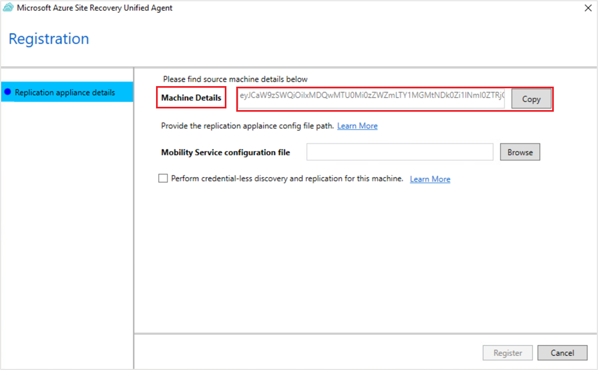
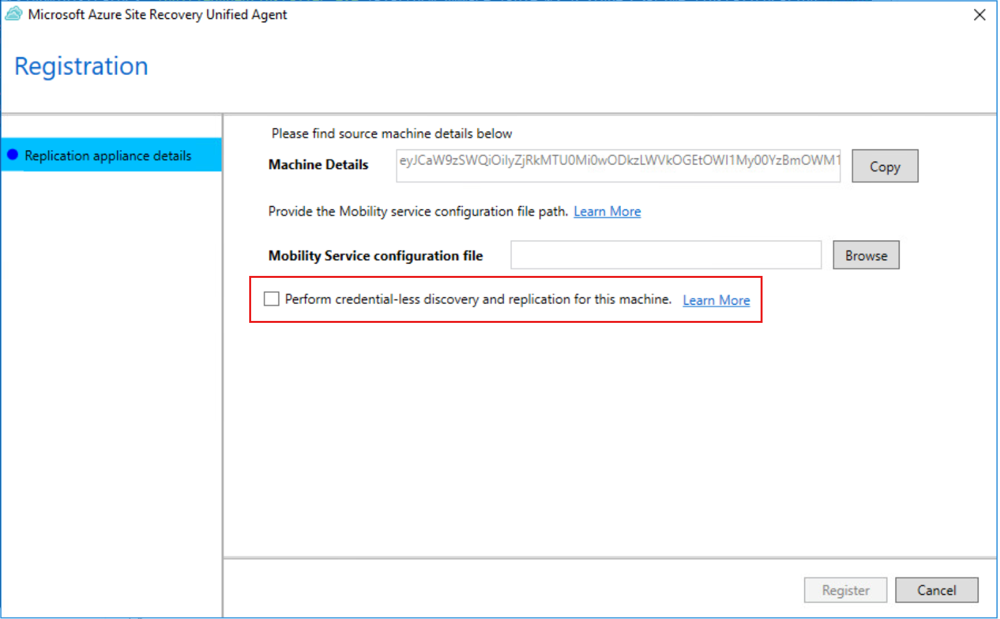
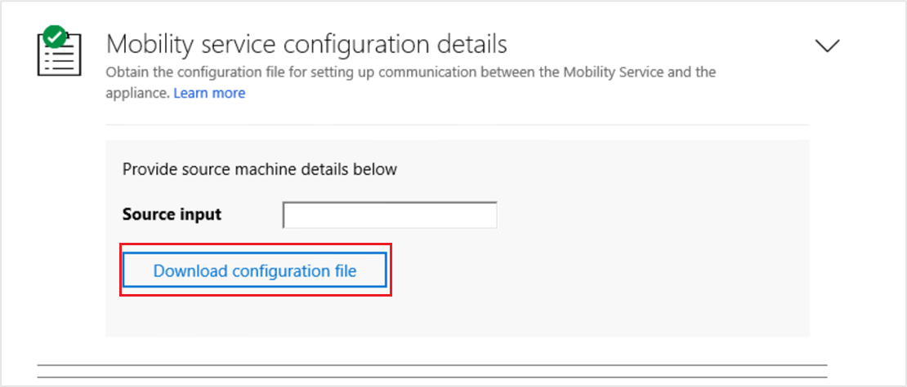

# About the Mobility service for VMware VMs and physical servers

> [!CAUTION]
> This article references CentOS, a Linux distribution that is nearing End Of Life (EOL) status. Please consider your use and planning accordingly. For more information, see the [CentOS End Of Life guidance](~/articles/virtual-machines/workloads/centos/centos-end-of-life.md).

When you set up disaster recovery for VMware virtual machines (VM) and physical servers using [Azure Site Recovery](site-recovery-overview.md), you install the Site Recovery Mobility service on each on-premises VMware VM and physical server. The Mobility service captures data, writes on the machine, and forwards them to the Site Recovery process server. The Mobility service is installed by the Mobility service agent software that you can deploy using the following methods:

- [Push installation](#push-installation): When protection is enabled via the Azure portal, Site Recovery installs the Mobility service on the server.
- Manual installation: You can install the Mobility service manually on each machine through the [user interface (UI)](#install-the-mobility-service-using-ui-classic) or [command prompt](#install-the-mobility-service-using-command-prompt-classic).
- [Automated deployment](vmware-azure-mobility-install-configuration-mgr.md): You can automate the Mobility service installation with software deployment tools such as Configuration Manager.

> [!NOTE]
> The Mobility service uses approximately 6%-10% of memory on source machines for VMware VMs or physical machines.

## Antivirus on replicated machines

If machines that you want to replicate are running antivirus software, exclude the Mobility service's installation folder _C:\ProgramData\ASR\agent_ from antivirus operations. This exclusion ensures that replication works as expected.

## Push installation

Push installation is an integral part of the job that runs from the Azure portal to [enable replication](vmware-azure-enable-replication.md#enable-replication). After choosing the set of VMs you wish to protect and enable replication, the configuration server pushes the Mobility service agent to the servers, installs the agent, and completes the agent's registration with the configuration server.

### Prerequisites

- Ensure that all push installation [prerequisites](vmware-azure-install-mobility-service.md) are met.
- Ensure that all server configurations meet the criteria in the [Support matrix for disaster recovery of VMware VMs and physical servers to Azure](vmware-physical-azure-support-matrix.md).
- From 9.36 version onwards, ensure the latest installer for SUSE Linux Enterprise Server 11 SP3, SUSE Linux Enterprise Server 11 SP4, RHEL 5, CentOS 5, Debian 7, Debian 8, Ubuntu 14.04 is [available on the configuration server and scale-out process server](#download-latest-mobility-agent-installer-for-suse-11-sp3-suse-11-sp4-rhel-5-cent-os-5-debian-7-debian-8-debian-9-oracle-linux-6-and-ubuntu-1404-server).
- From 9.52 version onwards, ensure the latest installer for Debian 9, is [available on the configuration server and scale-out process server](#download-latest-mobility-agent-installer-for-suse-11-sp3-suse-11-sp4-rhel-5-cent-os-5-debian-7-debian-8-debian-9-oracle-linux-6-and-ubuntu-1404-server).

The push installation workflow is described in the following sections:

### Mobility service agent version 9.23 and higher

For more information about version 9.23, see [Update Rollup 35 for Azure Site Recovery](https://support.microsoft.com/help/4494485/update-rollup-35-for-azure-site-recovery).

During a push installation of the Mobility service, the following steps are performed:

1. The agent is pushed to the source machine. Copying the agent to the source machine can fail due to multiple environmental errors. Refer to [our guidance](vmware-azure-troubleshoot-push-install.md) to troubleshoot push installation failures.
1. After the agent is successfully copied to the server, a prerequisite check is performed on the server.
   - If all prerequisites are met, the installation begins.
   - If one or more [prerequisites](vmware-physical-azure-support-matrix.md) aren't met, the installation fails.
1. As part of the agent installation, the Volume Shadow Copy Service (VSS) provider for Azure Site Recovery is installed. The VSS provider is used to generate application-consistent recovery points. If installation of the VSS provider fails, this step is skipped and the agent installation continues.
1. If the agent installation succeeds but the VSS provider installation fails, then the job status is marked as **Warning**. This doesn't impact crash-consistent recovery point generation.

    - To generate application-consistent recovery points, refer to [our guidance](vmware-physical-manage-mobility-service.md#install-site-recovery-vss-provider-on-source-machine) to complete a manual installation of the Site Recovery VSS provider.
    - If you don't want to generate application-consistent recovery points, [modify the replication policy](vmware-azure-set-up-replication.md#create-a-policy) to turn off application-consistent recovery points.

### Mobility service agent version 9.22 and below

1. The agent is pushed to the source machine. Copying the agent to the source machine can fail due to multiple environmental errors. Refer to [our guidance](vmware-azure-troubleshoot-push-install.md) to troubleshoot push installation failures.
1. After the agent is successfully copied to the server, a prerequisite check is performed on the server.
   - If all prerequisites are met, the installation begins.
   - The installation fails if one or more of the [prerequisites](vmware-physical-azure-support-matrix.md) aren't met.

1. As part of the agent installation, the Volume Shadow Copy Service (VSS) provider for Azure Site Recovery is installed. The VSS provider is used to generate application-consistent recovery points.
   - If the VSS provider installation fails, the agent installation fails. To avoid failure of the agent installation, use [version 9.23](https://support.microsoft.com/help/4494485/update-rollup-35-for-azure-site-recovery) or higher to generate crash-consistent recovery points and do a manual install of the VSS provider.

### Mobility service agent version 9.55 and higher

1. The modernized architecture of mobility agent is set as default for the version 9.55 and above. Follow the instructions [here](#install-the-mobility-service-using-ui-modernized) to install the agent.
2. To install the modernized architecture of mobility agent on versions 9.54 and above, follow the instructions [here](#install-the-mobility-service-using-command-prompt-modernized).


## Install the Mobility service using UI (Modernized)

>[!NOTE]
> This section is applicable to Azure Site Recovery - Modernized. [Here are the installation instructions for Classic](#install-the-mobility-service-using-ui-classic).

### Prerequisites

Locate the installer files for the server’s operating system using the following steps:
- On the appliance, go to the folder *E:\Software\Agents*.
- Copy the installer corresponding to the source machine’s operating system and place it on your source machine in a local folder, such as *C:\Program Files (x86)\Microsoft Azure Site Recovery*.


**Use the following steps to install the mobility service:**

>[!NOTE]
> If installing the agent version 9.54 and below, then ensure that the section [here](#install-the-mobility-service-using-command-prompt-modernized) is followed. For agent version 9.55 and above, the continue to follow the steps below.

1. Copy the installation file to the location *C:\Program Files (x86)\Microsoft Azure Site Recovery*, and run it. This launches the installer UI:

   

2. Provide the install location in the UI. This should be *C:\Program Files (x86)\Microsoft Azure Site Recovery*.

4. Click **Install**. This starts the installation of Mobility Service. Wait till the installation has been completed.

   

5. Once the installation is done, you will need to register the source machine with the appliance of your choice. To do so, copy the string present in the field  **Machine Details**.

   This field includes information, which is unique to the source machine. This information is required to [generate the Mobility Service configuration file](#generate-mobility-service-configuration-file). Learn more about [credential less discovery](#credential-less-discovery-in-modernized-architecture).

   

6.	[Generate the configuration file](#generate-mobility-service-configuration-file) using the unique source machine identifier. Once done, provide the path of **Mobility Service configuration file** in the Unified Agent configurator.
7.	Click **Register**.

    This will successfully register your source machine with your appliance.

## Install the Mobility service using command prompt (Modernized)

>[!NOTE]
> This section is applicable to Azure Site Recovery - Modernized. [Here are the installation instructions for Classic](#install-the-mobility-service-using-command-prompt-classic).

### Windows machine
1. Open command prompt and navigate to the folder where the installer file has been placed.

   ```cmd
   cd C:\Program Files (x86)\Microsoft Azure Site Recovery
   ```
2. Run the following command to extract the installer file:
   ```cmd
       .\Microsoft-ASR_UA*Windows*release.exe /q /x:"C:\Program Files (x86)\Microsoft Azure Site Recovery"
    ```
3. To proceed with the installation, run the following command:

   ```cmd

    .\UnifiedAgentInstaller.exe /Platform vmware /Silent /Role MS /CSType CSPrime /InstallLocation "C:\Program Files (x86)\Microsoft Azure Site Recovery"
   ```
    Once the installation is complete, copy the string that is generated alongside the parameter *Agent Config Input*. This string is required to [generate the Mobility Service configuration file](#generate-mobility-service-configuration-file).

    

4. After successfully installing, register the source machine with the above appliance using the following command:

   ```cmd
   "C:\Program Files (x86)\Microsoft Azure Site Recovery\agent\UnifiedAgentConfigurator.exe" /SourceConfigFilePath "config.json" /CredentialLessDiscovery true /CSType CSPrime
   ```

#### Installation settings

Setting | Details
--- | ---
Syntax | `.\UnifiedAgentInstaller.exe /Platform vmware /Role MS /CSType CSPrime /InstallLocation <Install Location>`
`/Role` | Mandatory installation parameter. Specifies whether the Mobility service (MS) are installed.
`/InstallLocation`| Optional. Specifies the Mobility service installation location (any folder).
`/Platform` | Mandatory. Specifies the platform on which the Mobility service is installed: <br/> **VMware** for VMware VMs/physical servers. <br/> **Azure** for Azure VMs.<br/><br/> If you're treating Azure VMs as physical machines, specify **VMware**.
`/Silent`| Optional. Specifies whether to run the installer in silent mode.
`/CSType`| Optional. Used to define modernized or classic architecture. By default for all agents on or above the version 9.55, modernized architecture would be launched. (CSPrime or CSLegacy)

#### Registration settings

Setting | Details
--- | ---
Syntax | `"<InstallLocation>\UnifiedAgentConfigurator.exe" /SourceConfigFilePath "config.json" /CSType CSPrime /CredentialLessDiscovery true`
`/SourceConfigFilePath` | Mandatory. Full file path of the Mobility Service configuration file. Use any valid folder.
`/CSType` |  Optional. Used to define modernized or legacy architecture. By default for all agents on or above the version 9.55, modernized architecture would be launched. (CSPrime or CSLegacy).
`/CredentialLessDiscovery` | Optional. Specifies whether credential-less discovery are performed or not.


### Linux machine

1. From a terminal session, copy the installer to a local folder such as **/tmp** on the server that you want to protect. Then run the below command:

   ```bash
       cd /tmp ;
       tar -xvf Microsoft-ASR_UA_version_LinuxVersion_GA_date_release.tar.gz
   ```

2. To install, use the below command:
   ```bash
       sudo  ./install -q -r MS -v VmWare -c CSPrime
    ```

    Once the installation is complete, copy the string that is generated alongside the parameter *Agent Config Input*. This string is required to [generate the Mobility Service configuration file](#generate-mobility-service-configuration-file).

3. After successfully installing, register the source machine with the above appliance using the following command:

   ```bash
        <InstallLocation>/Vx/bin/UnifiedAgentConfigurator.sh -S config.json -q -c CSPrime
    ```
#### Installation settings

  Setting | Details
  --- | ---
    Syntax | `./install -q -r MS -v VmWare -c CSPrime`
    `-r` | Mandatory. Installation parameter. Specifies whether the Mobility service (MS) should be installed.
    `-d` | Optional. Specifies the Mobility service installation location: `/usr/local/ASR`.
    `-v` | Mandatory. Specifies the platform on which Mobility service is installed. <br/> **VMware** for VMware VMs/physical servers. <br/> **Azure** for Azure VMs.
    `-q` | Optional. Specifies whether to run the installer in silent mode.
    `-c` | Optional. Used to define modernized or legacy architecture. By default for all agents on or above the version 9.55, modernized architecture would be launched. (CSPrime or CSLegacy).

#### Registration settings

  Setting | Details
  --- | ---
    Syntax | `<InstallLocation>/Vx/bin/UnifiedAgentConfigurator.sh -S config.json -q -D true -c CSPrime`
    `-S` |  Mandatory. Full file path of the Mobility Service configuration file. Use any valid folder.
    `-c` |  Optional. Used to define modernized and legacy architecture. By default for all agents on or above the version 9.55, modernized architecture would be launched. (CSPrime or CSLegacy).
    `-q` |  Optional. Specifies whether to run the installer in silent mode.
    `-D` |  Optional. Specifies whether credential-less discovery are performed or not.

## Credential-less discovery in modernized architecture

When providing both the machine credentials and the vCenter server or vSphere ESXi host credentials is not possible, then you should opt for credential-less discovery. When performing credential-less discovery, mobility service is installed manually on the source machine and during the installation, the check box for credential-less discovery should be set to true, so that when replication is enabled, no credentials are required.



## Generate Mobility Service configuration file

  Use the following steps to generate mobility service configuration file:

  1. Navigate to the appliance with which you want to register your source machine. Open the Microsoft Azure Appliance Configuration Manager and navigate to the section **Mobility service configuration details**.
  2. Paste the Machine Details string that you copied from Mobility Service and paste it in the input field here.
  3. Click **Download configuration file**.

  

This downloads the Mobility Service configuration file. Copy the downloaded file to a local folder in your source machine. You can place it in the same folder as the Mobility Service installer.

See information about [upgrading the mobility services](upgrade-mobility-service-modernized.md).


## Install the Mobility service using UI (Classic)

>[!NOTE]
> This section is applicable to Azure Site Recovery - Classic. [Here are the Installation instructions for Modernized](#install-the-mobility-service-using-ui-modernized)
### Prerequisites

- Ensure that all server configurations meet the criteria in the [Support matrix for disaster recovery of VMware VMs and physical servers to Azure](vmware-physical-azure-support-matrix.md).
- [Locate the installer](#locate-installer-files) for the server's operating system.
- Copy the installer corresponding to the source machine’s operating system and place it on your source machine in a local folder, such as C:\Program Files (x86)\Microsoft Azure Site Recovery.

>[!IMPORTANT]
> Don't use the UI installation method if you're replicating an Azure Infrastructure as a Service (IaaS) VM from one Azure region to another. Use the [command prompt](#install-the-mobility-service-using-command-prompt-classic) installation.

1.  Open command prompt and navigate to the folder where the installer file has been placed. Extract the installer:
      ```cmd
       Microsoft-ASR_UA*Windows*release.exe /q /x:'C:\Program Files (x86)\Microsoft Azure Site Recovery'
      ```
1. Run the below command to launch the installation wizard for the agent.
   ```cmd
    UnifiedAgentInstaller.exe /CSType CSLegacy
   ```
1. In **Installation Option**, select **Install mobility service**.
1. Choose the installation location and select **Install**.

    :::image type="content" source="./media/vmware-physical-mobility-service-install-manual/mobility1.png" alt-text="Mobility service installation option page.":::

1. Monitor the installation in **Installation Progress**. After the installation is finished, select **Proceed to Configuration** to register the service with the configuration server.

    :::image type="content" source="./media/vmware-physical-mobility-service-install-manual/mobility3.png" alt-text="Screenshot that shows the progress of the installation and the active Proceed to Configuration button when the installation is finished.":::

1. In **Configuration Server Details**, specify the IP address and passphrase that you configured. To generate the passphrase, follow the steps mentioned [here](./vmware-azure-mobility-install-configuration-mgr.md#prepare-the-installation-files).

    :::image type="content" source="./media/vmware-physical-mobility-service-install-manual/mobility4.png" alt-text="Mobility service registration page.":::

1. Select **Register** to finish the registration.

    :::image type="content" source="./media/vmware-physical-mobility-service-install-manual/mobility5.png" alt-text="Mobility service registration final page.":::

## Install the Mobility service using command prompt (Classic)

>[!NOTE]
> This section is applicable to Azure Site Recovery - Classic. [Here are the installation instructions for Modernized](#install-the-mobility-service-using-command-prompt-modernized).

### Prerequisites

- Ensure that all server configurations meet the criteria in the [Support matrix for disaster recovery of VMware VMs and physical servers to Azure](vmware-physical-azure-support-matrix.md).
- [Locate the installer](#locate-installer-files) for the server's operating system.

### Windows machine

- From a command prompt, run the following commands to copy the installer to a local folder, such as _C:\Temp_, on the server that you want to protect. Replace the installer's file name with the actual file name.

  ```cmd
  cd C:\Temp
  ren Microsoft-ASR_UA*Windows*release.exe MobilityServiceInstaller.exe
  MobilityServiceInstaller.exe /q /x:C:\Temp\Extracted
  cd C:\Temp\Extracted
  ```

- Run this command to install the agent.

  ```cmd
  UnifiedAgent.exe /Role "MS" /InstallLocation "C:\Program Files (x86)\Microsoft Azure Site Recovery" /Platform "VmWare" /Silent  /CSType CSLegacy
  ```

- Run these commands to register the agent with the configuration server.

  ```cmd
  cd C:\Program Files (x86)\Microsoft Azure Site Recovery\agent
  UnifiedAgentConfigurator.exe  /CSEndPoint <CSIP> /PassphraseFilePath <PassphraseFilePath>
  ```

#### Installation settings

Setting | Details
--- | ---
Syntax | `UnifiedAgent.exe /Role \<MS/MT> /InstallLocation \<Install Location> /Platform "VmWare" /Silent /CSType CSLegacy`
Setup logs | `%ProgramData%\ASRSetupLogs\ASRUnifiedAgentInstaller.log`
`/Role` | Mandatory installation parameter. Specifies whether the mobility service (MS) or master target (MT) should be installed.
`/InstallLocation`| Optional parameter. Specifies the Mobility service installation location (any folder).
`/Platform` | Mandatory. Specifies the platform on which the Mobility service is installed: <br/> **VMware** for VMware VMs/physical servers. <br/> **Azure** for Azure VMs.<br/><br/> If you're treating Azure VMs as physical machines, specify **VMware**.
`/Silent`| Optional. Specifies whether to run the installer in silent mode.
` /CSType` | Required. Used to define modernized or classic architecture. By default, modernized architecture would be launched. (CSPrime or CSLegacy)

#### Registration settings
Setting | Details
--- | ---
Syntax | `UnifiedAgentConfigurator.exe  /CSEndPoint \<CSIP> /PassphraseFilePath \<PassphraseFilePath>`
Agent configuration logs | `%ProgramData%\ASRSetupLogs\ASRUnifiedAgentConfigurator.log`
`/CSEndPoint` | Mandatory parameter. `<CSIP>` specifies the configuration server's IP address. Use any valid IP address.
`/PassphraseFilePath` |  Mandatory. Location of the passphrase. Use any valid UNC or local file path.

### Linux machine

1. From a terminal session, copy the installer to a local folder such as _/tmp_ on the server that you want to protect. Replace the installer's file name with your Linux distribution's actual file name, then run the commands.

   ```bash
   cd /tmp ;
   tar -xvf Microsoft-ASR_UA_version_LinuxVersion_GA_date_release.tar.gz
   ```

2. Install as follows (root account is not required, but root permissions are required):

   ```bash
   sudo ./install -r MS -v VmWare -d <Install Location> -q -c CSLegacy
   ```

3. After the installation is finished, the Mobility service must be registered to the configuration server. Run the following command to register the Mobility service with the configuration server.

   ```bash
   /usr/local/ASR/Vx/bin/UnifiedAgentConfigurator.sh -i <CSIP> -P /var/passphrase.txt -c CSLegacy
   ```

#### Installation settings

Setting | Details
--- | ---
Syntax | `./install -r MS -v VmWare [-d <Install Location>] [-q] -c CSLegacy`
`-r` | Mandatory installation parameter. Specifies whether the mobility service (MS) or master target (MT) should be installed.
`-d` | Optional parameter. Specifies the Mobility service installation location: `/usr/local/ASR`.
`-v` | Mandatory. Specifies the platform on which Mobility service is installed. <br/> **VMware** for VMware VMs/physical servers. <br/> **Azure** for Azure VMs.
`-q` | Optional. Specifies whether to run the installer in silent mode.
`-c` | Required. Used to define modernized or classic architecture. By default, modernized architecture would be launched. (CSPrime or CSLegacy)

#### Registration settings

Setting | Details
--- | ---
Syntax | `cd /usr/local/ASR/Vx/bin`</br> `UnifiedAgentConfigurator.sh -i \<CSIP> -P \<PassphraseFilePath> -c CSLegacy`
`-i` | Mandatory parameter. `<CSIP>` specifies the configuration server's IP address. Use any valid IP address.
`-P` |  Mandatory. Full file path of the file in which the passphrase is saved. [Learn more](./vmware-azure-manage-configuration-server.md#generate-configuration-server-passphrase).
`-c` | Required. Used to define modernized or classic architecture. By default, modernized architecture would be launched.(CSPrime or CSLegacy)

## Azure Virtual Machine agent

- **Windows VMs**: From version 9.7.0.0 of the Mobility service, the [Azure VM agent](../virtual-machines/extensions/features-windows.md#azure-vm-agent) is installed by the Mobility service installer. This ensures that when the machine fails over to Azure, the Azure VM meets the agent installation prerequisite for using any VM extension.
- **Linux VMs**: The  [WALinuxAgent](../virtual-machines/extensions/update-linux-agent.md) is automatically installed on the Azure VM after failover.

## Locate installer files

On the configuration server, go to the folder _%ProgramData%\ASR\home\svsystems\pushinstallsvc\repository_. Check which installer you need based on the operating system. The following table summarizes the installer files for each VMware VM and physical server operating system. Before you begin, you can review the [supported operating systems](vmware-physical-azure-support-matrix.md#replicated-machines).

> [!NOTE]
> The file names use the syntax shown in the following table with _version_ and _date_ as placeholders for the real values. The actual file names will look similar to these examples:
> - `Microsoft-ASR_UA_9.30.0.0_Windows_GA_22Oct2019_release.exe`
> - `Microsoft-ASR_UA_9.30.0.0_UBUNTU-16.04-64_GA_22Oct2019_release.tar.gz`

Installer file | Operating system (64-bit only)
--- | ---
`Microsoft-ASR_UA_version_Windows_GA_date_release.exe` | Windows Server 2016 </br> Windows Server 2012 R2 </br> Windows Server 2012 </br> Windows Server 2008 R2 SP1
[To be downloaded and placed in this folder manually](#rhel-5-or-centos-5-server) | Red Hat Enterprise Linux (RHEL) 5 </br> CentOS 5
`Microsoft-ASR_UA_version_RHEL6-64_GA_date_release.tar.gz` | Red Hat Enterprise Linux (RHEL) 6 </br> CentOS 6
`Microsoft-ASR_UA_version_RHEL7-64_GA_date_release.tar.gz` | Red Hat Enterprise Linux (RHEL) 7 </br> CentOS 7
`Microsoft-ASR_UA_version_RHEL8-64_GA_date_release.tar.gz` | Red Hat Enterprise Linux (RHEL) 8 </br> CentOS 8
`Microsoft-ASR_UA_version_SLES12-64_GA_date_release.tar.gz` | SUSE Linux Enterprise Server 12 SP1 </br> Includes SP2 and SP3.
[To be downloaded and placed in this folder manually](#suse-11-sp3-or-suse-11-sp4-server) | SUSE Linux Enterprise Server 11 SP3
[To be downloaded and placed in this folder manually](#suse-11-sp3-or-suse-11-sp4-server) | SUSE Linux Enterprise Server 11 SP4
`Microsoft-ASR_UA_version_SLES15-64_GA_date_release.tar.gz` | SUSE Linux Enterprise Server 15
`Microsoft-ASR_UA_version_OL6-64_GA_date_release.tar.gz` | Oracle Enterprise Linux 6.4 </br> Oracle Enterprise Linux 6.5
`Microsoft-ASR_UA_version_OL7-64_GA_date_release.tar.gz` | Oracle Enterprise Linux 7
`Microsoft-ASR_UA_version_OL8-64_GA_date_release.tar.gz` | Oracle Enterprise Linux 8
[To be downloaded and placed in this folder manually](#ubuntu-1404-server) | Ubuntu Linux 14.04
`Microsoft-ASR_UA_version_UBUNTU-16.04-64_GA_date_release.tar.gz` | Ubuntu Linux 16.04 LTS server
`Microsoft-ASR_UA_version_UBUNTU-18.04-64_GA_date_release.tar.gz` | Ubuntu Linux 18.04 LTS server
`Microsoft-ASR_UA_version_UBUNTU-20.04-64_GA_date_release.tar.gz` | Ubuntu Linux 20.04 LTS server
[To be downloaded and placed in this folder manually](#debian-7-debian-8-or-debian-9-server) | Debian 7
[To be downloaded and placed in this folder manually](#debian-7-debian-8-or-debian-9-server) | Debian 8
[To be downloaded and placed in this folder manually](#debian-7-debian-8-or-debian-9-server) | Debian 9

## Download latest mobility agent installer for SUSE 11 SP3, SUSE 11 SP4, RHEL 5, Cent OS 5, Debian 7, Debian 8, Debian 9, Oracle Linux 6 and Ubuntu 14.04 server

### SUSE 11 SP3 or SUSE 11 SP4 server

As a **prerequisite to update or protect SUSE Linux Enterprise Server 11 SP3 or SUSE 11 SP4 machines** from 9.36 version onwards:

1. Ensure latest mobility agent installer is downloaded from Microsoft Download Center and placed in push installer repository on configuration server and all scale-out process servers
2. [Download](site-recovery-whats-new.md) the latest SUSE Linux Enterprise Server 11 SP3 or SUSE 11 SP4 agent installer.
3. Navigate to Configuration server, copy the SUSE Linux Enterprise Server 11 SP3 or SUSE 11 SP4 agent installer on the path - INSTALL_DIR\home\svsystems\pushinstallsvc\repository
1. After copying the latest installer, restart InMage PushInstall service.
1. Now, navigate to associated scale-out process servers, repeat step 3 and step 4.
1. **For example**, if install path is  C:\Program Files (x86)\Microsoft Azure Site Recovery, then the above mentioned directories are
    1. C:\Program Files (x86)\Microsoft Azure Site Recovery\home\svsystems\pushinstallsvc\repository

### RHEL 5 Or CentOS 5 server

As a **prerequisite to update or protect RHEL 5 machines** from 9.36 version onwards:

1. Ensure latest mobility agent installer is downloaded from Microsoft Download Center and placed in push installer repository on configuration server and all scale-out process servers
2. [Download](site-recovery-whats-new.md) the latest RHEL 5 or CentOS 5 agent installer.
3. Navigate to Configuration server, copy the RHEL 5 or CentOS 5 agent installer on the path - INSTALL_DIR\home\svsystems\pushinstallsvc\repository
1. After copying the latest installer, restart InMage PushInstall service.
1. Now, navigate to associated scale-out process servers, repeat step 3 and step 4.
1. **For example**, if install path is  C:\Program Files (x86)\Microsoft Azure Site Recovery, then the above mentioned directories will be
    1. C:\Program Files (x86)\Microsoft Azure Site Recovery\home\svsystems\pushinstallsvc\repository

## Debian 7, Debian 8 or Debian 9 server

As a **prerequisite to update or protect Debian 7, Debian 8 or Debian 9 machines**:

1. Ensure latest mobility agent installer is downloaded from Microsoft Download Center and placed in push installer repository on configuration server and all scale-out process servers
2. [Download](site-recovery-whats-new.md) the latest Debian 7, Debian 8 or Debian 9 agent installer.
3. Navigate to Configuration server, copy the Debian 7, Debian 8 or Debian 9 agent installer on the path - INSTALL_DIR\home\svsystems\pushinstallsvc\repository
1. After copying the latest installer, restart InMage PushInstall service.
1. Now, navigate to associated scale-out process servers, repeat step 3 and step 4.
1. **For example**, if install path is  C:\Program Files (x86)\Microsoft Azure Site Recovery, then the above mentioned directories will be
    1. C:\Program Files (x86)\Microsoft Azure Site Recovery\home\svsystems\pushinstallsvc\repository

### Ubuntu 14.04 server

As a **prerequisite to update or protect Ubuntu 14.04 machines** from 9.42 version onwards:

1. Ensure latest mobility agent installer is downloaded from Microsoft Download Center and placed in push installer repository on configuration server and all scale-out process servers
2. [Download](site-recovery-whats-new.md) the latest Ubuntu 14.04 agent installer.
3. Navigate to Configuration server, copy the Ubuntu 14.04 agent installer on the path - INSTALL_DIR\home\svsystems\pushinstallsvc\repository
1. After copying the latest installer, restart InMage PushInstall service.
1. Now, navigate to associated scale-out process servers, repeat step 3 and step 4.
1. **For example**, if install path is  C:\Program Files (x86)\Microsoft Azure Site Recovery, then the above mentioned directories are
    1. C:\Program Files (x86)\Microsoft Azure Site Recovery\home\svsystems\pushinstallsvc\repository


## Next steps

> [!div class="nextstepaction"]
> [Set up push installation for the Mobility service](vmware-azure-install-mobility-service.md).
