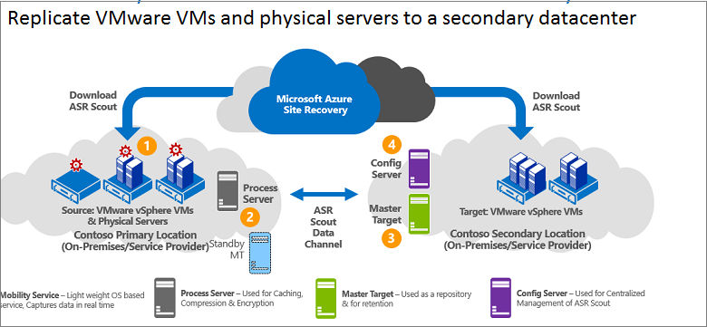

# Architecture for VMware/physical server replication to a secondary on-premises site

This article describes the architecture and processes used when set up disaster recovery replication, failover, and recovery of on-premises VMware virtual machines (VMs) or physical Windows/Linux servers to a secondary VMware site using [Azure Site Recovery](site-recovery-overview.md).

## Architectural components

**Area** | **Component** | **Details**
--- | --- | ---
**Azure** | You deploy this scenario using InMage Scout. | To obtain InMage Scout you need an Azure subscription.   After you create a Recovery Services vault, you download InMage Scout and install the latest updates to set up the deployment.
**Process server** | Located in primary site | You deploy the process server to handle caching, compression, and data optimization.   It also handles push installation of the Unified Agent to machines you want to protect.
**Configuration server** | Located in secondary site | The configuration server manages, configure, and monitor your deployment, either using the management website or the vContinuum console.
**vContinuum server** | Optional. Installed in the same location as the configuration server. | It provides a console for managing and monitoring your protected environment.
**Master target server** | Located in the secondary site | The master target server holds replicated data. It receives data from the process server, creates a replica machine in the secondary site, and holds the data retention points.   The number of master target servers you need depends on the number of machines you're protecting.   If you want to fail back to the primary site, you need a master target server there too. The Unified Agent is installed on this server.
**VMware ESX/ESXi and vCenter server** |  VMs are hosted on ESX/ESXi hosts. Hosts are managed with a vCenter server | You need a VMware infrastructure to replicate VMware VMs.
**VMs/physical servers** |  Unified Agent installed on VMware VMs and physical servers you want to replicate. | The agent acts as a communication provider between all of the components.

## Replication process

1. You set up the component servers in each site (configuration, process, master target), and install the Unified Agent on machines that you want to replicate.
2. After initial replication, the agent on each machine sends delta replication changes to the process server.
3. The process server optimizes the data, and transfers it to the master target server on the secondary site. The configuration server manages the replication process.

**Figure 6: VMware to VMware replication**

## Next steps

[Set up](vmware-physical-secondary-disaster-recovery.md) disaster recovery of VMware VMs and physical servers to a secondary site.
