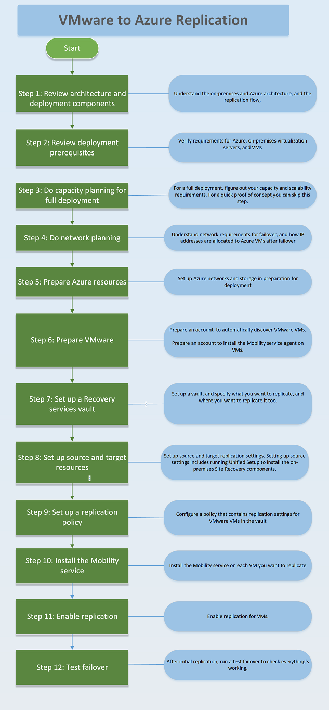

# Replicate VMware VMs to Azure with Site Recovery

> [!div class="op_single_selector"]
> * [Azure portal](vmware-walkthrough-overview.md)
> * [Azure classic](site-recovery-vmware-to-azure-classic.md)

This article provides an overview of the steps required to replicate on-premises VMware virtual machines to Azure, using the [Azure Site Recovery](site-recovery-overview.md) service in the Azure portal.

**Figure 1: Deployment process summary**

## Step 1: Review architecture and prerequisites

Before you start deployment, review the scenario architecture, and make sure you understand all the components you need to deploy

Go to [Step 1: Review the architecture](vmware-walkthrough-architecture.md)

## Step 2: Review prerequisites

Make sure you have the prerequisites in place for each deployment component:

- **Azure prerequisites**: You need a Microsoft Azure account, Azure networks, and storage accounts.
- **On-premises Site Recovery components**: You need a machine running on-premises Site Recovery components.
- **On-premises VMware prerequisites**: You need to set up accounts so that Site Recovery can access VMware servers and VMs.
- **Replicated VMs**: VMs you want to replicate need to comply with Azure requirements, and have the Mobility service component installed.

Go to [Step 2: Verify prerequisites and limitations](vmware-walkthrough-prerequisites.md)

## Step 3: Plan capacity

If you're doing a full deployment you need to figure out what replication resources you need. There are a couple of tools available to help you do this. Go to Step 2. If you're doing a quick set up to test the environment you can skip this step.

Go to [Step 3: Plan capacity](vmware-walkthrough-capacity.md)

## Step 4: Plan networking

You need to do some network planning to ensure that Azure VMs are connected to networks after failover occurs, and  that that they have the right IP addresses.

Go to [Step 4: Plan networking](vmware-walkthrough-network.md)

##  Step 5: Prepare Azure resources

Set up Azure networks and storage before you start. You can do this during deployment, but we recommend you do this before you start.

Go to [Step 5: Prepare Azure](vmware-walkthrough-prepare-azure.md)

## Step 6: Prepare VMware

You need to set up accounts that Site Recovery will use to:

- Access VMware virtualization servers to automatically detect VMs.
- Access VMs to install the Mobility service. Each VM you want to replicate must have the Mobility service agent installed before you can enable replication for it.

Go to [Step 6: Prepare VMware](vmware-walkthrough-prepare-vmware.md)

## Step 7: Set up a vault

You need to set up a Recovery Services vault to orchestrate and manage replication. When you set up the vault, you specify what you want to replicate, and where you want to replicate it to.

Go to [Step 7: Create a vault](vmware-walkthrough-create-vault.md)

## Step 8: Configure source and target settings

Set up the source and target that's used for replication. Setting up source settings includes running Unified Setup to install the on-premises Site Recovery components.

Go to [Step 8: Set up the source and target](vmware-walkthrough-source-target.md)

## Step 9: Set up a replication policy

You set up a policy to specify replication settings for VMware VMs in the vault.

Go to [Step 9: Set up a replication policy](vmware-walkthrough-replication.md)

## Step 10: Install the Mobility service

The Mobility service must be installed on each VM you want to replicate. There are a few ways to set up the service with push or pull installation.

Go to [Step 10: Install the Mobility service](vmware-walkthrough-install-mobility.md)

## Step 11: Enable replication

After the Mobility service is running on a VM you can enable replication for it. After enabling, initial replication of the VM occurs.

Go to [Step 11: Enable replication](vmware-walkthrough-enable-replication.md)

## Step 12: Run a test failover

After initial replication finishes, and delta replication is running, you can run a test failover to make sure everything works as expected.

Go to [Step 12: Run a test failover](vmware-walkthrough-test-failover.md)
