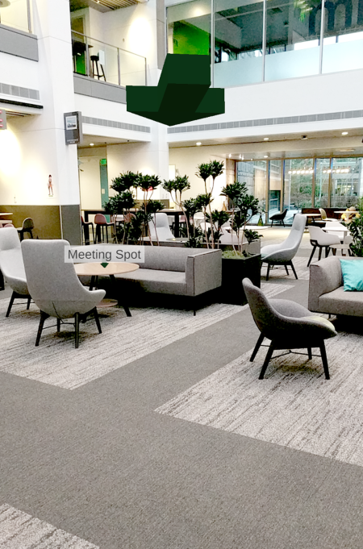

# Anchor relationships and way-finding in Azure Spatial Anchors

By using anchor relationships, you can create connected anchors in a space and then ask questions like these:

* Are there anchors nearby?
* How far away are they?

## Examples

You could use connected anchors in cases like these:

* A worker needs to complete a task that involves visiting various locations in an industrial factory. The factory has spatial anchors at each location. A HoloLens or mobile app helps guide the worker from one location to the next. The app first asks for the nearby spatial anchors and then guides the worker to the next location. The app visually shows the general direction and distance to the next location.

* A museum creates spatial anchors at public displays. Together, these anchors form a one-hour tour of the museum's essential public displays. At a public display, visitors can open the museum's mixed reality app on their mobile device. Then they point their phone camera around the space to see the general direction and distance to the other public displays on the tour. As a user walks toward a public display, the app updates the general direction and distance to help guide the user.

## Set up way-finding

An app that uses line-of-sight direction and distance between anchors to provide guidance is using *way-finding*. Way-finding is different from turn-by-turn navigation. In turn-by-turn navigation, users are guided around walls, through doors, and between floors. With way-finding, the user gets hints about the general direction of the destination. But inference or knowledge of the space also helps the user navigate through the structure to the destination.

To build a way-finding experience, first prepare a space for the experience and develop an app that users will interact with. These are the conceptual steps:

1. **Plan the space**: Decide which locations within the space will be part of the way-finding experience. In our scenarios, the factory supervisor or the museum tour coordinator might decide which locations to include in the way-finding experience.
2. **Connect anchors**: Visit the chosen locations to create spatial anchors. You can do this in an admin mode of the end-user app or in a different app entirely. You'll connect or relate each anchor to the others. The service maintains these relationships.
3. **Start the end-user experience**: Users run the app to locate an anchor, which can be in any of the chosen locations. Your overall design should determine the locations where users can enter the experience.
4. **Find nearby anchors**: After the user finds an anchor, the app can request nearby anchors. This procedure returns a pose between the device and these anchors.
5. **Guide the user**: The app can use the pose to each of these anchors to give guidance about the user's general direction and distance. For example, the camera feed in the app might show an icon and arrow to represent each potential destination, as the following image shows.
6. **Refine the guidance**: As the user walks, the app can periodically calculate a new pose between the device and the destination anchor. The app continues to refine the guidance hints that help the user arrive at the destination.

    

## Connect anchors

To build a way-finding experience, you first need to place the anchors in the chosen locations. In this section, we'll assume the app's admin has already finished this work.

### Connect anchors in a single session

To connect anchors:

1. Walk to the first location and create Anchor A by using a CloudSpatialAnchorSession.
2. Walk to the second location. The underlying MR/AR platform tracks the movement.
3. Create Anchor B by using the same CloudSpatialAnchorSession. Anchors A and B are now connected. The Spatial Anchors service maintains this relationship.
4. Continue the procedure for the remaining anchors.

### Connect anchors in multiple sessions

You can connect spatial anchors over multiple sessions. Using this method, you can create and connect some anchors at one time and then later create and connect more anchors.

To connect anchors over multiple sessions:

1. The app creates some anchors (Anchors A and B) in one CloudSpatialAnchorSession.
2. At a different time, the app locates one of these anchors (for example, Anchor A) by using a new CloudSpatialAnchorSession.
3. Walk to a new location. The underlying mixed-reality or augmented-reality platform tracks the movement.
4. Create Anchor C by using the same CloudSpatialAnchorSession. Anchors A, B, and C are now connected. The Spatial Anchors service maintains this relationship.

You can continue this procedure for more anchors and more sessions over time.

### Verify anchor connections

The app can verify that two anchors are connected by issuing a query for nearby anchors, which you do by setting the `NearAnchorCriteria` on a `CloudSpatialAnchorWatcher`. When the query's result contains the target anchor, the anchor connection is verified. If the anchors aren't connected, the app can try to connect them again.

Here are some reasons why anchors might fail to connect:

* The underlying mixed-reality or augmented-reality platform lost tracking during the process of connecting anchors.
* Because of a network error during communication with the Spatial Anchors service, the anchor connection couldn't be persisted.

### Find sample code

To find sample code that shows how to connect anchors and to do nearby queries, see [Spatial Anchors sample apps](https://github.com/Azure/azure-spatial-anchors-samples).
