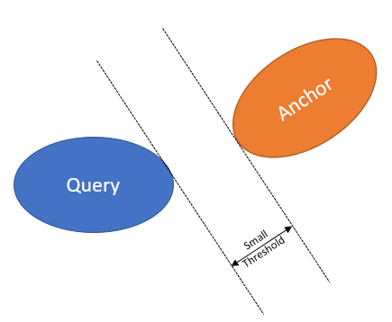

# Coarse relocalization

Coarse relocalization is a feature that provides an initial answer to the question: *Where is my device now / What content should I be observing?* The response isn't precise, but instead is in the form: *You're close to these anchors; try locating one of them*.

Coarse relocalization works by associating various on-device sensor readings with both the creation and the querying of anchors. For outdoor scenarios, the sensor data is typically the GPS (Global Positioning System) position of the device. When GPS is not available or unreliable (such as indoors), the sensor data consists of the WiFi access points and Bluetooth beacons in range. All collected sensor data contributes to maintaining a spatial index this is used by the Azure Spatial Anchors to quickly determine the anchors that are within approximately 100 meters of your device.

The fast look-up of anchors enabled by coarse relocalization simplifies the development of applications backed by world-scale collections of (say, millions of geo-distributed) anchors. The complexity of anchor management is all hidden away, allowing you to focus more on your awesome application logic. All the anchor heavy-lifting is done for you behind the scenes by Azure Spatial Anchors.

## Collected sensor data

The sensor data you can send to the anchor service is one of the following:

* GPS position: latitude, longitude, altitude.
* Signal strength of WiFi access points in range.
* Signal strength of Bluetooth beacons in range.

In general, your application will need to acquire device-specific permissions to access GPS, WiFi, or BLE data. Additionally, some of the sensor data above isn't available by design on certain platforms. To account for these situations, the collection of sensor data is optional and is turned off by default.

## Set up the sensor data collection

Let's start by creating a sensor fingerprint provider and making the session aware of it:

# [C#](#tab/csharp)

```csharp
// Create the sensor fingerprint provider
sensorProvider = new PlatformLocationProvider();

// Create and configure the session
cloudSpatialAnchorSession = new CloudSpatialAnchorSession();

// Inform the session it can access sensor data from your provider
cloudSpatialAnchorSession.LocationProvider = sensorProvider;
```

# [ObjC](#tab/objc)

```objc
// Create the sensor fingerprint provider
ASAPlatformLocationProvider *sensorProvider;
sensorProvider = [[ASAPlatformLocationProvider alloc] init];

// Create and configure the session
cloudSpatialAnchorSession = [[ASACloudSpatialAnchorSession alloc] init];

// Inform the session it can access sensor data from your provider
cloudSpatialAnchorSession.locationProvider = sensorProvider;
```

# [Swift](#tab/swift)

```swift
// Create the sensor fingerprint provider
var sensorProvider: ASAPlatformLocationProvider?
sensorProvider = ASAPlatformLocationProvider()

// Create and configure the session
cloudSpatialAnchorSession = ASACloudSpatialAnchorSession()

// Inform the session it can access sensor data from your provider
cloudSpatialAnchorSession!.locationProvider = sensorProvider
```

# [Java](#tab/java)

```java
// Create the sensor fingerprint provider
PlatformLocationProvider sensorProvider = new PlatformLocationProvider();

// Create and configure the session
cloudSpatialAnchorSession = new CloudSpatialAnchorSession();

// Inform the session it can access sensor data from your provider
cloudSpatialAnchorSession.setLocationProvider(sensorProvider);
```

# [C++ NDK](#tab/cpp)

```cpp
// Create the sensor fingerprint provider
std::shared_ptr<PlatformLocationProvider> sensorProvider;
sensorProvider = std::make_shared<PlatformLocationProvider>();

// Create and configure the session
cloudSpatialAnchorSession = std::make_shared<CloudSpatialAnchorSession>();

// Inform the session it can access sensor data from your provider
cloudSpatialAnchorSession->LocationProvider(sensorProvider);
```

# [C++ WinRT](#tab/cppwinrt)
```cpp
// Create the sensor fingerprint provider
PlatformLocationProvider sensorProvider = PlatformLocationProvider();

// Create and configure the session
cloudSpatialAnchorSession = CloudSpatialAnchorSession();

// Inform the session it can access sensor data from your provider
cloudSpatialAnchorSession.LocationProvider(sensorProvider);
```
---

Next, you'll need to decide which sensors you'd like to use for coarse relocalization. This decision is specific to the application you're developing, but the recommendations in the following table should give you a good starting point:


|             | Indoors | Outdoors |
|-------------|---------|----------|
| GPS         | Off | On |
| WiFi        | On | On (optional) |
| BLE beacons | On (optional with caveats, see below) | Off |


### Enabling GPS

Assuming your application already has permission to access the device's GPS position, you can configure Azure Spatial Anchors to use it:

# [C#](#tab/csharp)

```csharp
sensorProvider.Sensors.GeoLocationEnabled = true;
```

# [ObjC](#tab/objc)

```objc
ASASensorCapabilities *sensors = locationProvider.sensors;
sensors.geoLocationEnabled = true;
```

# [Swift](#tab/swift)

```swift
let sensors = locationProvider?.sensors
sensors.geoLocationEnabled = true
```

# [Java](#tab/java)

```java
SensorCapabilities sensors = sensorProvider.getSensors();
sensors.setGeoLocationEnabled(true);
```

# [C++ NDK](#tab/cpp)

```cpp
const std::shared_ptr<SensorCapabilities>& sensors = sensorProvider->Sensors();
sensors->GeoLocationEnabled(true);
```

# [C++ WinRT](#tab/cppwinrt)

```cpp
SensorCapabilities sensors = sensorProvider.Sensors()
sensors.GeoLocationEnabled(true);
```

---

When using GPS in your application, keep in mind that the readings provided by the hardware are typically:

* asynchronous and low frequency (less than 1 Hz).
* unreliable / noisy (on average 7-m standard deviation).

In general, both the device OS and Azure Spatial Anchors will do some filtering and extrapolation on the raw GPS signal in an attempt to mitigate these issues. This extra-processing requires additional time for convergence, so for best results you should try to:

* create one sensor fingerprint provider as early as possible in your application
* keep the sensor fingerprint provider alive between multiple sessions
* share the sensor fingerprint provider between multiple sessions

If you plan to use the sensor fingerprint provider outside an anchor session, make sure you start it before requesting sensor estimates. For instance, the following code will take care of updating your device's position on the map in real time:

# [C#](#tab/csharp)

```csharp
// Game about to start, start tracking the sensors
sensorProvider.Start();

// Game loop
while (m_isRunning)
{
    // Get the GPS estimate
    GeoLocation geoPose = sensorProvider.GetLocationEstimate();

    // Paint it on the map
    drawCircle(
        x: geoPose.Longitude,
        y: geoPose.Latitude,
        radius: geoPose.HorizontalError);
}

// Game ended, no need to track the sensors anymore
sensorProvider.Stop();
```

# [ObjC](#tab/objc)

```objc
// Game about to start, start tracking the sensors
[sensorProvider start];

// Game loop
while (m_isRunning)
{
    // Get the GPS estimate
    ASAGeoLocation *geoPose = [sensorProvider getLocationEstimate];

    // Paint it on the map
    drawCircle(geoPose.longitude, geoPose.latitude, geoPose.horizontalError);
}

// Game ended, no need to track the sensors anymore
[sensorProvider stop];
```

# [Swift](#tab/swift)

```swift
// Game about to start, start tracking the sensors
sensorProvider?.start()

// Game loop
while m_isRunning
{
    // Get the GPS estimate
    var geoPose: ASAGeoLocation?
    geoPose = sensorProvider?.getLocationEstimate()

    // Paint it on the map
    drawCircle(geoPose.longitude, geoPose.latitude, geoPose.horizontalError)
}

// Game ended, no need to track the sensors anymore
sensorProvider?.stop()
```

# [Java](#tab/java)

```java
// Game about to start, start tracking the sensors
sensorProvider.start();

// Game loop
while (m_isRunning)
{
    // Get the GPS estimate
    GeoLocation geoPose = sensorProvider.getLocationEstimate();

    // Paint it on the map
    drawCircle(geoPose.getLongitude(), geoPose.getLatitude(), geoPose.getHorizontalError());
}

// Game ended, no need to track the sensors anymore
sensorProvider.stop();
```

# [C++ NDK](#tab/cpp)

```cpp
// Game about to start, start tracking the sensors
sensorProvider->Start();

// Game loop
while (m_isRunning)
{
    // Get the GPS estimate
    std::shared_ptr<GeoLocation> geoPose = sensorProvider->GetLocationEstimate();

    // Paint it on the map
    drawCircle(geoPose->Longitude(), geoPose->Latitude(), geoPose->HorizontalError());
}

// Game ended, no need to track the sensors anymore
sensorProvider->Stop();
```

# [C++ WinRT](#tab/cppwinrt)

```cpp
// Game about to start, start tracking the sensors
sensorProvider.Start();

// Game loop
while (m_isRunning)
{
    // Get the GPS estimate
    GeoLocation geoPose = sensorProvider.GetLocationEstimate();

    // Paint it on the map
    drawCircle(geoPose.Longitude(), geoPose.Latitude(), geoPose.HorizontalError());
}

// Game ended, no need to track the sensors anymore
sensorProvider.Stop();
```

---

### Enabling WiFi

Assuming your application already has permission to access the device's WiFi state, you can configure Azure Spatial Anchors to use it:

# [C#](#tab/csharp)

```csharp
sensorProvider.Sensors.WifiEnabled = true;
```

# [ObjC](#tab/objc)

```objc
ASASensorCapabilities *sensors = locationProvider.sensors;
sensors.wifiEnabled = true;
```

# [Swift](#tab/swift)

```swift
let sensors = locationProvider?.sensors
sensors.wifiEnabled = true
```

# [Java](#tab/java)

```java
SensorCapabilities sensors = sensorProvider.getSensors();
sensors.setWifiEnabled(true);
```

# [C++ NDK](#tab/cpp)

```cpp
const std::shared_ptr<SensorCapabilities>& sensors = sensorProvider->Sensors();
sensors->WifiEnabled(true);
```

# [C++ WinRT](#tab/cppwinrt)

```cpp
SensorCapabilities sensors = sensorProvider.Sensors()
sensors.WifiEnabled(true);
```

---

When using WiFi in your application, keep in mind that the readings provided by the hardware are typically:

* asynchronous and low frequency (less than 0.1 Hz).
* potentially throttled at the OS level.
* unreliable / noisy (on average 3-dBm standard deviation).

Azure Spatial Anchors will attempt to build a filtered WiFi signal strength map during a session in an attempt to mitigate these issues. For best results you should try to:

* create the session well before placing the first anchor.
* keep the session alive for as long as possible (that is, create all anchors and query in one session).

### Enabling Bluetooth beacons

Assuming your application already has permission to access the device's Bluetooth state, you can configure Azure Spatial Anchors to use it:

# [C#](#tab/csharp)

```csharp
sensorProvider.Sensors.BluetoothEnabled = true;
```

# [ObjC](#tab/objc)

```objc
ASASensorCapabilities *sensors = locationProvider.sensors;
sensors.bluetoothEnabled = true;
```

# [Swift](#tab/swift)

```swift
let sensors = locationProvider?.sensors
sensors.bluetoothEnabled = true
```

# [Java](#tab/java)

```java
SensorCapabilities sensors = sensorProvider.getSensors();
sensors.setBluetoothEnabled(true);
```

# [C++ NDK](#tab/cpp)

```cpp
const std::shared_ptr<SensorCapabilities>& sensors = sensorProvider->Sensors();
sensors->BluetoothEnabled(true);
```

# [C++ WinRT](#tab/cppwinrt)

```cpp
SensorCapabilities sensors = sensorProvider.Sensors();
sensors.BluetoothEnabled(true);
```

---

Beacons are typically versatile devices, where everything - including UUIDs and MAC addresses - can be configured. This flexibility can be problematic for Azure Spatial Anchors as it considers beacons to be uniquely identified by their UUIDs. Failing to ensure this uniqueness will most likely cause spatial wormholes. For best results you should:

* assign unique UUIDs to your beacons.
* deploy them - typically in a regular pattern, such as a grid.
* pass the list of unique beacon UUIDs to the sensor fingerprint provider:

# [C#](#tab/csharp)

```csharp
sensorProvider.Sensors.KnownBeaconProximityUuids = new[]
{
    "22e38f1a-c1b3-452b-b5ce-fdb0f39535c1",
    "a63819b9-8b7b-436d-88ec-ea5d8db2acb0",
    . . .
};
```

# [ObjC](#tab/objc)

```objc
NSArray *uuids = @[@"22e38f1a-c1b3-452b-b5ce-fdb0f39535c1", @"a63819b9-8b7b-436d-88ec-ea5d8db2acb0"];

ASASensorCapabilities *sensors = locationProvider.sensors;
sensors.knownBeaconProximityUuids = uuids;
```

# [Swift](#tab/swift)

```swift
let uuids = [String]()
uuids.append("22e38f1a-c1b3-452b-b5ce-fdb0f39535c1")
uuids.append("a63819b9-8b7b-436d-88ec-ea5d8db2acb0")

let sensors = locationProvider?.sensors
sensors.knownBeaconProximityUuids = uuids
```

# [Java](#tab/java)

```java
String uuids[] = new String[2];
uuids[0] = "22e38f1a-c1b3-452b-b5ce-fdb0f39535c1";
uuids[1] = "a63819b9-8b7b-436d-88ec-ea5d8db2acb0";

SensorCapabilities sensors = sensorProvider.getSensors();
sensors.setKnownBeaconProximityUuids(uuids);
```

# [C++ NDK](#tab/cpp)

```cpp
std::vector<std::string> uuids;
uuids.push_back("22e38f1a-c1b3-452b-b5ce-fdb0f39535c1");
uuids.push_back("a63819b9-8b7b-436d-88ec-ea5d8db2acb0");

const std::shared_ptr<SensorCapabilities>& sensors = sensorProvider->Sensors();
sensors->KnownBeaconProximityUuids(uuids);
```

# [C++ WinRT](#tab/cppwinrt)

```cpp
std::vector<winrt::hstring> uuids;
uuids.emplace_back("22e38f1a-c1b3-452b-b5ce-fdb0f39535c1");
uuids.emplace_back("a63819b9-8b7b-436d-88ec-ea5d8db2acb0");

SensorCapabilities sensors = sensorProvider.Sensors();
sensors.KnownBeaconProximityUuids(uuids);
```

---

Azure Spatial Anchors will only track Bluetooth beacons that are in the known beacon proximity UUIDs list. Malicious beacons programmed to have allow-listed UUIDs can still negatively impact the quality of the service though. For that reason, you should use beacons only in curated spaces where you can control their deployment.

## Querying with sensor data

Once you have created anchors with associated sensor data, you can start retrieving them using the sensor readings reported by your device. You're no longer required to provide the service with a list of known anchors you're expecting to find - instead you just let the service know the location of your device as reported by its onboard sensors. Azure Spatial Anchors will then figure out the set of anchors close to your device and attempt to visually match them.

To have queries use the sensor data, start by creating "near device" criteria:

# [C#](#tab/csharp)

```csharp
NearDeviceCriteria nearDeviceCriteria = new NearDeviceCriteria();

// Choose a maximum exploration distance between your device and the returned anchors
nearDeviceCriteria.DistanceInMeters = 5;

// Cap the number of anchors returned
nearDeviceCriteria.MaxResultCount = 25;

anchorLocateCriteria = new AnchorLocateCriteria();
anchorLocateCriteria.NearDevice = nearDeviceCriteria;
```

# [ObjC](#tab/objc)

```objc
ASANearDeviceCriteria *nearDeviceCriteria = [[ASANearDeviceCriteria alloc] init];

// Choose a maximum exploration distance between your device and the returned anchors
nearDeviceCriteria.distanceInMeters = 5.0f;

// Cap the number of anchors returned
nearDeviceCriteria.maxResultCount = 25;

ASAAnchorLocateCriteria *anchorLocateCriteria = [[ASAAnchorLocateCriteria alloc] init];
anchorLocateCriteria.nearDevice = nearDeviceCriteria;
```

# [Swift](#tab/swift)

```swift
let nearDeviceCriteria = ASANearDeviceCriteria()!

// Choose a maximum exploration distance between your device and the returned anchors
nearDeviceCriteria.distanceInMeters = 5.0

// Cap the number of anchors returned
nearDeviceCriteria.maxResultCount = 25

let anchorLocateCriteria = ASAAnchorLocateCriteria()!
anchorLocateCriteria.nearDevice = nearDeviceCriteria
```

# [Java](#tab/java)

```java
NearDeviceCriteria nearDeviceCriteria = new NearDeviceCriteria();

// Choose a maximum exploration distance between your device and the returned anchors
nearDeviceCriteria.setDistanceInMeters(5.0f);

// Cap the number of anchors returned
nearDeviceCriteria.setMaxResultCount(25);

AnchorLocateCriteria anchorLocateCriteria = new AnchorLocateCriteria();
anchorLocateCriteria.setNearDevice(nearDeviceCriteria);
```

# [C++ NDK](#tab/cpp)

```cpp
auto nearDeviceCriteria = std::make_shared<NearDeviceCriteria>();

// Choose a maximum exploration distance between your device and the returned anchors
nearDeviceCriteria->DistanceInMeters(5.0f);

// Cap the number of anchors returned
nearDeviceCriteria->MaxResultCount(25);

auto anchorLocateCriteria = std::make_shared<AnchorLocateCriteria>();
anchorLocateCriteria->NearDevice(nearDeviceCriteria);
```

# [C++ WinRT](#tab/cppwinrt)

```cpp
NearDeviceCriteria nearDeviceCriteria = NearDeviceCriteria();

// Choose a maximum exploration distance between your device and the returned anchors
nearDeviceCriteria.DistanceInMeters(5.0f);

// Cap the number of anchors returned
nearDeviceCriteria.MaxResultCount(25);

// Set the session's locate criteria
anchorLocateCriteria = AnchorLocateCriteria();
anchorLocateCriteria.NearDevice(nearDeviceCriteria);
```

---

The `DistanceInMeters` parameter controls how far we'll explore the anchor graph to retrieve content. Assume for instance that you have populated some space with anchors at a constant density of 2 every meter. Furthermore, the camera on your device is  observing a single anchor and the service has successfully located it. You're most likely interested in retrieving all the anchors you've placed nearby rather than the single anchor you're currently observing. Assuming the anchors you've placed are connected in a graph, the service can retrieve all the nearby anchors for you by following the edges in the graph. The amount of graph traversal done is controlled by `DistanceInMeters`; you'll be given all the anchors connected to the one you've located, that are closer than `DistanceInMeters`.

Keep in mind that large values for `MaxResultCount` may negatively affect performance. Set it to a sensible value for your application.

Finally, you'll need to tell the session to use the sensor-based look up:

# [C#](#tab/csharp)

```csharp
cloudSpatialAnchorSession.CreateWatcher(anchorLocateCriteria);
```

# [ObjC](#tab/objc)

```objc
[cloudSpatialAnchorSession createWatcher:anchorLocateCriteria];
```

# [Swift](#tab/swift)

```swift
cloudSpatialAnchorSession!.createWatcher(anchorLocateCriteria)
```

# [Java](#tab/java)

```java
cloudSpatialAnchorSession.createWatcher(anchorLocateCriteria);
```

# [C++ NDK](#tab/cpp)

```cpp
cloudSpatialAnchorSession->CreateWatcher(anchorLocateCriteria);
```

# [C++ WinRT](#tab/cppwinrt)

```cpp
cloudSpatialAnchorSession.CreateWatcher(anchorLocateCriteria);
```

---

## Expected results

Consumer-grade GPS devices are typically quite imprecise. A study by [Zandenbergen and Barbeau (2011)][6] reports the median accuracy of mobile phones with assisted GPS (A-GPS) to be around 7 meters - quite a large value to be ignored! To account for these measurement errors, the service treats the anchors as probability distributions in GPS space. As such, an anchor is now the region of space that most likely (that is, with more than 95% confidence) contains its true, unknown GPS position.

The same reasoning is applied when querying with GPS. The device is represented as another spatial confidence region around its true, unknown GPS position. Discovering nearby anchors translates into simply finding the anchors with confidence regions *close enough* to the device's confidence region, as illustrated in the image below:



The accuracy of the GPS signal, both on anchor creation as well as during queries, has a large influence over the set of returned anchors. In contrast, queries based on WiFi / beacons will consider all anchors that have at least one access point / beacon in common with the query. In that sense, the result of a query based on WiFi / beacons is mostly determined by the physical range of the access points / beacons, and environmental obstructions.

The table below estimates the expected search space for each sensor type:

| Sensor      | Search space radius (approx.) | Details |
|-------------|:-------:|---------|
| GPS         | 20 m - 30 m | Determined by the GPS uncertainty among other factors. The reported numbers are estimated for the median GPS accuracy of mobile phones with A-GPS, that is 7 meters. |
| WiFi        | 50 m - 100 m | Determined by the range of the wireless access points. Depends on the frequency, transmitter strength, physical obstructions, interference, and so on. |
| BLE beacons |  70 m | Determined by the range of the beacon. Depends on the frequency, transmission strength, physical obstructions, interference, and so on. |

## Per-platform support

The following table summarizes the sensor data collected on each of the supported platforms, along with any platform-specific caveats:


|             | HoloLens | Android | iOS |
|-------------|----------|---------|-----|
| GPS         | N/A | Supported through [LocationManager][3] APIs (both GPS and NETWORK) | Supported through [CLLocationManager][4] APIs |
| WiFi        | Supported at a rate of approximately one scan every 3 seconds | Supported. Starting with API level 28, WiFi scans are throttled to 4 calls every 2 minutes. From Android 10, the throttling can be disabled from the Developer settings menu. For more information, see the [Android documentation][5]. | N/A - no public API |
| BLE beacons | Limited to [Eddystone][1] and [iBeacon][2] | Limited to [Eddystone][1] and [iBeacon][2] | Limited to [Eddystone][1] and [iBeacon][2] |

## Next steps

Use coarse relocalization in an app.

> [!div class="nextstepaction"]
> [Unity](../how-tos/set-up-coarse-reloc-unity.md)

> [!div class="nextstepaction"]
> [Objective-C](../how-tos/set-up-coarse-reloc-objc.md)

> [!div class="nextstepaction"]
> [Swift](../how-tos/set-up-coarse-reloc-swift.md)

> [!div class="nextstepaction"]
> [Java](../how-tos/set-up-coarse-reloc-java.md)

> [!div class="nextstepaction"]
> [C++/NDK](../how-tos/set-up-coarse-reloc-cpp-ndk.md)

> [!div class="nextstepaction"]
> [C++/WinRT](../how-tos/set-up-coarse-reloc-cpp-winrt.md)

<!-- Reference links in article -->
[1]: https://developers.google.com/beacons/eddystone
[2]: https://developer.apple.com/ibeacon/
[3]: https://developer.android.com/reference/android/location/LocationManager
[4]: https://developer.apple.com/documentation/corelocation/cllocationmanager?language=objc
[5]: https://developer.android.com/guide/topics/connectivity/wifi-scan
[6]: https://www.cambridge.org/core/journals/journal-of-navigation/article/positional-accuracy-of-assisted-gps-data-from-highsensitivity-gpsenabled-mobile-phones/E1EE20CD1A301C537BEE8EC66766B0A9
