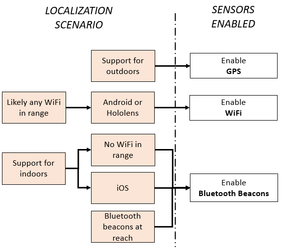

# Coarse relocalization

Coarse relocalization is a feature that enables large-scale localization by providing an approximate but fast answer to these questions: 
- *Where is my device now?* 
- *What content should I be observing?* 
 
The response isn't precise. It's in this form: *You're close to these anchors. Try to locate one of them*.

Coarse relocalization works by tagging anchors with various on-device sensor readings that are later used for fast querying. For outdoor scenarios, the sensor data is typically the GPS (Global Positioning System) position of the device. When GPS is unavailable or unreliable, like when you're indoors, the sensor data consists of the Wi-Fi access points and Bluetooth beacons in range. The collected sensor data contributes to maintaining a spatial index used by Azure Spatial Anchors to quickly determine which anchors are close to your device.

## When to use coarse relocalization

If you're planning to handle anchors in a space larger than a tennis court, you'll probably benefit from coarse relocalization spatial indexing.

The fast lookup of anchors enabled by coarse relocalization is designed to simplify the development of applications backed by world-scale collections of, say, millions of geo-distributed anchors. The complexity of spatial indexing is all hidden, so you can focus on your application logic. All the difficult work is done behind the scenes by Azure Spatial Anchors.

## Using coarse relocalization

Here's the typical workflow to create and query Azure Spatial Anchors with coarse relocalization:
1.  Create and configure a sensor fingerprint provider to collect the sensor data that you want.
2.  Start an Azure Spatial Anchors session and create the anchors. Because sensor fingerprinting is enabled, the anchors are spatially indexed by coarse relocalization.
3.  Query surrounding anchors by using coarse relocalization via the dedicated search criteria in the Spatial Anchors session.

You can refer to one of these tutorials to set up coarse relocalization in your application:
* [Coarse relocalization in Unity](../how-tos/set-up-coarse-reloc-unity.md)
* [Coarse relocalization in Objective-C](../how-tos/set-up-coarse-reloc-objc.md)
* [Coarse relocalization in Swift](../how-tos/set-up-coarse-reloc-swift.md)
* [Coarse relocalization in Java](../how-tos/set-up-coarse-reloc-java.md)
* [Coarse relocalization in C++/NDK](../how-tos/set-up-coarse-reloc-cpp-ndk.md)
* [Coarse relocalization in C++/WinRT](../how-tos/set-up-coarse-reloc-cpp-winrt.md)

## Sensors and platforms

### Platform availability

The following types of sensors can be used in conjunction with coarse relocation (see details in table below):

* **GPS position**: latitude, longitude, altitude
* Signal strength of **Wi-Fi** access points in range
* Signal strength of **Bluetooth** beacons in range

This table summarizes the availability of the sensor data on supported platforms and provides information that you should be aware of:

|                 | HoloLens | Android | iOS |
|-----------------|----------|---------|-----|
| **GPS**         | No1  | Yes4 | Yes6, 7 |
| **Wi-Fi**        | Yes2 | Yes5 | Yes7 |
| **BLE beacons** | Yes3 | Yes3 | Yes3, 7|

1 An external GPS device can be associated with HoloLens. Handle the [UpdatedSensorFingerprintRequired](/dotnet/api/microsoft.azure.spatialanchors.cloudspatialanchorsession.updatedsensorfingerprintrequired) event to submit [GeoLocation](/dotnet/api/microsoft.azure.spatialanchors.geolocation) readings if you are using HoloLens with an external GPS tracker. 
2 Supported at a rate of approximately one scan every 3 seconds.  
3 Limited to [Eddystone][1] and [iBeacon][2]. 
4 Supported through [LocationManager][3] APIs (both GPS and NETWORK). 
5 Starting with API level 28, Wi-Fi scans are throttled to four calls every 2 minutes. Starting with Android 10, you can disable this throttling from the **Developer settings** menu. For more information, see the [Android documentation][5]. 
6 Supported directly through iOS. 
7 Supported indirectly through [CLLocationManager][4] APIs. 

### Which sensor to enable

The choice of sensor depends on the application you're developing and the platform.
This diagram provides a starting point for determining which combination of sensors you can enable, depending on the localization scenario:

The following sections provide more insight on the advantages and limitations of each sensor type.

### GPS

GPS is the go-to option for outdoor scenarios.
When you use GPS in your application, keep in mind that the readings provided by the hardware are typically:

* Asynchronous and low frequency (less than 1 Hz).
* Unreliable/noisy (on average, 7-m standard deviation).

In general, both the device OS and Spatial Anchors will do some filtering and extrapolation of the raw GPS signal in an attempt to mitigate these problems. This extra processing requires time for convergence, so, for best results, you should try to:

* Create one sensor fingerprint provider as early as possible in your application.
* Keep the sensor fingerprint provider alive between multiple sessions.
* Share the sensor fingerprint provider between multiple sessions.

Consumer-grade GPS devices are typically imprecise. A study by [Zandenbergen and Barbeau (2011)][6] reports that the median accuracy of mobile phones that have assisted GPS (A-GPS) is about 7 meters. That's quite a large value to ignore! To account for these measurement errors, the service treats anchors as probability distributions in GPS space. So an anchor is the region of space that most likely (with more than 95% confidence) contains its true, unknown GPS position.

The same reasoning applies when you query by using GPS. The device is represented as another spatial confidence region around its true, unknown GPS position. Discovering nearby anchors translates to finding the anchors with confidence regions *close enough* to the device's confidence region, as illustrated here:

### Wi-Fi

On HoloLens and Android, Wi-Fi signal strength can be a good way to enable indoor coarse relocalization.
The advantage is the potential immediate availability of Wi-Fi access points (common in office spaces and shopping malls, for example) with no extra setup needed.

> [!NOTE]
> iOS doesn't provide an API for reading Wi-Fi signal strength, so it can't be used for coarse relocalization enabled via Wi-Fi.

When you use Wi-Fi in your application, keep in mind that the readings provided by the hardware are typically:

* Asynchronous and low frequency (less than 0.1 Hz).
* Potentially throttled at the OS level.
* Unreliable/noisy (on average, 3-dBm standard deviation).

Spatial Anchors will try to build a filtered map of Wi-Fi signal strength during a session in an attempt to mitigate these issues. For best results, try to:

* Create the session well before you place the first anchor.
* Keep the session alive for as long as possible. (That is, create all anchors and query in one session.)

### Bluetooth beacons

Careful deployment of Bluetooth beacons is a good solution for large-scale indoor coarse relocalization scenarios, where GPS is absent or inaccurate. It's also the only indoor method that's supported on all three platforms.

Beacons are typically versatile devices on which everything can be configured, including UUIDs and MAC addresses. Azure Spatial Anchors expects beacons to be uniquely identified by their UUIDs. If you don't ensure this uniqueness, you'll probably get incorrect results. For best results:

* Assign unique UUIDs to your beacons.
* Deploy beacons in a way that covers your space uniformly and so that at least three beacons are reachable from any point in space.
* Pass the list of unique beacon UUIDs to the sensor fingerprint provider.

Radio signals like those of Bluetooth are affected by obstacles and can interfere with other radio signals. So it can be hard to guess whether your space is uniformly covered. To guarantee a better customer experience, we recommend that you manually test the coverage of your beacons. You can conduct a test by walking around your space with candidate devices and an application that shows Bluetooth in range. While you test the coverage, make sure you can reach at least three beacons from any strategic position in your space. Having too many beacons can result in more interference between them and won't necessarily improve the accuracy of coarse relocalization.

Bluetooth beacons typically cover 80 meters if no obstacles are present in the space.
So, for a space that has no large obstacles, you could deploy beacons in a grid pattern every 40 meters.

A beacon that's running out of battery will affect the results, so be sure to monitor your deployment periodically for low or uncharged batteries.

Azure Spatial Anchors will track only Bluetooth beacons that are in the known-beacon proximity UUIDs list. But malicious beacons programmed to have allowlisted UUIDs can negatively affect the quality of the service. So you'll get the best results in curated spaces where you can control beacon deployment.

### Sensor accuracy

The accuracy of the GPS signal, both during anchor creation and during queries, has a significant influence on the set of returned anchors. In contrast, queries based on Wi-Fi/beacons will consider all anchors that have at least one access point / beacon in common with the query. In that sense, the result of a query that's based on Wi-Fi/beacons is determined mostly by the physical range of the access points / beacons and environmental obstructions.
This table estimates the expected search space for each sensor type:

| Sensor      | Search-space radius (approximate) | Details |
|-------------|:-------:|---------|
| **GPS**         | 20 m to 30 m | Determined by the GPS uncertainty, among other factors. The reported numbers are estimated for the median GPS accuracy of mobile phones with A-GPS: 7 meters. |
| **Wi-Fi**        | 50 m to 100 m | Determined by the range of the wireless access points. Depends on the frequency, transmitter strength, physical obstructions, interference, and so on. |
| **BLE beacons** |  70 m | Determined by the range of the beacon. Depends on the frequency, transmission strength, physical obstructions, interference, and so on. |

<!-- Reference links in article -->
[1]: https://developer.estimote.com/eddystone/
[2]: https://developer.apple.com/ibeacon/
[3]: https://developer.android.com/reference/android/location/LocationManager
[4]: https://developer.apple.com/documentation/corelocation/cllocationmanager?language=objc
[5]: https://developer.android.com/guide/topics/connectivity/wifi-scan
[6]: https://www.cambridge.org/core/journals/journal-of-navigation/article/positional-accuracy-of-assisted-gps-data-from-highsensitivity-gpsenabled-mobile-phones/E1EE20CD1A301C537BEE8EC66766B0A9
