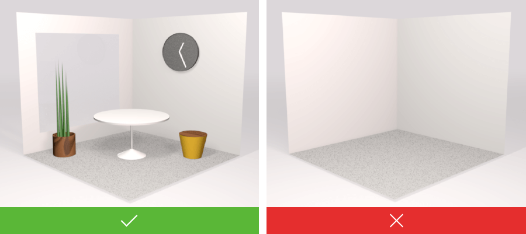
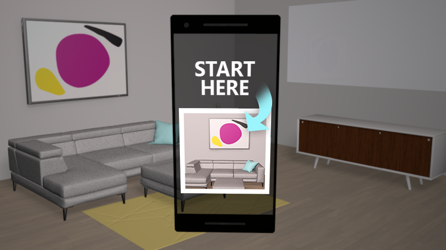
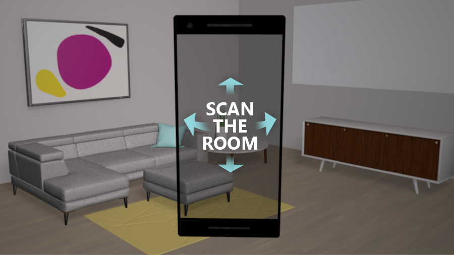

# Create an effective anchor experience by using Azure Spatial Anchors

This article provides guidelines and considerations to help you effectively create and locate anchors by using Spatial Anchors.

## Good anchors

Spatial Anchors helps you create good anchors. It's important to invest time in either educating or guiding users in your user experience (UX) to create good anchors. By investing in creating good anchors up front, you help end users to reliably find anchors:

- Across different devices.
- At various times.
- In different lighting conditions.
- From the desired perspectives within the space.

## Static and dynamic locations

Part of designing the anchor experience is choosing the locations. Will the locations be static and defined by an administrator of the space? Or will they be dynamic and defined by the user?

A retail store manager might want a static in-store experience to entice users to visit. But the developer of a mixed-reality board game would likely want to let users choose where to play.

For static locations, you can teach administrators to spend time curating the space with good anchors.

For dynamic locations, you should think about how you teach or guide users in your UX to create good anchors.

## Stable visual features

Visual tracking systems used on mixed-reality and augmented-reality devices rely on visual features of the environment. To get the most reliable experience:  

- *Do* create anchors in locations that have stable visual features (that is, features that don't change often).

- *Don't* create anchors on large blank surfaces that have no distinguishing characteristics.

- *Don't* create anchors on highly reflective materials.

- *Don't* create anchors on surfaces where the pattern repeats, such as carpet or wallpaper.

## Various viewing perspectives

When creating an anchor, think about the people who will later try to locate the anchor.

Consider, for example, an anchor in the middle of a room that has two doors. You likely want to allow users to enter the room from either door. When creating the anchor, you'll need to scan its position from both doorways. You change perspectives to capture environment data around the anchor so that users can locate the anchor from either door.

In general, when creating an anchor, scan it from the perspectives of the people who will try to locate it. So if you're placing virtual content on an outdoor sculpture, it makes sense to walk around the sculpture, while scanning it, as you create the anchor. If your anchor is in the corner of a room, there's only one direction to approach it from. When creating this anchor, you can scan it just from this perspective.

## Multiple anchors

Lighting can make a difference in the visual features that an app detects. Anchors created in strong natural light might be hard to locate in artificial light, and vice versa.  

If you have this issue, it can help to create two anchors. At the same spot, create one anchor in the daylight and another in artificial light. Your app can then query for both anchors. When either anchor is located, the app will have a pose for the anchor. 

Similarly, in environments where the visual features change because most objects move, multiple anchors can help. When an anchor becomes too difficult to find because of significant changes in the environment, you can replace the anchor with a new one. You might do this, for example, in a retail store where the layout is refreshed every few months.

## Targets and rooms

In many cases, an anchor is an entry point to your app's experience. You'll want to get through this step quickly and reliably so users can enter your experience. Spending time on how users will find your anchors is an important design step. It's helpful to think about finding anchors in terms of two broad scenarios: *targets* and *rooms*.

### Targets

In the target scenario, the location of an anchor is well known. For example, in a fictional mixed-reality painting app, one user places a virtual canvas on the wall. She instructs the other users in the room to point their devices at the same place on the wall to locate the anchor and begin the experience.  

Another example of a target scenario might be a sign in a coffee shop that reads, “Scan for deals.” The coffee shop has placed an anchor here. As users scan the sign, they locate the anchor and enter the augmented-reality experience to find deals on coffee.

In the target scenario, photos can help. If you show users a photo of the intended target on their device, they can quickly identify what to scan in the real world. For example, you might help your users arrive within the general area of an intended target by using GPS. When the user arrives, your app shows a photo of the target. The user looks around the space, finds the target, and scans for the anchor.

### Rooms

In the room scenario, users enter a space simply knowing there's an anchor here somewhere. Users scan the space with their device and quickly locate the anchor.

This experience typically requires you to create well-curated anchors, as discussed in Various viewing perspectives. If you scanned the room from many perspectives when you created the anchor, users can scan almost anywhere when they try to locate it.

Essentially, you spend more time scanning the space when you create the anchor so that later users can scan and locate the anchor quickly. As you create your experience, you'll need to consider this important trade-off.

The example of the mixed-reality painting app that we discussed earlier doesn't work well as a room scenario. Here, the user who places the anchor wants others to join the experience quickly. The users don't want to wait to start the experience until the room is well scanned. Because all users know exactly where to point their device to locate the anchors, this example works better as a target scenario.

## Anchor location

Visual tracking systems rely on the visual features in an environment. The more visual features that a scan includes, the higher the likelihood of finding an anchor.

Follow the general guidelines in this section to build a UX that encourages a useful scan of the environment.

First, if the user doesn't locate an anchor within a few seconds, the app should encourage users to move the device to capture more perspectives. The app can also encourage users to move themselves around the environment to scan for the anchor from more perspectives. The more feature perspectives that the device sees, the better.

For target scenarios, ask the user to move around the target to view it from different perspectives. In other words, ask the user to capture the target from new perspectives until the anchor is located.

For room scenarios, ask the user to slowly scan the room. For example, ask the user to turn to capture 180 degrees or even 360 degrees of the room. Or ask the user to view the room from a new perspective. 

The most meaningful method is to scan across the room. A scan across the room captures more visual features of the environment than a scan of a nearby wall, for example. A scan of a nearby wall won't capture as many useful visual features of the environment.

It's not helpful to repeatedly move the device from side to side when looking for an anchor. This simply captures the same points from the same perspective.

## Experience tests

In this article, we've discussed general guidelines. With Spatial Anchors, you're writing apps that interact with the real world. Because of that, you should devote time to testing your app's anchor scenarios in real environments. This is especially true for environments that represent where you expect your users to use the app.
