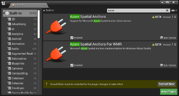
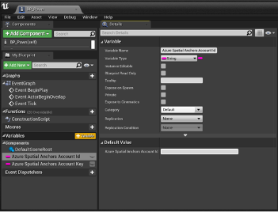
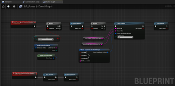
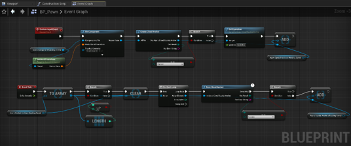
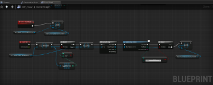
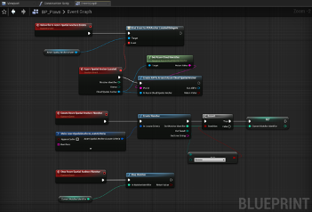

# How to create and locate anchors using Azure Spatial Anchors in Unreal

> [!div  class="op_single_selector"]
> * [Unity](create-locate-anchors-unity.md)
> * [Unreal](create-locate-anchors-unreal.md)
> * [Objective-C](create-locate-anchors-objc.md)
> * [Swift](create-locate-anchors-swift.md)
> * [Android Java](create-locate-anchors-java.md)
> * [C++/NDK](create-locate-anchors-cpp-ndk.md)
> * [C++/WinRT](create-locate-anchors-cpp-winrt.md)

Azure Spatial Anchors is a Microsoft Mixed Reality service that allows augmented reality devices to discover, share and persist anchor points in the physical world. Documentation below provides instructions for integrating the Azure spatial Anchors service into an Unreal project. If you're looking for more information, check out the [Azure Spatial Anchors service](https://azure.microsoft.com/services/spatial-anchors/#security).

## Prerequisites

To complete this guide, make sure you have:

- Installed [Unreal version 4.25](https://www.unrealengine.com/get-now) or later, as support for Azure Spatial Anchors isn't available in earlier releases.
- Read through the [Azure Spatial Anchors overview](../overview.md).
- Completed one of the [5-minute Quickstarts](../index.yml).
- Basic knowledge on C# and Unity.
- Basic knowledge on <a href="https://developers.google.com/ar/discover/" target="_blank">ARCore</a> if you want to use Android, or <a href="https://developer.apple.com/arkit/" target="_blank">ARKit</a> if you want to use iOS.

[!INCLUDE [Start](../../../includes/spatial-anchors-create-locate-anchors-start.md)]

## Adding Azure Spatial Anchors plugins
Before using Azure Spatial Anchors in your project, you need to:
* Get an **Account Id** and **Account Key** for your Azure Spatial Anchors account, which are used to authenticate users with your application's account. 
    * If you don't already have one, [create a spatial anchors resource](https://docs.microsoft.com/azure/spatial-anchors/quickstarts/get-started-hololens#create-a-spatial-anchors-resource) and grab your Account Id and Account Key before continuing.
    * Check out the [Azure Spatial Anchors authentication](https://docs.microsoft.com/azure/spatial-anchors/concepts/authentication?tabs=csharp) docs for more information.

> [!NOTE]
> Azure Spatial Anchors in Unreal 4.25 does not support Azure AD authentication tokens, but support for this functionality will be coming in a later release.

If you already have a HoloLens 2 project setup in Unreal you're good to go, otherwise follow the instructions in our [HoloLens 2 tutorial series](https://docs.microsoft.com/windows/mixed-reality/unreal-uxt-ch2) for creating and configuring one from scratch.

Lastly, you need to enable the necessary plugins in the Unreal editor by:
* Clicking **Editor > Plugins** and searching for **AzureSpatialAnchors** and **AzureSpatialAnchorsForWMR**.
* Select the **Enabled** checkbox in both plugins to allow access to the Azure Spatial Anchors blueprint libraries in your application.

Once that's done, restart the Unreal Editor for the plugin changes to take effect. The project is now ready to use Azure Spatial Anchors.

## Starting a Spatial Anchors session
// TODO: Add in overview of what an azure spatial anchors session is/does.

* Open the blueprint for the Pawn you're using in the application.
* Add two string variables for the **Account Id** and **Account Key**, then assign the corresponding values from your Azure Spatial Anchors account to authenticate the session.

In order to start an Azure Spatial Anchors session:
* Check that an AR Session is running in the HoloLens application, as the Azure Spatial Anchors session won't be able to successfully start until an AR Session is running. 
    * If you don't have one setup, [create an AR Session asset](https://docs.microsoft.com/windows/mixed-reality/unreal-uxt-ch3#adding-the-session-asset).
* Create an Azure Spatial Anchors session. 
    * Creating a session does not start the session by default, which allows the developer to configure the session for authentication with the Azure Spatial Anchors service.

//TODO: Add image for this step

* Configure the Azure Spatial Anchors session to provide the **Account Id** and **Account Key**. 

// TODO: Add image for this step

* Start the Azure Spatial Anchors session, allowing the application to create and locate Azure Spatial Anchors.

// TODO: Add image for this step

It's good practice to clean up Azure Spatial Anchors resources in your Event Graph blueprint when you're no longer using the service:
* First, stop the Azure Spatial Anchors session. 
    * At this point, the session will no longer be running, but its associated resources will still exist in the Azure Spatial Anchors plugin.

// TODO: Add image for this step

* Then destroy the Azure Spatial Anchors session. 
    * This will clean up any Azure Spatial Anchors session resources still known to the Azure Spatial Anchors plugin.

Your Event Graph blueprint should look like the screenshot below:

## Creating an anchor
// TODO: Add in overview of what an azure spatial anchors is and how it persists.

* First, ensure an Azure Spatial Anchors session is running. 
    * The application won't be able to create or persist an Azure Spatial Anchor when no Azure Spatial Anchors session is running.

// TODO: Add image for this step

* Next, create or obtain an Unreal **[Scene Component](https://docs.unrealengine.com/API/Runtime/Engine/Components/USceneComponent/index.html)** that should have it's location persisted. In the below image, we are using the **Scene Component Needing Anchor** component declared as a variable. 
    * An Unreal Scene Component is needed in order to establish an application world transform for an [AR Pin](https://docs.unrealengine.com/BlueprintAPI/HoloLensAR/ARPin/index.html) and Azure Spatial Anchor.

// TODO: Add image for this step

To construct and save an Azure Spatial Anchor for the desired Unreal Scene Component: 
* Call the [Pin Component](https://docs.unrealengine.com/BlueprintAPI/ARAugmentedReality/Pin/PinComponent/index.html) for the Unreal Scene Component and specify the Scene Component's **World Transform** as the World Transform used for the AR Pin. 
    * This creates an AR Pin, which is how Unreal tracks AR points in the application space, which is used to create an Azure Spatial Anchor.

// TODO: Add image for this step

* Call **Create Cloud Anchor** using the newly created AR Pin. 
    * This function creates an Azure Spatial Anchor locally but not in the Azure Spatial Anchor service. This allows parameters for the Azure Spatial Anchor, such as as an expiration date, to be set prior to creating the Azure Spatial Anchor with the service.

// TODO: Add image for this step

* Set the Azure Spatial Anchor expiration. This function's Lifetime parameter allows the developer to specify in seconds how long the anchor should be maintained by the service. 
    * For example, a week long expiration would take a value of 60 seconds x 60 minutes x 24 hours x 7 days = 604,800 seconds.

// TODO: Add image for this step

After setting anchor parameters, declare the anchor as ready to save. In the example below, the newly created Azure Spatial Anchor is added to a set of Azure Spatial Anchors needing saving. This set is declared as a variable for the Pawn blueprint.

// TODO: Add image for this step

## Saving an Anchor

After configuring the Azure Spatial Anchor with your desired parameters call **Save Cloud Anchor**, which declares the anchor to the Azure Spatial Anchors service. Once a call to Save Cloud Anchor succeeds, the associated Azure Spatial Anchor will be available for other users using Azure Spatial Anchor service.  

// TODO: Add image for this step

> [!NOTE]
> Save Cloud Anchor is a latent function and can only be called on a game thread event such as **EventTick**. Save Cloud Anchor may not appear as an available blueprint function in custom blueprint Macros/Functions. However, it should be available in the Pawn Event Graph blueprint editor.

In the example below, the Azure Spatial Anchor is stored in a set during an input event callback then saved on the Event tick. Saving an Azure Spatial Anchor may take multiple attempts depending on the amount of spatial data that your Azure Spatial Anchors session has created. Therefore, it's a good idea to check whether the save call succeeded. 

If it didn't save you can re-add the anchor to the set of anchors still needing to be saved. Subsequent EventTicks will then re-attempt saving the anchor until it is successfully saved with the Azure Spatial Anchor service.

Once the Azure Spatial Anchor is saved, you can use the transform of its associated AR Pin as a reference transform for placing content in the application. As other users in the application also detect this anchor, AR content can be aligned for different devices in the physical world.

## Deleting an Anchor

In addition to saving an anchor, developers can delete anchors from the Azure Spatial Anchor service by calling **Delete Cloud Anchor**. 

// TODO: Add image for this step

> [!NOTE] 
> Delete Cloud Anchor is a latent function and can only be called on a game thread event, such as Event Tick. Delete Cloud Anchor may not appear as an available blueprint function in custom blueprint Macros/Functions. It should however be available in the Pawn Event Graph blueprint editor.

In the example below, the anchor is flagged for deletion on a custom input event, then the deletion is attempted on the EventTick. If deleting the anchor fails, we re-add the Azure Spatial Anchor to the set of anchors flagged for deletion and try again on subsequent EventTicks.

Your Event Graph blueprint should now look like the screenshot below:

## Locating preexisting anchors

In addition to creating Azure Spatial Anchors, you can detect anchors created by peers with the Azure Spatial Anchors service:
* First, add an **AzureSpatialAnchorsEvent** component to your Pawn blueprint. 
    * This component allows you to subscribe to various Azure Spatial Anchors events, such as events called when Azure Spatial Anchors are located.

// TODO: Add image for this step

* Next, subscribe to the **ASAAnchor Located Delegate** for the **AzureSpatialAnchorsEvent** component. 
    * This delegate lets the application to know when new anchors associated with the Azure Spatial Anchors account have been located. 
    * With this event callback, Azure Spatial Anchors created by peers using the Azure Spatial Anchors session will not have AR Pins created by default. To create an AR Pin for the detected Azure Spatial Anchor, developers can call **Create ARPin Around Azure Cloud Spatial Anchor**.

In order to locate Azure Spatial Anchors created by peers using the Azure Spatial Anchor service, the application will have to create an **Azure Spatial Anchors Watcher**: 
* Check that an Azure Spatial Anchors session is running.
* Create an **AzureSpatialAnchorsLocateCriteria**. 
    * There are various location criteria parameters that can be specified, such as a distance from the user or distance from another anchors.
* Call **Create Watcher**.

// TODO: Add image for these step

The application now begins looking for Azure Spatial Anchors known to the Azure Spatial Anchors service. This means that users can locate Azure Spatial Anchors created by their peers.

After locating the desired Azure Spatial Anchor: 
* Call **Stop Watcher** to stop the Azure Spatial Anchors Watcher and clean up watcher resources.

// TODO: Add image for this step

Your final Event Graph blueprint should now look like the screenshot below:

## See also
* [Spatial Anchors documentation](https://docs.microsoft.com/azure/spatial-anchors/)
* [Spatial Anchor features](https://azure.microsoft.com/services/spatial-anchors/#features)
* [Effective anchor experience guidelines](https://docs.microsoft.com/azure/spatial-anchors/concepts/guidelines-effective-anchor-experiences)

