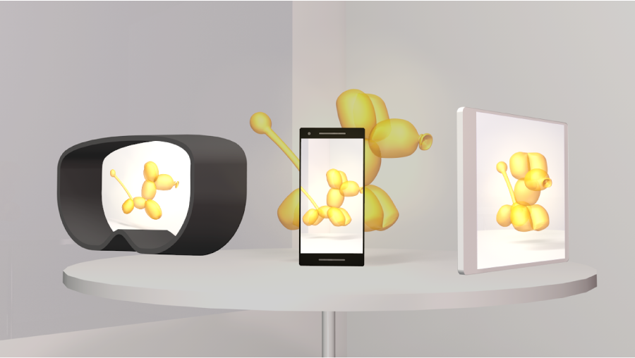

# Azure Spatial Anchors overview

Welcome to Azure Spatial Anchors. Azure Spatial Anchors empowers developers with essential capabilities to build spatially aware
mixed reality applications. These applications may support Microsoft HoloLens, iOS-based devices supporting ARKit, and
Android-based devices supporting ARCore. Azure Spatial Anchors enables developers to work with mixed reality platforms to
perceive spaces, designate precise points of interest, and to recall those points of interest from supported devices.
These precise points of interest are referred to as Spatial Anchors.

## Examples

Some example use cases enabled by Spatial Anchors include:

- [Multi-user experiences](tutorials/tutorial-share-anchors-across-devices.md). Azure Spatial Anchors makes it easy for people in the same place to participate in multi-user mixed reality applications. For example, two people can start a game of mixed reality chess by placing a virtual chess board on a table. Then, by pointing their device at the table, they can view and interact with the virtual chess board together.

- [Way-finding](concepts/anchor-relationships-way-finding.md). Developers can also connect Spatial Anchors together creating relationships between them. For example, an app may include an experience that has two or more points of interest that a user must interact with to complete a task. Those points of interest can be created in a connected fashion. Later, when the user is completing the multi-step task, the app can ask for anchors that are nearby the current one to direct the user towards the next step in the task.

- [Persisting virtual content in the real-world](how-tos/create-locate-anchors-unity.md#create-a-cloud-spatial-anchor). An app can let a user place a virtual calendar on a conference room wall, that people can see using a phone app or a HoloLens device. In an industrial setting, a user could receive contextual information about a machine by pointing a supported device camera at it.

Azure Spatial Anchors is composed of a managed service and client SDKs for supported device platforms. The following
sections provide information about getting started with building apps using Azure Spatial Anchors.

## Next steps

Create your first app with Azure Spatial Anchors.

> [!div class="nextstepaction"]
> [Unity (HoloLens)](quickstarts/get-started-unity-hololens.md)

> [!div class="nextstepaction"]
> [Unity (iOS)](quickstarts/get-started-unity-ios.md)

> [!div class="nextstepaction"]
> [Unity (Android)](quickstarts/get-started-unity-android.md)

> [!div class="nextstepaction"]
> [iOS](quickstarts/get-started-ios.md)

> [!div class="nextstepaction"]
> [Android](quickstarts/get-started-android.md)

> [!div class="nextstepaction"]
> [HoloLens](quickstarts/get-started-hololens.md)

> [!div class="nextstepaction"]
> [Xamarin (Android)](quickstarts/get-started-xamarin-android.md)

> [!div class="nextstepaction"]
> [Xamarin (iOS)](quickstarts/get-started-xamarin-ios.md)
