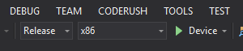

# Quickstart: Create a HoloLens app with Azure Spatial Anchors, in C++/WinRT and DirectX

This quickstart covers how to create a HoloLens app using [Azure Spatial Anchors](../overview.md) in C++/WinRT and DirectX. Azure Spatial Anchors is a cross-platform developer service that allows you to create mixed reality experiences using objects that persist their location across devices over time. When you're finished, you'll have a HoloLens app that can save and recall a spatial anchor.

You'll learn how to:

> [!div class="checklist"]
> * Create a Spatial Anchors account
> * Configure the Spatial Anchors account identifier and account key
> * Deploy and run on a HoloLens device

[!INCLUDE [quickstarts-free-trial-note](../../../includes/quickstarts-free-trial-note.md)]

## Prerequisites

To complete this quickstart, make sure you have:

- A Windows machine with <a href="https://www.visualstudio.com/downloads/" target="_blank">Visual Studio 2019</a> installed with the **Universal Windows Platform development** workload and the **Windows 10 SDK (10.0.17763.0 or newer)** component, and <a href="https://git-scm.com/download/win" target="_blank">Git for Windows</a>.
- The [C++/WinRT Visual Studio Extension (VSIX)](https://aka.ms/cppwinrt/vsix) for Visual Studio should be installed from the [Visual Studio Marketplace](https://marketplace.visualstudio.com/).
- A HoloLens device with [developer mode](https://docs.microsoft.com/windows/mixed-reality/using-visual-studio) enabled. This article requires a HoloLens device with the [Windows 10 October 2018 Update](https://docs.microsoft.com/windows/mixed-reality/release-notes-october-2018 ) (also known as RS5). To update to the latest release on HoloLens, open the **Settings** app, go to **Update & Security**, then select the **Check for updates** button.
- Your app must set the **spatialPerception** capability in its AppX manifest.

[!INCLUDE [Create Spatial Anchors resource](../../../includes/spatial-anchors-get-started-create-resource.md)]

## Open the sample project

[!INCLUDE [Clone Sample Repo](../../../includes/spatial-anchors-clone-sample-repository.md)]

Open `HoloLens\DirectX\SampleHoloLens.sln` in Visual Studio.

## Configure account identifier and key

The next step is to configure the app to use your account identifier and account key. You copied them into a text editor when [setting up the Spatial Anchors resource](#create-a-spatial-anchors-resource).

Open `HoloLens\DirectX\SampleHoloLens\ViewController.cpp`.

Locate the `SpatialAnchorsAccountKey` field and replace `Set me` with the account key.

Locate the `SpatialAnchorsAccountId` field and replace `Set me` with the account identifier.

## Deploy the app to your HoloLens

Change the **Solution Configuration** to **Release**, change **Solution Platform** to **x86**, and select **Device** from the deployment target options.

If using HoloLens 2, use **ARM** as the **Solution Platform**, instead of **x86**.

Power on the HoloLens device, sign in, and connect it to the PC using a USB cable.

Select **Debug** > **Start debugging** to deploy your app and start debugging.

Follow the instructions in the app to place and recall an anchor.

In Visual Studio, stop the app by either selecting **Stop Debugging** or pressing **Shift + F5**.

[!INCLUDE [Clean-up section](../../../includes/clean-up-section-portal.md)]

[!INCLUDE [Next steps](../../../includes/spatial-anchors-quickstarts-nextsteps.md)]

> [!div class="nextstepaction"]
> [Tutorial: Share Spatial Anchors across devices](../tutorials/tutorial-share-anchors-across-devices.md)
