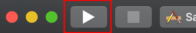

# Quickstart: Create an iOS app with Azure Spatial Anchors, in either Swift or Objective-C

This quickstart covers how to create an iOS app using [Azure Spatial Anchors](../overview.md) in either Swift or Objective-C. Azure Spatial Anchors is a cross-platform developer service that allows you to create mixed reality experiences using objects that persist their location across devices over time. When you're finished, you'll have an ARKit iOS app that can save and recall a spatial anchor.

You'll learn how to:

> [!div class="checklist"]
> * Create a Spatial Anchors account
> * Configure the Spatial Anchors account identifier and account key
> * Deploy and run on an iOS device

[!INCLUDE [quickstarts-free-trial-note](../../../includes/quickstarts-free-trial-note.md)]

## Prerequisites

To complete this quickstart, make sure you have:

- A developer enabled macOS machine with the latest version of <a href="https://geo.itunes.apple.com/us/app/xcode/id497799835?mt=12" target="_blank">Xcode</a> and <a href="https://cocoapods.org" target="_blank">CocoaPods</a> installed.
- Git installed via HomeBrew:
  1. Enter the following command as a single line in the terminal: `/usr/bin/ruby -e "$(curl -fsSL https://raw.githubusercontent.com/Homebrew/install/master/install)"`. 
  1. Run `brew install git` and `brew install git-lfs`.
  1. Update your git config with `git lfs install` (for the current user) or `git lfs install --system` (for the entire system).
- A developer enabled <a href="https://developer.apple.com/documentation/arkit/verifying_device_support_and_user_permission" target="_blank">ARKit compatible</a> iOS device.

[!INCLUDE [Create Spatial Anchors resource](../../../includes/spatial-anchors-get-started-create-resource.md)]

## Open the sample project

Use the Terminal to perform the following actions.

[!INCLUDE [Clone Sample Repo](../../../includes/spatial-anchors-clone-sample-repository.md)]

Install the necessary pods using CocoaPods:

# [Swift](#tab/openproject-swift)

Navigate to `iOS/Swift/`.

```bash
cd ./iOS/Swift/
```

# [Objective-C](#tab/openproject-objc)

Navigate to `iOS/Objective-C/`.

```bash
cd ./iOS/Objective-C/
```

---

Run `pod install --repo-update` to install the CocoaPods for the project.

Now open the `.xcworkspace` in Xcode.

> [!NOTE]
> See the troubleshooting steps [here](#cocoapods-issues-on-macos-catalina-1015) if you're having CocoaPod issues after
> upgrading to macOS Catalina (10.15).

# [Swift](#tab/openproject-swift)

```bash
open ./SampleSwift.xcworkspace
```

# [Objective-C](#tab/openproject-objc)

```bash
open ./SampleObjC.xcworkspace
```

---

## Configure account identifier and key

The next step is to configure the app to use your account identifier and account key. You copied them into a text editor when [setting up the Spatial Anchors resource](#create-a-spatial-anchors-resource).

# [Swift](#tab/openproject-swift)

Open `iOS/Swift/SampleSwift/ViewControllers/BaseViewController.swift`.

Locate the `spatialAnchorsAccountKey` field and replace `Set me` with the account key.

Locate the `spatialAnchorsAccountId` field and replace `Set me` with the account identifier.

Locate `startSession()` and add the following line, substituting in your account domain from earlier: `cloudSession!.configuration.accountDomain = "MyAccountDomain";`.

# [Objective-C](#tab/openproject-objc)

Open `iOS/Objective-C/SampleObjC/BaseViewController.m`.

Locate the `SpatialAnchorsAccountKey` field and replace `Set me` with the account key.

Locate the `SpatialAnchorsAccountId` field and replace `Set me` with the account identifier.

Locate `startSession()` and add the following line, substituting in your account domain from earlier: `_cloudSession.configuration.accountDomain = @"MyAccountDomain";`.

---

## Deploy the app to your iOS device

Connect the iOS device to the Mac and set the **active scheme** to your iOS device.


Select **Build and then run the current scheme**.



> [!NOTE]
> If you see a `library not found for -lPods-SampleObjC` error, you likely opened the `.xcodeproj` file instead of the
> `.xcworkspace`. Open the `.xcworkspace` and try again.

In Xcode, stop the app by pressing **Stop**.

## Troubleshooting

### CocoaPods issues on macOS Catalina (10.15)

If you recently updated to macOS Catalina (10.15) and had CocoaPods installed beforehand, CocoaPods may be in a broken
state and fail to properly configure your pods and `.xcworkspace` project files. To resolve this issue, you'll need to
reinstall CocoaPods by running the following commands:

```shell
brew update
brew install cocoapods --build-from-source
brew link --overwrite cocoapods
```

### App crashes when deploying to iOS 10.3.1 from a personal provisioning profile/developer account 

If you deploy your iOS app on iOS 10.3.1 from a personal provisioning profile/developer account, you might see this error: `Library not loaded: @rpath/ADAL...`. 

To resolve the issue:

- Use a provisioning profile that isn't a Personal Team profile (paid developer account).
- Deploy your app to an iOS device running iOS 13.3 or earlier, or to one running the iOS 13.4 beta or release version.
- Read more about this issue on [Stack Overflow](https://stackoverflow.com/questions/60015309/running-ios-apps-causes-runtime-error-for-frameworks-code-signature-invalid).


[!INCLUDE [Clean-up section](../../../includes/clean-up-section-portal.md)]

[!INCLUDE [Next steps](../../../includes/spatial-anchors-quickstarts-nextsteps.md)]

> [!div class="nextstepaction"]
> [Tutorial: Share Spatial Anchors across devices](../tutorials/tutorial-share-anchors-across-devices.md)
