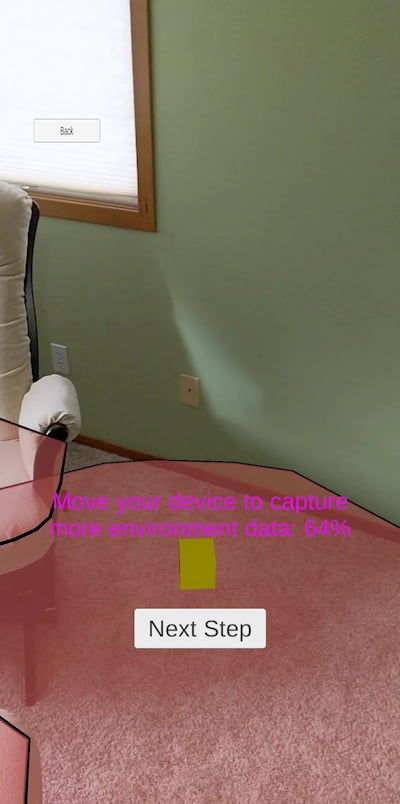
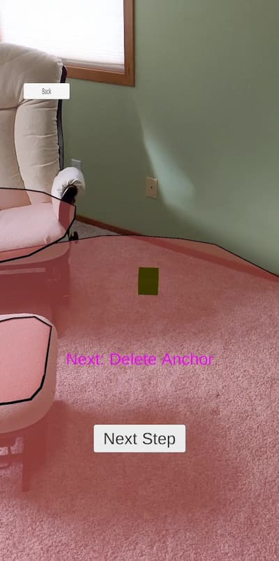

# Run the sample app: Android - Unity (C#)

This quickstart covers how to run the [Azure Spatial Anchors](../overview.md) sample app for Android devices using Unity (C#). Azure Spatial Anchors is a cross-platform developer service that allows you to create mixed reality experiences using objects that persist their location across devices over time. When you're finished, you'll have an ARCore Android app built with Unity that can save and recall a spatial anchor.

You'll learn how to:

> [!div class="checklist"]
> * Create a Spatial Anchors account
> * Prepare Unity build settings
> * Configure the Spatial Anchors account identifier and account key
> * Export the Android Studio project
> * Deploy and run on an Android device

[!INCLUDE [quickstarts-free-trial-note](../../../includes/quickstarts-free-trial-note.md)]

## Prerequisites

To complete this quickstart, make sure you have:

- A <a href="https://developer.android.com/studio/debug/dev-options" target="_blank">developer enabled</a> and <a href="https://developers.google.com/ar/discover/supported-devices" target="_blank">ARCore capable</a> Android device.
  - Additional device drivers may be required for your computer to communicate with your Android device. For more additional information and instructions, see [here](https://developer.android.com/studio/run/device.html).
- A Windows or macOS machine.
  - If running on Windows, you also need <a href="https://git-scm.com/download/win" target="_blank">Git for Windows</a> and <a href="https://git-lfs.github.com/">Git LFS</a>.
  - If running on macOS, get Git installed via HomeBrew. Enter the following command into a single line of the Terminal: `/usr/bin/ruby -e "$(curl -fsSL https://raw.githubusercontent.com/Homebrew/install/master/install)"`. Then, run `brew install git` and `brew install git-lfs`.
- A Unity installation, including the **Android Build Support** with **Android SDK & NDK Tools** and **OpenJDK** modules. For supported versions and required capabilities, visit the [Unity project setup page](../how-tos/setup-unity-project.md).

## Create a Spatial Anchors resource

[!INCLUDE [Create Spatial Anchors resource](../../../includes/spatial-anchors-get-started-create-resource.md)]

## Download sample project and import SDK

### Clone Samples Repository

[!INCLUDE [Clone Sample Repo](../../../includes/spatial-anchors-clone-sample-repository.md)]

### Import ASA SDK

Follow the instructions [here](../how-tos/setup-unity-project.md#download-asa-packages) to download and import the ASA SDK packages required for the Android platform.

## Configure Unity

[!INCLUDE [Open Unity Project](../../../includes/spatial-anchors-open-unity-project.md)]

[!INCLUDE [Android Unity Build Settings](../../../includes/spatial-anchors-unity-android-build-settings.md)]

## Configure the account information
[!INCLUDE [Configure Unity Scene](../../../includes/spatial-anchors-unity-configure-scene.md)]

## Export the Android Studio project

[!INCLUDE [Export Unity Project](../../../includes/spatial-anchors-unity-export-project-snip.md)]

Select your device in **Run Device** and then select **Build And Run**. You'll be asked to save an `.apk` file, which you can pick any name for.

In the app, select **BasicDemo** using the arrows, then press the **Go!** button to run the demo. Follow the instructions to place and recall an anchor.

Follow the instructions in the app to place and recall an anchor.

## Troubleshooting

### Rendering issues

When running the app, if you don't see the camera as the background (for instance you instead see a blank, blue, or other texture) then you likely need to reimport assets in Unity. Stop the app. From the top menu in Unity, choose **Assets -> Reimport all**. Then, run the app again.

[!INCLUDE [Clean-up section](../../../includes/clean-up-section-portal.md)]

[!INCLUDE [Next steps](../../../includes/spatial-anchors-quickstarts-nextsteps.md)]

> [!div class="nextstepaction"]
> [Tutorial: Share Spatial Anchors across devices](../tutorials/tutorial-share-anchors-across-devices.md)

> [!div class="nextstepaction"]
> [How To: Configure Azure Spatial Anchors in a Unity project](../how-tos/setup-unity-project.md)
