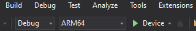
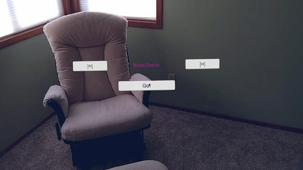
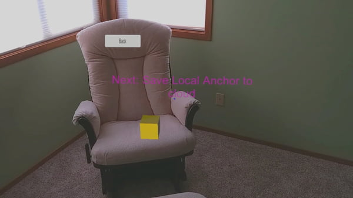
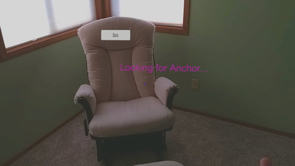
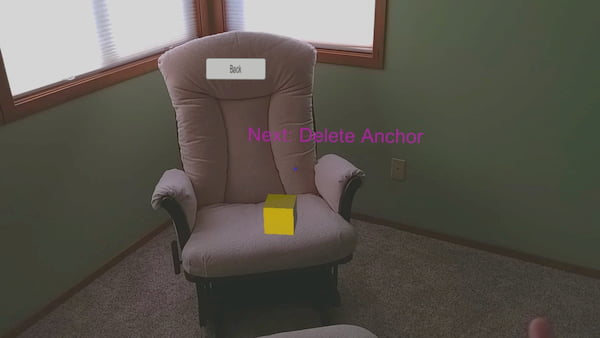

# Run the sample app: HoloLens - Unity (C#)

In this quickstart, you'll run the [Azure Spatial Anchors](../overview.md) sample app for HoloLens using Unity (C#). Spatial Anchors is a cross-platform developer service that allows you to create mixed reality experiences with objects that persist their location across devices over time. When you're finished, you'll have a HoloLens app built with Unity that can save and recall a spatial anchor.

You'll learn how to:

- Create a Spatial Anchors account.
- Prepare Unity build settings.
- Configure the Spatial Anchors account identifier and account key.
- Export the HoloLens Visual Studio project.
- Deploy the app and run it on a HoloLens device.

[!INCLUDE [quickstarts-free-trial-note](../../../includes/quickstarts-free-trial-note.md)]

## Prerequisites

To complete this quickstart:

- You need a HoloLens device with [developer mode](/windows/mixed-reality/using-visual-studio) enabled. For HoloLens 2 the [Windows 10 May 2020 Update or later](/windows/mixed-reality/whats-new/release-notes-may-2020) must be installed on the device. To update to the latest release on HoloLens, open the **Settings** app, go to **Update & Security**, and then select **Check for updates**.
- You need a Windows computer with <a href="https://www.visualstudio.com/downloads/" target="_blank">Visual Studio 2019</a> or later installed. Your Visual Studio installation must include the **Universal Windows Platform development** workload and the **Windows 10 SDK (10.0.18362.0 or newer)** component. You must also install <a href="https://git-scm.com/download/win" target="_blank">Git for Windows</a> and <a href="https://git-lfs.github.com/">Git LFS</a>.
- You need to have Unity installed. For supported versions and required capabilities, visit the [Unity project setup page](../how-tos/setup-unity-project.md).

## Create a Spatial Anchors resource

[!INCLUDE [Create Spatial Anchors resource](../../../includes/spatial-anchors-get-started-create-resource.md)]

## Download sample project and import SDK

### Clone Samples Repository

[!INCLUDE [Clone Sample Repo](../../../includes/spatial-anchors-clone-sample-repository.md)]

### Import ASA SDK

Follow the instructions [here](../how-tos/setup-unity-project.md#download-asa-packages) to download and import the ASA SDK packages required for the HoloLens platform.

## Configure Unity

[!INCLUDE [Open Unity Project](../../../includes/spatial-anchors-open-unity-project.md)]

[!INCLUDE [HoloLens Unity Build Settings](../../../includes/spatial-anchors-unity-hololens-build-settings.md)]

## Configure the account information
[!INCLUDE [Configure Unity Scene](../../../includes/spatial-anchors-unity-configure-scene.md)]

## Export the HoloLens Visual Studio project

[!INCLUDE [Export Unity Project](../../../includes/spatial-anchors-unity-export-project-snip.md)]

Select **Build**. In the dialog box, select a folder in which to export the HoloLens Visual Studio project.

When the export is complete, a folder containing the exported HoloLens project will appear.

## Deploy the HoloLens application

In the folder, double-click **HelloAR U3D.sln** to open the project in Visual Studio.

Change the **Solution Configuration** to **Release**, change the **Solution Platform** to **x86**, and select **Device** from the deployment target options.

If using HoloLens 2, use **ARM64** as the **Solution Platform**, instead of **x86**.

   

Turn on the HoloLens device, sign in, and connect the device to the PC by using a USB cable.

Select **Debug** > **Start debugging** to deploy your app and start debugging.

In the app, select **BasicDemo** using the arrows, then press the **Go!** button to run the demo. Follow the instructions to place and recall an anchor.

In Visual Studio, stop the app by selecting either **Stop Debugging** or Shift+F5.

[!INCLUDE [Clean-up section](../../../includes/clean-up-section-portal.md)]

[!INCLUDE [Next steps](../../../includes/spatial-anchors-quickstarts-nextsteps.md)]

> [!div class="nextstepaction"]
> [Tutorial: Share spatial anchors across devices](../tutorials/tutorial-share-anchors-across-devices.md)

> [!div class="nextstepaction"]
> [How To: Configure Azure Spatial Anchors in a Unity project](../how-tos/setup-unity-project.md)
