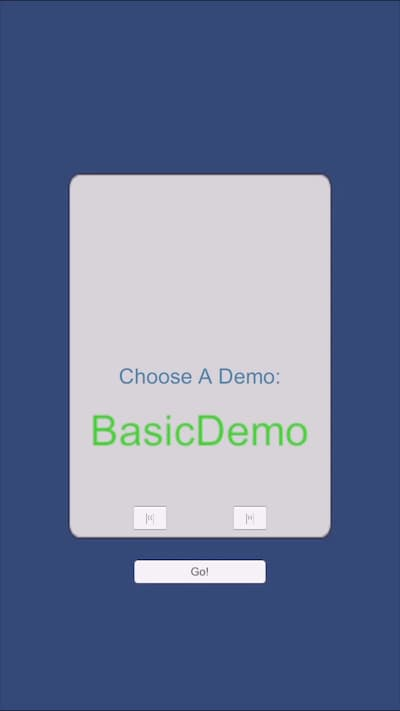
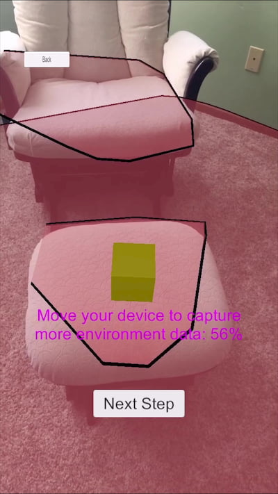
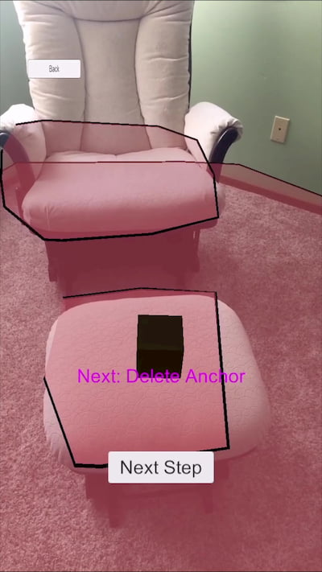

# Run the sample app: iOS - Unity (C#)

This quickstart covers how to run the [Azure Spatial Anchors](../overview.md) sample app for iOS devices using Unity (C#). Azure Spatial Anchors is a cross-platform developer service that allows you to create mixed reality experiences using objects that persist their location across devices over time. When you're finished, you'll have an ARKit iOS app built with Unity that can save and recall a spatial anchor.

You'll learn how to:

> [!div class="checklist"]
> * Create a Spatial Anchors account
> * Prepare Unity build settings
> * Configure the Spatial Anchors account identifier and account key
> * Export the Xcode project
> * Deploy and run on an iOS device

[!INCLUDE [quickstarts-free-trial-note](../../../includes/quickstarts-free-trial-note.md)]

## Prerequisites

To complete this quickstart, make sure you have:

- A developer enabled <a href="https://developer.apple.com/documentation/arkit/verifying_device_support_and_user_permission" target="_blank">ARKit compatible</a> iOS device.
- A macOS machine with the latest version of <a href="https://geo.itunes.apple.com/us/app/xcode/id497799835?mt=12" target="_blank">Xcode</a> installed.
- A Unity installation. For supported versions and required capabilities, visit the [Unity project setup page](../how-tos/setup-unity-project.md).
- Git installed via HomeBrew. Enter the following command into a single line of the Terminal: `/usr/bin/ruby -e "$(curl -fsSL https://raw.githubusercontent.com/Homebrew/install/master/install)"`. Then, run `brew install git` and `brew install git-lfs`.

## Create a Spatial Anchors resource

[!INCLUDE [Create Spatial Anchors resource](../../../includes/spatial-anchors-get-started-create-resource.md)]

## Download sample project and import SDK

### Clone Samples Repository

[!INCLUDE [Clone Sample Repo](../../../includes/spatial-anchors-clone-sample-repository.md)]

### Import ASA SDK

Follow the instructions [here](../how-tos/setup-unity-project.md#download-asa-packages) to download and import the ASA SDK packages required for the iOS platform.

## Configure Unity

[!INCLUDE [Open Unity Project](../../../includes/spatial-anchors-open-unity-project.md)]

[!INCLUDE [iOS Unity Build Settings](../../../includes/spatial-anchors-unity-ios-build-settings.md)]

## Configure the account information
[!INCLUDE [Configure Unity Scene](../../../includes/spatial-anchors-unity-configure-scene.md)]

## Export the Xcode project

[!INCLUDE [Export Unity Project](../../../includes/spatial-anchors-unity-export-project-snip.md)]

[!INCLUDE [Configure Xcode](../../../includes/spatial-anchors-unity-ios-xcode.md)]

In the app, select **BasicDemo** using the arrows, then press the **Go!** button to run the demo. Follow the instructions to place and recall an anchor.

When finished, stop the app by pressing **Stop** in Xcode.

## Troubleshooting

### Rendering issues

When running the app, if you don't see the camera as the background (for instance you instead see a blank, blue or other textures) then you likely need to re-import assets in Unity. Stop the app. From the top menu in Unity, choose **Assets -> Re-import all**. Then, run the app again.

[!INCLUDE [Clean-up section](../../../includes/clean-up-section-portal.md)]

[!INCLUDE [Next steps](../../../includes/spatial-anchors-quickstarts-nextsteps.md)]

> [!div class="nextstepaction"]
> [Tutorial: Share Spatial Anchors across devices](../tutorials/tutorial-share-anchors-across-devices.md)

> [!div class="nextstepaction"]
> [How To: Configure Azure Spatial Anchors in a Unity project](../how-tos/setup-unity-project.md)
