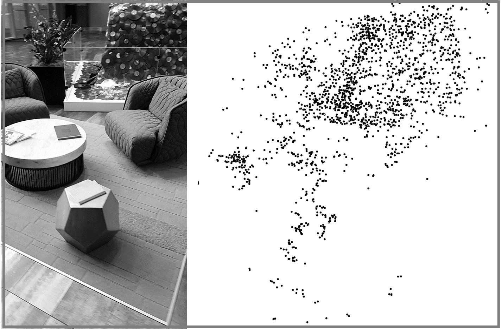
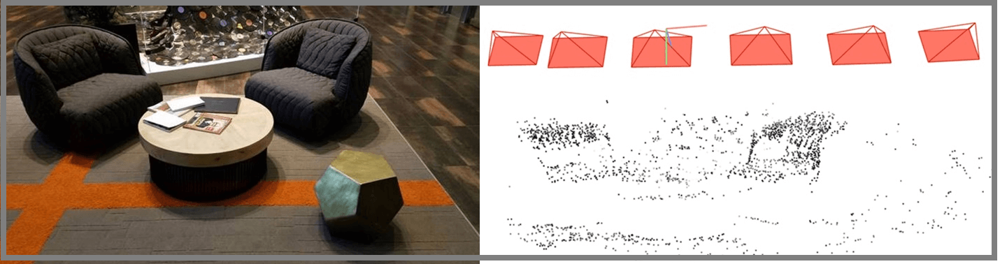

# Frequently asked questions about Azure Spatial Anchors

Azure Spatial Anchors is a managed cloud service and developer platform that enables cross-device, multi-user, mixed reality experiences across HoloLens, iOS and Android devices.

For more information, see [Azure Spatial Anchors overview](https://review.docs.microsoft.com/en-us/azure/spatial-anchors/overview?branch=release-pub-preview).

## Azure Spatial Anchors Product FAQs

**Q: Which devices does Azure Spatial Anchors support?**

**A:** Azure Spatial Anchors enables developers to build apps on HoloLens, on iOS devices with ARKit support, and on Android devices with ARCore support; for iOS and Android this includes both phones and tablets.

**Q: Do I have to be cloud connected to use Azure Spatial Anchors?**

**A:** Azure Spatial Anchors currently requires a network connection to the internet. We welcome your comments on our feedback site.

**Q: How accurately can Azure Spatial Anchors locate Anchors?**

**A:** Many factors affect the accuracy of locating anchors, including lighting conditions, the objects in the environment, and even the surface on which the anchor is placed. The best way to determine if the accuracy meets your needs is to try it in environments representative of the ones where you plan to use it. If you encounter environments where accuracy isn't meeting your needs, see **Submitting Diagnostics in Azure Spatial Anchors**.

**Q: How long does it take to create and locate Anchor?**

**A:** The time required to create and locate anchors is dependent on many factors such as the network connection, the device's processing and load, and the specific environment. We have customers building applications in many industries including manufacturing, retail and gaming indicating that the service enables agreat user experience for their scenarios.

# Privacy FAQ

**Q: When my application places a Spatial Anchor somewhere do all apps have access to it?**

**A:** Anchors are isolated by Azure account. Only apps to which you grant access to your account will be able to access anchors within the account.

**Q: What information about an environment is transmitted and stored on the service when using Azure Spatial Anchors? Are pictures of the environment transmitted and stored?  **

A: When creating or locating anchors, pictures of the environment are processed on the device into a derived format which is transmitted to and stored on the service.

Azure Spatial Anchors adheres to the [Azure service agreement]() and this information is treated as customer data.

To provide transparency about the data that's transmitted and stored, below is an image of an environment and the derived sparse point cloud that's transmitted and stored on the service.

 
Azure Spatial Anchors does however have a diagnostics mode API which allows apps to explicitly opt-in to submit environment data including pictures that the product team can use to diagnose issues. This is useful when you encounter an environment where you are unable to create and locate anchors predictability. For more information see **Submitting Diagnostics in Azure Spatial Anchors**.

# Availability and Pricing FAQs

**Q: Do you provide an SLA?**

**A:** Azure Spatial Anchors is currently in Public Preview and during this time we do not provide a guaranteed SLA for service availability or data storage. Please see the [Microsoft Online Subscription Agreement](https://azure.microsoft.com/en-us/support/legal/subscription-agreement/) for more information about preview releases.

**Q: Can I publish my apps using Azure Spatial Anchors to app stores? Can I use Azure Spatial Anchors for mission-critical production scenarios?**

**A:** Azure Spatial Anchors is currently in Public Preview and during this time we invite you to develop apps, provide feedback about the product, and plan for your production deployments.

We will announce our General Availability (GA) dates in the near future.

**Q: In what regions is Azure Spatial Anchors available?**

**A:** You can get your own Azure Spatial Anchors today in the Azure East US 2 region. What this means is that both compute and storage powering this service are located in this region. That said, there are no restrictions on where your clients are located. Going forward, we will expand regional availability of the service to all primary Azure regions.

**Q: Do you have any throttling limits in place?**

**A:** Yes,we have throttling limits in place and we will be continuously experimenting with them during Public Preview.

**Q: Do you charge for Azure Spatial Anchors? Will you ever charge?**

**A:** Azure Spatial Anchors is currently in Public Preview and during this time the service is free.

As we get closer to General Availability (GA), we will have more to share about pricing. For more information and to stay up to date, visit our [pricing page](http://azure.microsoft.com/pricing/details/azure-spatial-anchors).

# Technical FAQs

**Q: How does Azure Spatial Anchors work?**

**A:** Azure Spatial Anchors depends on mixed reality / augmented reality trackers that perceive the environment with cameras and track the device in 6-degrees-of-freedom (6DoF) as it moves through the space.

Given a 6DoF tracker as a building block, Azure Spatial Anchors allows you to designate certain points of interest in your real environment as "anchor" points. You might for example use an anchor to render content at a specific place in the real-world.

When you create an Anchor, the client SDK captures environment information around that point and transmits it to the service. When another device looks for the anchor in that same space, similar data is transmitted to the service, matched against the environment data previously stored, and the position of the anchor relative to the device is sent back for use in the application.

**Q: How does Azure Spatial Anchors integrate with ARKit and ARCore on iOS and Android?**

**A:** AzureSpatial Anchors leverages the native tracking capabilities of ARKit and ARCore. Our SDKs for iOS and Android integrate with the native platform capabilities and provide additional capabilities such as allowing app developers to persist anchors in a managed cloud service, and allowing your apps to locate those anchors again by simply connecting to the service.

**Q: How does Azure Spatial Anchors integrate with HoloLens?**

**A:** AzureSpatial Anchors leverages the native tracking capabilities of HoloLens. We provide an Azure Spatial Anchors SDK for building apps on HoloLens. The SDK integrates with the native HoloLens capabilities and provides additional capabilities such as allowing app developers to persist anchors in a managed cloud service and allowing your apps to locate those anchors again by simply connecting to the service.

**Q: Which platforms and languages does Azure Spatial Anchors support?**

**A:** Developers can build apps withAzure Spatial Anchors using familiar tools and frameworks for their device:

- Unity across HoloLens, iOS and Android
- Swift or Objective-C on iOS
- Java or the Android NDK on Android
- C++/WinRT on HoloLens.

Get started with [development here](https://review.docs.microsoft.com/en-us/azure/spatial-anchors/?branch=release-pub-preview).

**Q: Does it work with Unreal?**

**A:** We do not have a supported Unreal SDK today but are committed to making Azure Spatial Anchors work where developers need it. We'd love to have your feedback on this.

**Q: Does it work with Xamarin?**

**A:** We do not have a supported Xamarin SDK today but are committed to making Azure Spatial Anchors work where developers need it. We'd love to have your feedback on this.

