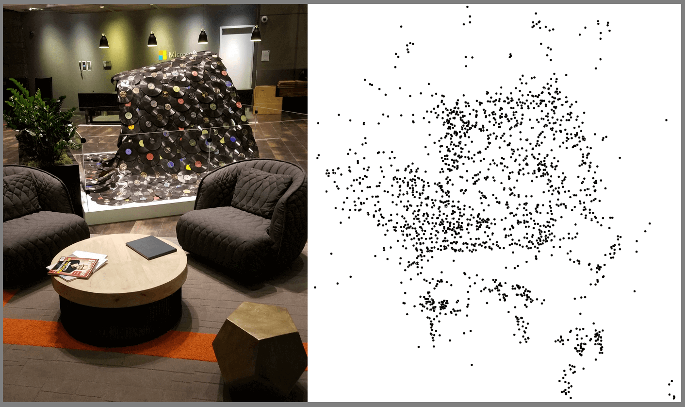

# Frequently asked questions about Azure Spatial Anchors

Azure Spatial Anchors is a managed cloud service and developer platform that enables multi-user, spatially aware mixed reality experiences across HoloLens, iOS, and Android devices.

For more information, see [Azure Spatial Anchors overview](overview.md).

## Azure Spatial Anchors Product FAQs

**Q: Which devices does Azure Spatial Anchors support?**

**A:** Azure Spatial Anchors enables developers to build apps on HoloLens, on iOS devices with ARKit support, and on Android devices with ARCore support; for iOS and Android this includes both phones and tablets.

**Q: Do I have to be connected to the cloud to use Azure Spatial Anchors?**

**A:** Azure Spatial Anchors currently requires a network connection to the internet. We welcome your comments on our [feedback site](https://feedback.azure.com/forums/919252-azure-spatial-anchors).

**Q: What are the connectivity requirements for Azure Spatial Anchors?**

**A:** Azure Spatial Anchors works with Wi-Fi and mobile broadband connections.

**Q: How accurately can Azure Spatial Anchors locate anchors?**

**A:** Many factors affect the accuracy of locating anchors--lighting conditions, the objects in the environment, and even the surface on which the anchor is placed. To determine if the accuracy will meet your needs, try the anchors in environments representative of where you plan to use them. If you encounter environments where accuracy isn't meeting your needs, see [Logging and diagnostics in Azure Spatial Anchors](./concepts/logging-diagnostics.md).

**Q: How long does it take to create and locate anchors?**

**A:** The time required to create and locate anchors is dependent on many factors--network connection, the device's processing and load, and the specific environment. We have customers building applications in many industries including manufacturing, retail, and gaming indicating that the service enables a great user experience for their scenarios.

## Privacy FAQ

**Q: When my application places a Spatial Anchor somewhere do all apps have access to it?**

**A:** Anchors are isolated by Azure account. Only apps to which you grant access to your account will be able to access anchors within the account.

**Q: How does Azure Spatial Anchors store data?**

**A:** All data is stored encrypted with a Microsoft managed data encryption key and all data is stored regionally for each of the resources.

**Q: Where does Azure Spatial Anchors store data?**

**A:** Azure Spatial Anchors accounts allow you to specify the region where your data will be stored. Microsoft may replicate data to other regions for resiliency, but Microsoft does not replicate or move data outside the geography. This data is stored in the region where the Azure Spatial Anchors account is configured. For example, if the account is registered in the East US region, this data is stored in the East US region but may be replicated to another region in the North America geography to ensure resiliency.

**Q: What information about an environment is transmitted and stored on the service when using Azure Spatial Anchors? Are pictures of the environment transmitted and stored?**

**A**: When creating or locating anchors, pictures of the environment are processed on the device into a derived format. This derived format is transmitted to and stored on the service.

To provide transparency, below is an image of an environment and the derived sparse point cloud. The point cloud shows the geometric representation of the environment that's transmitted and stored on the service. For each point in the sparse point cloud, we transmit and store a hash of the visual characteristics of that point. The hash is derived from, but does not contain, any pixel data.

Azure Spatial Anchors adheres to the [Azure Service Agreement Terms](https://go.microsoft.com/fwLink/?LinkID=522330&amp;amp;clcid=0x9), and the [Microsoft Privacy Statement](https://go.microsoft.com/fwlink/?LinkId=521839&amp;clcid=0x409).

*Figure 1: An environment and its derived sparse point cloud*

**Q: Is there a way I can send diagnostics information to Microsoft?**

**A**: Yes. Azure Spatial Anchors has a diagnostics mode that developers can choose to opt into through the Azure Spatial Anchors API. This is useful, for example, if you encounter an environment where you are unable to create and locate anchors predictably. We may ask if you can submit a diagnostics report containing information that helps us debug. For more information see [Logging and diagnostics in Azure Spatial Anchors](./concepts/logging-diagnostics.md).

## Availability and Pricing FAQs

**Q: Do you provide an SLA?**

**A:** As is standard for Azure services, we target an availability greater than 99.9%. 

**Q: Can I publish my apps using Azure Spatial Anchors to app stores? Can I use Azure Spatial Anchors for mission-critical production scenarios?**

**A:** Yes, Azure Spatial Anchors is generally available and has a standard Azure services SLA. We invite you to develop apps for your production deployments, and [share your feedback](https://feedback.azure.com/forums/919252-azure-spatial-anchors) about the product with us.

**Q: Do you have any throttling limits in place?**

**A**: Yes, we have throttling limits.  We don’t expect you’ll hit them for typical application development and testing. For production deployments, we are ready to support our customers’ high-scale requirements. [Contact us](mailto:azuremrscontact@microsoft.com) to discuss.

**Q: In what regions is Azure Spatial Anchors available?**

**A:** Azure Spatial Anchors is currently available in West US 2, East US, East US 2, South Central US, West Europe, North Europe, UK South, Australia East, Southeast Asia, and Korea Central. Additional regions will be available in the future.

What this means is that both compute and storage powering this service are in these regions. That said, there are no restrictions on where your clients are located. 

**Q: Do you charge for Azure Spatial Anchors?**

**A:** You can find details about pricing on our [pricing page](https://azure.microsoft.com/pricing/details/spatial-anchors/).

## Technical FAQs

**Q: How does Azure Spatial Anchors work?**

**A:** Azure Spatial Anchors depends on mixed reality / augmented reality trackers. These trackers perceive the environment with cameras and track the device in 6-degrees-of-freedom (6DoF) as it moves through the space.

Given a 6DoF tracker as a building block, Azure Spatial Anchors allows you to designate certain points of interest in your real environment as "anchor" points. You might, for example, use an anchor to render content at a specific place in the real-world.

When you create an anchor, the client SDK captures environment information around that point and transmits it to the service. If another device looks for the anchor in that same space, similar data transmits to the service. That data is matched against the environment data previously stored. The position of the anchor relative to the device is then sent back for use in the application.

**Q: How does Azure Spatial Anchors integrate with ARKit and ARCore on iOS and Android?**

**A:** Azure Spatial Anchors leverages the native tracking capabilities of ARKit and ARCore. In addition, our SDKs for iOS and Android offer capabilities such as persisting anchors in a managed cloud service, and allowing your apps to locate those anchors again by simply connecting to the service.

**Q: How does Azure Spatial Anchors integrate with HoloLens?**

**A:** Azure Spatial Anchors leverages the native tracking capabilities of HoloLens. We provide an Azure Spatial Anchors SDK for building apps on HoloLens. The SDK integrates with the native HoloLens capabilities and provides additional capabilities. These capabilities include allowing app developers to persist anchors in a managed cloud service and allowing your apps to locate those anchors again by connecting to the service.

**Q: Which platforms and languages does Azure Spatial Anchors support?**

**A:** Developers can build apps with Azure Spatial Anchors using familiar tools and frameworks for their device:

- Unity across HoloLens, iOS, and Android
- Xamarin on iOS and Android
- Swift or Objective-C on iOS
- Java or the Android NDK on Android
- C++/WinRT on HoloLens

Get started with [development here](index.yml).

**Q: Does it work with Unreal?**

**A:** Support for Unreal will be considered in the future.

**Q: What ports and protocols does Azure Spatial Anchors use?**

**A:** Azure Spatial Anchors communicates over TCP port 443 using an encrypted protocol. For authentication, it uses [Azure Active Directory](../active-directory/index.yml), which communicates using HTTPS over port 443.