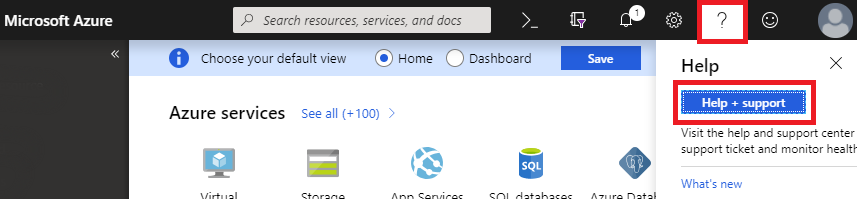
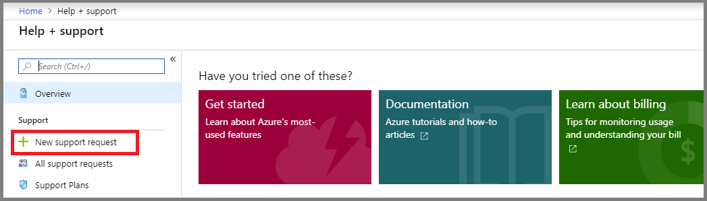
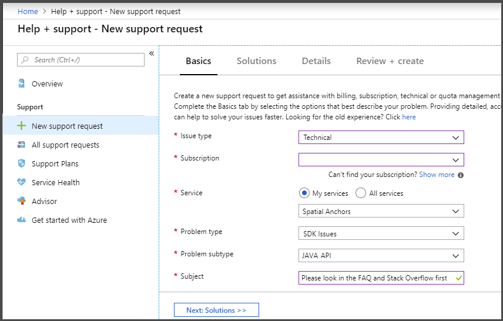

# Azure Spatial Anchors support options

## Open a tech support ticket

To open a technical support ticket within the Azure Portal for Azure Spatial Anchors:

1. With the [Azure portal](https://azure.microsoft.com/account/) open, select the help icon from the top menu bar, then select the **Help + support** button.

1. With the Help + support page open, select **+ New support request**.

1. When completing the support ticket fields:

- Issue type: Technical
- Service: Spatial Anchors

## Community support

For support from the user community, please see [Azure Spatial Anchors on Stack Overflow](https://stackoverflow.com/questions/tagged/azure-spatial-anchors).

## Provide content feedback

On the bottom of each content article, there is an opportunity to open a GitHub issue and provide feedback on the Azure Spatial Anchor documentation content.

## Provide product feedback

To provide feedback, share an idea or suggestion for the Azure Spatial Anchors service, or vote on the ideas that others have submitted, visit the [Azure Spatial Anchors Feedback Forum](https://feedback.azure.com/forums/919252-azure-spatial-anchors).

## Next steps

For frequently asked questions about Azure Spatial Anchors, see the [FAQ](spatial-anchor-faq.md) page.
