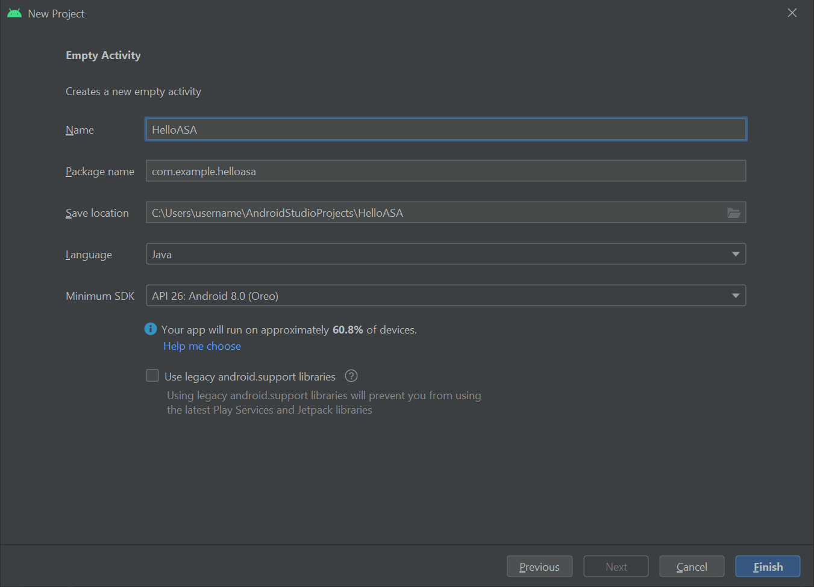
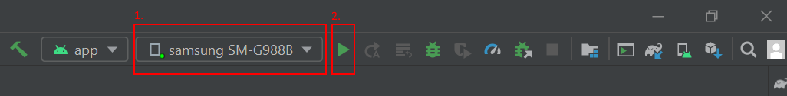

# Tutorial: Step-by-step instructions to create a new Android app using Azure Spatial Anchors

This tutorial will show you how to create a new Android app that integrates ARCore functionality with Azure Spatial Anchors.

## Prerequisites

To complete this tutorial, make sure you have:

- A Windows or macOS machine with <a href="https://developer.android.com/studio/" target="_blank">Android Studio 3.4+</a>.
- A <a href="https://developer.android.com/studio/debug/dev-options" target="_blank">developer enabled</a> and <a href="https://developers.google.com/ar/discover/supported-devices" target="_blank">ARCore capable</a> Android device.

## Getting started

Start Android Studio. In the **Welcome to Android Studio** window, click **Start a new Android Studio project**. 
1. Select **File**->**New Project**.
1. In the **Create New Project** window, under the **Phone and Tablet** section, choose **Empty Activity**, and click **Next**.
1. In the New Project - Empty Activity window, change the following values:
   - Change the **Name**, **Package name** and **Save location** to your desired values
   - Set **Language** is to `Java`
   - Set **Minimum API level** to `API 26: Android 8.0 (Oreo)`
   - Leave the other options as they are
   - Click **Finish**. 
1. The **Component Installer** will run. After some processing, Android Studio will open the IDE.



<!-- maybe snapshot here -->

## Trying it out

To test out your new app, connect your developer-enabled device to your development machine with a USB cable. On the top right of Android Studio select your connected device and click on the **Run 'app'** icon. Android Studio installs the app on your connected device and starts it. You should now see "Hello World!" displayed in the app running on your device. Click **Run**->**Stop 'app'**.



## Integrating _ARCore_

<a href="https://developers.google.com/ar/discover/" target="_blank">_ARCore_</a> is Google's platform for building Augmented Reality experiences, enabling your device to track its position as it moves and builds its own understanding of the real world.

Modify `app\manifests\AndroidManifest.xml` to include the following entries inside the root `<manifest>` node. This code snippet does a few things:

- It will allow your app to access your device camera.
- It will also ensure your app is only visible in the Google Play Store to devices that support ARCore.
- It will configure the Google Play Store to download and install ARCore, if it isn't installed already, when your app is installed.

```xml
<manifest ...>

    <uses-permission android:name="android.permission.CAMERA" />
    <uses-feature android:name="android.hardware.camera.ar" />

    <application>
        ...
        <meta-data android:name="com.google.ar.core" android:value="required" />
        ...
    </application>

</manifest>
```

Modify `Gradle Scripts\build.gradle (Module: app)` to include the following entry. This code will ensure that your app targets ARCore version 1.25. After this change, you might get a notification from Gradle asking you to sync: click **Sync now**.

```gradle
dependencies {
    ...
    implementation 'com.google.ar:core:1.25.0'
    ...
}
```

## Integrating _Sceneform_

[_Sceneform_](https://developers.google.com/sceneform/develop/) makes it simple to render realistic 3D scenes in Augmented Reality apps, without having to learn OpenGL.

Modify `Gradle Scripts\build.gradle (Module: app)` to include the following entries. This code will allow your app to use language constructs from Java 8, which `Sceneform` requires. It will also ensure your app targets `Sceneform` version 1.15. After this change, you might get a notification from Gradle asking you to sync: click **Sync now**.

```gradle
android {
    ...

    compileOptions {
        sourceCompatibility JavaVersion.VERSION_1_8
        targetCompatibility JavaVersion.VERSION_1_8
    }
}

dependencies {
    ...
    implementation 'com.google.ar.sceneform.ux:sceneform-ux:1.15.0'
    ...
}
```

Open your `app\res\layout\activity_main.xml`, and replace the existing Hello Wolrd `<TextView ... />` element with the following ArFragment. This code will cause the camera feed to be displayed on your screen enabling ARCore to track your device position as it moves.


```xml
<fragment android:name="com.google.ar.sceneform.ux.ArFragment"
    android:id="@+id/ux_fragment"
    android:layout_width="match_parent"
    android:layout_height="match_parent" />
```

> [!NOTE]
> In order to see the raw xml of your main activity click on the "Code" or "Split" button on the top right of Android Studio.

[Redeploy](#trying-it-out) your app to your device to validate it once more. This time, you should be asked for camera permissions. Once approved, you should  see your camera feed rendering on your screen.

## Place an object in the real world

Let's create & place an object using your app. First, add the following imports into your `app\java\<PackageName>\MainActivity`:

[!code-java[MainActivity](../../../includes/spatial-anchors-new-android-app-finished.md?range=21-23,27-33,17-18)]

Then, add the following member variables into your `MainActivity` class:

[!code-java[MainActivity](../../../includes/spatial-anchors-new-android-app-finished.md?range=47-52)]

Next, add the following code into your `app\java\<PackageName>\MainActivity` `onCreate()` method. This code will hook up a listener, called `handleTap()`, that will detect when the user taps the screen on your device. If the tap happens to be on a real world surface that has already been recognized by ARCore's tracking, the listener will run.

[!code-java[MainActivity](../../../includes/spatial-anchors-new-android-app-finished.md?range=63-69,80&highlight=6-7)]

Finally, add the following `handleTap()` method, that will tie everything together. It will create a sphere, and place it on the tapped location. The sphere will initially be black, since `this.recommendedSessionProgress` is set to zero right now. This value will be adjusted later on.

[!code-java[MainActivity](../../../includes/spatial-anchors-new-android-app-finished.md?range=159-167,179-180,183-192,209)]

[Redeploy](#trying-it-out) your app to your device to validate it once more. This time, you can move around your device to get ARCore to start recognizing your environment. Then, tap the screen to create & place your black sphere over the surface of your choice.

## Attach a local Azure Spatial Anchor

Modify `Gradle Scripts\build.gradle (Module: app)` to include the following entry. This sample code snippet targets Azure Spatial Anchors SDK version 2.10.2. Note that SDK version 2.7.0 is currently the minimum supported version, and referencing any more recent version of Azure Spatial Anchors should work as well. We recommend using the latest version of Azure Spatial Anchors SDK. You can find the SDK release notes [here.](https://github.com/Azure/azure-spatial-anchors-samples/releases)

```gradle
dependencies {
    ...
    implementation 'com.microsoft.azure.spatialanchors:spatialanchors_jni:[2.10.2]'
    implementation 'com.microsoft.azure.spatialanchors:spatialanchors_java:[2.10.2]'
    ...
}
```

If you are targeting Azure Spatial Anchors SDK 2.10.0 or later, include the following entry in the repositories section of your project's `settings.gradle` file. This will include the URL to the Maven package feed that hosts Azure Spatial Anchors Android packages for SDK 2.10.0 or later: 

```gradle
dependencyResolutionManagement {
    ...
    repositories {
        ...
        maven {
            url 'https://pkgs.dev.azure.com/aipmr/MixedReality-Unity-Packages/_packaging/Maven-packages/maven/v1'
        }
        ...
    }
}
```

Right-click `app\java\<PackageName>`->**New**->**Java Class**. Set **Name** to _MyFirstApp_, and select **Class**. A file called `MyFirstApp.java` will be created. Add the following import to it:

```java
import com.microsoft.CloudServices;
```

Define `android.app.Application` as its superclass.
```java
public class MyFirstApp extends android.app.Application {...
```

Then, add the following code inside the new `MyFirstApp` class, which will ensure Azure Spatial Anchors is initialized with your application's context.

```java
    @Override
    public void onCreate() {
        super.onCreate();
        CloudServices.initialize(this);
    }
```

Now, modify `app\manifests\AndroidManifest.xml` to include the following entry inside the root `<application>` node. This code will hook up the Application class you created into your app.

```xml
    <application
        android:name=".MyFirstApp"
        ...
    </application>
```

Back in `app\java\<PackageName>\MainActivity`, add the following imports into it:

[!code-java[MainActivity](../../../includes/spatial-anchors-new-android-app-finished.md?range=17,16,18,24,26,35,36,38&highlight=2-8)]

Then, add the following member variables into your `MainActivity` class:

[!code-java[MainActivity](../../../includes/spatial-anchors-new-android-app-finished.md?range=52-56&highlight=3-5)]

Next, let's add the following `initializeSession()` method inside your `mainActivity` class. Once called, it will ensure an Azure Spatial Anchors session is created and properly initialized during the startup of your app. This code makes sure that the sceneview session passed to ASA session via the `cloudSession.setSession` call is not null by having early return.

[!code-java[MainActivity](../../../includes/spatial-anchors-new-android-app-finished.md?range=92-107,155)]

Since `initializeSession()` could do an early return if sceneView session is not yet setup (i.e., if `sceneView.getSession()` is null), we add an onUpdate call to make sure that ASA session gets initialized once sceneView session is created.
[!code-java[MainActivity](../../../includes/spatial-anchors-new-android-app-finished.md?name=scene_OnUpdate)]

Now, let's hook your `initializeSession()` and `scene_OnUpdate(...)` method into your `onCreate()` method. Also, we'll ensure that frames from your camera feed are sent to Azure Spatial Anchors SDK for processing.

[!code-java[MainActivity](../../../includes/spatial-anchors-new-android-app-finished.md?range=63-80&highlight=9-17)]

Finally, add the following code into your `handleTap()` method. It will attach a local Azure Spatial Anchor to the black sphere that we're placing in the real world.

[!code-java[MainActivity](../../../includes/spatial-anchors-new-android-app-finished.md?range=159-167,179-192,209&highlight=12-13)]

[Redeploy](#trying-it-out) your app once more. Move around your device, tap the screen, and place a black sphere. This time, though, your code will be creating and attaching a local Azure Spatial Anchor to your sphere.

Before proceeding any further, you'll need to create an Azure Spatial Anchors account to get the account Identifier, Key, and Domain, if you don't already have them. Follow the following section to obtain them.

## Create a Spatial Anchors resource

[!INCLUDE [Create Spatial Anchors resource](../../../includes/spatial-anchors-get-started-create-resource.md)]

## Upload your local anchor into the cloud

Once you have your Azure Spatial Anchors account Identifier, Key, and Domain, we can go back in `app\java\<PackageName>\MainActivity`, add the following imports into it:

[!code-java[MainActivity](../../../includes/spatial-anchors-new-android-app-finished.md?range=38-43&highlight=3-6)]

Then, add the following member variables into your `MainActivity` class:

[!code-java[MainActivity](../../../includes/spatial-anchors-new-android-app-finished.md?range=56-61&highlight=3-6)]

Now, add the following code into your `initializeSession()` method. First, this code will allow your app to monitor the progress that the Azure Spatial Anchors SDK makes as it collects frames from your camera feed. As it does, the color of your sphere will start changing from its original black, into grey. Then, it will turn white once enough frames are collected to submit your anchor to the cloud. Second, this code will provide the credentials needed to communicate with the cloud back-end. Here is where you'll configure your app to use your account Identifier, Key, and Domain. You copied them into a text editor when [setting up the Spatial Anchors resource](#create-a-spatial-anchors-resource).

[!code-java[MainActivity](../../../includes/spatial-anchors-new-android-app-finished.md?range=92-130,151-155&highlight=17-43)]

Next, add the following `uploadCloudAnchorAsync()` method inside your `mainActivity` class. Once called, this method will asynchronously wait until enough frames are collected from your device. As soon as that happens, it will switch the color of your sphere to yellow, and then it will start uploading your local Azure Spatial Anchor into the cloud. Once the upload finishes, the code will return an anchor identifier.

[!code-java[MainActivity](../../../includes/spatial-anchors-new-android-app-finished.md?name=uploadCloudAnchorAsync)]

Finally, let's hook everything together. In your `handleTap()` method, add the following code. It will invoke your `uploadCloudAnchorAsync()` method as soon as your sphere is created. Once the method returns, the code below will perform one final update to your sphere, changing its color to blue.

[!code-java[MainActivity](../../../includes/spatial-anchors-new-android-app-finished.md?range=159-167,179-209&highlight=26-39)]

[Redeploy](#trying-it-out) your app once more. Move around your device, tap the screen, and place your sphere. This time, though, your sphere will change its color from black to white, as camera frames are collected. Once we have enough frames, the sphere will turn to yellow, and the cloud upload will start. Make sure your phone is connected to the internet. Once the upload finishes, your sphere will turn blue. Optionally, you can monitor the `Logcat` window in Android Studio to view the log messages your app is sending. Examples of messages that would be logged include the session progress during the frames-capture and the anchor identifier that the cloud returns once the upload is completed.

> [!NOTE]
> If you are not seeing the value of `recommendedSessionProgress` (in your debug logs referred to as `Session progress`) change then make sure you are **both moving and rotating** your phone around the sphere you have placed.


## Locate your cloud spatial anchor

Once your anchor is uploaded to the cloud, we're ready to attempt locating it again. First, let's add the following imports into your code.

[!code-java[MainActivity](../../../includes/spatial-anchors-new-android-app-finished.md?range=43,44,34,37&highlight=3-4)]

Then, let's add the following code into your `handleTap()` method. This code will:

- Remove our existing blue sphere from the screen.
- Initialize our Azure Spatial Anchors session again. This action will ensure that the anchor we're going to locate comes from the cloud instead of the local anchor we created.
- Issue a query for the anchor we uploaded to the cloud.

[!code-java[MainActivity](../../../includes/spatial-anchors-new-android-app-finished.md?name=handleTap&highlight=10-19)]

Now, let's hook the code that will be invoked when the anchor we're querying for is located. Inside your `initializeSession()` method, add the following code. This snippet will create & place a green sphere once the cloud spatial anchor is located. It will also enable screen tapping again, so you can repeat the whole scenario once more: create another local anchor, upload it, and locate it again.

[!code-java[MainActivity](../../../includes/spatial-anchors-new-android-app-finished.md?name=initializeSession&highlight=40-59)]

That's it! [Redeploy](#trying-it-out) your app one last time to try out the whole scenario end to end. Move around your device, and place your black sphere. Then, keep moving your device to capture camera frames until the sphere turns yellow. Your local anchor will be uploaded, and your sphere will turn blue. Finally, tap your screen once more, so that your local anchor is removed, and then we'll query for its cloud counterpart. Continue moving your device around until your cloud spatial anchor is located. A green sphere should appear in the correct location, and you can rinse & repeat the whole scenario again.

## Putting everything together

Here is how the complete `MainActivity` class file should look, after all
the different elements have been put together. You can use it as a reference to
compare against your own file, and spot if you may have any differences left.

[!INCLUDE [Share Anchors Sample Prerequisites](../../../includes/spatial-anchors-new-android-app-finished.md)]

## Next steps

In this tutorial, you've seen how to create a new Android app that integrates ARCore functionality with Azure Spatial Anchors. To learn more about the Azure Spatial Anchors library, continue to our guide on how to create and locate anchors.

> [!div class="nextstepaction"]
> [Create and locate anchors using Azure Spatial Anchors](../../../articles/spatial-anchors/create-locate-anchors-overview.md)
