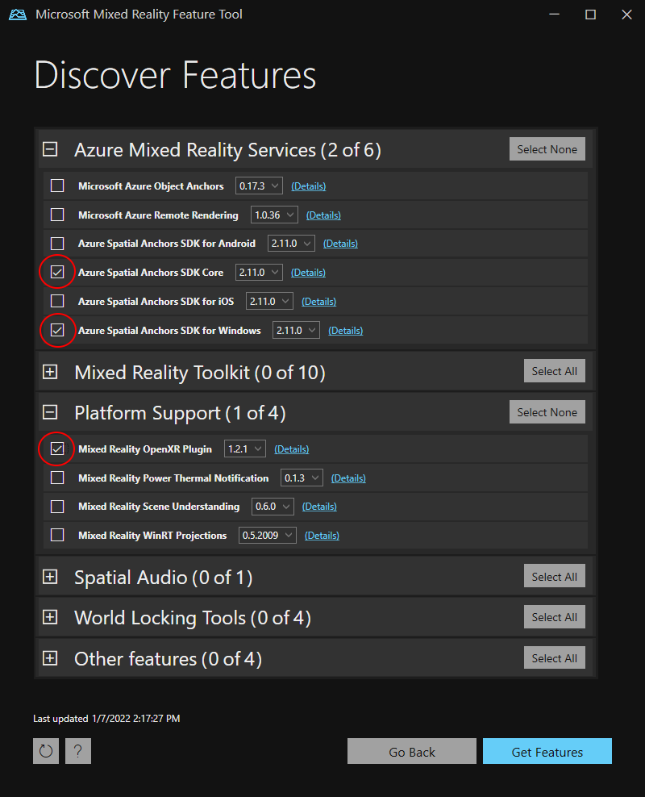
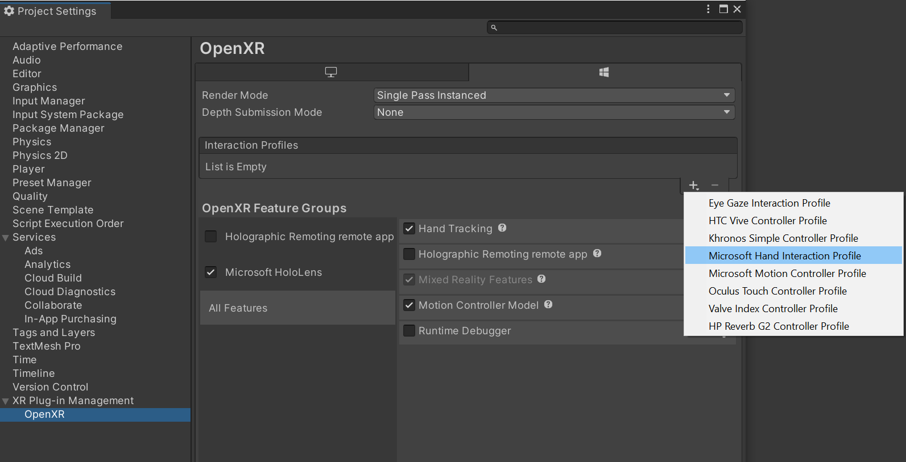
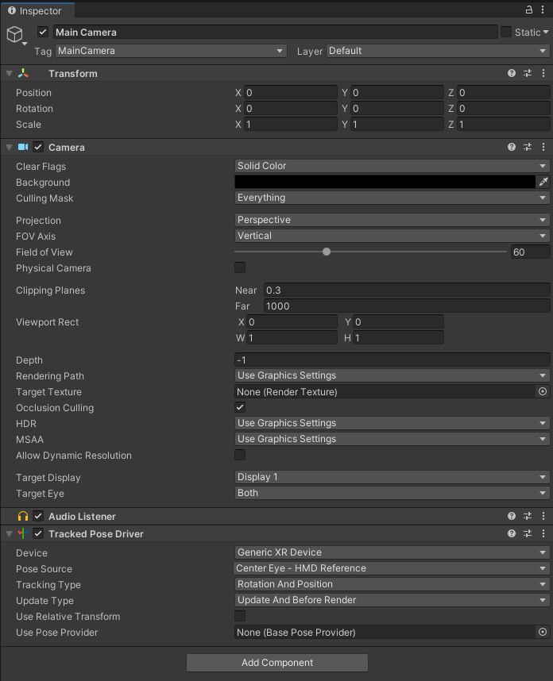
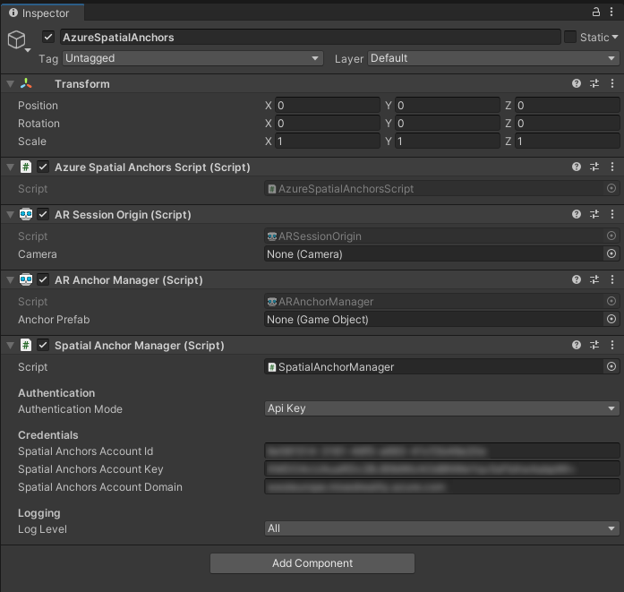

# Tutorial: Step-by-step instructions to create a new HoloLens Unity app using Azure Spatial Anchors

This tutorial will show you how to create a new HoloLens Unity app with Azure Spatial Anchors.

## Prerequisites

To complete this tutorial, make sure you have:

1. **PC** - A PC running Windows
2. **Visual Studio** - <a href="https://www.visualstudio.com/downloads/" target="_blank">Visual Studio 2019</a> installed with the **Universal Windows Platform development** workload and the **Windows 10 SDK (10.0.18362.0 or newer)** component. The [C++/WinRT Visual Studio Extension (VSIX)](https://aka.ms/cppwinrt/vsix) for Visual Studio should be installed from the [Visual Studio Marketplace](https://marketplace.visualstudio.com/).
3. **HoloLens** - A HoloLens device with [developer mode](/windows/mixed-reality/using-visual-studio) enabled. This article requires a HoloLens device with the [Windows 10 May 2020 Update](/windows/mixed-reality/whats-new/release-notes-may-2020). To update to the latest release on HoloLens, open the **Settings** app, go to **Update & Security**, then select the **Check for updates** button.
4. **Unity** - [Unity 2020.3.25](https://unity.com/download) with modules **Universal Windows Platform Build Support** and **Windows Build Support (IL2CPP)**

## Creating and setting up Unity Project

### Create New Project
1. In **Unity Hub**, select **New project**
2. Select **3D**
3. Enter your **Project name** and enter a save **Location**
4. Select **Create project** and wait for Unity to create your project

### Change Build Platform
1. In your unity editor, select **File** > **Build Settings**
1. Select **Universal Windows Platform** then **Switch Platform**. Wait until Unity has finished processing all files.

### Import ASA and OpenXR
1. Launch [Mixed Reality Feature Tool](/windows/mixed-reality/develop/unity/welcome-to-mr-feature-tool)
1. Select your project path - the folder that contains folders such as  _Assets_, _Packages_, _ProjectSettings_, and so on - and select  **Discover Features**
1. Under _Azure Mixed Reality Services_, select both
    1. **Azure Spatial Anchors SDK Core**
    1. **Azure Spatial Anchors SDK for Windows**
1. Under _Platform Support_, select
    1. **Mixed Reality OpenXR Plugin**
> [!NOTE]
> Make sure you have refreshed the catalog and the newest version is selected for each

5. Press **Get Features** --> **Import** --> **Approve** --> **Exit**
6. When refocussing your Unity window, Unity will start importing the modules
7. If you get a message about using the new input system, select **Yes** to restart Unity and enable the backends.

### Set up the project settings
We'll now set some Unity project settings that help us target the Windows Holographic SDK for development.

#### Change OpenXR Settings 
1. Select **File** > **Build Settings** (it might still be open from the previous step)
1. Select **Player Settings...**
1. Select **XR Plug-in Management**
1. Make sure the **Universal Windows Platform Settings** tab is selected and check the box next to **OpenXR** and next to **Microsoft HoloLens feature group**
1. Select the yellow warning sign next to **OpenXR** to display all OpenXR issues.
1. Select **Fix all**
1. To fix the issue "_At least one interaction profile must be added_", select *Edit* to open the OpenXR Project settings. Then under **Interaction Profiles** select the **+** symbol and select **Microsoft Hand Interaction Profile**

#### Change Quality Settings
1. Select **Edit** > **Project Settings** > **Quality**
2. In the column under the **Universal Windows Platform** logo, select the arrow in the **Default** row and select **Very Low**. You'll know the setting is applied correctly when the box in the **Universal Windows Platform**  column and **Very Low** row is green.

#### Set capabilities
1. Go to **Edit** > **Project Settings** > **Player** (you may still have it open from the previous step).
2. Make sure the **Universal Windows Platform Settings** tab is selected
3. In the **Publishing Settings** Configuration section, enable the following
    1. InternetClient
    1. InternetClientServer
    1. PrivateNetworkClientServer
    1. SpatialPerception (might already be enabled)

#### Set up the main camera
1. In the **Hierarchy Panel**, select **Main Camera**.
2. In the **Inspector**, set its transform position to **0,0,0**.
3. Find the **Clear Flags** property, and change the dropdown from **Skybox** to **Solid Color**.
4. Select the **Background** field to open a color picker.
5. Set **R, G, B, and A** to **0**.
6. Select **Add Component** at the bottom and add the **Tracked Pose Driver** Component to the camera

## Try it out #1
You should now have an empty scene that is ready to be deployed to your HoloLens device. To test out that everything is working, build your app in **Unity** and deploy it from **Visual Studio**. Follow [**Using Visual Studio to deploy and debug**](/windows/mixed-reality/develop/advanced-concepts/using-visual-studio?tabs=hl2) to do so. You should see the Unity start screen, and then a clear display.

## Create a Spatial Anchors resource

[!INCLUDE [Create Spatial Anchors resource](../../../includes/spatial-anchors-get-started-create-resource.md)]

## Creating & Adding Scripts

1. In Unity in the **Project pane**, create a new folder called _Scripts_, in the **Assets** folder.
2. In the folder right-click -> **Create** -> **C# Script**. Title it **AzureSpatialAnchorsScript**
3. Go to **GameObject** -> **Create Empty**.
4. Select it, and in the **Inspector** rename it from **GameObject** to **AzureSpatialAnchors**. 
1. Still on the `GameObject`
    1. Set its position to 0,0,0
    1. Select **Add Component** and search for and add the **AzureSpatialAnchorsScript**
    1. Select **Add Component** again and search for and add the **AR Anchor Manager**. This will automatically add **AR Session Origin** too.
    1. Select **Add Component** again and search for and add the **SpatialAnchorManager** script
    1. In the added **SpatialAnchorManager** component fill out the **Account ID**, **Account Key** and **Account Domain** which you have copied in the previous step from the spatial anchors resource in the Azure portal.

## App Overview
Our app will support the following interactions:

Gesture | Action
------|------- 
[Tap](/dynamics365/mixed-reality/guides/operator-gestures-hl2#air-tap) anywhere | Start/Continue Session + Create anchor at Hand Position
Tapping on an anchor | Delete `GameObject` + Delete Anchor in ASA Cloud Service
Tap + Hold for 2 sec (+ session is running) | Stop the session and remove all `GameObjects`. Keep anchors in ASA Cloud Service
Tap + Hold for 2 sec (+ session is not running)| Start the session and look for all anchors.

## Add Tap recognition
Let's add some code to our script to be able to recognize a user's [tapping gesture](/dynamics365/mixed-reality/guides/operator-gestures-hl2#air-tap).
1. Open `AzureSpatialAnchorsScript.cs` in Visual Studio by double-clicking on the script in your Unity **Project pane**.
2. Add the following array to your class

[!code-csharp[AzureSpatialAnchorsScript](../../../includes/spatial-anchors-new-unity-hololens-app-finished.md?range=24-29&highlight=3-6)]

3. Add the following two methods below the Update() method. We will add implementation at a later stage
[!code-csharp[AzureSpatialAnchorsScript](../../../includes/spatial-anchors-new-unity-hololens-app-finished.md?range=58-60,97,99,102-107,119,121,123-127,141&highlight=6-12,14-19)]

4. Add the following import
[!code-csharp[AzureSpatialAnchorsScript](../../../includes/spatial-anchors-new-unity-hololens-app-finished.md?range=20)]
 
5. Add the following code top the `Update()` method. This will allow the app to recognize short and long (2 sec) hand-tapping gestures
[!code-csharp[AzureSpatialAnchorsScript](../../../includes/spatial-anchors-new-unity-hololens-app-finished.md?name=Update&highlight=4-39)]

## Add & Configure SpatialAnchorManager
The ASA SDK offers a simple interface called `SpatialAnchorManager` to make calls to the ASA service. Let's add it as a variable to our `AzureSpatialAnchorsScript.cs`

First add the import
[!code-csharp[AzureSpatialAnchorsScript](../../../includes/spatial-anchors-new-unity-hololens-app-finished.md?range=14)]

Then declare the variable
[!code-csharp[AzureSpatialAnchorsScript](../../../includes/spatial-anchors-new-unity-hololens-app-finished.md?range=24-34&highlight=8-11)]

In the `Start()` method, assign the variable to the component we added in a previous step
[!code-csharp[AzureSpatialAnchorsScript](../../../includes/spatial-anchors-new-unity-hololens-app-finished.md?range=47-50,54&highlight=4)]

In order to receive debug and error logs, we need to subscribe to the different callbacks
[!code-csharp[AzureSpatialAnchorsScript](../../../includes/spatial-anchors-new-unity-hololens-app-finished.md?range=47-52,54&highlight=5-6)]

> [!Note]
> To view the logs make sure after you built the project from Unity and you open the visual studio solution `.sln`, select Debug --> Run with Debugging and leave your HoloLens connected to your computer while the app is running.

## Start Session
To create and find anchors, we first have to start a session. When calling `StartSessionAsync()`, `SpatialAnchorManager` will create a session if necessary and then start it. Let's add this to our `ShortTap()` method.
[!code-csharp[AzureSpatialAnchorsScript](../../../includes/spatial-anchors-new-unity-hololens-app-finished.md?range=102-108,119&highlight=7)]

## Create Anchor
Now that we have a session running we can create anchors. In this application, we'd like to keep track of the created anchor `GameObjects` and the created anchor identifiers (anchor IDs). Let's add two lists to our code.
[!code-csharp[AzureSpatialAnchorsScript](../../../includes/spatial-anchors-new-unity-hololens-app-finished.md?range=14,15,16,19,20,31-44&highlight=2,11-14,16-19)]

Let's create a method `CreateAnchor` that creates an anchor at a **position** defined by its parameter.
[!code-csharp[AzureSpatialAnchorsScript](../../../includes/spatial-anchors-new-unity-hololens-app-finished.md?range=18)]
[!code-csharp[AzureSpatialAnchorsScript](../../../includes/spatial-anchors-new-unity-hololens-app-finished.md?range=198-205,256)]

Since spatial anchors not only have a **position** but also a **rotation**, let's set the **rotation** to always orient towards the HoloLens on creation.

[!code-csharp[AzureSpatialAnchorsScript](../../../includes/spatial-anchors-new-unity-hololens-app-finished.md?range=198-212,256&highlight=9-14)]

Now that we have the **position** and the **rotation** of the desired anchor, let's create a visible `GameObject`. Note that Spatial Anchors does not require the anchor `GameObject` to be visible to the end user since the main purpose of Spatial Anchors is to provide a common and persistent reference frame. For the purpose of this tutorial, we will visualize the anchors as cubes. Each anchor will be initialized as a **white** cube, which will turn into a **green** cube once the creation process succeeded.

[!code-csharp[AzureSpatialAnchorsScript](../../../includes/spatial-anchors-new-unity-hololens-app-finished.md?range=198-218,256&highlight=16-20)]

> [!Note]
> We are using a legacy shader, since it's included in a default Unity build. Other shaders like the default shader are only included if manually specified or they are directly part of the scene. If a shader is not included and the application is trying to render it, it will result in a pink material.

Now let's add and configure the Spatial Anchor components. We are setting the expiration of the anchor to 3 days from anchor creation. After that they will automatically be deleted from the cloud.
Remember to add the import

[!code-csharp[AzureSpatialAnchorsScript](../../../includes/spatial-anchors-new-unity-hololens-app-finished.md?range=13)]
[!code-csharp[AzureSpatialAnchorsScript](../../../includes/spatial-anchors-new-unity-hololens-app-finished.md?range=198-224,256&highlight=22-26)]

To save an anchor, the user must collect environment data.
[!code-csharp[AzureSpatialAnchorsScript](../../../includes/spatial-anchors-new-unity-hololens-app-finished.md?range=198-231,256&highlight=28-33)]
> [!Note]
> A HoloLens can possibly reuse already captured environment data surrounding the anchor, resulting in `IsReadyForCreate` to be true already when called for the first time.

Now that the cloud spatial anchor has been prepared, we can try the actual save here.
[!code-csharp[AzureSpatialAnchorsScript](../../../includes/spatial-anchors-new-unity-hololens-app-finished.md?name=CreateAnchor&highlight=35-58)]

Finally let's add the function call to our `ShortTap` method

[!code-csharp[AzureSpatialAnchorsScript](../../../includes/spatial-anchors-new-unity-hololens-app-finished.md?range=102-108,112,119&highlight=8)]

Our app can now create multiple anchors. Any device can now locate the created anchors (if not expired yet) as long as they know the anchor IDs and have access to the same Spatial Anchors Resource on Azure.

## Stop Session & Destroy GameObjects

To emulate a second device finding all anchors, we will now stop the session and remove all anchor GameObjects (we will keep the anchor IDs). After that we will start a new session and query the anchors using the stored anchor IDs.

`SpatialAnchorManager` can take care of the session stopping by simply calling its `DestroySession()` method. Let's add this to our `LongTap()` method

[!code-csharp[AzureSpatialAnchorsScript](../../../includes/spatial-anchors-new-unity-hololens-app-finished.md?range=123-127,131,141&highlight=6)]

Let's create a method to remove all anchor `GameObjects`

[!code-csharp[AzureSpatialAnchorsScript](../../../includes/spatial-anchors-new-unity-hololens-app-finished.md?name=RemoveAllAnchorGameObjects)]

And call it after destroying the session in `LongTap()`

[!code-csharp[AzureSpatialAnchorsScript](../../../includes/spatial-anchors-new-unity-hololens-app-finished.md?range=123-127,130-133,141&highlight=6,8-9)]

## Locate Anchor
We will now try to find the anchors again with the correct position and rotation that we created them in. To do that we need to start a session and create a `Watcher` that will look for anchors that fit the given criteria. As criteria we will feed it the IDs of the anchors we previously created. Let's create a method `LocateAnchor()` and use `SpatialAnchorManager` to create a `Watcher`. For locate strategies other than using anchor IDs see [Anchor locate strategy](../../../articles/spatial-anchors/concepts/anchor-locate-strategy.md)

[!code-csharp[AzureSpatialAnchorsScript](../../../includes/spatial-anchors-new-unity-hololens-app-finished.md?name=LocateAnchor)]

Once a watcher is started it will fire a callback when it found an anchor that fits the given criteria. Let's first create our anchor-located method called `SpatialAnchorManager_AnchorLocated()` that we will configure to be called when the watcher has located an anchor. This method will create a visual `GameObject` and attach the native anchor component to it. The native anchor component will make sure the correct position and rotation of the `GameObject` is set.

Similar to the creation process, the anchor is attached to a GameObject. This GameObject does not have to be visible in your scene for spatial anchors to work. For the purpose of this tutorial, we will visualize each anchor as a **blue** cube once they have been located.  If you only use the anchor to establish a shared coordinate system, there is no need to visualize the created GameObject.

[!code-csharp[AzureSpatialAnchorsScript](../../../includes/spatial-anchors-new-unity-hololens-app-finished.md?name=SpatialAnchorManagerAnchorLocated)]

Let's now subscribe to the AnchorLocated callback from `SpatialAnchorManager` to make sure our `SpatialAnchorManager_AnchorLocated()` method is called once the watcher finds an anchor.

[!code-csharp[AzureSpatialAnchorsScript](../../../includes/spatial-anchors-new-unity-hololens-app-finished.md?name=Start&highlight=7)]

Finally, let's expand our `LongTap()` method to include finding the anchor. We'll use the `IsSessionStarted` boolean to decide if we are looking for all anchors or destroying all anchors as described in the [App Overview](#app-overview)

[!code-csharp[AzureSpatialAnchorsScript](../../../includes/spatial-anchors-new-unity-hololens-app-finished.md?name=LongTap&highlight=6,7,12-18)]

## Try it out #2
Your app now supports creating anchors and locating them. Build your app in **Unity** and deploy it from **Visual Studio** by following [**Using Visual Studio to deploy and debug**](/windows/mixed-reality/develop/advanced-concepts/using-visual-studio?tabs=hl2).

Make sure your HoloLens is connected to the internet. Once the app has started and the _made with Unity_ message disappears, short tap in your surroundings. A **white** cube should appear to show the position and rotation of the to-be-created anchor. The anchor creation process is automatically called. As you slowly look around your surroundings, you are capturing environment data. Once enough environment data is collected our app will try to create an anchor at the specified location. Once the anchor creation process is completed, the cube will turn **green**. Check your debug logs in visual studio to see if everything worked as intended.

Long tap to remove all `GameObjects` from your scene and stop the spatial anchor session.

Once your scene is cleared, you can long tap again, which will start a session and look for the anchors you have previously created. Once they are found, they are visualized by **blue** cubes at the anchored position and rotation. These anchors (as long as they are not expired) can be found by any supported device as long as they have the correct anchor IDs and have access to your spatial anchor resource.

## Delete Anchor
Right now our app can create and locate anchors. While it deletes the `GameObjects`, it doesn't delete the anchor in the cloud. Let's add the functionality to also delete it in the cloud if you tap on an existing anchor.

Let's add a method `DeleteAnchor` that receives a `GameObject`. We will then use the `SpatialAnchorManager` together with the object's `CloudNativeAnchor` component to request deletion of the anchor in the cloud.

[!code-csharp[AzureSpatialAnchorsScript](../../../includes/spatial-anchors-new-unity-hololens-app-finished.md?name=DeleteAnchor)]

To call this method from `ShortTap`, we need to be able to determine if a tap has been near an existing visible anchor. Let's create a helper method that takes care of that

[!code-csharp[AzureSpatialAnchorsScript](../../../includes/spatial-anchors-new-unity-hololens-app-finished.md?range=17)]
[!code-csharp[AzureSpatialAnchorsScript](../../../includes/spatial-anchors-new-unity-hololens-app-finished.md?name=IsAnchorNearby)]

We can now extend our `ShortTap` method to include the `DeleteAnchor` call
[!code-csharp[AzureSpatialAnchorsScript](../../../includes/spatial-anchors-new-unity-hololens-app-finished.md?name=ShortTap&highlight=8-10,12-17)]

## Try it #3
Build your app in **Unity** and deploy it from **Visual Studio** by following [**Using Visual Studio to deploy and debug**](/windows/mixed-reality/develop/advanced-concepts/using-visual-studio?tabs=hl2).

Note that the location of your hand-tapping gesture is the **center of your hand** in this app and not the tip of your fingers.

When you tap into an anchor, either created (green) or located (blue) a request is sent to the spatial anchor service to remove this anchor from the account. Stop the session (long tap) and start the session again (long tap) to search for all anchors. The deleted anchors will no longer be located.

## Putting everything together

Here is how the complete `AzureSpatialAnchorsScript` class file should look like, after all the different elements have been put together. You can use it as a reference to compare against your own file, and spot if you may have any differences left.

> [!NOTE]
> You'll notice that we have included `[RequireComponent(typeof(SpatialAnchorManager))]` to the script. With this, Unity will make sure that the GameObject where we attach `AzureSpatialAnchorsScript` to, also has the `SpatialAnchorManager` attached to it.

[!INCLUDE [AzureSpatialAnchorsScript](../../../includes/spatial-anchors-new-unity-hololens-app-finished.md)]

## Next steps

In this tutorial, you learned how to implement a basic Spatial Anchors application for HoloLens using Unity. To learn more about how to use Azure Spatial Anchors in a new Android app, continue to the next tutorial.

> [!div class="nextstepaction"]
> [Starting a new Android app](tutorial-new-android-app.md)
