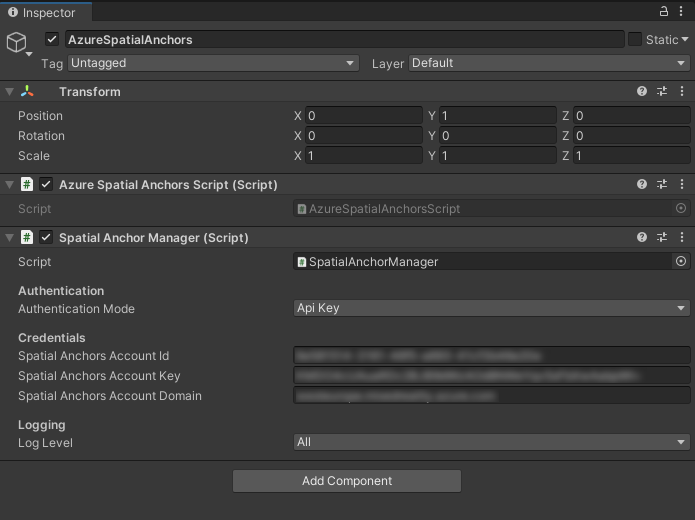

<!-- 
   
[X] Make sure you have internet on your Hl2
[X] User Debug - ARM64 - Device, Debug -> Start Debugging to see logs 
[X] "After closing session you could have a different device on a different day (depending on your anchor expiration), as long as you still have the IDs"
[ ] Tapping will be middle of the hand, not your fingers
[X] Using Legacy shader since it's included in a default Unity build. Default shaders are only included if part of the scene.
-->

# Tutorial: Step-by-step instructions to create a new HoloLens Unity app using Azure Spatial Anchors

This tutorial will show you how to create a new HoloLens Unity app with Azure Spatial Anchors.

## Prerequisites

To complete this tutorial, make sure you have:

1. **PC** - A PC running Windows
2. **Visual Studio** - <a href="https://www.visualstudio.com/downloads/" target="_blank">Visual Studio 2019</a> installed with the **Universal Windows Platform development** workload and the **Windows 10 SDK (10.0.18362.0 or newer)** component. The [C++/WinRT Visual Studio Extension (VSIX)](https://aka.ms/cppwinrt/vsix) for Visual Studio should be installed from the [Visual Studio Marketplace](https://marketplace.visualstudio.com/).
3. **HoloLens** - A HoloLens device with [developer mode](/windows/mixed-reality/using-visual-studio) enabled. This article requires a HoloLens device with the [Windows 10 May 2020 Update](/windows/mixed-reality/whats-new/release-notes-may-2020). To update to the latest release on HoloLens, open the **Settings** app, go to **Update & Security**, then select the **Check for updates** button.
4. **Unity** - [Unity 2020.3.25](https://unity.com/download) with modules **Universal Windows Platform Build Support** and **Windows Build Support (IL2CPP)**

## Creating and setting up Unity Project

### Create New Project
1. Create a new **Unity** Project in **Unity Hub**
2. Select **3D**
3. Name your project and enter a save **Location**.
4. Select **Create** and wait for Unity to create your project.

### Import ASA and OpenXR
1. Launch [Mixed Reality Feature Toolkit](https://docs.microsoft.com/windows/mixed-reality/develop/unity/welcome-to-mr-feature-tool)
2. Select your project path - This is the folder that contains folders such as *Assets*, *Library*, *Logs*, etc - and click **Discover Features**
3. Under Azure Mixed Reality Services select both
    1. **Azure Spatial Anchors SDK Core**
    1. **Azure Spatial Anchors SDK for Windows**
1. Under Platform Support select 
    1. **Mixed Reality OpenXR Plugin**
> [!NOTE]
> Make sure you have refreshed the catalog and the newest version is selected for each


5. Press **Get Features** --> **Import** --> **Approve** --> **Exit**
6. When refocussing your Unity window, Unity will start importing the modules
7. If you get a message about using the new input system click **Yes** to restart Unity and enable the backends.


### Set up the project settings
We'll now set some Unity project settings that help us target the Windows Holographic SDK for development.
#### Change Build Platform
1. Select **File** > **Build Settings**
1. Select **Universal Windows Platform** then **Switch Platform**. Wait until Unity has finished processing all files.
#### Change OpenXR Settings 
1. Select **File** > **Build Settings** (it might still be open from the previous step)
1. Select **Player Settings...**
1. Select **XR Plug-in Management**
1. Make sure the **Universal Windows Platform Settings** tab is selected and check the box next to **OpenXR** and next to **Microsoft HoloLens feature group**
1. Click on the yellow warning sign next to **OpenXR** to display all OpenXR issues.
1. Select **Fix all**
1. To fix the issue *At least one interaction profile must be added* click on *Edit* to open the OpenXR Project settings. Then under **Interaction Profiles** select the **+** symbol and select **Microsoft Hand Interaction Profile**

#### Change Quality Settings
1. Select **Edit** > **Project Settings** > **Quality**
2. In the column under the **Universal Windows Platform** logo, click on the arrow at the **Default** row and select **Very Low**. You'll know the setting is applied correctly when the box in the **Universal Windows Platform**  column and **Very Low** row is green.

#### Set capabilities
1. Go to **Edit** > **Project Settings** > **Player** (you may still have it open from the previous step).
2. Make sure the **Universal Windows Platform Settings** tab is selected
3. In the **Publishing Settings** Configuration section, enable the following
    1. InternetClient
    1. InternetClientServer
    1. PrivateNetworkClientServer
    1. SpatialPerception (might already be enabled)

#### Set up the main camera
1. In the **Hierarchy Panel**, select **Main Camera**.
2. In the **Inspector**, set its transform position to **0,0,0**.
3. Find the **Clear Flags** property, and change the dropdown from **Skybox** to **Solid Color**.
4. Click on the **Background** field to open a color picker.
5. Set **R, G, B, and A** to **0**.
6. Click **Add Component** and add the **Tracked Pose Driver** Component to the camera


## Try it out #1
You should now have an empty scene that is ready to be deployed to your HoloLens device. To test out that everything is working, build your app in **Unity** and deploy it from **Visual Studio**. Follow [**Using Visual Studio to deploy and debug**](https://docs.microsoft.com/windows/mixed-reality/develop/advanced-concepts/using-visual-studio?tabs=hl2) to do so. You should see the Unity start screen, and then a clear display.

<!-- 
[!INCLUDE [Create Spatial Anchors resource](../../../includes/spatial-anchors-get-started-create-resource.md)]
TODO : uncomment this-->

## Creating & Adding Scripts

1. In Unity in the **Project** pane, create a new folder called _Scripts_, in the **Assets** folder.
2. In the folder right-click -> **Create** -> **C# Script**. Title it **AzureSpatialAnchorsScript**
3. Go to **GameObject** -> **Create Empty**.
4. Select it, and in the **Inspector** rename it from **GameObject** to **AzureSpatialAnchors**. 
1. Still on the `GameObject`
    1. Set its position to 0,0,0
    1. Select **Add Component** and search for and add the **AzureSpatialAnchorsScript**
    1. Select **Add Component** again and search for and add the **AR Anchor Manager**. This will automatically add **AR Session Origin** too.
    1. Select **Add Component** again and search for and add the **SpatialAnchorManager** script
    1. In the added **SpatialAnchorManager** component fill out the **Account ID**, **Account Key** and **Account Domain** which you have copied in the previous step from the spatial anchors resource on the azure portal.



## App Overview
Our app will support the following interactions:

Gesture | Action
------|------- 
Tap anywhere | Start/Continue Session + Create anchor at Hand Position
Tapping on an anchor | Delete `GameObject` + Delete Anchor in ASA Cloud Service
Tap + Hold for 2 sec (+ session is running) | Stop the session and remove all `GameObjects`. Keep anchors in ASA Cloud Service
Tap + Hold for 2 sec (+ session is not running)| Start the session and look for all anchors.


## Add Tap recognition
1. Open `AzureSpatialAnchorsScript.cs` in Visual Studio. 
2. Add the following array to your class

[!code-csharp[AzureSpatialAnchorsScript](../../../includes/spatial-anchors-new-unity-hololens-app-finished.md?range=24-29&highlight=3-6)]

3. Add the following two methods below the Update() method. We will add implementation at a later stage
[!code-csharp[AzureSpatialAnchorsScript](../../../includes/spatial-anchors-new-unity-hololens-app-finished.md?range=57-59,95,99-104,116-122,136&highlight=5-18)]

4. Add the following import
[!code-csharp[AzureSpatialAnchorsScript](../../../includes/spatial-anchors-new-unity-hololens-app-finished.md?range=20)]
 
5. Add the following code top the `Update()` method. This will allow the app to recognize short and long (2s) hand tapping gestures
[!code-csharp[AzureSpatialAnchorsScript](../../../includes/spatial-anchors-new-unity-hololens-app-finished.md?name=Update&highlight=4-39)]

## Add & Configure SpatialAnchorManager
The ASA SDK offers a simple interface called `SpatialAnchorManager` to make calls to the ASA service. Let's add it as a variable to our `AzureSpatialAnchorsScript.cs`

First add the import
[!code-csharp[AzureSpatialAnchorsScript](../../../includes/spatial-anchors-new-unity-hololens-app-finished.md?range=14)]

Then declare the variable
[!code-csharp[AzureSpatialAnchorsScript](../../../includes/spatial-anchors-new-unity-hololens-app-finished.md?range=24-34&highlight=8-11)]

In the `Start()` method, assign the variable to the component we added in a previous step
[!code-csharp[AzureSpatialAnchorsScript](../../../includes/spatial-anchors-new-unity-hololens-app-finished.md?range=46-49,53&highlight=4)]

In order to receive debug and error logs, we need to subscribe to the different callbacks
[!code-csharp[AzureSpatialAnchorsScript](../../../includes/spatial-anchors-new-unity-hololens-app-finished.md?range=46-51,53&highlight=5-6)]

> [!Note]
> To view the logs make sure after you built the project from Unity and you open the visual studio solution `.sln`, select Debug --> Run with Debugging and leave your HoloLens connected to your computer while the app is running.

## Start Session
To create and find anchors we first have to start a session. When calling `StartSessionAsync()` SpatialAnchorManager will create a session if necessary and then start it. Let's add this to our `ShortTap()` method 
[!code-csharp[AzureSpatialAnchorsScript](../../../includes/spatial-anchors-new-unity-hololens-app-finished.md?range=99-105,116&highlight=7)]

## Create Anchor
Now that we have a session running we can create anchors. In this application we'd like to keep track of the created anchor `GameObjects` and AnchorIds. Let's add two lists to our code.
[!code-csharp[AzureSpatialAnchorsScript](../../../includes/spatial-anchors-new-unity-hololens-app-finished.md?range=14,15,16,19,20,31-44&highlight=2,11-19)]

Let's create a method that creates an anchor at a **position** defined by its parameter.

Since spatial anchors not only have a **position** but also a **rotation** let's set the **rotation** to always orient towards the HoloLens on creation.

[!code-csharp[AzureSpatialAnchorsScript](../../../includes/spatial-anchors-new-unity-hololens-app-finished.md?range=18,21,187-200,247)]

Now that we have the **position** and the **rotation** of the desired anchor, let's create a visible `GameObject`. ASA does not require the `GameObject` to be visible to the end-user, but for the purpose of this tutorial it will make the process easier to follow.


[!code-csharp[AzureSpatialAnchorsScript](../../../includes/spatial-anchors-new-unity-hololens-app-finished.md?range=200-206&highlight=3-7)]
> [!Note]
> We are using a legacy shader, since it's included in a default Unity build. Other shaders like the default shader are only included if manually specified or they are directly part of the scene. If a shader is not included and the application is trying to render it, it will result in a pink material.

Now let's add and configure the Spatial Anchor components. We are setting the expiration of the anchor to 3 days. After that they will automatically be deleted from the cloud.
Remember to add the import

[!code-csharp[AzureSpatialAnchorsScript](../../../includes/spatial-anchors-new-unity-hololens-app-finished.md?range=13)]
[!code-csharp[AzureSpatialAnchorsScript](../../../includes/spatial-anchors-new-unity-hololens-app-finished.md?range=206-212&highlight=3-7)]

To save an anchor the user must collect environment data. 
[!code-csharp[AzureSpatialAnchorsScript](../../../includes/spatial-anchors-new-unity-hololens-app-finished.md?range=212-219&highlight=3-8)]
> [!Note]
> A HoloLens can possibly reuse already captured environment data surrounding the anchor resulting in `IsReadyForCreate` to be true instantly when called.

Now that the cloud spatial anchor has been prepared, we can try the actual save here.
[!code-csharp[AzureSpatialAnchorsScript](../../../includes/spatial-anchors-new-unity-hololens-app-finished.md?range=187-246&highlight=35-59)]

Finally let's add the function call to our `ShortTap` method

[!code-csharp[AzureSpatialAnchorsScript](../../../includes/spatial-anchors-new-unity-hololens-app-finished.md?range=99-105,109,116&highlight=8)]

Our app can now create multiple anchors. Any device can now locate the created anchors (if not expired yet) as long as they know the AnchorIDs and have access to the same Spatial Anchors Resource on Azure.

## Stop Session & Destroy GameObjects

To emulate a second device finding all anchors, we will now stop the session and remove all anchor GameObjects (we will keep the AnchorIDs). After that we will start a new session and query the anchors using the stored AnchorIDs.

Spatial anchor manager can take care of the session stopping by simply calling its `DestroySession()` method. Let's add this to our `LongTap()` method

[!code-csharp[AzureSpatialAnchorsScript](../../../includes/spatial-anchors-new-unity-hololens-app-finished.md?range=118-122,126,136&highlight=6)]

Let's create a method to remove all anchor `GameObjects`

[!code-csharp[AzureSpatialAnchorsScript](../../../includes/spatial-anchors-new-unity-hololens-app-finished.md?range=138-148)]

And call it after destroying the session in `LongTap()`
[!code-csharp[AzureSpatialAnchorsScript](../../../includes/spatial-anchors-new-unity-hololens-app-finished.md?range=118-122,125-128,136&highlight=6,8-9)]


## Locate Anchor
We will now try to find the anchors again with the correct position and rotation that we created them in. To do that we need to start a session and create a `Watcher` that will look for anchors that fit the given criteria. As criteria we will feed it the IDs of the anchors we previously created. Let's create a method `LocateAnchor()` and use spatial anchor manager to create a `Watcher`.

[!code-csharp[AzureSpatialAnchorsScript](../../../includes/spatial-anchors-new-unity-hololens-app-finished.md?range=248-262)]

Once a watcher is started it will fire a callback when it found an anchor that fits the given criteria. Let's first create our anchor located method called `SpatialAnchorManager_AnchorLocated()` that we will configure to be called when the watcher has located an anchor. This method will create a visual `GameObject` and attach the native anchor component to it. The native anchor component will make sure the correct position and rotation of the `GameObject` is set.

Similar to the creation process, the anchor does not have to be visible for spatial anchors to work. If you only use it to have a referenced shared coordinate system there is no need for showing the anchor to the end-user. For the purpose of this tutorial we will visualize the anchors.

[!code-csharp[AzureSpatialAnchorsScript](../../../includes/spatial-anchors-new-unity-hololens-app-finished.md?range=264-292)]

Let's now subscribe to the AnchorLocated callback from spatial anchor manager to make sure our `SpatialAnchorManager_AnchorLocated()` method is called once the watcher finds an anchor.

[!code-csharp[AzureSpatialAnchorsScript](../../../includes/spatial-anchors-new-unity-hololens-app-finished.md?range=46-53&highlight=7)]

Finally, let's expand our `LongTap()` method to include finding the anchor. We will use the IsSessionStarted boolean to decide if we are looking for a anchors or destroying all anchors as described in the [App Overview](#app-overview)

[!code-csharp[AzureSpatialAnchorsScript](../../../includes/spatial-anchors-new-unity-hololens-app-finished.md?range=118-136&highlight=6,7,12-18)]

## Try it out #2
Your app now supports creating anchors and locating them. Build your app in **Unity** and deploy it from **Visual Studio**. Follow [**Using Visual Studio to deploy and debug**](https://docs.microsoft.com/windows/mixed-reality/develop/advanced-concepts/using-visual-studio?tabs=hl2) to run your app. 

Make sure your HoloLens is connected to the internet. Once the app started and the _made with Unity_ message disappears, short tap in your surroundings. A white cube should appear to show the position and rotation of the anchor. The anchor creation process is automatically called in our code. As you slowly look around your surroundings you are capturing environment data which is used to create the anchor. Once the anchor creation process is completed the cube will turn green. Check your debug logs in visual studio to see if everything worked as intended.

Long tap to remove all `GameObjects` from your scene and stop the spatial anchor session.

Once your scene is cleared you can long tap again, which will start a session, look for the anchors you have created and create blue `GameObjects` at the anchored position and rotation. This anchor-finding process will work on any supported device now as long as they have the correct anchorIDs and access to your spatial anchor resource.

## Delete Anchor
Right now our app can create and locate anchors. While it deletes the `GameObjects`, it does not delete the anchor in the cloud. Let's add the functionality to also delete it in the cloud if i tap on an existing anchor.

Let's add a method `ASA_DeleteAnchor` that receives a `GameObject`. We will then use the spatial anchor manager together with the object's `CloudNativeAnchor` component to request deletion of the anchor in the cloud.
```csharp
    private async void ASA_DeleteAnchor(GameObject anchorGameObject)
    {
        CloudNativeAnchor cloudNativeAnchor = anchorGameObject.GetComponent<CloudNativeAnchor>();
        CloudSpatialAnchor cloudSpatialAnchor = cloudNativeAnchor.CloudAnchor;

        Debug.Log($"ASA - Deleting cloud anchor: {cloudSpatialAnchor.Identifier}");

        //Request Deletion of Cloud Anchor
        await spatialAnchorManager.DeleteAnchorAsync(cloudSpatialAnchor);

        //Remove local references
        createdAnchorIDs.Remove(cloudSpatialAnchor.Identifier);
        foundOrCreatedAnchorGameObjects.Remove(anchorGameObject);
        Destroy(anchorGameObject);

        Debug.Log($"ASA - Cloud anchor deleted!");
    }
```

To call this method from `ShortTap` we need to be able to determine if a tap has been near an existing visible anchor. Let's create a helper method that takes care of that
```csharp
    /// <summary>
    /// Returns true if an Anchor GameObject is within 15cm of position
    /// </summary>
    /// <param name="position"></param>
    /// <param name="anchorGameObject"></param>
    /// <returns></returns>
    private bool IsAnchorNearby(Vector3 position, out GameObject anchorGameObject)
    {
        anchorGameObject = null;

        if (foundOrCreatedAnchorGameObjects.Count <= 0)
            return false;

        //Iterate over existing anchor gameobjects to find the nearest
        var (distance, closestObject) = foundOrCreatedAnchorGameObjects.Aggregate(
            new Tuple<float, GameObject>(Mathf.Infinity, null),
            (minPair, gameobject) =>
            {
                Vector3 gameObjectPosition = gameobject.transform.position;
                float distance = (position - gameObjectPosition).magnitude;
                return distance < minPair.Item1 ? new Tuple<float, GameObject>(distance, gameobject) : minPair;
            });

        if (distance <= 0.15f)
        {
            //Found an anchor within 15cm
            anchorGameObject = closestObject;
            return true;
        }
        else
            return false;
    }
```
We can now extend our `ShortTap` method to include the `ASA_DeleteAnchor` call
```csharp
    private async void ShortTap(Vector3 handPosition)
    {
        await ASA_StartSession();
        if (!IsAnchorNearby(handPosition, out GameObject anchorGameObject))
        {
            //No Anchor Nearby, start session and create an anchor
            await ASA_CreateAnchor(handPosition);
        } else
        {
            //Delete nearby Anchor
            ASA_DeleteAnchor(anchorGameObject);
        }
    }
```

## Try it

------------------------------
# Archive
## Place an object in the real world
Let's create & place an object using your app. Open the Visual Studio solution that we created when we [deployed our app](#trying-it-out).

First, add the following imports into your `Assembly-CSharp (Universal Windows)\Scripts\AzureSpatialAnchorsScript.cs`:

[!code-csharp[AzureSpatialAnchorsScript](../../../includes/spatial-anchors-new-unity-hololens-app-finished.md?range=19-24)]

Then, add the following members variables into your `AzureSpatialAnchorsScript` class:

[!code-csharp[AzureSpatialAnchorsScript](../../../includes/spatial-anchors-new-unity-hololens-app-finished.md?range=26-47,53-57,65-84)]

Before we continue, we need to set the sphere prefab we created on our spherePrefab member variable. Go back to **Unity**.
1. In **Unity**, select the **MixedRealityCloud** object in the **Hierarchy** pane.
2. Click on the **Sphere** prefab that you saved in the **Project** pane. Drag the **Sphere** you clicked on into the **Sphere Prefab** area under **Azure Spatial Anchors Script (Script)** in the **Inspector** pane.

You should now have the **Sphere** set as the prefab on your script. Build from **Unity** and then open the resulting **Visual Studio** solution again, like you just did in [Trying it out](#trying-it-out).

In **Visual Studio**, open up `AzureSpatialAnchorsScript.cs` again. Add the following code into your `Start()` method. This code will hook up `GestureRecognizer`, which will call `HandleTap` when it detects an air tap.

[!code-csharp[AzureSpatialAnchorsScript](../../../includes/spatial-anchors-new-unity-hololens-app-finished.md?range=86-95,98&highlight=4-10)]

We now have to add the following `HandleTap()` method below `Update()`. It will do a ray cast and get a hit point at which to place a sphere.

[!code-csharp[AzureSpatialAnchorsScript](../../../includes/spatial-anchors-new-unity-hololens-app-finished.md?range=273-283,305-306,310-318)]

We now need to create the sphere. The sphere will initially be white, but this value will be adjusted later on. Add the following `CreateAndSaveSphere()` method:

[!code-csharp[AzureSpatialAnchorsScript](../../../includes/spatial-anchors-new-unity-hololens-app-finished.md?range=320-331,396)]

Run your app from **Visual Studio** to validate it once more. This time, tap the screen to create & place your white sphere over the surface of your choice.

## Set up the dispatcher pattern

When working with Unity, all Unity APIs (for example, APIs you use to do UI updates) need to happen on the main thread. In the code we'll write however, we get callbacks on other threads. We want to update UI in these callbacks, so we need a way to go from a side thread onto the main thread. To execute code on the main thread from a side thread, we'll use the dispatcher pattern.

Let's add a member variable, `dispatchQueue`, which is a Queue of Actions. We will push Actions onto the queue, and then dequeue and run the Actions on the main thread.

[!code-csharp[AzureSpatialAnchorsScript](../../../includes/spatial-anchors-new-unity-hololens-app-finished.md?range=43-56&highlight=6-9)]

Next, let's add a way to add an Action to the Queue. Add `QueueOnUpdate()` right after `Update()` :

[!code-csharp[AzureSpatialAnchorsScript](../../../includes/spatial-anchors-new-unity-hololens-app-finished.md?range=112-122)]

We can use the Update() loop to check if there is an Action queued. If so, we will dequeue the Action and run it.

[!code-csharp[AzureSpatialAnchorsScript](../../../includes/spatial-anchors-new-unity-hololens-app-finished.md?range=100-110&highlight=4-10)]

## Get the Azure Spatial Anchors SDK

### Choose ASA version
[!INCLUDE [Choose SDK Version](../../../includes/spatial-anchors-unity-choose-sdk-version.md)]

### Download packages
[!INCLUDE [Download Unity Packages](../../../includes/spatial-anchors-unity-download-packages.md)]

### Import packages
[!INCLUDE [Import Unity Packages](../../../includes/spatial-anchors-unity-import-packages.md)]

### Prepare code
In your **Visual Studio** solution, add the following import into your `<ProjectName>\Assets\Scripts\AzureSpatialAnchorsScript.cs`:

[!code-csharp[AzureSpatialAnchorsScript](../../../includes/spatial-anchors-new-unity-hololens-app-finished.md?range=18-21&highlight=1)]

Then, add the following member variables into your `AzureSpatialAnchorsScript` class:

[!code-csharp[AzureSpatialAnchorsScript](../../../includes/spatial-anchors-new-unity-hololens-app-finished.md?range=53-68&highlight=6-11)]

## Attach a local Azure Spatial Anchor to the local anchor

Let's set up Azure Spatial Anchor's CloudSpatialAnchorSession. We'll start by adding the following `InitializeSession()` method inside your `AzureSpatialAnchorsScript` class. Once called, it will ensure an Azure Spatial Anchors session is created and properly initialized during the startup of your app.

[!code-csharp[AzureSpatialAnchorsScript](../../../includes/spatial-anchors-new-unity-hololens-app-finished.md?range=179-208,211-215)]

We now need to write code to handle delegate calls. We'll add more to them as we continue.

[!code-csharp[AzureSpatialAnchorsScript](../../../includes/spatial-anchors-new-unity-hololens-app-finished.md?range=217-232)]

Now, let's hook your `initializeSession()` method into your `Start()` method.

[!code-csharp[AzureSpatialAnchorsScript](../../../includes/spatial-anchors-new-unity-hololens-app-finished.md?range=86-98&highlight=12)]

Finally, add the following code into your `CreateAndSaveSphere()` method. It will attach a local Azure Spatial Anchor to the sphere that we're placing in the real world.

[!code-csharp[AzureSpatialAnchorsScript](../../../includes/spatial-anchors-new-unity-hololens-app-finished.md?range=320-344,396&highlight=14-25)]

Before proceeding any further, you'll need to create an Azure Spatial Anchors account to get the account Identifier, Key, and Domain. If you don't already have those values, follow the next section to obtain them.

[!INCLUDE [Create Spatial Anchors resource](../../../includes/spatial-anchors-get-started-create-resource.md)]

## Upload your local anchor into the cloud

Once you have your Azure Spatial Anchors account Identifier, Key, and Domain, go and paste the `Account Id` into `SpatialAnchorsAccountId`, the `Account Key` into `SpatialAnchorsAccountKey`, and the `Account Domain` into `SpatialAnchorsAccountDomain`.

Finally, let's hook everything together. In your `CreateAndSaveSphere()` method, add the following code. It will invoke the `CreateAnchorAsync()` method as soon as your sphere is created. Once the method returns, the code below will update your sphere one last time, changing its color to blue.

[!code-csharp[AzureSpatialAnchorsScript](../../../includes/spatial-anchors-new-unity-hololens-app-finished.md?range=320-397&highlight=26-77)]

Run your app from **Visual Studio** once more. Move around your head and then air tap to place your sphere. Once we have
enough frames, the sphere will turn yellow, and the cloud upload will start. Once the upload finishes, your sphere will
turn blue. Optionally, you can also use the [Output window](/visualstudio/ide/reference/output-window)
while debugging inside **Visual Studio** to monitor the log messages your app is sending. Make sure you deploy the `Debug`
configuration of your app from Visual Studio to see the log messages. You can watch the `RecommendedForCreateProgress`,
and once the upload is complete, you'll be able to see the anchor identifier returned from the cloud.

> [!NOTE]
> If you get "DllNotFoundException: Unable to load DLL 'AzureSpatialAnchors': The specified module could not be found.", you should **Clean** and **Build** your solution again.

## Locate your cloud spatial anchor

One your anchor is uploaded to the cloud, we're ready to attempt locating it again. Let's add the following code into your `HandleTap()` method. This code will:

* Call `ResetSession()`, which will stop the `CloudSpatialAnchorSession` and remove our existing blue sphere from the screen.
* Initialize `CloudSpatialAnchorSession` again. We do this so we're sure the anchor we're going to locate comes from the cloud instead of being the local anchor we created.
* Create a **Watcher** that will look for the anchor we uploaded to Azure Spatial Anchors.

[!code-csharp[AzureSpatialAnchorsScript](../../../includes/spatial-anchors-new-unity-hololens-app-finished.md?range=273-311&highlight=13-31,35-36)]

Let's now add our `ResetSession()` and `CleanupObjects()` methods. You can put them below `QueueOnUpdate()`

[!code-csharp[AzureSpatialAnchorsScript](../../../includes/spatial-anchors-new-unity-hololens-app-finished.md?range=124-177)]

We now need to hook up the code that will be invoked when the anchor we're querying for is located. Inside `InitializeSession()`, add the following callbacks:

[!code-csharp[AzureSpatialAnchorsScript](../../../includes/spatial-anchors-new-unity-hololens-app-finished.md?range=206-212&highlight=4-5)]


Now lets add code that will create & place a green sphere once the CloudSpatialAnchor is located. It will also enable screen tapping again, so you can repeat the whole scenario once more: create another local anchor, upload it, and locate it again.

[!code-csharp[AzureSpatialAnchorsScript](../../../includes/spatial-anchors-new-unity-hololens-app-finished.md?range=234-271)]

That's it! Run your app from **Visual Studio** one last time to try out the whole scenario end to end. Move around your device, and place your white sphere. Then, keep moving your head to capture environment data until the sphere turns yellow. Your local anchor will be uploaded, and your sphere will turn blue. Finally, tap your screen once more to remove your local anchor and begin a query for its cloud counterpart. Continue moving your device around until your cloud spatial anchor is located. A green sphere should appear in the correct location, and you can repeat the whole scenario again.

## Putting everything together

Here is how the complete `AzureSpatialAnchorsScript` class file should look like, after all the different elements have been put together. You can use it as a reference to compare against your own file, and spot if you may have any differences left.


[!INCLUDE [AzureSpatialAnchorsScript](../../../includes/spatial-anchors-new-unity-hololens-app-finished.md)]

## Next steps

In this tutorial, you've learn more about how to use Azure Spatial Anchors in a new Unity HoloLens app. To learn more about how to use Azure Spatial Anchors in a new Android app, continue to the next tutorial.

> [!div class="nextstepaction"]
> [Starting a new Android app](../articles/spatial-anchors/tutorials/tutorial-new-android-app.md)