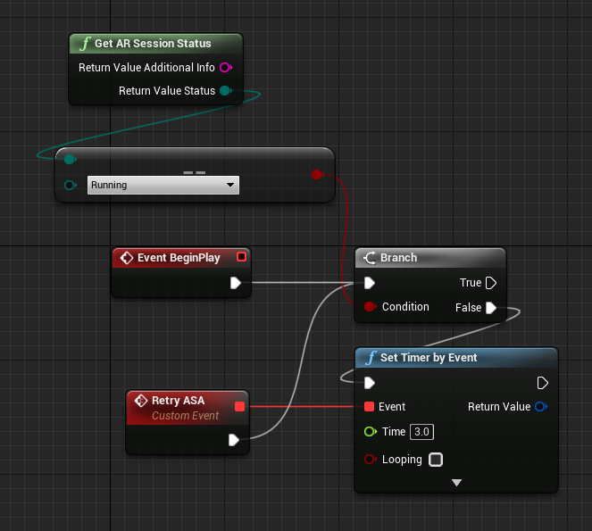
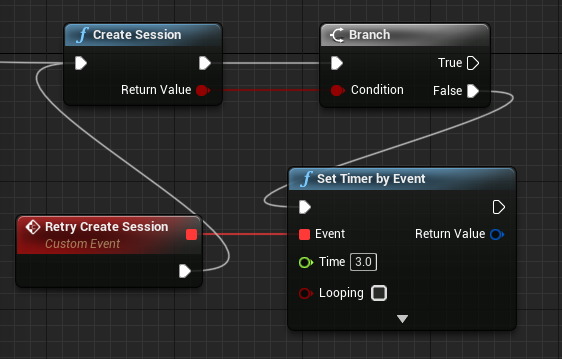
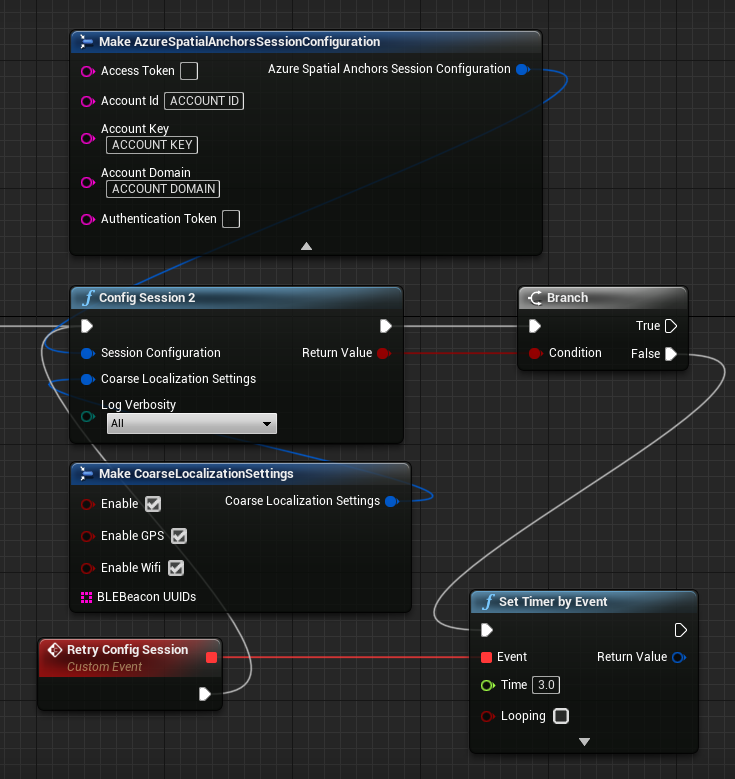
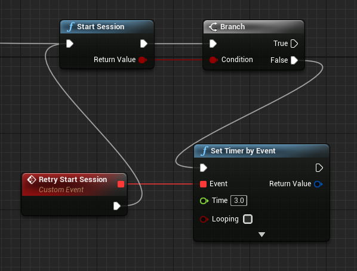
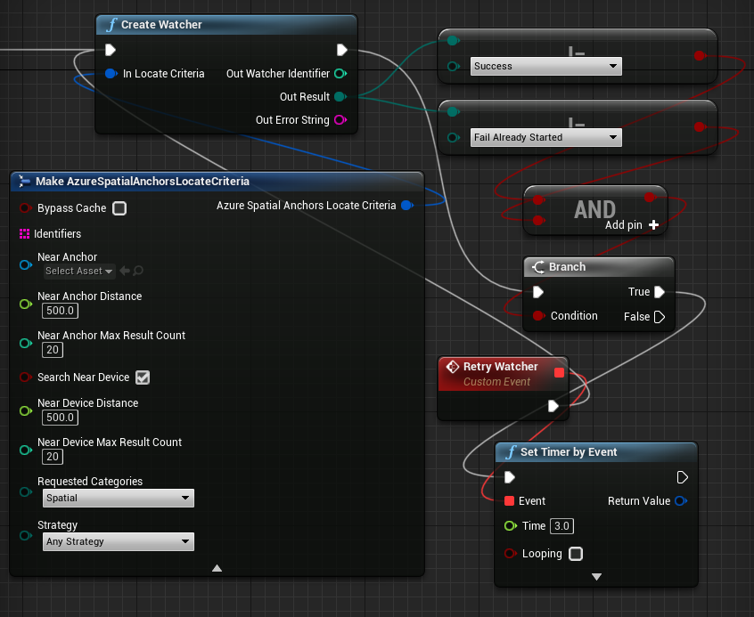
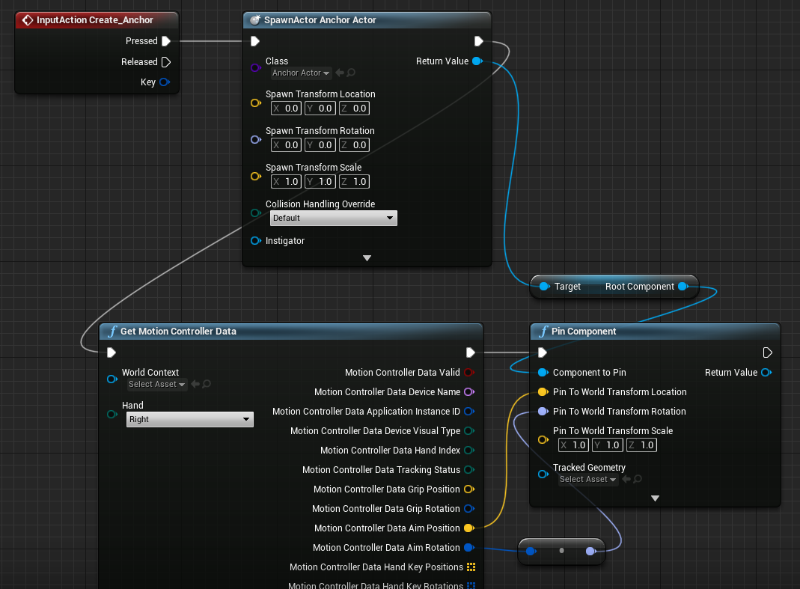
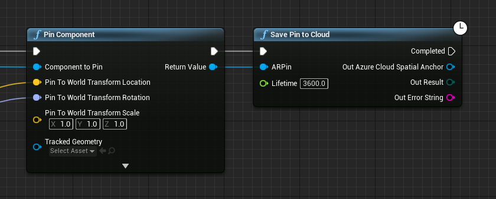
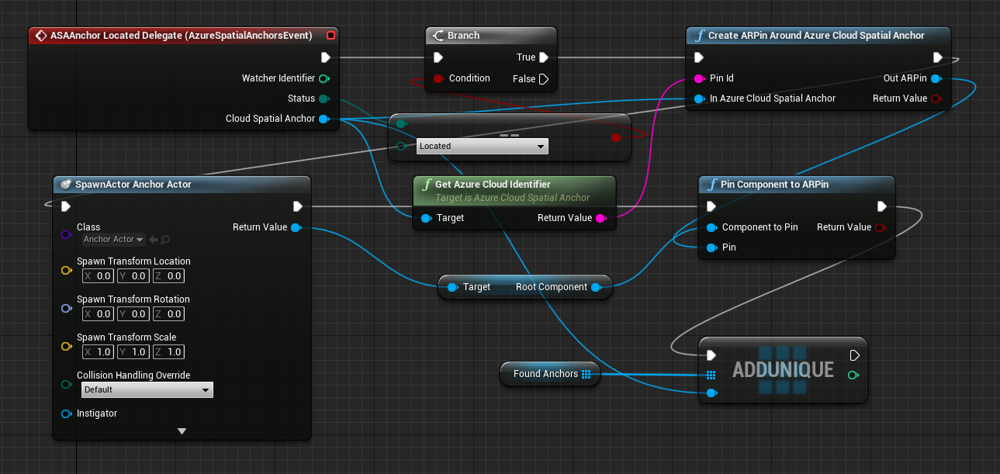
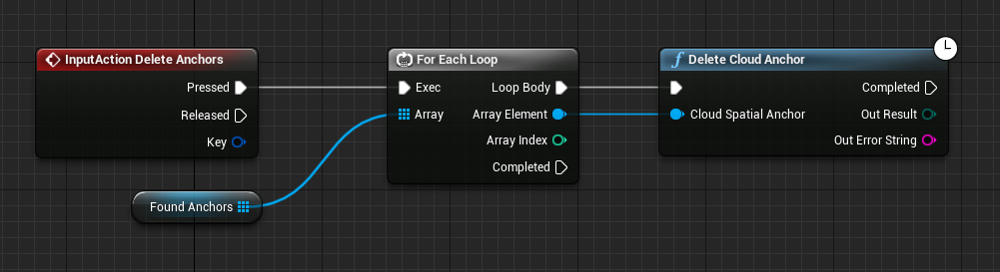

# Tutorial: Step-by-step instructions to create a new HoloLens Unreal app using Azure Spatial Anchors

This tutorial will show you how to create a new HoloLens Unreal app with Azure Spatial Anchors.

## Prerequisites

To complete this tutorial, make sure you have:

1. **PC** - A PC running Windows
2. **Visual Studio** - <a href="https://www.visualstudio.com/downloads/" target="_blank">Visual Studio 2019</a> installed with the **Universal Windows Platform development** workload and the **Windows 10 SDK (10.0.18362.0 or newer)** component. The [C++/WinRT Visual Studio Extension (VSIX)](https://aka.ms/cppwinrt/vsix) for Visual Studio should be installed from the [Visual Studio Marketplace](https://marketplace.visualstudio.com/).
3. **HoloLens** - A HoloLens device with the [Windows 10 May 2020 Update](/windows/mixed-reality/whats-new/release-notes-may-2020) or newer. To update to the latest release on HoloLens, open the **Settings** app, go to **Update & Security**, then select the **Check for updates** button.
4. **Unreal** - <a href="https://www.unrealengine.com/get-now" target="_blank">Unreal Engine</a> version 4.26 or newer, with the <a href="https://docs.microsoft.com/en-us/windows/mixed-reality/develop/unreal/unreal-project-setup" target="_blank">HoloLens 2 installation options</a> installed.

## Creating and setting up Unreal Project

### Create New Project
Follow <a href="https://docs.microsoft.com/en-us/windows/mixed-reality/develop/unreal/unreal-quickstart" target="_blank">these instructions</a> to create a new Unreal project for HoloLens development.

### Setup HoloLens build
Follow <a href="https://docs.microsoft.com/en-us/windows/mixed-reality/develop/unreal/tutorials/unreal-uxt-ch6" target="_blank">these steps</a> to package and deploy a HoloLens application.

### Enable Azure Spatial Anchor plugins and set capabilities
Follow [these steps](../how-tos/setup-unreal-project.md) to enable the Azure Spatial Anchors plugins in your project and set the correct capabilities.

For this sample, also enable the **Microphone** capability in **Edit > Project Settings > HoloLens > Capabilities**.

## Create a Spatial Anchors resource

[!INCLUDE [Create Spatial Anchors resource](../../../includes/spatial-anchors-get-started-create-resource.md)]

## Setup Azure Spatial Anchors in a Blueprint
1. In Unreal in the **Content Browser**, right click and select **Blueprint Class**.  Then select **Actor**.  Title it **AzureSpatialAnchorsActor**.
2. Click on this new actor and navigate to the **Details** tab on the right.  Find the **Input** section and change the **Auto Receive Input** dropdown to **Player 0**.
3. Drag and drop this actor into the **Game Viewport** to add it to the level.
4. Double click on **AzureSpatialAnchorsActor** in the **Content Browser** to edit the blueprint.
5. Navigate to the **Event Graph**
6. Drag a connector off of the **Event BeginPlay** node and check if the return value status of **Get AR Session Status** is **Running**.  In the following image, the return value was right clicked on and **Split Struct Pin** was selected.
7. If the AR Session is not running, set a timer for 3 seconds to retry.
8. The ARSession should have been started in the level blueprint from the <a href="https://docs.microsoft.com/en-us/windows/mixed-reality/develop/unreal/unreal-quickstart#adding-a-session-asset">setup instructions</a>.

9. Call **Create Session** from the **Azure Spatial Anchors Library**.  If this returns false, set a timer for 3 seconds to retry.

10. Call **Config Session 2**, set the **Log Verbosity** to **All**.
11. Make **Course Localization Settings** with everything enabled.
12. Make **Azure Spatial Anchors Session Configuration** with **Account ID**, **Account Key**, and **Account Domain** set from the values you copied earlier in the Azure Portal.  Click the dropdown arrow to see all of these fields.
13. If this return false, set a timer for 3 seconds to retry.

14. Call **Start Session**
15. If this return false, set a timer for 3 seconds to retry.

16. Call **Create Watcher**
17. Make an **Azure Spatial Anchors Locate Criteria** for the Create Watcher input.
18. Expand the Locate Criteria dropdown and enable the **Search Near Device** checkbox.
19. This Locate Criteria could also be used to find specific anchors if any are known.
20. If the return result is not **Success** or **Fail Already Started**, set a timer for 3 seconds to retry.

21. Drag a connector off of the **Event EndPlay** node and call **Stop Session** followed by **Destroy Session** to end the Azure Spatial Anchor session when the application terminates.

## App Overview

Our app will have the following interactions:

Gesture | Action
------|------- 
[Tap](/dynamics365/mixed-reality/guides/operator-gestures-hl2#air-tap) anywhere with Right hand | Create a local anchor and save it to the cloud.
Voice Command "Delete Anchors" | Delete any cloud anchors that have been found.

## Add Tap Recognition
1. Open **Edit > Project Settings** and navigate to the **Input** page.
2. Expand the **Action Mappings** dropdown.
3. Click the **Plus** button next to the Action Mappings dropdown.
4. Name the new action **Create_Anchor**.
5. In the dropdown below the new action, select **OpenXRMsftHandInteraction (R) Select**.

## Add Voice Commands
1. Open **Edit > Project Settings** and navigate to the **Input** page.
2. Expand the **Speech mappings** dropdown.
3. Click the **Plus** button next to the Speech Mappings dropdown.
4. Expand the new speech mapping entry in the Speech Mappings dropdown.
5. Set the **Action Name** and **Speech Keyword** to **Delete Anchors**

## Create Anchors
### Create an actor to pin to a spatial anchor
1. In Unreal in the **Content Browser**, right click and select **Blueprint Class**.  Then select **Actor**.  Title it **AnchorActor**.
2. Double click on Anchor Actor to open the Blueprint window.
3. In the **Components** tab, click the **Add Component** dropdown.
4. Select **Cube**
5. With the newly created Cube selected in the Components tab, set the **Transform > Scale** in the **Details** tab to **(0.2, 0.2, 0.2)**.

### Create a local anchor
1. In the **AzureSpatialAnchorsActor**'s Event Graph, right click and search for the **Create_Anchor** event added earlier.
2. Drag a connector from the **Pressed** output.
3. Search for **Spawn Actor from Class**.
4. In the **Class** dropdown, select the **Anchor Actor** created earlier.
5. Right click on **Spawn Transform**, then select **Split Struct Pin**.
6. Drag a connector from the **output pin** of SpawnActor Anchor Actor.
7. Search for **Get Motion Controller Data**
8. Change the **Hand** dropdown to **Right** since the Create_Anchor event is fired from a right select.
9. Right Click on **Motion Controller Data**, then select **Split Struct Pin**.
10. Drag a connector from the **output pin** of Get Motion Controller Data.
11. Search for **Pin Component**
12. Drag a connector from the **Return Value** pin of **Spawn Actor Anchor Actor**.
13. Search for **Get Root Component**
14. Drag a connector from **Root Component** to the **Component to Pin** input pin in **Pin Component**
15. Right click on the **Pin to World Transform** input in the **Pin Component** node and select **Split Struct Pin**.
16. Connect Get Motion Controller Data's **Motion Controller Data Aim Position** to Pin Component's **Pin To World Transform Location** input.
17. Connect Get Motion Controller Data's **Motion Controller Data Aim Rotation** to Pin Component's **Pin To World Transform Rotation** input.

### Save anchor to the cloud
1. In the **AzureSpatialAnchorsActor**'s Event Graph, Drag a connector from the output pin of the **Pin Component** node created earlier.
2. Search for **Save Pin to Cloud**
3. Connect Pin Component's **Return Value** to Save Pin to Cloud's **ARPin** input.
4. Set the **Lifetime** input to the desired anchor lifetime in seconds.  3600 seconds is an hour. 

4. This is an asynchronous function, which may take some time to execute.  Do not close the application immediately to give some time to actually save the anchor.
5. You can check the **Anchors Created** chart in the **Monitoring** tab in the Spatial Anchors resource in your Azure Portal to verify your anchors were saved.

## Locate Anchors
1. Open the **AzureSpatialAnchorsActor**'s Blueprint.
2. In the **Variables** section on the **My Blueprint** tab, click the **plus** button.
3. Create a new variable called **FoundAnchors**.
4. With FoundAnchors selected, navigate to the **Details** tab on the right.  
5. Change the **Variable Type** to an **Azure Cloud Spatial Anchor** **Object Reference**.
6. Click on the blue circle to the right of the Variable Type dropdown, and select **Array**
7. Click on the **Add Component** dropdown in the **Components** tab.  Search for **Azure Spatial Anchors Event**.
8. With the new AzureSpatialAnchorsEvent component selected, navigate to the **Details** tab on the right and scroll down to **Events**.  
9. Click the **plus** button next to **ASAAnchor Located Delegate**.  This will place a new event in the Event Graph.
10. From this event, check that the **Status** is **Located**.
11. Call **Create AR Pin Around Azure Cloud Spatial Anchor**.
12. Drag a connector from ASAAnchor Located Delegate's **Cloud Spatial Anchor** output pin and search for **Get Azure Cloud Identifier**.  
13. Connect this return value to Create ARPin Around Azure Cloud Spatial Anchor's **Pin Id** pin.
14. Connect ASAAnchor Located Delegate's **Cloud Spatial Anchor** output pin to Create ARPin Around Azure Cloud Spatial Anchor's **In Azure Cloud Spatial Anchor** pin.
15. Call **Spawn Actor** with **Anchor Actor** and a **Spawn Transform Location** of identity.
16. Call Pin Component to ARPin with the **Root Component** of **SpawnActor**'s output actor and the **Out ARPin** from **Create AR Pin Around Azure Cloud Spatial Anchor**.
17. Finally populate the Found Anchors array with ASAAnchor Located Delegate's Cloud Spatial Anchor output.

18. To see this code work: after creating a few anchors, close the application and relaunch it.  Each of the saved anchors should spawn a local anchor at the located pose.

## Delete Anchors
1. In the **AzureSpatialAnchorsActor**'s Event Graph, right click and search for the **Delete Anchors** speech event added earlier.
2. Iterate over the anchors in the Found Anchors array.
3. Call **Delete Cloud Anchor** on each of the found anchors.

## Putting everything together
You can use the <a href="https://github.com/microsoft/Microsoft-OpenXR-Unreal" target="_blank">Microsoft OpenXR sample on GitHub</a> as a reference.

## Next steps

In this tutorial, you learned how to implement a basic Spatial Anchors application for HoloLens using Unreal. To learn more about how to use Azure Spatial Anchors in a new Android app, continue to the next tutorial.

> [!div class="nextstepaction"]
> [Starting a new Android app](tutorial-new-android-app.md)